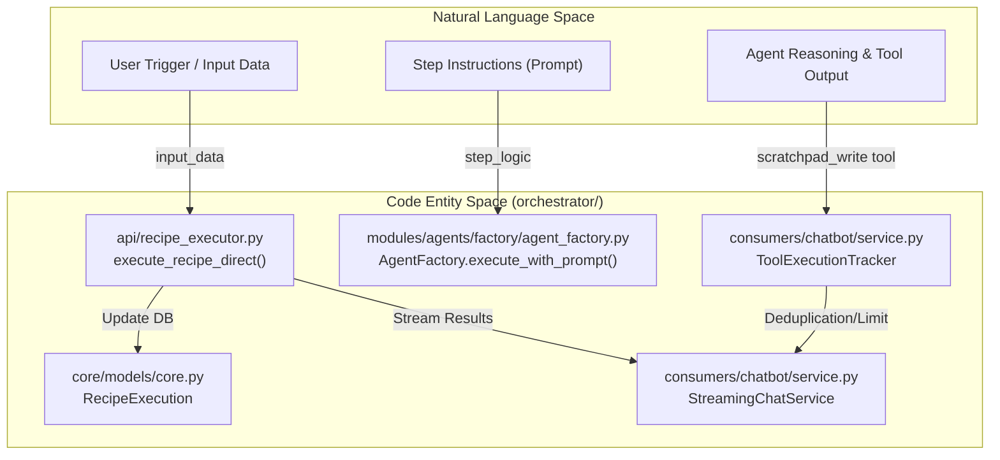
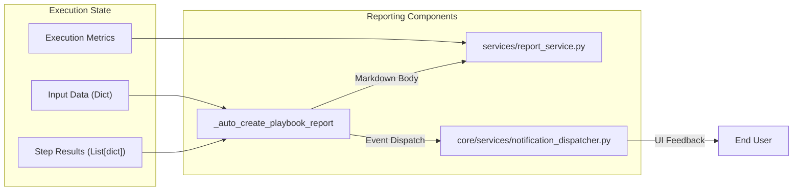

# Recipe Scratchpad

Relevant source files

The following files were used as context for generating this wiki page:

- [frontend/app/api/chat/route.ts](frontend/app/api/chat/route.ts)
- [frontend/components/chatbot/chat.tsx](frontend/components/chatbot/chat.tsx)
- [frontend/components/chatbot/mission-suggestion-card.tsx](frontend/components/chatbot/mission-suggestion-card.tsx)
- [frontend/lib/chat/hooks.ts](frontend/lib/chat/hooks.ts)
- [frontend/stores/mission-store.ts](frontend/stores/mission-store.ts)
- [orchestrator/api/chat.py](orchestrator/api/chat.py)
- [orchestrator/api/recipe_executor.py](orchestrator/api/recipe_executor.py)
- [orchestrator/consumers/chatbot/service.py](orchestrator/consumers/chatbot/service.py)
- [orchestrator/modules/agents/factory/agent_factory.py](orchestrator/modules/agents/factory/agent_factory.py)

## Purpose and Scope

The Recipe Scratchpad is a structured, inter-step data sharing system designed for multi-step recipe executions. It replaces verbose full-text output dumps between steps with auto-extracted key-value summaries and explicit agent exports, achieving 80-90% token savings while preserving essential context [orchestrator/api/recipe_executor.py:14-19](). The scratchpad is integrated into the `execute_recipe_direct` flow to facilitate data flow between sequential steps of a `WorkflowTemplate` (aliased as `WorkflowRecipe`) [orchestrator/api/recipe_executor.py:36-37]().

This system ensures that agents executing downstream steps have access to critical data produced by upstream agents without exceeding context window limits, utilizing the same component path as the standard chatbot for architectural alignment [orchestrator/api/recipe_executor.py:5-12]().

---

## Architecture and Data Flow

The scratchpad is managed during the execution loop of a recipe. The executor initializes and interacts with the scratchpad to maintain state across the workflow lifecycle. It leverages `StreamingChatService` and `ToolExecutionTracker` to handle the actual LLM interaction and tool loops for each step [orchestrator/consumers/chatbot/service.py:12-13](), [orchestrator/consumers/chatbot/service.py:83-90]().

### Natural Language to Code Entity Mapping

The following diagram bridges the conceptual "Natural Language Space" of recipe steps to the specific "Code Entity Space" of the scratchpad system.

**Title: Recipe Context Pipeline**

**Sources:** [orchestrator/api/recipe_executor.py:5-19](), [orchestrator/api/recipe_executor.py:36-37](), [orchestrator/consumers/chatbot/service.py:83-111](), [orchestrator/modules/agents/factory/agent_factory.py:1-11]()

---

## Data Layout and Storage Strategy

The system utilizes a tiered storage approach to manage recipe data based on its lifecycle and size [orchestrator/api/recipe_executor.py:14-19]().

| Tier | Storage Target | Entity / Model | Purpose |
| :--- | :--- | :--- | :--- |
| **Tier 1: Ephemeral** | Redis / Memory | `RecipeScratchpad` | High-speed context sharing between steps during execution [orchestrator/api/recipe_executor.py:15](). |
| **Tier 2: Compact** | PostgreSQL | `RecipeExecution.step_results` | Permanent summary for UI display and history [orchestrator/api/recipe_executor.py:95-100](). |
| **Tier 3: Cold** | S3 / Blob | `step_logs` | Full verbose logs (messages, raw tool results) for debugging [orchestrator/api/recipe_executor.py:17-18](). |

### Context Assembly and Reporting

The scratchpad context is used to generate final reports upon completion. The `_auto_create_playbook_report` function rolls up metrics and step results into a Markdown summary [orchestrator/api/recipe_executor.py:88-105]().

*   **Execution Metrics**: Roll up cost, model usage, and duration across every LLM call in the execution [orchestrator/api/recipe_executor.py:112-118]().
*   **Step Summaries**: Captures the `output_preview` and status of each step for the final report [orchestrator/api/recipe_executor.py:159-169]().
*   **Final Output**: Includes a preview of the final data produced by the recipe [orchestrator/api/recipe_executor.py:177-185]().

**Title: Scratchpad Context Resolution**

**Sources:** [orchestrator/api/recipe_executor.py:45-55](), [orchestrator/api/recipe_executor.py:88-126](), [orchestrator/api/recipe_executor.py:141-158]()

---

## Tool Integration and Safety

Agents interact with the scratchpad and other tools through a unified execution layer. To prevent infinite loops during complex recipe steps, the `ToolExecutionTracker` is employed [orchestrator/consumers/chatbot/service.py:50-51]().

### Tool Loop Prevention
1.  **Exact Deduplication**: Prevents the same tool from being called with identical arguments multiple times [orchestrator/consumers/chatbot/service.py:87-87]().
2.  **Semantic Deduplication**: Uses string similarity to detect redundant search queries [orchestrator/consumers/chatbot/service.py:62-71]().
3.  **Retry Limits**: Enforces specific limits per tool type (e.g., `write_file` is limited to 5 calls per turn) [orchestrator/consumers/chatbot/service.py:98-111]().

### Scratchpad Tooling
*   **`scratchpad_write`**: Injected tool for explicit agent exports of structured data [orchestrator/api/recipe_executor.py:16]().
*   **Platform Actions**: Agents can use `platform_execute` to introspect the system, with limits counted by the inner action name [orchestrator/consumers/chatbot/service.py:122-133]().

**Sources:** [orchestrator/api/recipe_executor.py:15-16](), [orchestrator/consumers/chatbot/service.py:83-111](), [orchestrator/consumers/chatbot/service.py:150-161]()

---

## Notification and Event Dispatch

The `RecipeExecutor` integrates with the `NotificationDispatcher` to provide real-time updates to the frontend during execution [orchestrator/api/recipe_executor.py:45-55]().

1.  **Playbook Events**: Events are fired for step completion and final recipe results [orchestrator/api/recipe_executor.py:66-75]().
2.  **Non-blocking**: Notification failures are logged but do not halt the execution of the recipe [orchestrator/api/recipe_executor.py:59-61]().
3.  **UI Integration**: Notifications are linked to the specific `recipe_execution_id` for easy navigation [orchestrator/api/recipe_executor.py:70-71]().

**Sources:** [orchestrator/api/recipe_executor.py:45-83](), [orchestrator/api/recipe_executor.py:101-105]()

---