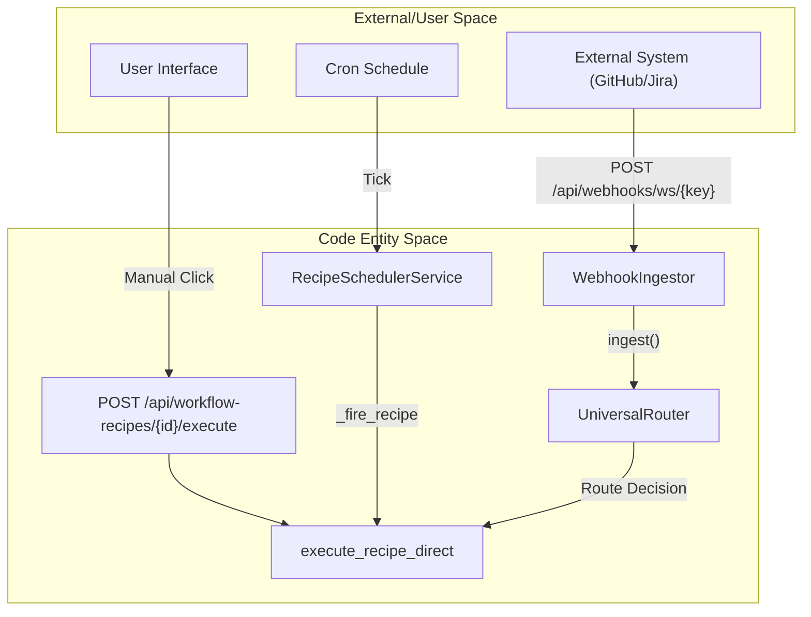
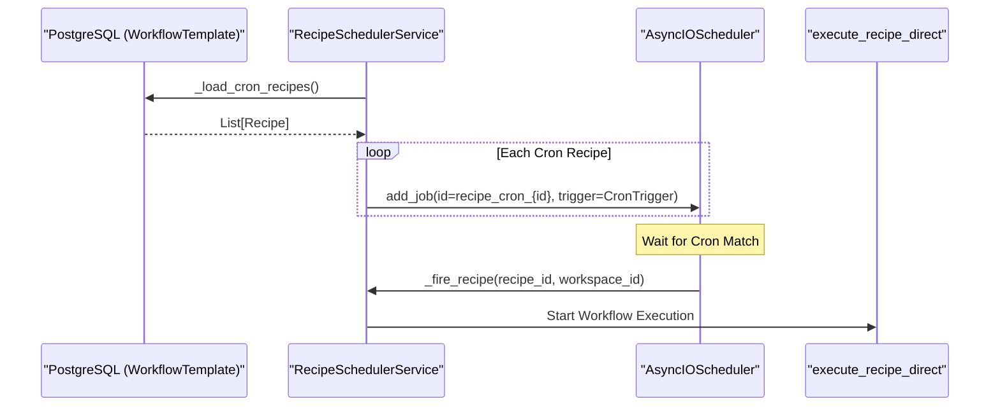

# Scheduling & Triggers

Relevant source files

The following files were used as context for generating this wiki page:

- [docs/PRDS/53-WEBHOOK-TRIGGER-SYSTEM-PRD.md](docs/PRDS/53-WEBHOOK-TRIGGER-SYSTEM-PRD.md)
- [docs/PRDS/69-AGENT-INTELLIGENCE-LAYER.md](docs/PRDS/69-AGENT-INTELLIGENCE-LAYER.md)
- [docs/PRDS/70-SECURITY-HARDENING-PENTEST-REMEDIATION.md](docs/PRDS/70-SECURITY-HARDENING-PENTEST-REMEDIATION.md)
- [frontend/components/settings/SettingsPanel.tsx](frontend/components/settings/SettingsPanel.tsx)
- [frontend/components/settings/SystemLLMSettingsTab.tsx](frontend/components/settings/SystemLLMSettingsTab.tsx)
- [frontend/components/settings/SystemSettingsTab.tsx](frontend/components/settings/SystemSettingsTab.tsx)
- [frontend/components/settings/WebhooksSettingsTab.tsx](frontend/components/settings/WebhooksSettingsTab.tsx)
- [frontend/components/workspace-provider.tsx](frontend/components/workspace-provider.tsx)
- [orchestrator/alembic/versions/20260213_add_workspace_webhook_key.py](orchestrator/alembic/versions/20260213_add_workspace_webhook_key.py)
- [orchestrator/api/webhooks.py](orchestrator/api/webhooks.py)
- [orchestrator/api/workspaces.py](orchestrator/api/workspaces.py)
- [orchestrator/core/models/routing.py](orchestrator/core/models/routing.py)
- [orchestrator/core/routing/ingestors/webhook.py](orchestrator/core/routing/ingestors/webhook.py)
- [orchestrator/modules/tools/discovery/actions_harness.py](orchestrator/modules/tools/discovery/actions_harness.py)
- [orchestrator/modules/tools/discovery/handlers_harness.py](orchestrator/modules/tools/discovery/handlers_harness.py)
- [orchestrator/modules/tools/discovery/handlers_missions.py](orchestrator/modules/tools/discovery/handlers_missions.py)
- [orchestrator/scripts/seed_blog_playbook.py](orchestrator/scripts/seed_blog_playbook.py)
- [orchestrator/services/harness_service.py](orchestrator/services/harness_service.py)
- [orchestrator/services/scheduler.py](orchestrator/services/scheduler.py)
- [orchestrator/tests/test_recipe_scheduler.py](orchestrator/tests/test_recipe_scheduler.py)
- [orchestrator/tests/test_unified_scheduler.py](orchestrator/tests/test_unified_scheduler.py)

This page documents the execution trigger mechanisms for workflow recipes and workspace interactions: manual execution, cron-based scheduling, and webhook-based triggers. Each recipe can be configured with a trigger type that determines how it executes, while workspaces provide a global webhook for routed message ingestion.

---

## Schedule Types Overview

Recipes support three mutually exclusive schedule types defined in the configuration. These types determine the entry point into the execution engine.

| Type | Trigger Mechanism | Use Case |
|------|------------------|----------|
| `manual` | User-initiated via UI or API | One-off workflows, testing, ad-hoc tasks |
| `cron` | Time-based with `APScheduler` | Periodic reports, scheduled maintenance, batch jobs |
| `trigger` | Webhook HTTP POST | External event-driven workflows (Jira, GitHub, Slack, etc.) |

**Diagram: Trigger to Code Entity Mapping**

Sources: [orchestrator/tests/test_recipe_scheduler.py:180-188](), [orchestrator/api/webhooks.py:6-12](), [orchestrator/core/routing/ingestors/webhook.py:22-30]()

---

## Workspace Webhooks vs. Recipe Webhooks

The system distinguishes between a global workspace-level entry point and specific recipe triggers.

### 1. Workspace Webhook (Universal Routing)
Every workspace is assigned a unique `webhook_key` upon creation [orchestrator/api/workspaces.py:63-65](). Messages sent to this endpoint are processed by the `WebhookIngestor`, which normalizes various payload formats (Telegram, Slack, Twilio) into a `RequestEnvelope` [orchestrator/core/routing/ingestors/webhook.py:40-74]().

*   **Endpoint**: `POST /api/webhooks/ws/{workspace_key}` [orchestrator/api/webhooks.py:6]()
*   **Logic**: The `UniversalRouter` analyzes the content to determine if it should trigger an agent or a specific workflow [orchestrator/core/models/routing.py:74-82]().
*   **Overrides**: Users can force a route by including `agent_id` or `workflow_id` in the JSON body [orchestrator/core/routing/ingestors/webhook.py:82-89]().

### 2. Recipe-Specific Webhooks
Recipes configured with the `trigger` type receive a dedicated `webhook_id`. These are task-specific and bypass the universal router to execute the associated recipe directly [orchestrator/api/webhooks.py:10-12]().

Sources: [orchestrator/api/workspaces.py:63-93](), [orchestrator/core/routing/ingestors/webhook.py:22-105](), [frontend/components/settings/WebhooksSettingsTab.tsx:84-91]()

---

## Cron Scheduling Implementation

Cron-based execution is managed by the `RecipeSchedulerService`, which wraps `APScheduler`.

### Service Lifecycle
The scheduler starts during the FastAPI lifespan. It can run as a standalone service or be shared within a `UnifiedScheduler` [orchestrator/services/scheduler.py:20]().

*   **Initialization**: On `start()`, the service queries the database for all recipes with a `cron` type `schedule_config` [orchestrator/tests/test_recipe_scheduler.py:107-123]().
*   **Job Storage**: It supports both `MemoryJobStore` and persistent stores. In production, Redis is typically used to persist jobs across service restarts [orchestrator/tests/test_recipe_scheduler.py:35-37]().

### Cron Expression Handling
The system uses standard 5-field crontab expressions. The `_FakeCronTrigger.from_crontab(expression)` method validates the syntax before scheduling [orchestrator/tests/test_recipe_scheduler.py:19-30]().

**Diagram: RecipeSchedulerService Data Flow**

Sources: [orchestrator/tests/test_recipe_scheduler.py:103-140](), [orchestrator/scripts/seed_blog_playbook.py:123-126]()

---

## Webhook Ingestion Logic

The `WebhookIngestor` is responsible for "flattening" diverse incoming payloads into a unified format that the system can understand.

### Content Extraction Hierarchy
The ingestor checks fields in the following order to find the message body:
1.  **Direct Fields**: `message`, `text`, `content`, `body` [orchestrator/core/routing/ingestors/webhook.py:44-48]().
2.  **Telegram**: `message.text` or `message.caption` [orchestrator/core/routing/ingestors/webhook.py:51-54]().
3.  **Slack**: `event.text` [orchestrator/core/routing/ingestors/webhook.py:57-60]().
4.  **WhatsApp/Twilio**: `Body` or deep-nested `entry[0].changes[0].value.messages[0].text.body` [orchestrator/core/routing/ingestors/webhook.py:63-74]().
5.  **Fallback**: Full JSON stringification of the body [orchestrator/core/routing/ingestors/webhook.py:76-77]().

### Signature Verification
For security, the system can verify HMAC-SHA256 signatures. It checks common headers like `X-Hub-Signature-256` (GitHub), `X-Composio-Signature`, and `X-Webhook-Signature` [orchestrator/api/webhooks.py:44-66](). If a secret is configured for the workspace, the incoming payload must match the computed HMAC to proceed [orchestrator/api/webhooks.py:76-84]().

Sources: [orchestrator/core/routing/ingestors/webhook.py:22-105](), [orchestrator/api/webhooks.py:44-86]()

---

## Proactive & Automated Triggers

Beyond standard user-defined triggers, the system includes autonomous scheduling components for maintenance and optimization.

### 1. Heartbeat Service
The `HeartbeatService` runs periodic checks (intervals or cron) to allow agents or the orchestrator to perform proactive tasks [frontend/components/settings/SystemLLMSettingsTab.tsx:52-61](). It can be configured with `active_hours` and a specific `proactive_level` (Silent, Notify, Act & Notify, Autonomous) [frontend/components/settings/SystemLLMSettingsTab.tsx:82-87]().

### 2. HARNESS (Self-Optimization)
The `HarnessService` is a specialized weekly cron job (defaulting to Sunday 02:00 UTC) [orchestrator/services/harness_service.py:33](). It collects metrics and auto-applies safe configuration changes to agents to optimize workspace performance [orchestrator/services/harness_service.py:5-9](). It uses an `AsyncIOScheduler` to manage the weekly `harness_sweep` [orchestrator/services/harness_service.py:87-94]().

### 3. Mission Triggers
Agents can programmatically launch "Missions" (multi-agent workflows) using the `platform_create_mission` tool [orchestrator/scripts/seed_blog_playbook.py:48-53](). This serves as a dynamic trigger where one agent initiates a complex, multi-step orchestration run.

Sources: [orchestrator/services/harness_service.py:33-40](), [orchestrator/services/harness_service.py:87-94](), [frontend/components/settings/SystemLLMSettingsTab.tsx:82-87]()

---

## Configuration Reference

### RecipeScheduleConfig Structure
The configuration is typically stored as a JSON object in the `WorkflowTemplate` model.

| Field | Type | Description |
|-------|------|-------------|
| `type` | `string` | `manual`, `cron`, or `trigger` |
| `cron_expression` | `string` | Standard cron string (e.g., `0 9 * * 2,5`) |
| `webhook_id` | `string` | Unique identifier for the recipe's direct webhook |

Sources: [orchestrator/scripts/seed_blog_playbook.py:123-126](), [orchestrator/tests/test_recipe_scheduler.py:180-188]()

### Integration Settings
Workspaces store platform-specific tokens in their settings to enable replying to webhooks (e.g., sending a Telegram message back after processing a webhook) [orchestrator/api/workspaces.py:30-37]().

*   `telegram_bot_token`
*   `slack_bot_token`
*   `whatsapp_access_token`

Sources: [orchestrator/api/workspaces.py:118-156]()

---