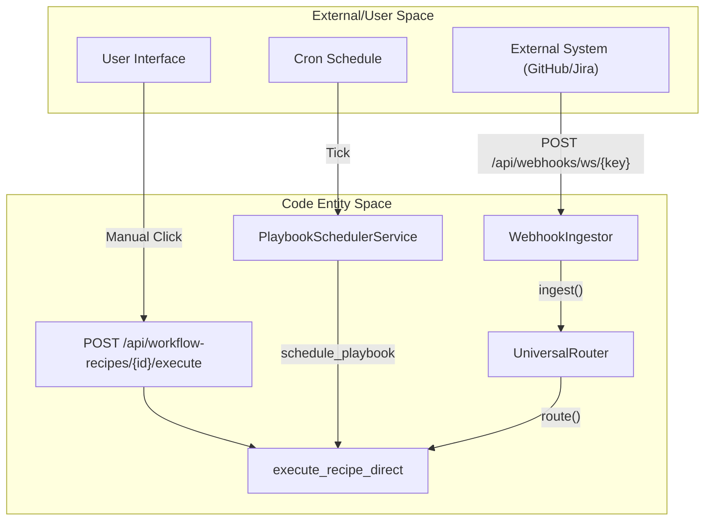

# Scheduling & Triggers

Relevant source files

The following files were used as context for generating this wiki page:

- [frontend/components/activity/board/__tests__/schedule-choice.test.ts](frontend/components/activity/board/__tests__/schedule-choice.test.ts)
- [frontend/components/activity/board/create-task-dialog.tsx](frontend/components/activity/board/create-task-dialog.tsx)
- [frontend/components/activity/board/create-task-steps.tsx](frontend/components/activity/board/create-task-steps.tsx)
- [frontend/components/activity/board/schedule-choice.ts](frontend/components/activity/board/schedule-choice.ts)
- [frontend/components/workflows/execution-kitchen.tsx](frontend/components/workflows/execution-kitchen.tsx)
- [frontend/hooks/use-board-tasks-api.ts](frontend/hooks/use-board-tasks-api.ts)
- [orchestrator/alembic/versions/calendar_scheduled_board_tasks.py](orchestrator/alembic/versions/calendar_scheduled_board_tasks.py)
- [orchestrator/alembic/versions/prd72_board_tasks.py](orchestrator/alembic/versions/prd72_board_tasks.py)
- [orchestrator/api/composio.py](orchestrator/api/composio.py)
- [orchestrator/api/recipe_executor.py](orchestrator/api/recipe_executor.py)
- [orchestrator/api/scheduled_tasks.py](orchestrator/api/scheduled_tasks.py)
- [orchestrator/api/skills.py](orchestrator/api/skills.py)
- [orchestrator/api/tools.py](orchestrator/api/tools.py)
- [orchestrator/api/webhooks.py](orchestrator/api/webhooks.py)
- [orchestrator/api/workflow_recipes.py](orchestrator/api/workflow_recipes.py)
- [orchestrator/core/composio/client.py](orchestrator/core/composio/client.py)
- [orchestrator/core/composio/linkedin_image_workaround.py](orchestrator/core/composio/linkedin_image_workaround.py)
- [orchestrator/core/composio/tool_executor.py](orchestrator/core/composio/tool_executor.py)
- [orchestrator/core/credentials/tester.py](orchestrator/core/credentials/tester.py)
- [orchestrator/core/credentials/types.py](orchestrator/core/credentials/types.py)
- [orchestrator/core/database/credential_types_seed.json](orchestrator/core/database/credential_types_seed.json)
- [orchestrator/core/routing/ingestors/webhook.py](orchestrator/core/routing/ingestors/webhook.py)
- [orchestrator/core/seeds/utterances/scheduling.yaml](orchestrator/core/seeds/utterances/scheduling.yaml)
- [orchestrator/modules/tools/discovery/handlers_scheduling.py](orchestrator/modules/tools/discovery/handlers_scheduling.py)
- [orchestrator/services/metadata_sync_service.py](orchestrator/services/metadata_sync_service.py)
- [orchestrator/services/playbook_scheduler.py](orchestrator/services/playbook_scheduler.py)
- [orchestrator/services/scheduled_task_service.py](orchestrator/services/scheduled_task_service.py)
- [orchestrator/services/webhook_dedup.py](orchestrator/services/webhook_dedup.py)
- [orchestrator/tests/test_p2w0_service_imports_resolve.py](orchestrator/tests/test_p2w0_service_imports_resolve.py)
- [orchestrator/tests/test_p2w2_webhook_dedup.py](orchestrator/tests/test_p2w2_webhook_dedup.py)
- [orchestrator/tests/test_p2w2_webhook_signature_reject.py](orchestrator/tests/test_p2w2_webhook_signature_reject.py)
- [orchestrator/tests/test_prd209_alembic_single_head.py](orchestrator/tests/test_prd209_alembic_single_head.py)
- [orchestrator/tests/test_prd232_us007_seed_intent_clusters.py](orchestrator/tests/test_prd232_us007_seed_intent_clusters.py)

This page documents the execution trigger mechanisms for workflow recipes and workspace interactions: manual execution, cron-based scheduling, and webhook-based triggers. Each recipe can be configured with a trigger type that determines how it executes, while workspaces provide global and recipe-specific webhook ingestion channels backed by signature verification and deduplication.

---

## Schedule Types Overview

Recipes support three mutually exclusive schedule types defined in the configuration. These types determine the entry point into the execution engine.

| Type | Trigger Mechanism | Use Case |
|------|------------------|----------|
| `manual` | User-initiated via UI or API | One-off workflows, testing, ad-hoc tasks |
| `cron` | Time-based with `APScheduler` via `PlaybookSchedulerService` | Periodic reports, scheduled maintenance, batch jobs |
| `trigger` | Webhook HTTP POST | External event-driven workflows (Jira, GitHub, Slack, etc.) |

**Diagram: Trigger to Code Entity Mapping**

Sources: [orchestrator/api/webhooks.py:6-12](), [orchestrator/api/workflow_recipes.py:36-50](), [orchestrator/api/recipe_executor.py:5-19]()

---

## Workspace Webhooks vs. Recipe Webhooks

The system distinguishes between a global workspace-level entry point and specific recipe triggers.

### 1. Workspace Webhook (Universal Routing)
Every workspace is assigned a unique `webhook_key` upon creation. Messages sent to this endpoint are processed by the `WebhookIngestor`, which normalizes various payload formats (Telegram, Slack, Twilio) into a `RequestEnvelope`.

*   **Endpoint**: `POST /api/webhooks/ws/{workspace_key}` [orchestrator/api/webhooks.py:6]()
*   **Logic**: The `UniversalRouter` analyzes the content to determine if it should trigger an agent or a specific workflow.
*   **Platform Detection**: The system automatically detects the source platform (Slack, Telegram, WhatsApp, Twilio) based on payload structure [orchestrator/api/webhooks.py:159-185]().
*   **Slack Verification**: Slack requests undergo specific v0 signing scheme verification with timestamp skew protection [orchestrator/api/webhooks.py:127-153]().

### 2. Recipe-Specific Webhooks
Recipes configured with the `trigger` type receive a dedicated webhook mapping. These are task-specific and bypass the universal router to execute the associated recipe directly. 

*   **Composio Integration**: For triggers sourced from Composio (e.g., GitHub events), the system automatically handles subscription via `_auto_register_trigger` [orchestrator/api/workflow_recipes.py:52-81]().
*   **Subscription Storage**: Active subscriptions are stored in the `TriggerSubscription` table, linking the `composio_subscription_id` to the `workflow_id` [orchestrator/api/workflow_recipes.py:109-124]().

Sources: [orchestrator/api/webhooks.py:6-12](), [orchestrator/api/workflow_recipes.py:52-130](), [orchestrator/core/composio/client.py:63-82]()

---

## Agent-Initiated Scheduled Tasks

Beyond recipe schedules, agents and operators can autonomously schedule tasks using the `ScheduledTaskService`.

*   **Task Types**: Supports `one_shot` (ISO datetime) and `recurring` (Cron expression) [orchestrator/services/scheduled_task_service.py:75-78]().
*   **Rate Limiting**: Limits to 10 active tasks per agent, 25 recurring tasks per workspace, and 50 operator tasks per workspace [orchestrator/services/scheduled_task_service.py:31-34]().
*   **Delivery Modes**: Supports `chat` (opening a chat session with the target agent) and `board_task` (filing a board ticket into the workspace board) [orchestrator/services/scheduled_task_service.py:37-39]().
*   **Execution Flow**: When a task fires, it registers with the `UnifiedScheduler` (APScheduler) and executes according to its delivery mode [orchestrator/services/scheduled_task_service.py:4-14]().

Sources: [orchestrator/services/scheduled_task_service.py:31-78](), [orchestrator/services/scheduled_task_service.py:89-112]()

---

## Webhook Security & Verification

The system implements strict verification for incoming webhooks to prevent unauthorized execution and replay attacks.

### Signature Verification
The `_verify_webhook_signature` function validates HMAC-SHA256 signatures for generic webhooks, GitHub, and Composio [orchestrator/api/webhooks.py:50-76]().
*   **Headers Checked**: `X-Hub-Signature-256`, `X-Composio-Signature`, `X-Webhook-Signature`.
*   **Algorithm**: Uses `hmac.compare_digest` to mitigate timing attacks [orchestrator/api/webhooks.py:83-89]().

### Deduplication
Incoming webhooks are processed through `webhook_dedup` to prevent duplicate execution from retried external requests [orchestrator/api/webhooks.py:35]().

Sources: [orchestrator/api/webhooks.py:35](), [orchestrator/api/webhooks.py:50-91]()

---

## Configuration Reference

### RecipeScheduleConfig Structure
The configuration determines how the execution engine interacts with the recipe schedule.

| Field | Type | Description |
|-------|------|-------------|
| `type` | `string` | `manual`, `cron`, or `trigger` [orchestrator/api/workflow_recipes.py:62-63]() |
| `cron_expression` | `string` | Standard cron string (e.g., `0 9 * * 1`) [orchestrator/api/workflow_recipes.py:44]() |
| `trigger_config` | `dict` | Contains `source` (e.g., 'composio') and `trigger_name` [orchestrator/api/workflow_recipes.py:65-75]() |

### TriggerSubscription Model
Used for mapping external events to internal logic.

*   `composio_subscription_id`: The ID returned by Composio's subscription API [orchestrator/api/workflow_recipes.py:115]().
*   `is_active`: Boolean flag for enabling/disabling the trigger [orchestrator/api/workflow_recipes.py:117]().
*   `entity_id`: Links to the `ComposioEntity` associated with the workspace [orchestrator/api/workflow_recipes.py:109]().

Sources: [orchestrator/api/workflow_recipes.py:36-130](), [orchestrator/core/composio/client.py:146-165]()

---