# Scheduling & Triggers

<details>
<summary>Relevant source files</summary>

The following files were used as context for generating this wiki page:

- [frontend/components/workflows/create-recipe-modal.tsx](frontend/components/workflows/create-recipe-modal.tsx)
- [frontend/components/workflows/execution-kitchen.tsx](frontend/components/workflows/execution-kitchen.tsx)
- [frontend/components/workflows/recipe-execution-config.tsx](frontend/components/workflows/recipe-execution-config.tsx)
- [frontend/components/workflows/recipe-preview-panel.tsx](frontend/components/workflows/recipe-preview-panel.tsx)
- [frontend/components/workflows/recipe-step-builder.tsx](frontend/components/workflows/recipe-step-builder.tsx)
- [frontend/components/workflows/recipes-tab.tsx](frontend/components/workflows/recipes-tab.tsx)
- [frontend/components/workflows/view-recipe-modal.tsx](frontend/components/workflows/view-recipe-modal.tsx)
- [frontend/hooks/use-recipe-form.ts](frontend/hooks/use-recipe-form.ts)
- [orchestrator/alembic/versions/20260202_add_workspace_id_to_skills_patterns_models.py](orchestrator/alembic/versions/20260202_add_workspace_id_to_skills_patterns_models.py)
- [orchestrator/api/recipe_executor.py](orchestrator/api/recipe_executor.py)
- [orchestrator/api/workflow_recipes.py](orchestrator/api/workflow_recipes.py)
- [orchestrator/core/models/core.py](orchestrator/core/models/core.py)
- [orchestrator/core/services/recipe_memory_service.py](orchestrator/core/services/recipe_memory_service.py)
- [orchestrator/core/services/workspace_manager.py](orchestrator/core/services/workspace_manager.py)

</details>


## Purpose and Scope

This document covers the scheduling and triggering mechanisms for recipe execution in Automatos AI. Recipes can be executed in three ways: manual on-demand execution, automated cron-based scheduling, and event-driven webhook triggers. For information about the recipe execution process itself, see [Recipe Execution](#4.2). For configuration of retry logic and timeouts, see [Execution Configuration](#4.3).

---

## Schedule Types Overview

Automatos AI supports three execution trigger types for workflow recipes, each designed for different automation scenarios. The schedule type is configured during recipe creation as the fourth step of the wizard and stored in the `schedule_config` JSONB field of the `WorkflowTemplate` model (aliased as `WorkflowRecipe`).

### Supported Schedule Types

| Type | Use Case | Trigger Mechanism | Configuration Required |
|------|----------|-------------------|------------------------|
| `manual` | Ad-hoc execution | User clicks "Execute" or calls API | None |
| `cron` | Time-based automation | `RecipeSchedulerService` checks expression | Cron expression (5-part) |
| `trigger` | Event-driven automation | External webhook or Composio event | Webhook URL or Composio app config |

**Schedule Type Flow - Code Entity Mapping**

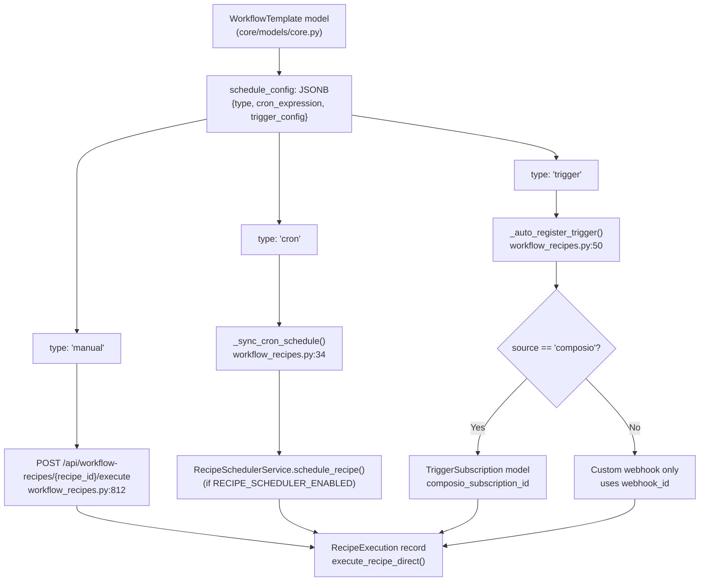

**Sources:** [orchestrator/api/workflow_recipes.py:34-47](), [orchestrator/api/workflow_recipes.py:50-126](), [orchestrator/api/workflow_recipes.py:812-877](), [orchestrator/core/models/core.py:1-20]()

---

## Manual Execution

Manual execution is the default schedule type, requiring explicit user action to trigger recipe execution. This mode is suitable for testing, debugging, and workflows that should only run when explicitly invoked.

### Configuration

The manual schedule type requires no additional configuration beyond setting `type: 'manual'` in the `schedule_config` object.

```typescript
schedule_config: {
  type: 'manual',
  cron_expression: '',
  trigger_config: {}
}
```

### Execution Methods

**Frontend UI:**
- Navigate to recipe detail page
- Click the "Execute" or "Cook" button
- Recipe executes immediately with optional input parameters

**Backend API:**
- `POST /api/workflow-recipes/{id}/execute`
- Request body can include input data matching the recipe's input schema
- Returns execution ID for tracking progress

### UI Components

The manual execution interface displays informational guidance and a disabled test button that becomes active after the recipe is saved:

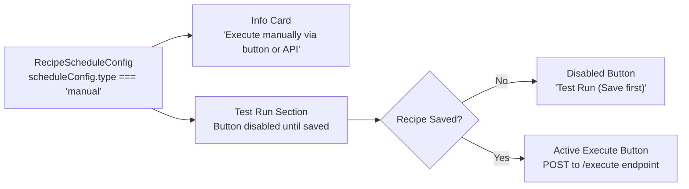

**Sources:** [frontend/components/workflows/recipe-schedule-config.tsx:164-192]()

---

## Cron-Based Scheduling

Cron-based scheduling enables time-based automated execution using standard 5-part cron expressions. The system parses the cron expression and executes the recipe at matching times.

### Cron Expression Format

Automatos AI uses the standard 5-field cron format:

```
minute hour day(month) month day(week)
```

**Field Ranges:**
- `minute`: 0-59
- `hour`: 0-23
- `day(month)`: 1-31
- `month`: 1-12
- `day(week)`: 0-7 (0 and 7 both represent Sunday)

### Backend Cron Scheduler Service

The `_sync_cron_schedule()` function synchronizes recipe schedules with the `RecipeSchedulerService`:

```python
def _sync_cron_schedule(recipe: WorkflowRecipe):
    """Sync a recipe's cron schedule with the RecipeSchedulerService."""
    if not config.RECIPE_SCHEDULER_ENABLED:
        return
    try:
        from services.recipe_scheduler import get_recipe_scheduler
        scheduler = get_recipe_scheduler()
        sc = recipe.schedule_config or {}
        if sc.get("type") == "cron" and sc.get("cron_expression"):
            scheduler.schedule_recipe(recipe)
        else:
            scheduler.unschedule_recipe(recipe.id)
```

This function is called:
- After recipe creation (line 495)
- After recipe update (line 623)
- During recipe deletion to unschedule (line 667)

**Cron Scheduler Architecture**

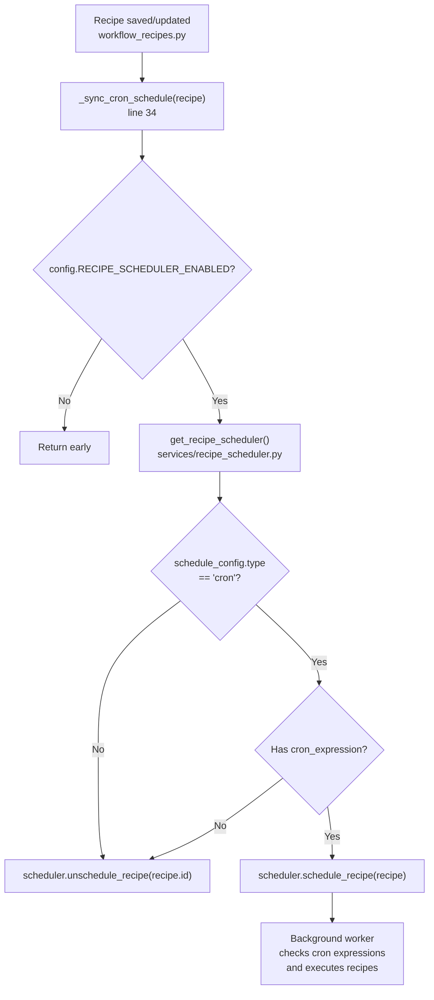

**Sources:** [orchestrator/api/workflow_recipes.py:34-47](), [orchestrator/api/workflow_recipes.py:495](), [orchestrator/api/workflow_recipes.py:623](), [orchestrator/api/workflow_recipes.py:667-672]()

### Quick Pick Templates

The UI provides common cron patterns as quick-pick options:

| Label | Cron Expression | Description |
|-------|----------------|-------------|
| Every hour | `0 * * * *` | At minute 0 of every hour |
| Daily at 9am | `0 9 * * *` | Every day at 9:00 AM |
| Weekdays at 9am | `0 9 * * 1-5` | Monday-Friday at 9:00 AM |
| Weekly on Monday | `0 9 * * 1` | Every Monday at 9:00 AM |

### UI Configuration

The cron scheduling interface provides:

1. **Quick Pick Dropdown** - Select from predefined schedules
2. **Manual Expression Input** - Enter custom cron expression with field labels
3. **Next Runs Preview** - Visual list of upcoming execution times
4. **Validation Feedback** - Real-time error display for invalid expressions

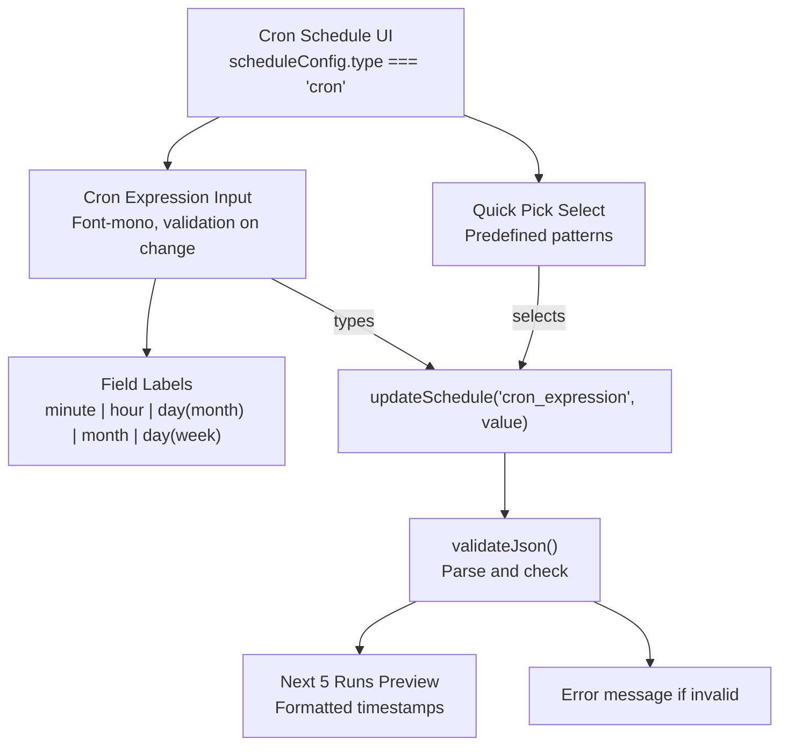

**Sources:** [frontend/components/workflows/recipe-schedule-config.tsx:195-263]()

---

## Webhook Triggers

Webhook triggers enable event-driven recipe execution through HTTP POST requests. The system supports two trigger sources: custom webhooks and Composio app integrations.

### Webhook URL Generation

Each recipe with trigger-based scheduling receives a unique `webhook_id` (UUID hex string) generated during recipe creation or update.

**Webhook ID Assignment Logic**

```python
# In create_workflow_recipe (orchestrator/api/workflow_recipes.py:426-429)
schedule_config = recipe_data.get('schedule_config')
if schedule_config and schedule_config.get('type') in ('trigger', 'webhook'):
    if 'webhook_id' not in schedule_config:
        schedule_config['webhook_id'] = uuid4().hex

# In update_workflow_recipe (orchestrator/api/workflow_recipes.py:542-549)
if 'schedule_config' in recipe_data:
    sc = recipe_data['schedule_config']
    if sc and sc.get('type') in ('trigger', 'webhook') and 'webhook_id' not in sc:
        # Preserve existing webhook_id on update to avoid breaking external integrations
        existing_wh = (recipe.schedule_config or {}).get('webhook_id')
        sc['webhook_id'] = existing_wh or uuid4().hex
```

The webhook URL format is:
```
POST {BACKEND_URL}/webhooks/recipe/{webhook_id}
```

**Webhook ID Generation and Persistence**

```mermaid
graph TB
    CreateRecipe["POST /api/workflow-recipes<br/>workflow_recipes.py:369"]
    UpdateRecipe["PUT /api/workflow-recipes/{id}<br/>workflow_recipes.py:512"]
    
    CreateRecipe --> CheckType{schedule_config.type<br/>in ('trigger', 'webhook')?}
    UpdateRecipe --> CheckType
    
    CheckType -->|No| NoWebhook["No webhook_id generated"]
    CheckType -->|Yes| CheckExists{Has webhook_id?}
    
    CheckExists -->|Yes| PreserveID["Keep existing webhook_id"]
    CheckExists -->|No| GenerateID["webhook_id = uuid4().hex<br/>(12-16 char hex string)"]
    
    PreserveID --> StoreDB["Store in schedule_config JSONB<br/>WorkflowTemplate.schedule_config"]
    GenerateID --> StoreDB
    
    StoreDB --> Frontend["Frontend displays:<br/>{BACKEND_URL}/webhooks/recipe/{webhook_id}"]
```

The webhook URL is displayed in the frontend for custom webhook integrations. External services can POST to this endpoint with JSON payloads that become the recipe's `input_data`.

**Sources:** [orchestrator/api/workflow_recipes.py:426-429](), [orchestrator/api/workflow_recipes.py:542-549]()

### Trigger Source Types

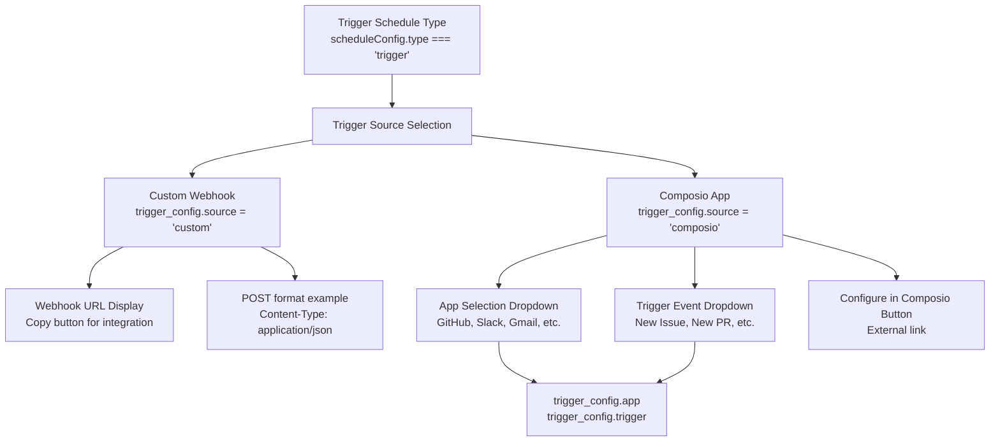

**Sources:** [frontend/components/workflows/recipe-schedule-config.tsx:25-28](), [frontend/components/workflows/recipe-schedule-config.tsx:108-111]()

### Custom Webhook Integration

For custom webhooks, the UI provides:

1. **Webhook URL Display** - Read-only input showing the unique webhook endpoint
2. **Copy Button** - One-click copy to clipboard with visual feedback
3. **Usage Documentation** - Code example showing POST request format

```
POST https://api.automatos.ai/webhooks/recipe/wh-abc123
Content-Type: application/json
Body: { "your_input": "data" }
```

The webhook body is validated against the recipe's input schema before execution.

**Sources:** [frontend/components/workflows/recipe-schedule-config.tsx:268-298](), [frontend/components/workflows/recipe-schedule-config.tsx:381-394]()

### Composio App Triggers

Composio integration enables recipes to be triggered by events from 250+ connected apps:

**Supported Apps (Sample):**
- GitHub (new issue, new PR, status change)
- Slack (new message, new channel)
- Gmail (new email, label change)
- Jira (new ticket, status update)
- Notion (new page, database update)
- Linear (new issue, status change)
- Salesforce (new lead, opportunity update)
- HubSpot (contact created, deal stage change)

**Configuration Fields:**
- `trigger_config.app` - Selected Composio app name
- `trigger_config.trigger` - Specific event type from the app
- External configuration link to Composio dashboard

The Composio configuration interface shows:

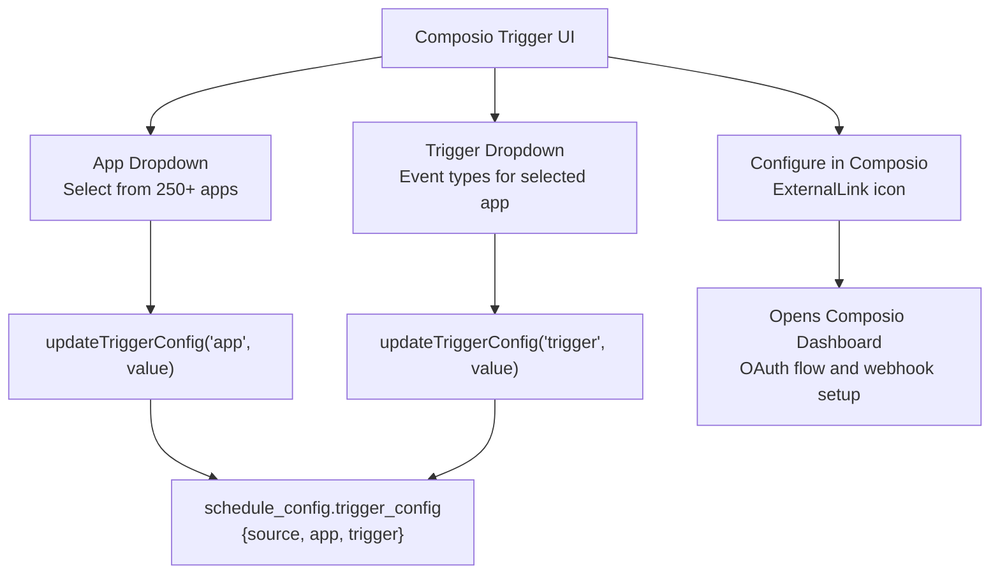

**Sources:** [frontend/components/workflows/recipe-schedule-config.tsx:329-378]()

---

## Configuration Interface

The scheduling configuration is the fourth and final step in the recipe creation wizard. It provides a tabbed interface for selecting and configuring the schedule type.

### Wizard Step Integration

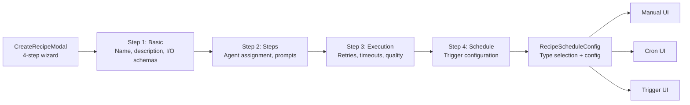

The wizard tracks the current step and validates that users can only proceed if required fields are filled. The schedule step (index 3) always allows proceeding since manual execution requires no configuration.

**Sources:** [frontend/components/workflows/create-recipe-modal.tsx:20-25](), [frontend/components/workflows/create-recipe-modal.tsx:318-328]()

### Schedule Type Selection

The type selection interface uses a three-column card layout with icons and descriptions:

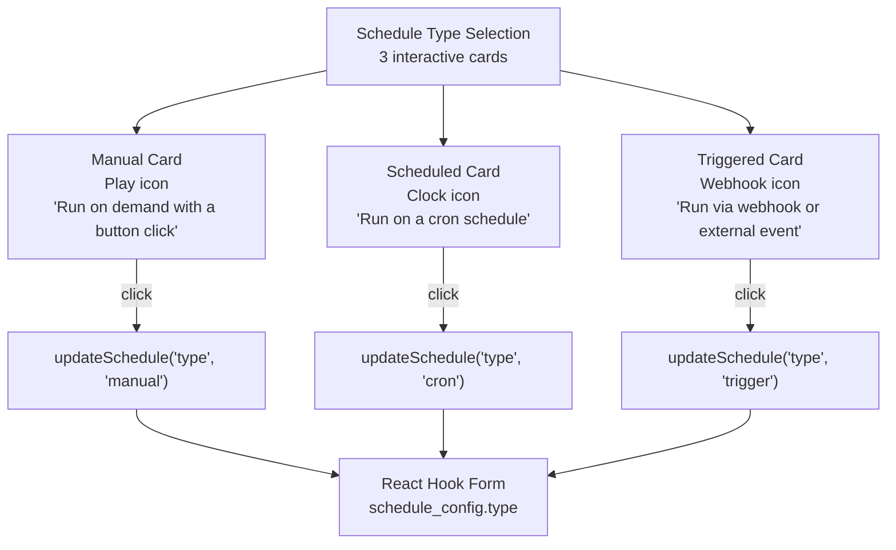

**Sources:** [frontend/components/workflows/recipe-schedule-config.tsx:134-161]()

### Form State Management

Schedule configuration uses React Hook Form's context to manage state:

```typescript
const methods = useFormContext<RecipeFormValues>()
const scheduleConfig = methods.watch('schedule_config')

const updateSchedule = (field, value) => {
  methods.setValue('schedule_config', { 
    ...scheduleConfig, 
    [field]: value 
  })
}
```

Changes are reactive and immediately reflected in the preview panel, which displays schedule badges and complexity calculations.

**Sources:** [frontend/components/workflows/recipe-schedule-config.tsx:90-98](), [frontend/hooks/use-recipe-form.ts:1-262]()

---

## Backend Integration

When a recipe is saved, the schedule configuration is transformed from the frontend form format into the backend API payload format, and triggers are automatically registered with external services if needed.

### Form to API Transformation

The `transformFormToApiPayload` function in `use-recipe-form.ts` handles the conversion:

**Form to API Transformation Flow**

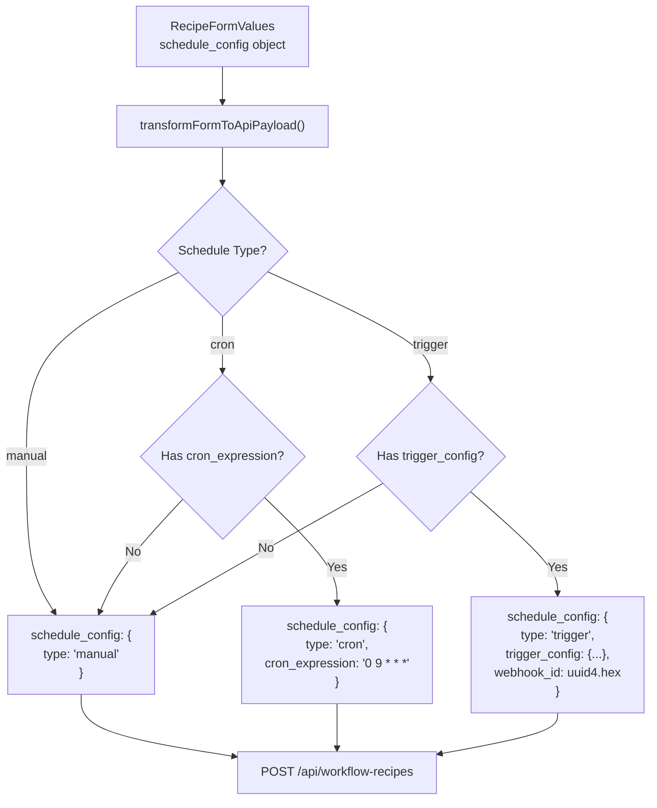

The transformation logic ensures:
- Empty cron expressions are omitted
- Empty trigger_config objects are omitted
- Only relevant fields are included based on schedule type
- Webhook IDs are automatically generated for trigger types

**Sources:** [frontend/hooks/use-recipe-form.ts:79-88]()

### API Payload Structure

The backend expects `schedule_config` as a structured object:

```typescript
{
  template_id: "my-recipe-abc123",
  name: "Daily Report Generator",
  template_definition: {...},
  steps: [...],
  execution_config: {...},
  schedule_config: {
    type: "trigger",
    webhook_id: "abc123def456",  // Auto-generated UUID hex
    trigger_config: {
      source: "composio",
      trigger_name: "GITHUB_NEW_ISSUE",
      app: "github"
    }
  }
}
```

**Sources:** [frontend/hooks/use-recipe-form.ts:90-102](), [orchestrator/api/workflow_recipes.py:416-418]()

### Webhook ID Generation

For trigger-based schedules, a unique `webhook_id` is generated during recipe creation or update if not already present:

```python
# In create_workflow_recipe endpoint
if schedule_config and schedule_config.get('type') in ('trigger', 'webhook'):
    if 'webhook_id' not in schedule_config:
        schedule_config['webhook_id'] = uuid4().hex
```

This `webhook_id` serves as a unique identifier for webhook endpoints and trigger subscriptions.

**Sources:** [orchestrator/api/workflow_recipes.py:416-418](), [orchestrator/api/workflow_recipes.py:528-531]()

### Automatic Trigger Registration

When a recipe with Composio triggers is created or updated, the `_auto_register_trigger()` function automatically registers the trigger subscription with the Composio API.

**Trigger Auto-Registration Process - Code Entity Flow**

```mermaid
graph TB
    SaveRecipe["Recipe Saved<br/>create_workflow_recipe() or<br/>update_workflow_recipe()"]
    
    CheckType{schedule_config.type<br/>== 'trigger'?}
    
    SaveRecipe --> CheckType
    CheckType -->|No| Skip["Return None"]
    CheckType -->|Yes| AutoReg["_auto_register_trigger(recipe, workspace_id, db)<br/>workflow_recipes.py:50"]
    
    AutoReg --> GetConfig["trigger_config = schedule_config.get('trigger_config', {})"]
    
    GetConfig --> CheckSource{trigger_config.get('source')<br/>== 'composio'?}
    
    CheckSource -->|No| SkipComposio["Log: Non-Composio trigger<br/>Return None"]
    CheckSource -->|Yes| GetTriggerName["trigger_name = trigger_config.get('trigger_name')<br/>or trigger_config.get('trigger')"]
    
    GetTriggerName --> CheckExists["db.query(TriggerSubscription).filter(<br/>workflow_id == recipe.id,<br/>trigger_name == trigger_name,<br/>is_active == True).first()"]
    
    CheckExists --> Exists{Subscription<br/>exists?}
    
    Exists -->|Yes| ReturnExisting["Return existing.composio_subscription_id"]
    Exists -->|No| GetEntity["EntityManager(db).get_or_create_entity(workspace_id)<br/>Returns {id, composio_entity_id}"]
    
    GetEntity --> BuildURL["callback_url = f'{config.BACKEND_URL}/api/composio/webhook'"]
    
    BuildURL --> Subscribe["get_composio_client().subscribe_to_trigger(<br/>entity_id, trigger_name, callback_url)"]
    
    Subscribe --> CreateSub["TriggerSubscription(<br/>  entity_id=entity['id'],<br/>  trigger_name=trigger_name,<br/>  callback_url=callback_url,<br/>  workflow_id=recipe.id,<br/>  composio_subscription_id=result['id'],<br/>  is_active=True<br/>)"]
    
    CreateSub --> CommitDB["db.add(subscription)<br/>db.commit()"]
    
    CommitDB --> ReturnNew["Return result['id']"]
```

The function returns the `composio_subscription_id` on success, or `None` if no registration was performed (custom webhooks or errors).

**Sources:** [orchestrator/api/workflow_recipes.py:50-126](), [orchestrator/api/workflow_recipes.py:490-492]()

### TriggerSubscription Model

The `TriggerSubscription` table (defined in `core/models/composio.py`) tracks active trigger registrations:

| Field | Type | Description |
|-------|------|-------------|
| `id` | Integer | Primary key |
| `entity_id` | Integer | FK to `composio_entities.id` |
| `trigger_name` | String | Composio trigger name (e.g., `"GITHUB_NEW_ISSUE"`) |
| `callback_url` | String | Webhook endpoint URL (typically `/api/composio/webhook`) |
| `agent_id` | Integer | Optional FK to `agents.id` |
| `workflow_id` | Integer | FK to `workflow_templates.id` (WorkflowRecipe) |
| `composio_subscription_id` | String | Composio's subscription ID (returned from their API) |
| `is_active` | Boolean | Whether subscription is active (default `True`) |

**TriggerSubscription Lifecycle**

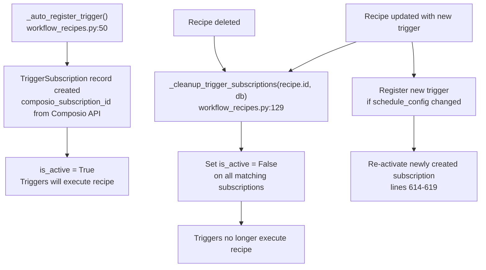

The subscription links the recipe to the external trigger source and stores the callback URL where Composio will deliver events.

**Sources:** [orchestrator/api/workflow_recipes.py:28](), [orchestrator/api/workflow_recipes.py:106-115](), [orchestrator/api/workflow_recipes.py:129-137](), [orchestrator/api/workflow_recipes.py:607-620]()

### Custom Webhooks vs Composio Triggers

The system distinguishes between two trigger sources:

**Custom Webhooks:**
- No external registration required
- Only need `webhook_id` stored in `schedule_config`
- Endpoint: `POST /webhooks/recipe/{webhook_id}`
- Payload becomes recipe `input_data`

**Composio Triggers:**
- Require registration via Composio API
- Create `TriggerSubscription` record
- Callback URL: `POST /api/composio/webhook`
- Composio forwards events to the callback

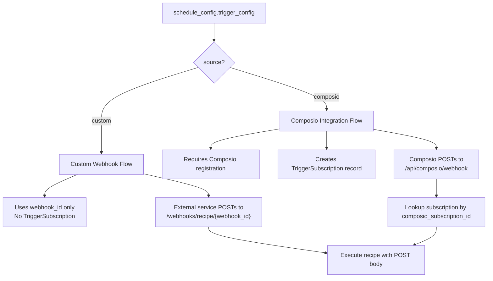

**Sources:** [orchestrator/api/workflow_recipes.py:52-56]()

### Trigger Subscription Cleanup

When recipes are updated or deleted, the `_cleanup_trigger_subscriptions()` function deactivates old trigger subscriptions to prevent orphaned webhooks.

**Cleanup Function Implementation**

```python
def _cleanup_trigger_subscriptions(recipe_id: int, db: Session) -> None:
    """Deactivate trigger subscriptions for a recipe."""
    subs = db.query(TriggerSubscription).filter(
        TriggerSubscription.workflow_id == recipe_id,
        TriggerSubscription.is_active == True,
    ).all()
    for sub in subs:
        sub.is_active = False
        logger.info("[trigger_auto] Deactivated subscription %d for recipe %d", sub.id, recipe_id)
```

**Update Flow:**

When `schedule_config` is modified in `update_workflow_recipe()`:
1. Line 609: Register new trigger with `_auto_register_trigger()`
2. Line 611-620: If new subscription created, cleanup old subscriptions
3. Line 614-619: Re-activate the newly created subscription (cleanup may have caught it)

```python
# workflow_recipes.py:607-620
if 'schedule_config' in recipe_data:
    new_sub_id = _auto_register_trigger(recipe, ctx.workspace_id, db)
    if new_sub_id:
        # New subscription created — deactivate old ones (except the new one)
        _cleanup_trigger_subscriptions(recipe.id, db)
        # Re-activate the newly created one
        new_sub = db.query(TriggerSubscription).filter(
            TriggerSubscription.composio_subscription_id == new_sub_id,
            TriggerSubscription.workflow_id == recipe.id,
        ).first()
        if new_sub:
            new_sub.is_active = True
    db.commit()
```

**Delete Flow:**

```python
# workflow_recipes.py:675
_cleanup_trigger_subscriptions(recipe.id, db)
db.delete(recipe)
db.commit()
```

**Sources:** [orchestrator/api/workflow_recipes.py:129-137](), [orchestrator/api/workflow_recipes.py:607-620](), [orchestrator/api/workflow_recipes.py:675]()

---

## Schedule Storage and Execution

### Database Storage

The `schedule_config` is stored as a JSON field in the `workflow_recipes` table:

- **Type:** JSON/JSONB column
- **Structure:** Exact match to API payload format
- **Indexing:** The `type` field can be indexed for filtering recipes by schedule type

Related tables:
- `workflow_recipes`: Stores the recipe definition and `schedule_config`
- `trigger_subscriptions`: Tracks active Composio trigger registrations
- `recipe_executions`: Records each execution instance

**Database Schema Relationships**

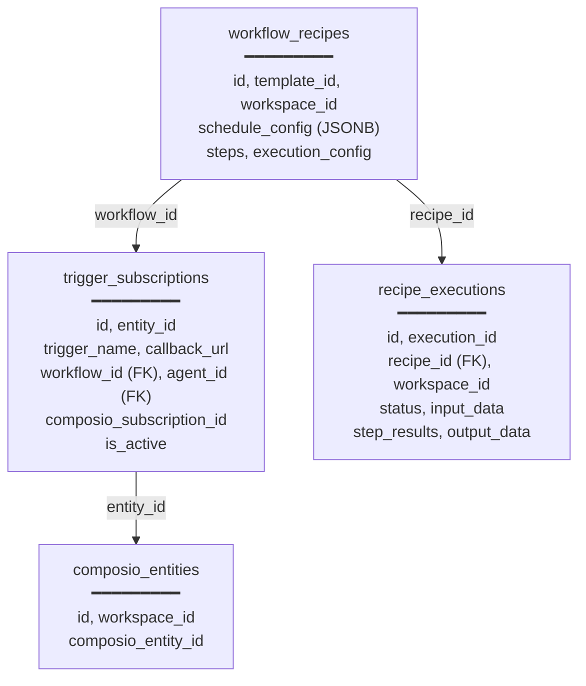

**Sources:** [orchestrator/api/workflow_recipes.py:26-29]()

### Schedule Execution Flow

**Complete Execution Flow by Schedule Type**

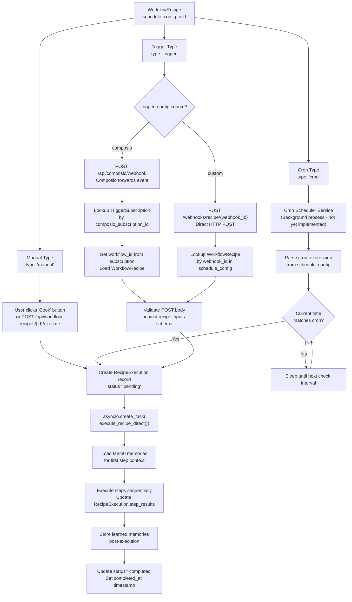

**Sources:** [orchestrator/api/workflow_recipes.py:783-880](), [orchestrator/api/workflow_recipes.py:37-56]()

### Recipe Execution Endpoint

The `POST /api/workflow-recipes/{recipe_id}/execute` endpoint creates a `RecipeExecution` record and launches an async task via `execute_recipe_direct()`.

**Execute Endpoint Implementation (workflow_recipes.py:812-877)**

```python
@router.post("/{recipe_id}/execute")
async def execute_recipe(
    recipe_id: str,
    ctx: RequestContext = Depends(get_request_context_hybrid),
    body: Dict[str, Any] = Body(default={}),
    db: Session = Depends(get_db)
):
    # 1. Fetch recipe from DB (line 836)
    recipe = db.query(WorkflowRecipe).filter(
        WorkflowRecipe.owner_type == 'workspace',
        WorkflowRecipe.workspace_id == ctx.workspace_id,
        WorkflowRecipe.template_id == recipe_id
    ).first()
    
    # 2. Extract and validate input_data (lines 841-851)
    input_data = body.get('input_data') or {}
    if recipe.inputs:
        for param_name, param_def in recipe.inputs.items():
            if param_name not in input_data:
                input_data[param_name] = param_def.get('default', '')
    
    # 3. Create RecipeExecution record (lines 853-863)
    recipe_execution_id = f"exec-{uuid4().hex[:12]}"
    recipe_execution = RecipeExecution(
        execution_id=recipe_execution_id,
        recipe_id=recipe.id,
        workspace_id=ctx.workspace_id,
        status='pending',
        input_data=input_data,
        current_step=0,
        triggered_by=ctx.user.email if ctx.user else 'anonymous'
    )
    db.add(recipe_execution)
    
    # 4. Update usage stats (lines 865-867)
    recipe.use_count += 1
    recipe.last_used_at = datetime.now()
    db.commit()
    
    # 5. Launch async execution (line 869)
    asyncio.create_task(execute_recipe_direct(
        recipe_execution_id=recipe_execution_id,
        recipe_id=recipe.id,
        workspace_id=ctx.workspace_id,
        input_data=input_data,
        db_url=str(db.get_bind().url)
    ))
    
    return {
        "recipe_execution_id": recipe_execution_id,
        "status": "started"
    }
```

**Execution Flow - Code Entity Mapping**

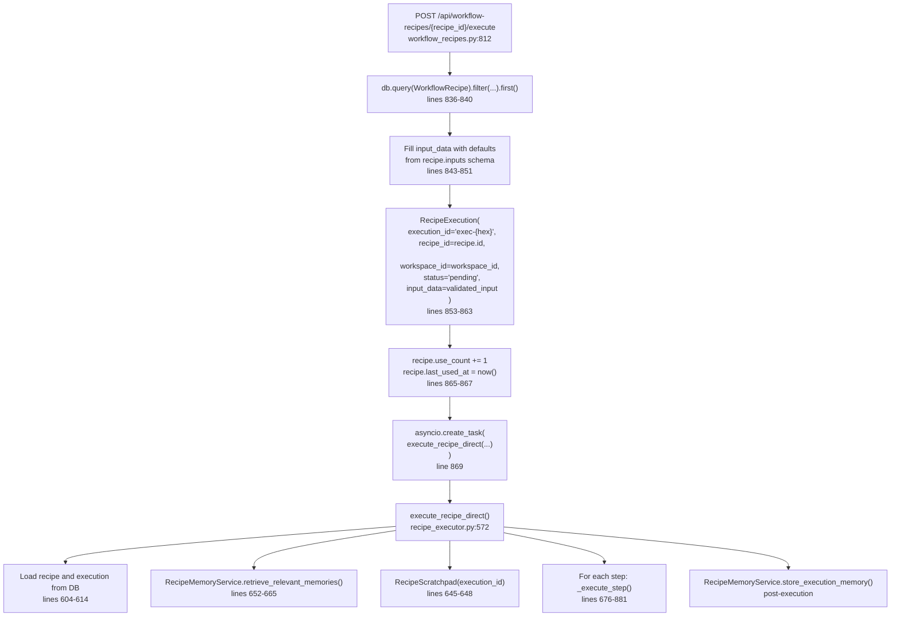

**Sources:** [orchestrator/api/workflow_recipes.py:812-877](), [orchestrator/api/recipe_executor.py:572-922]()

### Execution Status Tracking

The `RecipeExecution` model (defined in `core/models/core.py`) tracks execution state:

| Field | Type | Description |
|-------|------|-------------|
| `id` | Integer | Primary key (auto-increment) |
| `execution_id` | String | Unique execution identifier (`exec-{12-char-hex}`) |
| `recipe_id` | Integer | FK to `workflow_templates.id` |
| `workspace_id` | UUID | Workspace isolation (FK to `workspaces.id`) |
| `status` | String | `pending`, `running`, `completed`, `failed` |
| `current_step` | Integer | Current step number (0-indexed, increments during execution) |
| `input_data` | JSONB | Input parameters passed to execution |
| `step_results` | JSONB | Array of step execution results (compact summaries) |
| `output_data` | JSONB | Final output and summary |
| `error_message` | Text | Error details if `status='failed'` |
| `started_at` | DateTime | Execution start timestamp (set when status → `running`) |
| `completed_at` | DateTime | Execution completion timestamp |
| `total_duration_ms` | Integer | Total execution duration in milliseconds |
| `triggered_by` | String | User email, `'webhook'`, or `'cron'` |
| `quality_score` | Float | Post-execution quality assessment (0.0-1.0) |
| `created_at` | DateTime | Record creation timestamp |
| `updated_at` | DateTime | Record last update timestamp |

**Execution State Transitions**

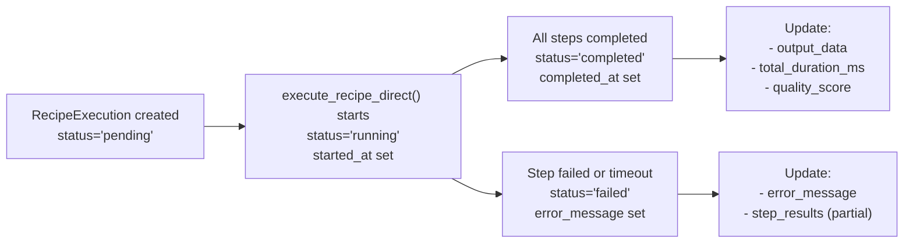

Frontend components (e.g., `ExecutionKitchen`, `RecipeStepProgress`) poll the `RecipeExecution` record via `GET /api/workflow-recipes/executions/{execution_id}` to display real-time progress.

**Sources:** [orchestrator/core/models/core.py:600-650](), [orchestrator/api/recipe_executor.py:617-620](), [orchestrator/api/recipe_executor.py:699-700]()

### Preview Integration

The schedule type is displayed in the recipe preview panel with visual badges:

| Type | Badge Icon | Badge Color | Label |
|------|-----------|-------------|-------|
| `manual` | Play | Primary | "Manual" |
| `cron` | Clock | Primary | "Scheduled" |
| `trigger` | Webhook | Primary | "Triggered" |

The complexity score calculation includes schedule type as a factor:
- Manual: +0 points
- Cron: +5 points
- Trigger: +10 points

**Sources:** [frontend/components/workflows/recipe-preview-panel.tsx:31-35](), [frontend/components/workflows/recipe-preview-panel.tsx:56-59]()

---

## Key Configuration Fields

### schedule_config Object Structure

```typescript
interface ScheduleConfig {
  type: 'manual' | 'cron' | 'trigger'
  cron_expression?: string        // Required if type === 'cron'
  webhook_id?: string              // Auto-generated for trigger types
  trigger_config?: {               // Required if type === 'trigger'
    source?: 'composio' | 'custom'
    trigger_name?: string          // Composio trigger name (canonical)
    trigger?: string               // Composio trigger name (UI shorthand)
    app?: string                   // Composio app name
    // Additional custom fields as needed
  }
}
```

**Field Descriptions:**

| Field | Required When | Description |
|-------|---------------|-------------|
| `type` | Always | Schedule execution mode |
| `cron_expression` | `type === 'cron'` | 5-part cron string (minute hour day month weekday) |
| `webhook_id` | `type === 'trigger'` | UUID hex for webhook endpoint identification |
| `trigger_config.source` | `type === 'trigger'` | Either `'composio'` or `'custom'` |
| `trigger_config.trigger_name` | Composio triggers | Canonical trigger name (e.g., `"GITHUB_NEW_ISSUE"`) |
| `trigger_config.trigger` | Composio triggers | UI shorthand for trigger name (alternative field) |
| `trigger_config.app` | Composio triggers | App name (e.g., `"github"`, `"slack"`) |

### Default Values

When a new recipe is created, the default schedule configuration is:

```typescript
schedule_config: {
  type: 'manual',
  cron_expression: '',
  trigger_config: {}
}
```

The `webhook_id` is generated automatically when the user selects `type: 'trigger'` and saves the recipe.

**Sources:** [frontend/components/workflows/create-recipe-modal.tsx:95-99](), [orchestrator/api/workflow_recipes.py:416-418](), [orchestrator/api/workflow_recipes.py:58-62]()

### Backend Validation

The backend validates `schedule_config` structure using the `WorkflowTemplate.validate_schedule_config()` method (defined in `core/models/core.py`):

```python
def validate_schedule_config(self) -> Tuple[bool, Optional[str]]:
    """Validate schedule_config structure"""
    if not self.schedule_config:
        return True, None
    
    config = self.schedule_config
    
    # Validate type field
    if 'type' not in config:
        return False, "schedule_config must have 'type' field"
    
    valid_types = ['manual', 'cron', 'trigger', 'webhook']
    if config['type'] not in valid_types:
        return False, f"Invalid schedule type: {config['type']}"
    
    # Validate cron expression if type is 'cron'
    if config['type'] == 'cron':
        if 'cron_expression' not in config or not config['cron_expression']:
            return False, "cron_expression required for cron schedule"
    
    # Validate trigger config if type is 'trigger' or 'webhook'
    if config['type'] in ('trigger', 'webhook'):
        if 'trigger_config' not in config:
            return False, "trigger_config required for trigger schedule"
    
    return True, None
```

**Validation Points in API**

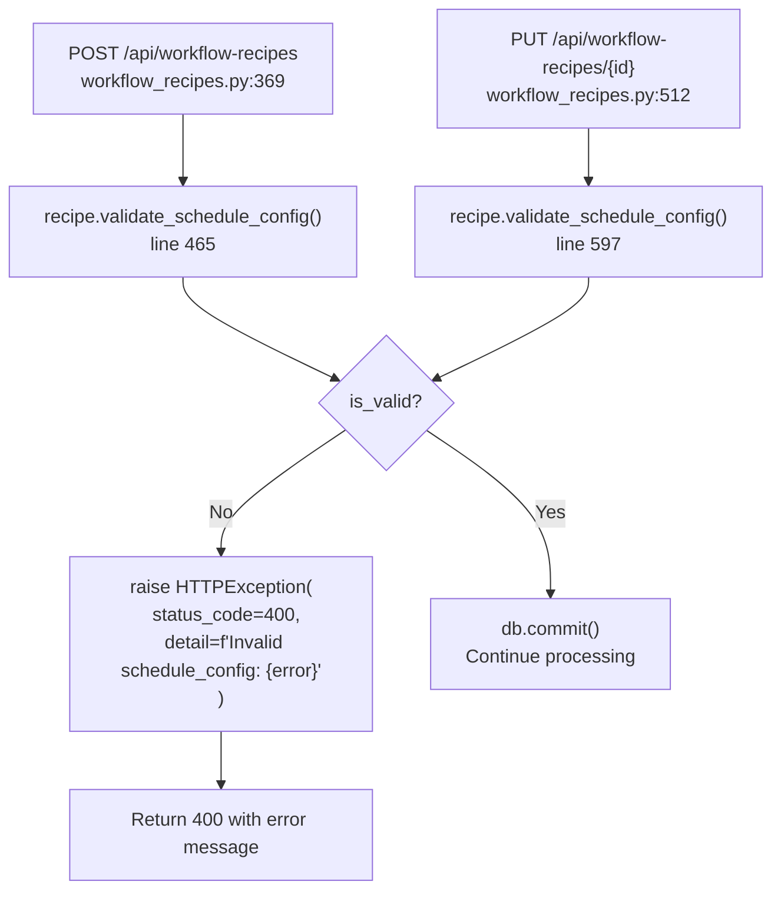

Validation occurs before committing new or updated recipes to the database. Invalid configurations result in HTTP 400 responses with detailed error messages.

**Sources:** [orchestrator/api/workflow_recipes.py:465-468](), [orchestrator/api/workflow_recipes.py:595-600]()

---

## Summary

Automatos AI provides flexible scheduling options for workflow recipes:

1. **Manual Execution** - Simple on-demand triggering via UI or API
2. **Cron Scheduling** - Time-based automation with standard cron expressions and next-run preview
3. **Webhook Triggers** - Event-driven execution via custom webhooks or Composio app integrations

The configuration interface is integrated as Step 4 of the recipe creation wizard, with reactive UI updates, validation, and preview capabilities. Schedule configuration is stored as structured JSON and used by backend services to determine execution timing and triggers.

---