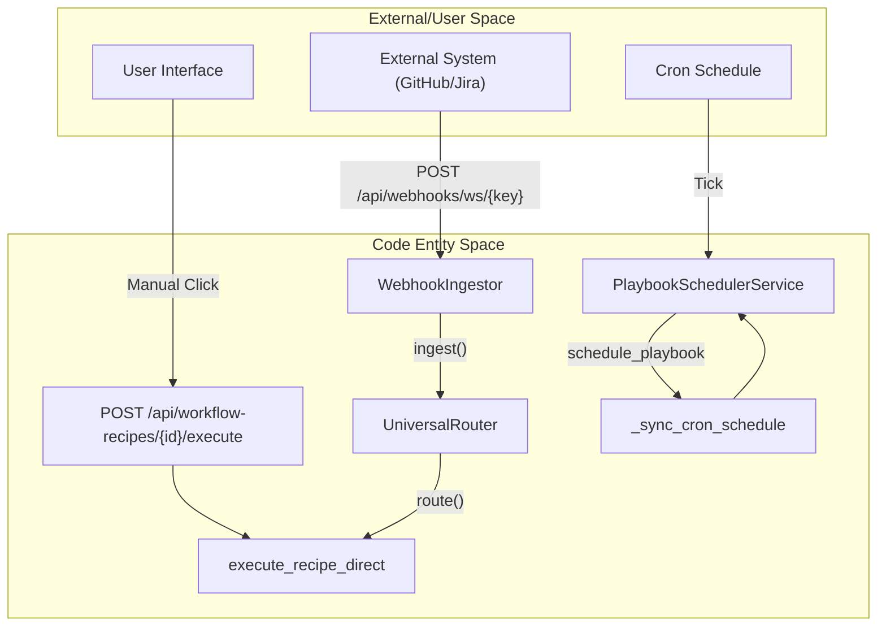
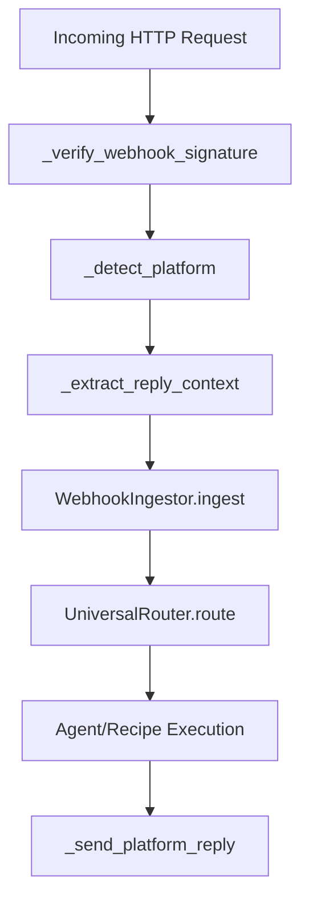

# Scheduling & Triggers

Relevant source files

The following files were used as context for generating this wiki page:

- [docs/PRDS/53-WEBHOOK-TRIGGER-SYSTEM-PRD.md](docs/PRDS/53-WEBHOOK-TRIGGER-SYSTEM-PRD.md)
- [frontend/app/globals.css](frontend/app/globals.css)
- [frontend/app/layout.tsx](frontend/app/layout.tsx)
- [frontend/components/agents/org-chart-tab.tsx](frontend/components/agents/org-chart-tab.tsx)
- [frontend/components/providers.tsx](frontend/components/providers.tsx)
- [frontend/components/settings/WebhooksSettingsTab.tsx](frontend/components/settings/WebhooksSettingsTab.tsx)
- [frontend/components/ui/theme-toggle.tsx](frontend/components/ui/theme-toggle.tsx)
- [frontend/components/workspace-provider.tsx](frontend/components/workspace-provider.tsx)
- [orchestrator/alembic/versions/20260213_add_workspace_webhook_key.py](orchestrator/alembic/versions/20260213_add_workspace_webhook_key.py)
- [orchestrator/api/marketplace.py](orchestrator/api/marketplace.py)
- [orchestrator/api/webhooks.py](orchestrator/api/webhooks.py)
- [orchestrator/api/workflow_recipes.py](orchestrator/api/workflow_recipes.py)
- [orchestrator/core/auth/hybrid.py](orchestrator/core/auth/hybrid.py)
- [orchestrator/core/routing/ingestors/webhook.py](orchestrator/core/routing/ingestors/webhook.py)
- [orchestrator/core/seeds/platform-management-skill.md](orchestrator/core/seeds/platform-management-skill.md)
- [orchestrator/tests/test_invitation_routing.py](orchestrator/tests/test_invitation_routing.py)

This page documents the execution trigger mechanisms for workflow recipes and workspace interactions: manual execution, cron-based scheduling, and webhook-based triggers. Each recipe can be configured with a trigger type that determines how it executes, while workspaces provide a global webhook for routed message ingestion.

---

## Schedule Types Overview

Recipes support three mutually exclusive schedule types defined in the configuration. These types determine the entry point into the execution engine.

| Type | Trigger Mechanism | Use Case |
|------|------------------|----------|
| `manual` | User-initiated via UI or API | One-off workflows, testing, ad-hoc tasks |
| `cron` | Time-based with `APScheduler` | Periodic reports, scheduled maintenance, batch jobs |
| `trigger` | Webhook HTTP POST (Composio or Custom) | External event-driven workflows (Jira, GitHub, Slack, etc.) |

**Diagram: Trigger to Code Entity Mapping**

Sources: [orchestrator/api/workflow_recipes.py:34-47](), [orchestrator/api/webhooks.py:6-12](), [orchestrator/core/routing/ingestors/webhook.py:22-30]()

---

## Workspace Webhooks vs. Recipe Webhooks

The system distinguishes between a global workspace-level entry point and specific recipe triggers.

### 1. Workspace Webhook (Universal Routing)
Every workspace is assigned a unique `webhook_key` upon creation [orchestrator/alembic/versions/20260213_add_workspace_webhook_key.py:25-35](). Messages sent to this endpoint are processed by the `WebhookIngestor`, which normalizes various payload formats (Telegram, Slack, Twilio, WhatsApp) into a `RequestEnvelope` [orchestrator/api/webhooks.py:91-117]().

*   **Endpoint**: `POST /api/webhooks/ws/{workspace_key}` [orchestrator/api/webhooks.py:6]()
*   **Logic**: The `UniversalRouter` analyzes the content to determine if it should trigger an agent or a specific workflow.
*   **Platform Detection**: The backend automatically detects platforms like Telegram, Slack, and WhatsApp based on payload structure [orchestrator/api/webhooks.py:91-117]().
*   **Security**: Verification is handled via `_verify_webhook_signature` using HMAC-SHA256 [orchestrator/api/webhooks.py:44-60]().

### 2. Recipe-Specific Webhooks
Recipes configured with the `trigger` type receive a dedicated `webhook_id`. 
*   **Composio Integration**: If the trigger source is `composio`, the system automatically registers the webhook with Composio via `_auto_register_trigger` [orchestrator/api/workflow_recipes.py:50-69]().
*   **Subscription Management**: Active triggers are stored in the `TriggerSubscription` table [orchestrator/api/workflow_recipes.py:107-116]().
*   **UI Reference**: The frontend provides a reference to these in the Webhooks Settings tab [frontend/components/settings/WebhooksSettingsTab.tsx:84-91]().

Sources: [orchestrator/api/workflow_recipes.py:50-126](), [orchestrator/api/webhooks.py:6-12](), [frontend/components/settings/WebhooksSettingsTab.tsx:84-91]()

---

## Webhook Ingestion & Routing Logic

The `WebhookIngestor` and `UniversalRouter` work together to transform raw HTTP requests into actionable agent or workflow executions.

### Content Extraction Hierarchy
The `WebhookIngestor` extracts reply context based on the messaging platform:
*   **Telegram**: Extracts `chat_id` and `from_user` [orchestrator/api/webhooks.py:124-127]().
*   **Slack**: Extracts `channel`, `thread_ts`, and `user` [orchestrator/api/webhooks.py:129-133]().
*   **WhatsApp**: Extracts `from_phone` and `phone_number_id` [orchestrator/api/webhooks.py:135-141]().

### Platform Reply Functions
The system can send replies back to the originating platform after processing:
*   **Telegram**: `_send_telegram_reply` truncates text to 4096 characters and uses Markdown [orchestrator/api/webhooks.py:154-171]().
*   **Slack**: `_send_slack_reply` uses `chat.postMessage` with optional `thread_ts` [orchestrator/api/webhooks.py:184-197]().

**Diagram: Webhook Processing Flow**

Sources: [orchestrator/api/webhooks.py:44-208](), [orchestrator/core/routing/ingestors/webhook.py:22-30]()

---

## Trigger Subscriptions & Automation

The `TriggerSubscription` model facilitates long-lived connections between external events and internal workflows.

### Auto-Registration Flow
When a recipe is created or updated with a `trigger` configuration:
1.  `_auto_register_trigger` checks if the source is `composio` [orchestrator/api/workflow_recipes.py:65-69]().
2.  It retrieves or creates a `ComposioEntity` for the workspace [orchestrator/api/workflow_recipes.py:95-96]().
3.  It calls `client.subscribe_to_trigger` with a callback URL pointing to `/api/composio/webhook` [orchestrator/api/workflow_recipes.py:101-105]().
4.  A `TriggerSubscription` record is persisted to track the `composio_subscription_id` [orchestrator/api/workflow_recipes.py:107-116]().

### Cleanup
When recipes are deleted or triggers are disabled, `_cleanup_trigger_subscriptions` deactivates existing subscriptions by setting `is_active = False` [orchestrator/api/workflow_recipes.py:129-137]().

Sources: [orchestrator/api/workflow_recipes.py:50-138](), [orchestrator/core/models/composio.py:28]()

---

## Configuration Reference

### RecipeScheduleConfig Structure
Stored within the `WorkflowRecipe.schedule_config` JSONB field.

| Field | Type | Description |
|-------|------|-------------|
| `type` | `string` | `manual`, `cron`, or `trigger` [orchestrator/api/workflow_recipes.py:60]() |
| `cron_expression` | `string` | Standard cron string used by `PlaybookSchedulerService` [orchestrator/api/workflow_recipes.py:42]() |
| `trigger_config` | `dict` | Contains `source` (e.g., `composio`) and `trigger_name` [orchestrator/api/workflow_recipes.py:63-75]() |

### Workspace Webhook Metadata
Workspace models include fields for external ingestion:
*   `webhook_url`: The public endpoint for the workspace [frontend/components/workspace-provider.tsx:27]().
*   `webhook_key`: The secret key used for URL-based authentication [frontend/components/workspace-provider.tsx:28]().

Sources: [orchestrator/api/workflow_recipes.py:41-78](), [frontend/components/workspace-provider.tsx:14-33]()

---