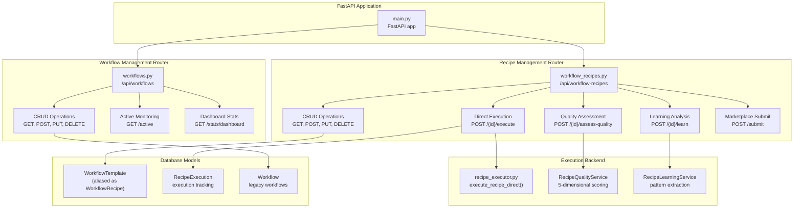
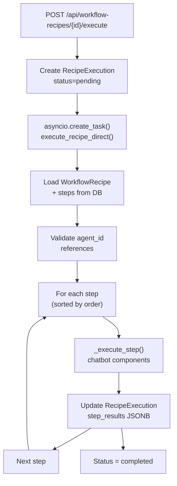
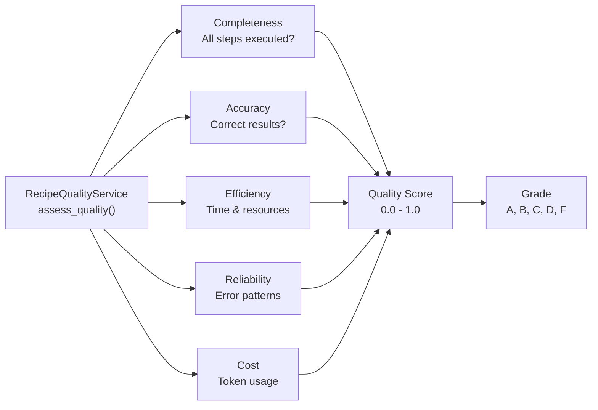
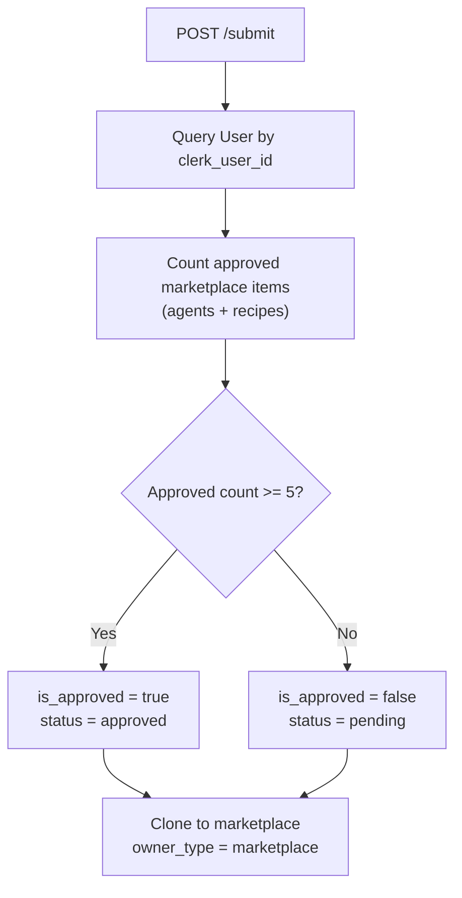
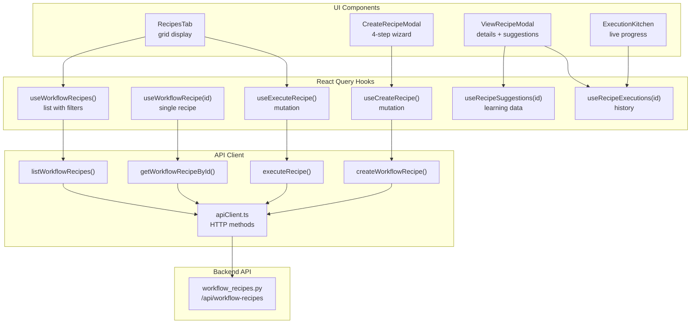
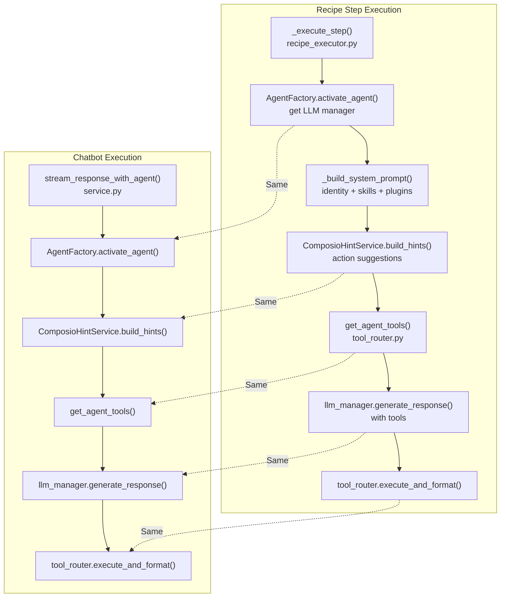
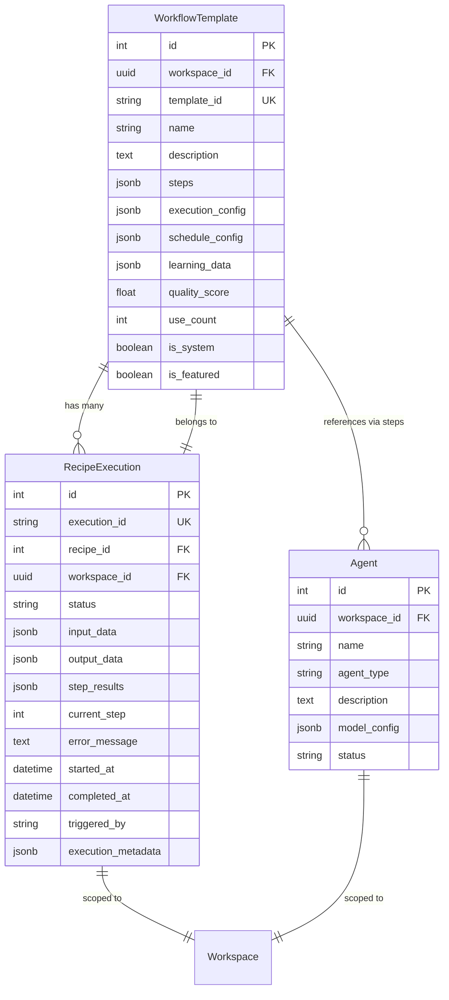
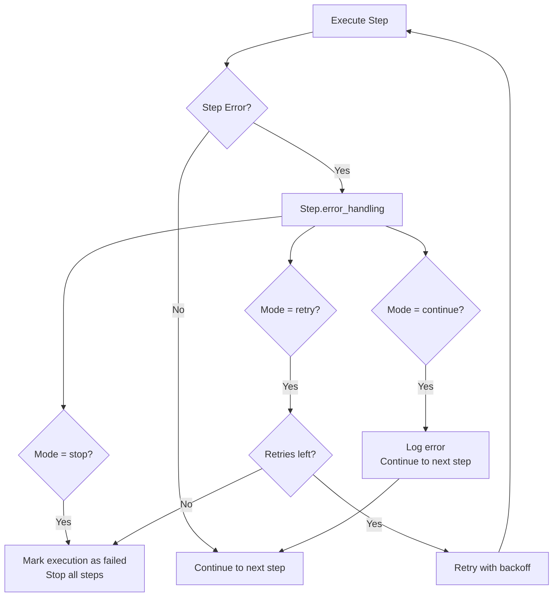
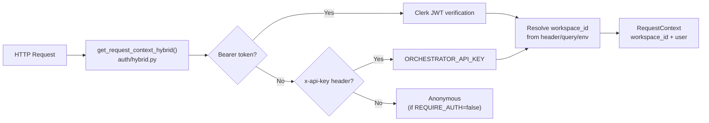

# Workflow API Reference

<details>
<summary>Relevant source files</summary>

The following files were used as context for generating this wiki page:

- [frontend/app/admin/plugins/page.tsx](frontend/app/admin/plugins/page.tsx)
- [frontend/components/workflows/create-recipe-modal.tsx](frontend/components/workflows/create-recipe-modal.tsx)
- [frontend/components/workflows/execution-kitchen.tsx](frontend/components/workflows/execution-kitchen.tsx)
- [frontend/components/workflows/recipe-execution-config.tsx](frontend/components/workflows/recipe-execution-config.tsx)
- [frontend/components/workflows/recipe-preview-panel.tsx](frontend/components/workflows/recipe-preview-panel.tsx)
- [frontend/components/workflows/recipe-step-builder.tsx](frontend/components/workflows/recipe-step-builder.tsx)
- [frontend/components/workflows/recipes-tab.tsx](frontend/components/workflows/recipes-tab.tsx)
- [frontend/components/workflows/view-recipe-modal.tsx](frontend/components/workflows/view-recipe-modal.tsx)
- [frontend/hooks/use-recipe-form.ts](frontend/hooks/use-recipe-form.ts)
- [frontend/lib/api-client.ts](frontend/lib/api-client.ts)
- [orchestrator/.env.example](orchestrator/.env.example)
- [orchestrator/alembic/versions/20260202_add_workspace_id_to_skills_patterns_models.py](orchestrator/alembic/versions/20260202_add_workspace_id_to_skills_patterns_models.py)
- [orchestrator/api/agent_plugins.py](orchestrator/api/agent_plugins.py)
- [orchestrator/api/recipe_executor.py](orchestrator/api/recipe_executor.py)
- [orchestrator/api/workflow_recipes.py](orchestrator/api/workflow_recipes.py)
- [orchestrator/config.py](orchestrator/config.py)
- [orchestrator/core/database/load_seed_data.py](orchestrator/core/database/load_seed_data.py)
- [orchestrator/core/models/core.py](orchestrator/core/models/core.py)
- [orchestrator/core/seeds/seed_personas.py](orchestrator/core/seeds/seed_personas.py)
- [orchestrator/core/seeds/seed_plugin_categories.py](orchestrator/core/seeds/seed_plugin_categories.py)
- [orchestrator/core/services/plugin_cache.py](orchestrator/core/services/plugin_cache.py)
- [orchestrator/core/services/recipe_memory_service.py](orchestrator/core/services/recipe_memory_service.py)
- [orchestrator/core/services/workspace_manager.py](orchestrator/core/services/workspace_manager.py)
- [orchestrator/main.py](orchestrator/main.py)
- [scripts/ralph/prd.json](scripts/ralph/prd.json)

</details>


This page documents the REST API endpoints for workflow and recipe management, including CRUD operations, execution control, quality assessment, and learning analysis. The workflow system provides two execution modes: the legacy 9-stage pipeline (for workflows) and the direct step-by-step executor (for recipes).

For information about workflow concepts and architecture, see [Workflows & Recipes](#4). For execution configuration details, see [Execution Configuration](#4.3). For quality assessment implementation, see [Quality Assessment & Learning](#4.5).

---

## API Architecture Overview

The workflow API is organized into two primary router modules that handle distinct responsibilities within the orchestration system.

**Workflow API Routers Architecture**



Sources: [orchestrator/api/workflow_recipes.py:1-22](), [orchestrator/api/workflows.py:1-34](), [orchestrator/api/recipe_executor.py:1-19]()

---

## Recipe CRUD Endpoints

The recipe management endpoints provide full lifecycle control for workflow recipes, including creation, retrieval, updates, and deletion.

### List Recipes

**Endpoint**: `GET /api/workflow-recipes`

Lists all workflow recipes in the current workspace with filtering, pagination, and sorting capabilities.

**Query Parameters**:

| Parameter | Type | Default | Description |
|-----------|------|---------|-------------|
| `is_featured` | boolean | - | Filter by featured status |
| `is_public` | boolean | `true` | Filter by public visibility |
| `search` | string | - | Search in name and description |
| `skip` | integer | `0` | Pagination offset (≥0) |
| `limit` | integer | `50` | Results per page (1-100) |
| `sort_by` | string | `popularity` | Sort field: `popularity`, `created_at`, `use_count`, `average_rating`, `name` |

**Response**:
```json
{
  "items": [
    {
      "id": 1,
      "template_id": "data-pipeline-recipe",
      "name": "Data Pipeline Automation",
      "description": "Automated ETL workflow",
      "steps": [...],
      "quality_score": 0.87,
      "use_count": 42,
      "is_featured": true,
      "created_at": "2024-01-15T10:30:00Z"
    }
  ],
  "total": 15,
  "skip": 0,
  "limit": 50
}
```

**Implementation Details**:

The list endpoint applies workspace isolation via `RequestContext`, filters based on query parameters, and enriches step data with agent information through the `_enrich_steps_with_agents()` helper function.

Sources: [orchestrator/api/workflow_recipes.py:66-138]()

---

### Get Recipe by ID

**Endpoint**: `GET /api/workflow-recipes/{recipe_id}`

Retrieves a single recipe by its `template_id` with enriched agent details for each step.

**Path Parameters**:
- `recipe_id` (string, required): The recipe's unique template ID

**Response**:
```json
{
  "template_id": "data-pipeline-recipe",
  "name": "Data Pipeline Automation",
  "description": "Automated ETL workflow",
  "steps": [
    {
      "step_id": "extract-step",
      "order": 1,
      "agent_id": 123,
      "prompt_template": "Extract data from source",
      "agent": {
        "id": 123,
        "name": "DataExtractor",
        "model": "gpt-4",
        "provider": "openai",
        "tool_count": 5,
        "status": "active"
      }
    }
  ],
  "execution_config": {
    "mode": "sequential",
    "max_retries": 3
  },
  "quality_score": 0.87
}
```

**Agent Enrichment**:

The `_enrich_steps_with_agents()` function batch-fetches agents referenced in recipe steps and injects their metadata into the response, including model configuration and tool counts.

Sources: [orchestrator/api/workflow_recipes.py:141-168](), [orchestrator/api/workflow_recipes.py:29-63]()

---

### Create Recipe

**Endpoint**: `POST /api/workflow-recipes`

Creates a new workflow recipe with validation of steps, execution configuration, and agent references.

**Request Body**:
```json
{
  "template_id": "my-custom-recipe",
  "name": "Custom Workflow",
  "description": "My automated workflow",
  "template_definition": {},
  "steps": [
    {
      "step_id": "step-1",
      "order": 1,
      "agent_id": 123,
      "prompt_template": "Analyze the data",
      "error_handling": "stop",
      "max_retries": 2
    }
  ],
  "execution_config": {
    "mode": "sequential",
    "max_retries": 1,
    "retry_delay": 5,
    "per_step_timeout": 300,
    "total_timeout": 1800,
    "quality_threshold": 0.7,
    "auto_learn": true
  },
  "schedule_config": {
    "type": "manual"
  },
  "is_public": true
}
```

**Required Fields**:
- `template_id`: Unique identifier
- `name`: Display name
- `description`: Recipe description
- `template_definition`: JSON workflow structure
- `steps`: Array of step definitions (required, non-empty)

**Validation Process**:

The create endpoint performs multiple validation checks before persisting the recipe:

1. **Step Structure Validation**: Calls `recipe.validate_steps()` to ensure each step has required fields
2. **Execution Config Validation**: Calls `recipe.validate_execution_config()` to verify timeouts and retry settings
3. **Schedule Config Validation**: Calls `recipe.validate_schedule_config()` for cron expressions
4. **Agent Reference Validation**: Queries database to ensure all `agent_id` references exist in the workspace

Sources: [orchestrator/api/workflow_recipes.py:171-299]()

---

### Update Recipe

**Endpoint**: `PUT /api/workflow-recipes/{recipe_id}`

Updates an existing recipe. System recipes (`is_system=true`) cannot be modified.

**Path Parameters**:
- `recipe_id` (string, required): The recipe's template ID

**Updatable Fields**:
- `name`, `description`, `tags`
- `template_definition`, `steps`, `inputs`, `outputs`
- `execution_config`, `schedule_config`
- `recommended_agents`, `required_tools`
- `is_public`, `is_featured`
- `preview_image`, `documentation_url`, `version`, `changelog`

**Validation on Update**:

When updating `steps`, the endpoint re-validates:
- Step structure via `recipe.validate_steps()`
- Agent ID references against workspace agents
- Execution and schedule config structures

Sources: [orchestrator/api/workflow_recipes.py:302-398]()

---

### Delete Recipe

**Endpoint**: `DELETE /api/workflow-recipes/{recipe_id}`

Deletes a workflow recipe. System recipes cannot be deleted.

**Response**:
```json
{
  "message": "Recipe deleted successfully",
  "recipe_id": "my-custom-recipe"
}
```

Sources: [orchestrator/api/workflow_recipes.py:401-442]()

---

## Recipe Execution Endpoints

The execution system provides direct step-by-step recipe execution that bypasses the legacy 9-stage pipeline, using the same components as the chatbot for consistency.

### Execute Recipe

**Endpoint**: `POST /api/workflow-recipes/{recipe_id}/execute`

Launches a recipe execution as an asynchronous background task, creating a `RecipeExecution` record and returning immediately with the execution ID.

**Request Body** (optional):
```json
{
  "input_data": {
    "project_name": "my-repo",
    "target_branch": "main"
  }
}
```

**Response**:
```json
{
  "recipe_execution_id": "exec-abc123def456",
  "recipe_id": "data-pipeline-recipe",
  "status": "started",
  "total_steps": 5,
  "message": "Recipe execution started (direct mode)"
}
```

**Execution Flow**:



**Background Execution Process**:

The `execute_recipe_direct()` function runs asynchronously after the API returns. It:
1. Loads recipe and validates agents exist
2. Executes steps sequentially (or parallel if configured)
3. For each step:
   - Builds clean prompt with input substitutions
   - Calls `_execute_step()` which uses chatbot's tool router, hint service, and LLM
   - Stores results in `RecipeExecution.step_results` JSONB array
4. Handles errors per step's `error_handling` config (`stop`, `continue`, or `retry`)

Sources: [orchestrator/api/workflow_recipes.py:542-639](), [orchestrator/api/recipe_executor.py:313-441]()

---

### Get Execution Status

**Endpoint**: `GET /api/workflow-recipes/{recipe_id}/executions/{execution_id}`

Retrieves detailed execution status including step-level progress and results. Used by frontend for polling execution updates.

**Response**:
```json
{
  "execution_id": "exec-abc123def456",
  "recipe_id": "data-pipeline-recipe",
  "recipe_name": "Data Pipeline Automation",
  "status": "running",
  "current_step": 3,
  "total_steps": 5,
  "step_results": [
    {
      "step_id": "extract-step",
      "order": 1,
      "status": "completed",
      "output": "Extracted 1000 records",
      "tool_calls": [],
      "duration_ms": 2500,
      "tokens_used": 150
    }
  ],
  "started_at": "2024-01-15T14:30:00Z",
  "completed_at": null,
  "error_message": null
}
```

**Step Results Structure**:

Each entry in `step_results` contains:
- `step_id`, `order`: Step identification
- `agent_id`, `agent_name`: Executing agent
- `status`: `"running"`, `"completed"`, `"failed"`
- `output`: Agent's final response text
- `tool_calls`: Array of tool invocations with results
- `duration_ms`, `tokens_used`: Performance metrics
- `error`: Error message if step failed

Sources: [orchestrator/api/workflow_recipes.py:642-706](), [orchestrator/api/recipe_executor.py:411-428]()

---

### List Recipe Executions

**Endpoint**: `GET /api/workflow-recipes/{recipe_id}/executions`

Lists execution history for a recipe with optional status filtering.

**Query Parameters**:

| Parameter | Type | Default | Description |
|-----------|------|---------|-------------|
| `status` | string | - | Filter: `pending`, `running`, `completed`, `failed`, `cancelled` |
| `skip` | integer | `0` | Pagination offset |
| `limit` | integer | `20` | Results per page (1-100) |

**Response**:
```json
{
  "items": [
    {
      "execution_id": "exec-abc123",
      "status": "completed",
      "started_at": "2024-01-15T14:30:00Z",
      "completed_at": "2024-01-15T14:35:00Z",
      "total_duration_ms": 300000,
      "quality_score": 0.89
    }
  ],
  "total": 42,
  "recipe_quality_score": 0.87
}
```

Sources: [orchestrator/api/workflow_recipes.py:872-928]()

---

## Quality Assessment & Learning Endpoints

These endpoints implement the self-learning system that analyzes execution quality and extracts improvement patterns.

### Assess Execution Quality

**Endpoint**: `POST /api/workflow-recipes/{recipe_id}/assess-quality`

Triggers a 5-dimensional quality assessment on a completed execution. Updates the recipe's `quality_score` field with a rolling average.

**Request Body**:
```json
{
  "execution_id": "exec-abc123def456",
  "learnings": {
    "patterns": [],
    "performance_metrics": {}
  }
}
```

**Quality Assessment Dimensions**:



**Response**:
```json
{
  "execution_id": "exec-abc123def456",
  "assessed_at": "2024-01-15T14:40:00Z",
  "quality_score": 0.8725,
  "breakdown": {
    "completeness": 0.95,
    "accuracy": 0.88,
    "efficiency": 0.82,
    "reliability": 0.90,
    "cost": 0.81
  },
  "grade": "B+",
  "bottlenecks": [
    {
      "step_id": "transform-step",
      "reason": "High token usage",
      "duration_ms": 8500
    }
  ]
}
```

**Assessment Logic**:

The `RecipeQualityService` calculates each dimension:

1. **Completeness** (0.5 weight): % steps completed + output produced
2. **Accuracy** (0.5 weight): Error-free steps + schema conformance
3. **Efficiency** (0.5 weight): Time vs. timeout + token efficiency
4. **Reliability** (from learnings): Success patterns / failure patterns
5. **Cost** (0.3 weight): Total tokens vs. expected token budget

Sources: [orchestrator/api/workflow_recipes.py:770-827](), [orchestrator/core/services/recipe_quality_service.py:36-106]()

---

### Analyze Execution Learning

**Endpoint**: `POST /api/workflow-recipes/{recipe_id}/learn`

Triggers learning analysis to extract patterns, performance metrics, and improvement suggestions from a completed execution.

**Request Body**:
```json
{
  "execution_id": "exec-abc123def456"
}
```

**Response**:
```json
{
  "execution_id": "exec-abc123def456",
  "analyzed_at": "2024-01-15T14:41:00Z",
  "patterns": [
    {
      "type": "success",
      "description": "Agent DataExtractor consistently completes in < 3s",
      "frequency": 42,
      "confidence": 0.95
    },
    {
      "type": "failure",
      "description": "Step transform-step fails when input > 1000 records",
      "frequency": 5,
      "confidence": 0.78
    }
  ],
  "suggestions": [
    "Consider increasing per_step_timeout for transform-step to 600s",
    "Add data validation before transform-step to catch large inputs"
  ],
  "performance_metrics": {
    "avg_step_duration_ms": 3250,
    "total_retries": 2,
    "agent_efficiency": {
      "DataExtractor": 0.92,
      "DataTransformer": 0.76
    }
  }
}
```

**Learning Process**:

The `RecipeLearningService.analyze_execution()` method:
1. Analyzes step results for success/failure patterns
2. Identifies performance bottlenecks
3. Tracks agent-specific metrics
4. Generates actionable improvement suggestions
5. Stores findings in `WorkflowRecipe.learning_data` JSONB field

Sources: [orchestrator/api/workflow_recipes.py:713-767]()

---

### Get Recipe Suggestions

**Endpoint**: `GET /api/workflow-recipes/{recipe_id}/suggestions`

Retrieves improvement suggestions from the recipe's accumulated learning data.

**Response**:
```json
{
  "recipe_id": "data-pipeline-recipe",
  "quality_score": 0.87,
  "suggestions": [
    "Increase timeout for step 3 to handle large datasets",
    "Consider parallel execution for steps 2-4"
  ],
  "patterns": [
    {
      "type": "success",
      "description": "Fast extraction with < 500 records"
    }
  ],
  "performance_metrics": {
    "avg_execution_time_ms": 125000
  },
  "last_analyzed_at": "2024-01-15T14:41:00Z",
  "analysis_count": 42
}
```

Sources: [orchestrator/api/workflow_recipes.py:830-869]()

---

## Marketplace Endpoints

The marketplace system enables recipe sharing and installation across workspaces.

### Submit Recipe to Marketplace

**Endpoint**: `POST /api/workflow-recipes/submit`

Submits a workspace recipe to the marketplace for approval. Trusted users (5+ approved items) auto-publish; others enter approval queue.

**Request Body**:
```json
{
  "recipe_id": "my-recipe",
  "category": "Data Processing",
  "icon": "🔄"
}
```

**Trust System**:



**Response**:
```json
{
  "success": true,
  "auto_approved": true,
  "marketplace_recipe_id": 456,
  "message": "Recipe published to marketplace"
}
```

Sources: [orchestrator/api/workflow_recipes.py:935-1020]()

---

### Install Recipe from Marketplace

**Endpoint**: `POST /api/workflow-recipes/install/{marketplace_recipe_id}`

Installs a marketplace recipe into the current workspace by cloning it with workspace ownership.

**Response**:
```json
{
  "success": true,
  "workspace_recipe_id": 789,
  "message": "Recipe installed successfully"
}
```

Sources: [orchestrator/api/workflow_recipes.py:1022-1087]()

---

## Workflow Management Endpoints

Legacy workflow endpoints for the 9-stage pipeline system. New implementations should use recipes instead.

### List Workflows

**Endpoint**: `GET /api/workflows`

**Query Parameters**:
- `q`: Search query (name/description)
- `owner`: Filter by owner
- `tag`: Filter by tag
- `skip`, `limit`: Pagination

Sources: [orchestrator/api/workflows.py:139-180]()

---

### Get Active Workflows

**Endpoint**: `GET /api/workflows/active`

Returns currently running workflows with metrics and recent execution history. Also includes recipe executions for the unified "Cooking" tab.

**Response Structure**:
```json
{
  "active_workflows": [
    {
      "id": 1,
      "name": "Code Review Pipeline",
      "current_execution": {
        "status": "running",
        "progress": 45,
        "current_step": "Processing"
      },
      "metrics": {
        "success_rate": 92.5
      }
    }
  ],
  "recipe_runs": [
    {
      "execution_id": "exec-abc123",
      "recipe_name": "Data Pipeline",
      "status": "running",
      "current_step": 3,
      "total_steps": 5
    }
  ]
}
```

**Integration with Frontend**:

The `ExecutionKitchen` component polls this endpoint to display live execution status for both workflows and recipes in a unified interface.

Sources: [orchestrator/api/workflows.py:182-331](), [frontend/components/workflows/execution-kitchen.tsx:1-30]()

---

### Get Workflow Statistics

**Endpoint**: `GET /api/workflows/stats/dashboard`

Returns comprehensive workflow statistics for dashboard display.

**Response**:
```json
{
  "total_workflows": 24,
  "active_workflows": 5,
  "today_executions": 18,
  "completed_today": 15,
  "success_rate": 83.3,
  "agent_utilization": 67.5
}
```

Sources: [orchestrator/api/workflows.py:688-758]()

---

## Frontend Integration

The frontend uses React Query hooks to interact with the workflow API, providing automatic caching, refetching, and optimistic updates.

**React Query Hook Architecture**



**Query Key Strategy**:

The `recipeKeys` factory generates hierarchical cache keys for granular invalidation:

```typescript
recipeKeys = {
  all: ['workflow-recipes'],
  lists: () => [...recipeKeys.all, 'list'],
  list: (params) => [...recipeKeys.lists(), params],
  detail: (id) => [...recipeKeys.all, 'detail', id],
  suggestions: (id) => [...recipeKeys.all, 'suggestions', id],
  executions: (id, params) => [...recipeKeys.all, 'executions', id, params]
}
```

When a recipe is updated, only affected cache entries are invalidated while preserving unrelated data.

Sources: [frontend/hooks/use-recipe-api.ts:1-180](), [frontend/components/workflows/recipes-tab.tsx:104-128]()

---

## Step Execution Component Architecture

Recipe execution uses the same components as the chatbot to ensure consistency in tool routing, hint generation, and LLM interaction.

**Chatbot Component Alignment**



**Shared Components**:

1. **AgentFactory.activate_agent()**: Loads agent configuration and initializes LLM manager
2. **ComposioHintService.build_hints()**: Generates action hints based on task and available tools
3. **get_agent_tools()**: Builds OpenAI function schemas for enabled Composio actions
4. **LLM generate_response()**: Calls LLM with messages and tool definitions
5. **tool_router.execute_and_format()**: Executes tool calls and formats results for LLM

This alignment ensures recipe steps have identical tool access, hint quality, and execution behavior as interactive chat sessions.

Sources: [orchestrator/api/recipe_executor.py:44-181](), [orchestrator/api/recipe_executor.py:184-262]()

---

## Data Models

The workflow system uses several database models to track recipes, executions, and quality metrics.

**Database Model Relationships**



**Step Results JSONB Schema**:

Each entry in `RecipeExecution.step_results` follows this structure:
```json
{
  "step_id": "extract-step",
  "order": 1,
  "agent_id": 123,
  "agent_name": "DataExtractor",
  "output_key": "extraction_result",
  "status": "completed",
  "output": "Extracted 1000 records",
  "tool_calls": [
    {
      "action": "COMPOSIO_GITHUB_LIST_REPOSITORIES",
      "params": {"owner": "AutomatosAI"},
      "result": "Found 15 repositories",
      "duration_ms": 850
    }
  ],
  "duration_ms": 2500,
  "tokens_used": 150,
  "started_at": "2024-01-15T14:30:00Z",
  "completed_at": "2024-01-15T14:30:02.5Z",
  "error": null,
  "retries": 0
}
```

Sources: [orchestrator/alembic/versions/20260201_add_recipe_executions.py:1-56](), [orchestrator/api/recipe_executor.py:413-428]()

---

## Error Handling

The recipe execution system implements multi-level error handling with configurable retry strategies.

**Error Handling Flow**



**Error Handling Modes** (per step configuration):

1. **`stop`** (default): Halts execution immediately, marks as `failed`
2. **`continue`**: Logs error in step result, proceeds to next step
3. **`retry`**: Attempts retry with exponential backoff up to `max_retries`

**Backoff Strategy**:

Retry delays use exponential backoff from `execution_config.retry_delay`:
```python
delay_seconds = retry_delay * (2 ** attempt)
```

For example, with `retry_delay=5` and 3 retries: 5s, 10s, 20s.

Sources: [orchestrator/api/recipe_executor.py:442-491]()

---

## Authentication & Authorization

All workflow endpoints use hybrid authentication that supports both Clerk JWT tokens and API keys, with strict workspace isolation.

**Request Context Resolution**



**Workspace Isolation**:

All queries filter by `workspace_id` from `RequestContext`:
```python
query = db.query(WorkflowRecipe).filter(
    WorkflowRecipe.owner_type == 'workspace',
    WorkflowRecipe.workspace_id == ctx.workspace_id
)
```

This ensures users can only access recipes in their own workspace.

Sources: [orchestrator/api/workflow_recipes.py:68-92](), [orchestrator/core/auth/hybrid.py]()

---