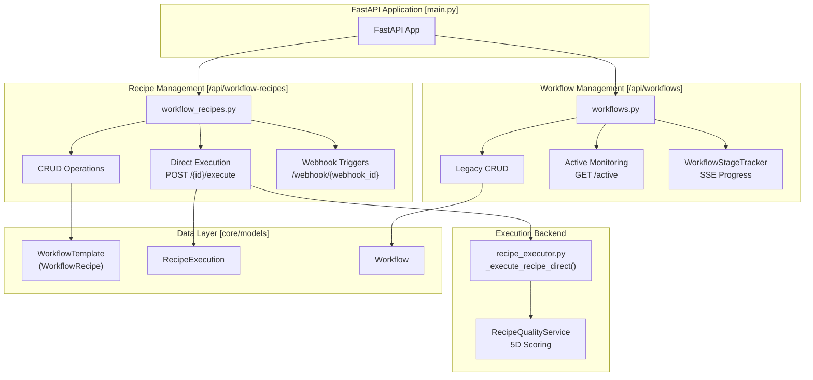
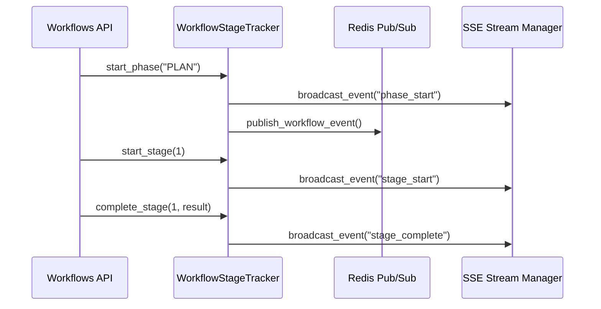

# Workflow API Reference

Relevant source files

The following files were used as context for generating this wiki page:

- [frontend/app/chat/page.tsx](frontend/app/chat/page.tsx)
- [frontend/next-env.d.ts](frontend/next-env.d.ts)
- [orchestrator/alembic/versions/20260202_add_workspace_id_to_skills_patterns_models.py](orchestrator/alembic/versions/20260202_add_workspace_id_to_skills_patterns_models.py)
- [orchestrator/api/context.py](orchestrator/api/context.py)
- [orchestrator/api/workflows.py](orchestrator/api/workflows.py)
- [orchestrator/core/llm/clients/openai_embedding.py](orchestrator/core/llm/clients/openai_embedding.py)
- [orchestrator/core/llm/rerank_manager.py](orchestrator/core/llm/rerank_manager.py)
- [orchestrator/core/services/__init__.py](orchestrator/core/services/__init__.py)

This page documents the REST API endpoints for workflow and recipe management, including CRUD operations, execution control, quality assessment, and learning analysis. The system provides two primary execution paths: the **Workflow Pipeline** (legacy 9-stage/PRD-59 dynamic) and the **Recipe Direct Executor** (modern step-by-step).

---

## API Architecture Overview

The workflow API is organized into modular routers within the FastAPI application. These routers handle distinct responsibilities from template management to real-time execution tracking.

**Workflow API Routers Architecture**

Sources: [orchestrator/api/workflows.py:34-35](), [orchestrator/core/models/core.py:27-28](), [orchestrator/api/workflows.py:37-41]()

---

## Recipe CRUD Endpoints

The recipe management endpoints provide full lifecycle control for workflow recipes, including creation, retrieval, updates, and deletion.

### List Recipes
**Endpoint**: `GET /api/workflow-recipes`

Lists all workflow recipes in the current workspace with filtering and sorting.

| Parameter | Type | Default | Description |
|-----------|------|---------|-------------|
| `is_featured`| boolean | - | Filter by featured status |
| `is_public`  | boolean | `true` | Filter by public visibility |
| `search`     | string  | - | Search in name and description |
| `sort_by`    | string  | `popularity` | `popularity`, `created_at`, `use_count`, `name` |

**Implementation Details**:
The list endpoint applies workspace isolation via `get_request_context_hybrid` and enriches step data with agent information.

Sources: [orchestrator/api/workflows.py:29-31]()

### Create Recipe
**Endpoint**: `POST /api/workflow-recipes`

Creates a new workflow recipe with validation of steps and execution configuration.

**Validation Logic**:
1. **Step Structure**: Verifies required fields in each step.
2. **Execution Config**: Validates timeouts and retry settings.
3. **Trigger Registration**: Subscribes to external triggers if configured.

Sources: [orchestrator/api/workflows.py:21-27]()

---

## Recipe Execution Endpoints

The execution system provides a direct step-by-step path that uses the same components as the chatbot for consistency.

### Execute Recipe
**Endpoint**: `POST /api/workflow-recipes/{recipe_id}/execute`

Launches a recipe execution as an asynchronous background task.

**Execution Flow**:
1. Creates a `RecipeExecution` record with status `pending`.
2. Launches execution logic in the background.
3. Uses a **per-workspace semaphore** to bound concurrent execution.
4. Each step is executed, optionally sharing data via a scratchpad.

Sources: [orchestrator/api/workflows.py:27-27](), [orchestrator/api/workflows.py:10-12]()

---

## Workflow Stage Tracking (SSE)

For complex missions and legacy workflows, the `WorkflowStageTracker` provides real-time progress updates via Server-Sent Events (SSE).

**Stage and Phase Architecture**:
The tracker supports both the legacy 9-stage pipeline and the PRD-59 dynamic phases.

| Phase | Label | Stages Included |
|-------|-------|-----------------|
| `PLAN` | Planning | 1, 2, 2b (Agent Negotiation) |
| `PREPARE` | Preparation | 3, 3b (Prompt Optimization) |
| `EXECUTE` | Execution | 4, 4b (Inter-Agent Coordination) |
| `EVALUATE`| Evaluation | 5, 6 |
| `LEARN` | Learning | 7, 8, 9 |

**Real-time Event Flow**:

Sources: [orchestrator/api/workflows.py:37-68](), [orchestrator/api/workflows.py:88-107](), [orchestrator/api/workflows.py:126-140](), [orchestrator/api/workflows.py:161-180]()

---

## Learning System & Performance Tracking

The learning module tracks agent performance and extracts successful patterns from workflow executions.

### Learning from Execution
The system processes results from completed workflows to update agent metrics and learn patterns.

**Implementation Logic**:
1. **Agent Performance**: Updates success/failure counters for involved agents.
2. **Pattern Recognition**: Analyzes strategy and complexity against quality scores.
3. **Success Rate**: Calculates the ratio of successful executions to total executions for ranking.

Sources: [orchestrator/api/workflows.py:47-49](), [orchestrator/api/workflows.py:66-67]()

---

## Frontend API Client Integration

The frontend interacts with these endpoints via the `apiClient` and specialized React hooks.

**Code Entity Mapping**:
- **Workflow Execution**: Frontend triggers `POST /api/workflows/{id}/execute` via the API client.
- **Active Monitoring**: Frontend polls or streams `GET /api/workflows/active`.
- **Progress Tracking**: `WorkflowStageTracker` emits SSE events consumed by the UI to update progress bars and phase labels.

Sources: [frontend/app/chat/page.tsx:9-11](), [orchestrator/api/workflows.py:98-105]()

---