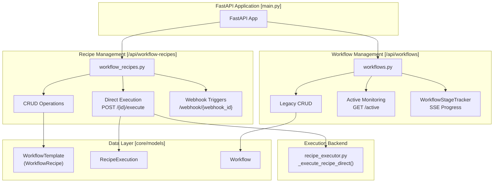
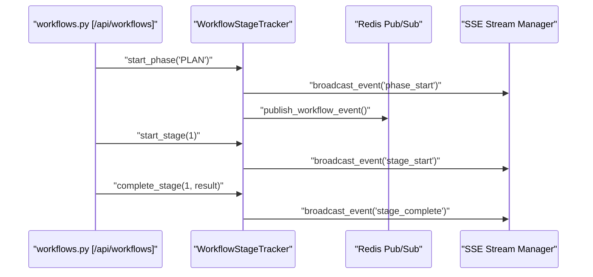
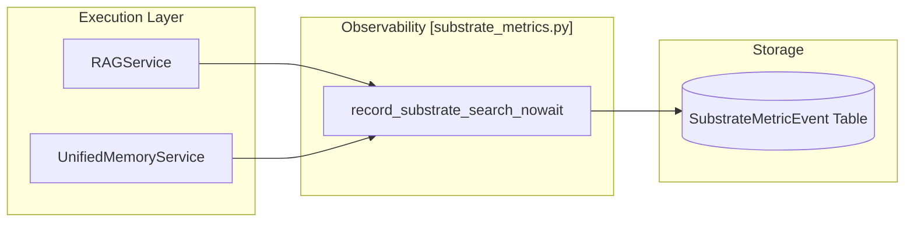

# Workflow API Reference

Relevant source files

The following files were used as context for generating this wiki page:

- [frontend/components/__tests__/prd197-substrate-tile.test.tsx](frontend/components/__tests__/prd197-substrate-tile.test.tsx)
- [frontend/components/command-center/is-it-working-strip.tsx](frontend/components/command-center/is-it-working-strip.tsx)
- [frontend/hooks/use-analytics-api.ts](frontend/hooks/use-analytics-api.ts)
- [frontend/hooks/use-marketplace-api.ts](frontend/hooks/use-marketplace-api.ts)
- [frontend/hooks/use-playbook-api.ts](frontend/hooks/use-playbook-api.ts)
- [frontend/hooks/use-playbook-form.ts](frontend/hooks/use-playbook-form.ts)
- [frontend/lib/api-client.ts](frontend/lib/api-client.ts)
- [orchestrator/alembic/versions/agents_public_id_default.py](orchestrator/alembic/versions/agents_public_id_default.py)
- [orchestrator/api/api_playbooks.py](orchestrator/api/api_playbooks.py)
- [orchestrator/api/workflow_templates.py](orchestrator/api/workflow_templates.py)
- [orchestrator/api/workflows.py](orchestrator/api/workflows.py)
- [orchestrator/config.py](orchestrator/config.py)
- [orchestrator/core/models/substrate_metrics.py](orchestrator/core/models/substrate_metrics.py)
- [orchestrator/core/observability/substrate_metrics.py](orchestrator/core/observability/substrate_metrics.py)
- [orchestrator/main.py](orchestrator/main.py)
- [orchestrator/modules/tools/discovery/cascade_installer.py](orchestrator/modules/tools/discovery/cascade_installer.py)
- [orchestrator/modules/tools/discovery/handlers_marketplace.py](orchestrator/modules/tools/discovery/handlers_marketplace.py)
- [orchestrator/modules/tools/discovery/handlers_packages.py](orchestrator/modules/tools/discovery/handlers_packages.py)
- [orchestrator/modules/tools/discovery/not_found_candidates.py](orchestrator/modules/tools/discovery/not_found_candidates.py)
- [orchestrator/reports/route-manifest.json](orchestrator/reports/route-manifest.json)
- [orchestrator/router_manifest.py](orchestrator/router_manifest.py)
- [orchestrator/tests/authz_sweep_probe.py](orchestrator/tests/authz_sweep_probe.py)
- [orchestrator/tests/test_p2w2_authz_boundary_sweep.py](orchestrator/tests/test_p2w2_authz_boundary_sweep.py)
- [orchestrator/tests/test_prd154_s5_missions.py](orchestrator/tests/test_prd154_s5_missions.py)
- [orchestrator/tests/test_prd222_not_found_names_candidates.py](orchestrator/tests/test_prd222_not_found_names_candidates.py)
- [orchestrator/tests/test_prd222_w2s1_plan_tiers.py](orchestrator/tests/test_prd222_w2s1_plan_tiers.py)

This page documents the REST API endpoints for workflow and recipe management, including CRUD operations, execution control, quality assessment, and learning analysis. The system provides two primary execution paths: the **Workflow Pipeline** (legacy 9-stage/PRD-59 dynamic) and the **Recipe Direct Executor** (modern step-by-step).

---

## API Architecture Overview

The workflow API is organized into modular routers within the FastAPI application. These routers handle distinct responsibilities from template management to real-time execution tracking, mounted across `main.py` and managed via explicit router registrations.

**Workflow API Routers Architecture**

Sources: [orchestrator/api/workflow_recipes.py:22-31](), [orchestrator/api/workflows.py:34-35](), [orchestrator/api/recipe_executor.py:1-19]()

---

## Recipe CRUD Endpoints

The recipe management endpoints provide full lifecycle control for workflow recipes, which are stored as `WorkflowTemplate` models in the database (`core/models/core.py`).

### List Recipes
**Endpoint**: `GET /api/workflow-recipes`

Lists all workflow recipes in the current workspace with filtering and sorting parameters.

| Parameter | Type | Default | Description |
|-----------|------|---------|-------------|
| `is_featured`| boolean | - | Filter by featured status |
| `is_public`  | boolean | `true` | Filter by public visibility |
| `search`     | string  | - | Search in name and description |
| `sort_by`    | string  | `popularity` | `popularity`, `created_at`, `use_count`, `name` |

**Implementation Details**:
The list endpoint applies workspace isolation via `get_request_context_hybrid` and enriches step data with agent information through the `_enrich_steps_with_agents()` helper. This helper fetches the `Agent` ORM objects and attaches model configurations and tool counts to each step.

Sources: [orchestrator/api/workflow_recipes.py:177-187](), [orchestrator/api/workflow_recipes.py:140-174]()

### Create and Manage Recipes
**Endpoint**: `POST /api/workflow-recipes`

Creates a new workflow recipe. If the `schedule_config` uses a Composio trigger, the system calls `_auto_register_trigger()` to subscribe via the Composio API and store a `TriggerSubscription`.

**Scheduling Logic**:
The system uses `_sync_cron_schedule()` to interface with the `PlaybookSchedulerService`. If a recipe is configured with a cron expression, it is added to the system scheduler via `scheduler.schedule_playbook(recipe)`; otherwise, it is unscheduled.

Sources: [orchestrator/api/workflow_recipes.py:34-48](), [orchestrator/api/workflow_recipes.py:50-89]()

---

## Recipe Execution Endpoints

The execution system provides a direct step-by-step path that uses the same components as the chatbot (`ContextService`, `ToolRouter`) for consistency.

### Execute Recipe
**Endpoint**: `POST /api/workflow-recipes/{recipe_id}/execute`

Launches a recipe execution as an asynchronous background task.

**Execution Flow**:
1. **Concurrency Control**: Uses a per-workspace semaphore (`_workspace_semaphores`) to bound concurrent recipe execution (default: 3).
2. **Activation**: The `AgentFactory` activates the agent for each step via `activate_agent(agent.id)`, providing its LLM manager.
3. **Context Construction**: `ContextService(RECIPE)` builds the system prompt and base tools.
4. **Tool Injection**: Injects the `scratchpad_write` and `scratchpad_read` tools into the agent's context for inter-step communication.
5. **Iteration Limit**: Defaults to 25 LLM tool-call turns per step.

Sources: [orchestrator/api/workflow_recipes.py:1-25](), [orchestrator/api/workflows.py:30-40]()

---

## Workflow Stage Tracking (SSE) & Pipeline Architecture

For complex missions and legacy workflows, the `WorkflowStageTracker` provides real-time progress updates via Server-Sent Events (SSE).

**Stage and Phase Architecture**:
The tracker supports both the legacy 9-stage pipeline and the PRD-59 dynamic phases.

| Phase | Label | Stages Included |
|-------|-------|-----------------|
| `PLAN` | Planning | 1 (Decomposition), 2 (Selection), 2b (Negotiation) |
| `PREPARE` | Preparation | 3 (Context Engineering), 3b (Optimization) |
| `EXECUTE` | Execution | 4 (Execution), 4b (Coordination) |
| `EVALUATE`| Evaluation | 5 (Aggregation), 6 (Learning Update) |
| `LEARN` | Learning | 7 (Quality), 8 (Memory), 9 (Response) |

**Real-time Event Flow**:

Sources: [orchestrator/api/workflows.py:37-68](), [orchestrator/api/workflows.py:88-106](), [orchestrator/api/workflows.py:126-141]()

---

## Observability & Analytics

Workflow and recipe performance is tracked via specialized telemetry and analytics endpoints.

### Substrate Health Monitoring
Retrieval health for workflows (documents, memory, field) is tracked via the `SubstrateMetricEvent` model. The `record_substrate_search` function writes search latency and status (hit/empty/error) to the database.

**Substrate Telemetry Flow**

### Analytics Endpoints
The frontend uses `useAnalyticsSuccessRate` and `useMissionSuccessRate` hooks to query performance data from the backend. These metrics are displayed in the "Is It Working?" strip in the Command Center.

Sources: [frontend/lib/api-client.ts:38-51](), [frontend/hooks/use-analytics-api.ts:33-45]()

---

## Marketplace Integration

Workflows can be published to the community marketplace by setting their `owner_type` to `marketplace`.

**Marketplace API Flow**:
1. **Listing**: `GET /api/marketplace/items?type=recipe` queries the `WorkflowTemplate` table where `owner_type == 'marketplace'`.
2. **Installation**: `POST /api/marketplace/install` clones the marketplace item into the user's workspace.
3. **Platform Actions**: Agents can browse and manage marketplace items using tools like `browse_marketplace_agents` and plugin installers.

Sources: [orchestrator/modules/tools/discovery/handlers_marketplace.py:82-154](), [orchestrator/modules/tools/discovery/cascade_installer.py:78-128]()

---

## Frontend Integration

The frontend interacts with these endpoints via the `apiClient` and specialized React components for monitoring execution state.

**Key Components**:
- **ExecutionKitchen**: A real-time theater for viewing execution logs. It maps incoming SSE events to `STAGE_NAMES` for display and uses `TheaterStageProgress` for visualization.
- **OrgChartTab**: Visualizes agent relationships and teams within a workspace using `OrgChartCanvas`, allowing users to see the organizational structure created by workflows.
- **StreamingLog**: A sub-component within `ExecutionKitchen` that renders log entries with status indicators based on event types.

Sources: [frontend/components/command-center/is-it-working-strip.tsx:51-120](), [frontend/hooks/use-analytics-api.ts:1-35]()

---