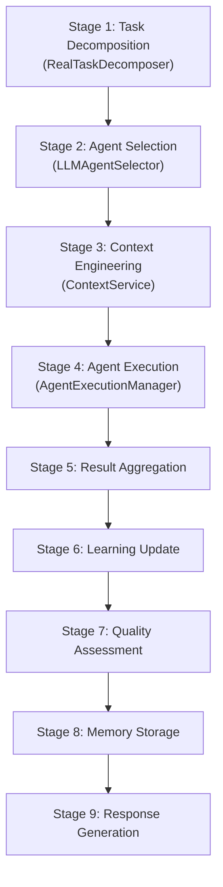
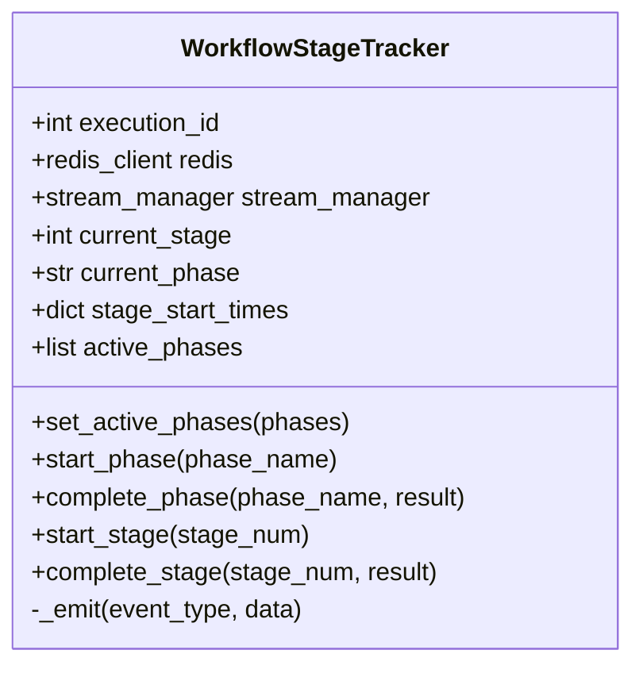

# Workflow Pipeline Architecture

Relevant source files

The following files were used as context for generating this wiki page:

- [frontend/app/chat/page.tsx](frontend/app/chat/page.tsx)
- [frontend/components/marketplace/marketplace-agents-tab.tsx](frontend/components/marketplace/marketplace-agents-tab.tsx)
- [frontend/components/marketplace/marketplace-homepage.tsx](frontend/components/marketplace/marketplace-homepage.tsx)
- [frontend/components/marketplace/marketplace-tools-tab.tsx](frontend/components/marketplace/marketplace-tools-tab.tsx)
- [frontend/components/shared/stats-bar.tsx](frontend/components/shared/stats-bar.tsx)
- [frontend/components/tools/tools-dashboard.tsx](frontend/components/tools/tools-dashboard.tsx)
- [frontend/components/workflows/active-workflows-panel.tsx](frontend/components/workflows/active-workflows-panel.tsx)
- [frontend/components/workflows/execution-kitchen.tsx](frontend/components/workflows/execution-kitchen.tsx)
- [frontend/components/workflows/workflow-management.tsx](frontend/components/workflows/workflow-management.tsx)
- [frontend/lib/tooltips.json](frontend/lib/tooltips.json)
- [frontend/next-env.d.ts](frontend/next-env.d.ts)
- [orchestrator/alembic/versions/20260202_add_workspace_id_to_skills_patterns_models.py](orchestrator/alembic/versions/20260202_add_workspace_id_to_skills_patterns_models.py)
- [orchestrator/api/context.py](orchestrator/api/context.py)
- [orchestrator/api/recipe_executor.py](orchestrator/api/recipe_executor.py)
- [orchestrator/api/workflow_recipes.py](orchestrator/api/workflow_recipes.py)
- [orchestrator/api/workflows.py](orchestrator/api/workflows.py)
- [orchestrator/core/llm/clients/openai_embedding.py](orchestrator/core/llm/clients/openai_embedding.py)
- [orchestrator/core/llm/rerank_manager.py](orchestrator/core/llm/rerank_manager.py)
- [orchestrator/core/services/__init__.py](orchestrator/core/services/__init__.py)
- [orchestrator/modules/learning/tests/conftest.py](orchestrator/modules/learning/tests/conftest.py)
- [orchestrator/modules/learning/tests/test_learning_system.py](orchestrator/modules/learning/tests/test_learning_system.py)

## Purpose and Scope

This document describes the workflow execution pipeline architecture in Automatos AI, covering the **legacy 9-stage workflow orchestration system**, the **PRD-59 dynamic phase model**, and the **Recipe Direct Executor**. It explains how `WorkflowStageTracker` bridges these approaches to provide real-time progress tracking via SSE events and Redis Pub/Sub.

---

## Overview: Execution Models

Automatos AI supports two distinct workflow execution architectures:

| Model | Description | Use Case | Complexity |
|-------|-------------|----------|------------|
| **Legacy 9-Stage Pipeline** | Complex orchestration with task decomposition, agent selection, and learning loops. | Advanced multi-agent coordination. | High |
| **Recipe Direct Executor** | Simple step-by-step agent execution using chatbot components (PRD-50 alignment). | Standard automation workflows and "Starter Plan" recipes. | Low |

The `WorkflowStageTracker` class provides a unified progress tracking interface that supports both models, allowing gradual migration from the legacy system to the dynamic phase model while maintaining backward compatibility [orchestrator/api/workflows.py:37-42]().

**Sources:** [orchestrator/api/workflows.py:37-42](), [orchestrator/api/recipe_executor.py:1-19]()

---

## Legacy 9-Stage Pipeline

### Architecture Overview

The legacy workflow pipeline decomposes complex tasks into 9 sequential stages. Each stage is responsible for a specific orchestration concern.

**Legacy Stage to Code Entity Mapping**

### Stage Implementation Details

*   **Stage 1: Task Decomposition**: Defined in `STAGES` [orchestrator/api/workflows.py:42](). This stage breaks a complex `task_description` into atomic subtasks.
*   **Stage 2: Agent Selection**: Defined in `STAGES` [orchestrator/api/workflows.py:43](). This stage identifies the best agent match based on skills.
*   **Stage 3: Context Engineering**: Handled via `ContextService` to build the prompt for the selected agent [orchestrator/api/workflows.py:44]().
*   **Stage 4: Agent Execution**: The core execution phase where the agent performs the assigned task [orchestrator/api/workflows.py:45]().

**Sources:** [orchestrator/api/workflows.py:41-51]()

---

## PRD-59 Dynamic Phase Architecture

### Five-Phase Model

PRD-59 introduces a simplified **phase-based execution model** that groups related stages into high-level phases. The `WorkflowStageTracker.PHASES` dictionary maps phases to their constituent stages, including new dynamic sub-stages like "2b" (Agent Negotiation) and "4b" (Inter-Agent Coordination) [orchestrator/api/workflows.py:62-68]().

**Phase to Stage Relationship**

```mermaid
graph LR
    subgraph PLAN["PLAN Phase"]
        S1["Stage 1: Decomposition"]
        S2["Stage 2: Selection"]
        S2b["Stage 2b: Negotiation"]
    end
    
    subgraph PREPARE["PREPARE Phase"]
        S3["Stage 3: Context"]
        S3b["Stage 3b: Prompt Opt"]
    end
    
    subgraph EXECUTE["EXECUTE Phase"]
        S4["Stage 4: Execution"]
        S4b["Stage 4b: Coordination"]
    end
    
    subgraph EVALUATE["EVALUATE Phase"]
        S5["Stage 5: Aggregation"]
        S6["Stage 6: Learning"]
    end
    
    subgraph LEARN["LEARN Phase"]
        S7["Stage 7: Quality"]
        S8["Stage 8: Memory"]
        S9["Stage 9: Response"]
    end
    
    PLAN --> PREPARE
    PREPARE --> EXECUTE
    EXECUTE --> EVALUATE
    EVALUATE --> LEARN
```

### Phase Configuration

| Phase | Stages | Label | Purpose |
|-------|--------|-------|---------|
| `PLAN` | 1, 2, "2b" | Planning | Task decomposition and agent selection/negotiation [orchestrator/api/workflows.py:63](). |
| `PREPARE` | 3, "3b" | Preparation | Context assembly and prompt optimization [orchestrator/api/workflows.py:64](). |
| `EXECUTE` | 4, "4b" | Execution | Agent task execution with inter-agent coordination [orchestrator/api/workflows.py:65](). |
| `EVALUATE` | 5, 6 | Evaluation | Result aggregation and learning updates [orchestrator/api/workflows.py:66](). |
| `LEARN` | 7, 8, 9 | Learning | Quality assessment, memory storage, and response generation [orchestrator/api/workflows.py:67](). |

**Sources:** [orchestrator/api/workflows.py:54-68]()

---

## WorkflowStageTracker Implementation

### Class Structure

`WorkflowStageTracker` is the central component for tracking workflow progress. It maintains state for the current phase and stage, calculating durations and broadcasting updates [orchestrator/api/workflows.py:37-78]().

### Key Logic

1. **Phase Management**: `start_phase` marks the beginning of a high-level phase (e.g., `PLAN`) and calculates the `phase_index` relative to `active_phases` [orchestrator/api/workflows.py:88-106]().
2. **Stage Management**: `start_stage` and `complete_stage` handle both integer IDs and dynamic strings (e.g., "4b"). They calculate `duration_ms` for performance monitoring [orchestrator/api/workflows.py:126-159]().
3. **Event Emission**: The `_emit` method ensures dual-delivery:
   - **SSE**: Real-time updates to the browser via `stream_manager` [orchestrator/api/workflows.py:163-171]().
   - **Redis**: Persistence and inter-service coordination via `publish_workflow_event` [orchestrator/api/workflows.py:173-178]().

**Sources:** [orchestrator/api/workflows.py:37-180]()

---

## Recipe Direct Executor

The `RecipeExecutor` (via `recipe_executor.py`) provides a streamlined path for standard automation, bypassing the 9-stage pipeline to execute steps sequentially [orchestrator/api/recipe_executor.py:1-19]().

### Execution Lifecycle

1. **Workspace Semaphore**: `_get_workspace_semaphore` limits concurrency (default: 3) per workspace to prevent resource exhaustion [orchestrator/api/recipe_executor.py:47-59]().
2. **Agent Activation**: Uses `AgentFactory.activate_agent` to initialize the agent runtime and LLM manager [orchestrator/api/recipe_executor.py:118-119]().
3. **Context Assembly**: Uses `ContextService` in `RECIPE` mode to build the system prompt, injecting `recipe_step` details [orchestrator/api/recipe_executor.py:143-149]().
4. **Tool Hints**: Employs `ComposioToolService` to perform semantic search for relevant external app actions based on the step prompt [orchestrator/api/recipe_executor.py:166-173]().
5. **Scratchpad**: Utilizes `RecipeScratchpad` for inter-step data sharing, injecting `scratchpad_write` and `scratchpad_read` tools into the agent's toolset [orchestrator/api/recipe_executor.py:108-115]().

**Sources:** [orchestrator/api/recipe_executor.py:1-173]()

---

## Frontend Integration: Execution Kitchen

The `ExecutionKitchen` component provides the "Theater" view for monitoring workflow and recipe executions [frontend/components/workflows/execution-kitchen.tsx:47-55]().

### UI Components

*   **TheaterStageProgress**: Visualizes the 9-stage or phase-based progress [frontend/components/workflows/execution-kitchen.tsx:36]().
*   **StreamingLog**: Renders real-time events from the `WorkflowStageTracker` SSE stream, color-coding by event type (e.g., `agent_spawn`, `task_error`) [frontend/components/workflows/execution-kitchen.tsx:99-142]().
*   **TheaterSelfLearningPanel**: Displays `LearningData` and `QualityData` gathered during the `EVALUATE` and `LEARN` phases [frontend/components/workflows/execution-kitchen.tsx:39-43]().

**Sources:** [frontend/components/workflows/execution-kitchen.tsx:35-46](), [frontend/components/workflows/execution-kitchen.tsx:99-142]()

---

## Code Entity Reference

### Core Services

| Entity | File | Role |
|--------|------|------|
| `WorkflowStageTracker` | [orchestrator/api/workflows.py:37]() | Orchestrates phase/stage transitions and event emission. |
| `RecipeExecution` | [core/models/core.py]() | Database model for tracking individual recipe runs [orchestrator/api/workflow_recipes.py:27](). |
| `AgentFactory` | [modules/agents/factory/agent_factory.py]() | Activates agent runtimes for execution [orchestrator/api/recipe_executor.py:118](). |
| `ContextService` | [modules/context.py]() | Assembles context for recipe steps [orchestrator/api/recipe_executor.py:143](). |

### API Endpoints

| Method | Path | Purpose |
|--------|------|---------|
| `GET` | `/api/workflows` | Enhanced workflow management with live tracking [orchestrator/api/workflows.py:34](). |
| `GET` | `/api/workflow-recipes` | CRUD for workflow recipes [orchestrator/api/workflow_recipes.py:22](). |
| `POST` | `/api/context/add` | Adds execution results to the context system [orchestrator/api/context.py:55](). |

**Sources:** [orchestrator/api/workflows.py](), [orchestrator/api/recipe_executor.py](), [orchestrator/api/workflow_recipes.py](), [orchestrator/api/context.py]()

---