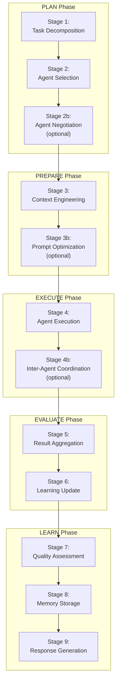
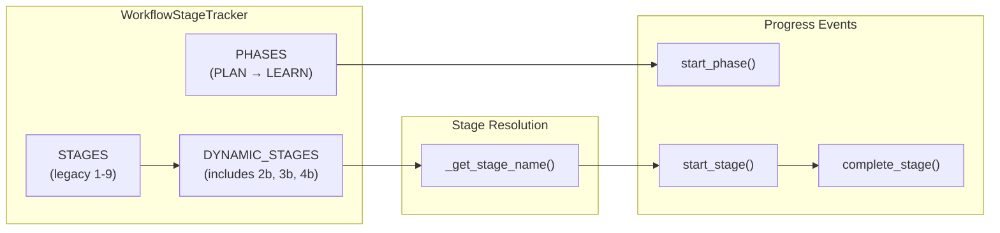
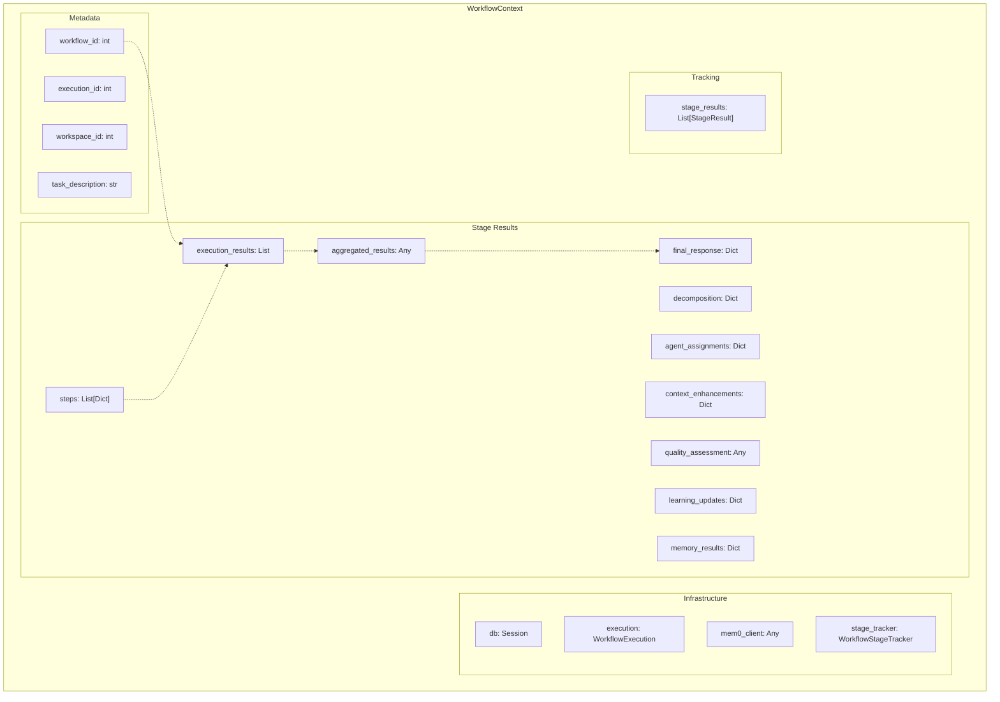
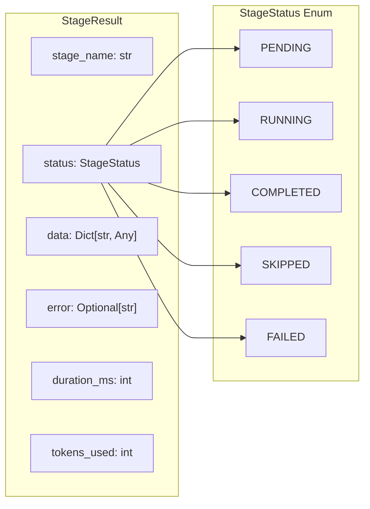
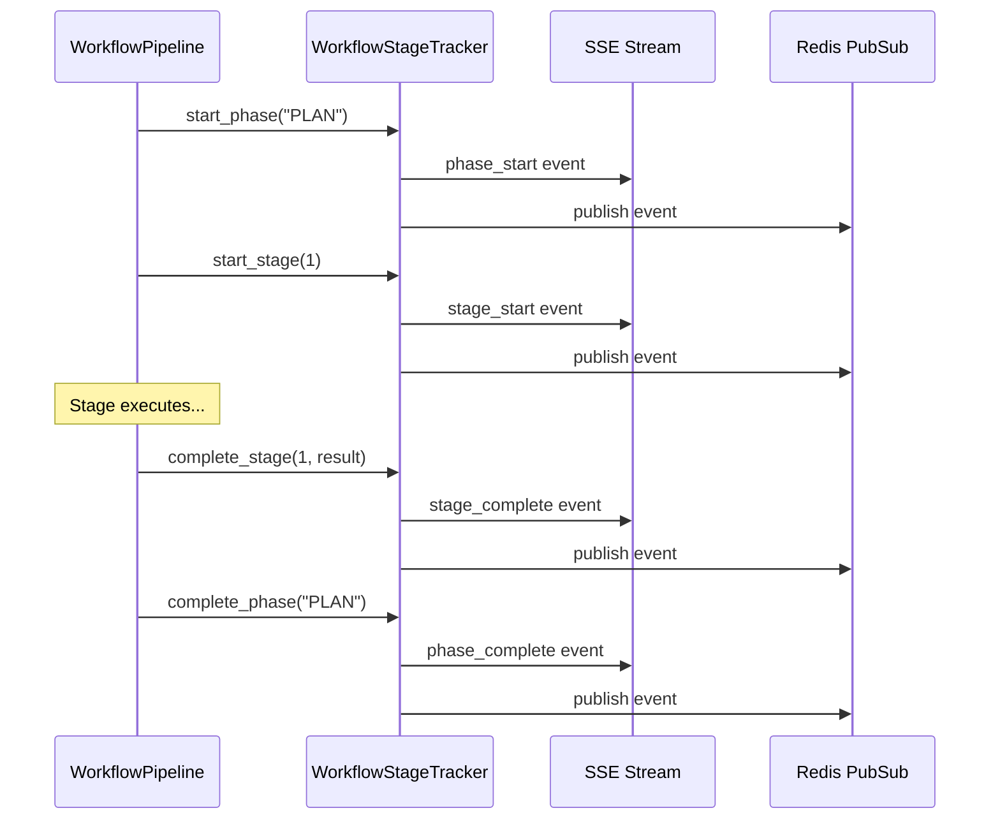
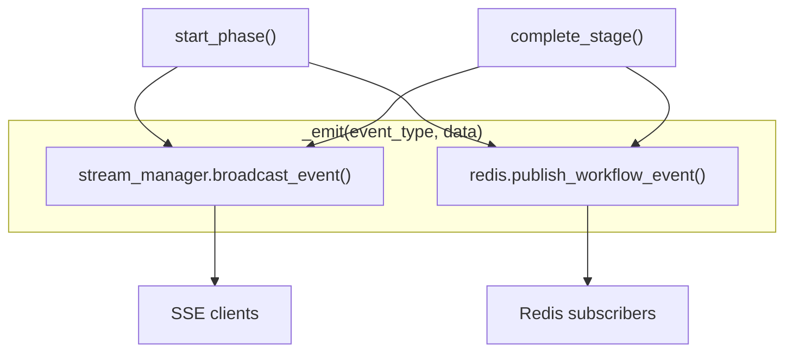
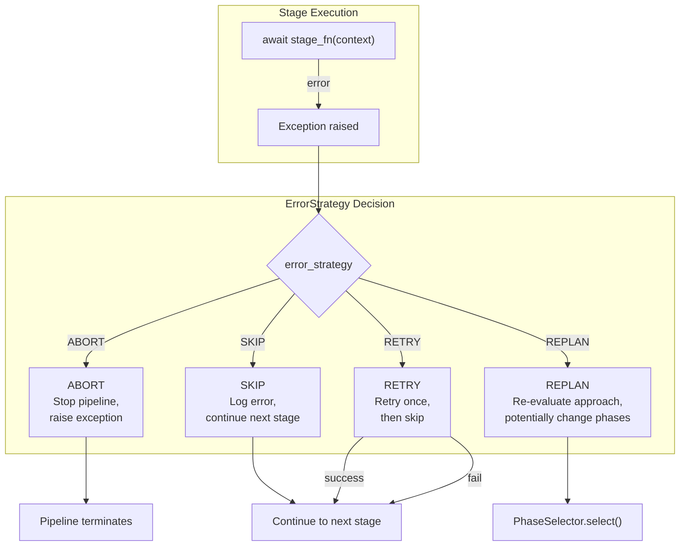
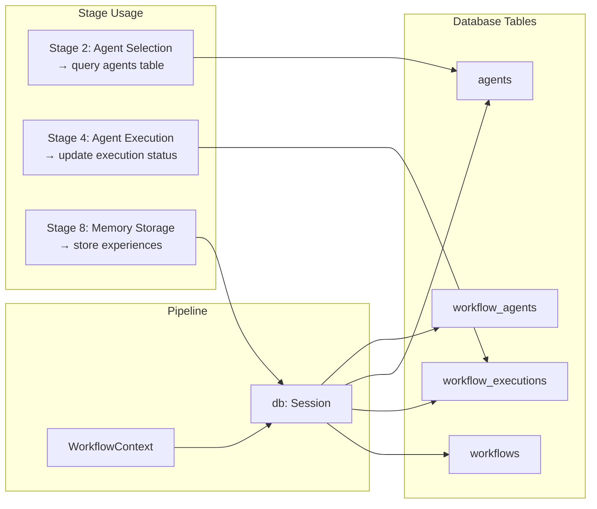
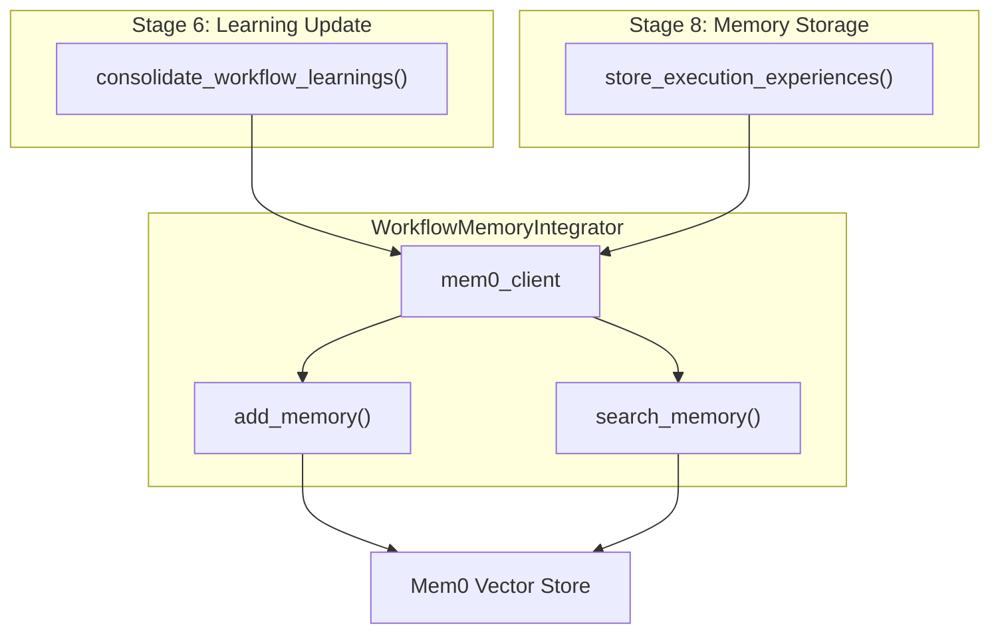
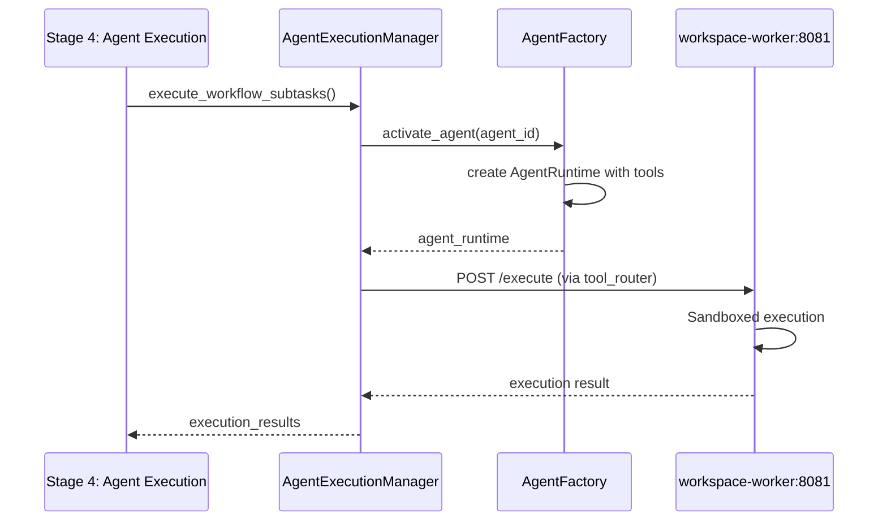

# Workflow Pipeline Architecture

<details>
<summary>Relevant source files</summary>

The following files were used as context for generating this wiki page:

- [frontend/tsconfig.tsbuildinfo](frontend/tsconfig.tsbuildinfo)
- [orchestrator/api/workflows.py](orchestrator/api/workflows.py)
- [orchestrator/consumers/chatbot/service.py](orchestrator/consumers/chatbot/service.py)
- [orchestrator/core/llm/manager.py](orchestrator/core/llm/manager.py)
- [orchestrator/modules/agents/factory/agent_factory.py](orchestrator/modules/agents/factory/agent_factory.py)
- [orchestrator/modules/orchestrator/pipeline.py](orchestrator/modules/orchestrator/pipeline.py)
- [orchestrator/modules/orchestrator/service.py](orchestrator/modules/orchestrator/service.py)

</details>


## Purpose and Scope

This document describes the composable workflow pipeline architecture that executes multi-agent workflows through a series of phases and stages. The pipeline provides a flexible, observable execution model that supports dynamic phase selection, real-time progress tracking via SSE, and configurable error handling strategies.

For information about recipe-based workflow execution, see [Recipe Execution Engine](#4.2). For workflow API endpoints and HTTP interfaces, see [Workflow API Reference](#4.8).

---

## Architecture Overview

The workflow pipeline architecture implements a **phase-stage execution model** where:

- **Phases** are high-level execution categories (PLAN, PREPARE, EXECUTE, EVALUATE, LEARN)
- **Stages** are individual processing steps within phases (Task Decomposition, Agent Selection, etc.)
- **Pipeline** is the composable executor that runs selected phases and stages in order

This design enables:
- **Dynamic Execution**: Only required phases run based on task complexity
- **Observable Progress**: SSE events stream real-time updates to clients
- **Error Resilience**: Configurable strategies for handling stage failures
- **Composability**: Stages can be registered, reordered, or skipped

### Phase-Stage Hierarchy



**Sources:** [orchestrator/api/workflows.py:40-71](), [orchestrator/modules/orchestrator/pipeline.py:1-18]()

---

## Phase System

### Phase Definitions

The system defines five core phases that map to the 9-stage execution model:

| Phase | Stages | Purpose | When Skipped |
|-------|--------|---------|--------------|
| **PLAN** | 1, 2, 2b | Decompose task and select agents | Simple single-agent tasks |
| **PREPARE** | 3, 3b | Build context and optimize prompts | ATOM complexity (greetings) |
| **EXECUTE** | 4, 4b | Run agents and coordinate | Never (core execution) |
| **EVALUATE** | 5, 6 | Aggregate results and update learning | Fast execution mode |
| **LEARN** | 7, 8, 9 | Assess quality, store memories, generate response | Non-learning mode |

**Sources:** [orchestrator/api/workflows.py:65-71]()

### Phase Selection Logic

The `PhaseSelector` (referenced but not in provided files) determines which phases to execute based on:

1. **Complexity Assessment**: ATOM tasks skip PLAN/PREPARE phases
2. **Execution Mode**: AUTONOMOUS vs RECIPE vs HYBRID
3. **Configuration Flags**: `enable_learning`, `enable_memory`, `skip_quality_check`
4. **Agent Capabilities**: Multi-agent tasks enable coordination stages

### Dynamic Stage Mapping



**Sources:** [orchestrator/api/workflows.py:40-90]()

---

## Pipeline Execution

### WorkflowPipeline Class

The `WorkflowPipeline` class is the core executor that processes phases and stages:

```mermaid
graph TB
    subgraph "WorkflowPipeline Initialization"
        WP["WorkflowPipeline"]
        ES["error_strategy:<br/>ErrorStrategy"]
        PC["progress_callback:<br/>StageProgressCallback"]
        REG["_stage_registry:<br/>Dict[str, StageFunction]"]
    end
    
    subgraph "Execution Flow"
        execute["execute(phases, context)"]
        phase_loop["for phase in phases"]
        stage_loop["for stage in phase.stages"]
        lookup["lookup stage_fn in registry"]
        call["await stage_fn(context)"]
        track["append result to context"]
    end
    
    subgraph "Error Handling"
        error["Exception caught"]
        abort["ErrorStrategy.ABORT<br/>→ raise"]
        skip["ErrorStrategy.SKIP<br/>→ continue"]
        retry["ErrorStrategy.RETRY<br/>→ retry once"]
        replan["ErrorStrategy.REPLAN<br/>→ re-evaluate"]
    end
    
    WP --> ES
    WP --> PC
    WP --> REG
    execute --> phase_loop
    phase_loop --> stage_loop
    stage_loop --> lookup
    lookup --> call
    call --> track
    call -->|error| error
    error --> abort
    error --> skip
    error --> retry
    error --> replan
```

**Sources:** [orchestrator/modules/orchestrator/pipeline.py:134-279]()

### Stage Registration

Stages are registered by name before execution:

```python
# Registration pattern
pipeline = WorkflowPipeline()
pipeline.register_stage("Task Decomposition", decompose_fn)
pipeline.register_stage("Agent Selection", select_fn)
```

The registry maps stage names (strings) to stage functions (callables). This decouples the pipeline executor from specific stage implementations.

**Sources:** [orchestrator/modules/orchestrator/pipeline.py:155-157]()

### Execution Loop

The pipeline executes stages in order:

1. **Iterate phases**: Call `on_phase_start()` for each phase
2. **Iterate stages**: For each stage in the phase:
   - Look up stage function in registry
   - Skip if not registered and optional
   - Call `on_stage_start()` for progress tracking
   - Execute stage function: `result = await stage_fn(context)`
   - Append result to `context.stage_results`
   - Call `on_stage_complete()` or handle error
3. **Complete phase**: Call `on_phase_complete()`

**Sources:** [orchestrator/modules/orchestrator/pipeline.py:159-278]()

---

## Workflow Context

### WorkflowContext Structure

The `WorkflowContext` dataclass is the shared state container passed through all stages:



**Sources:** [orchestrator/modules/orchestrator/pipeline.py:62-101]()

### Context Access Patterns

The context provides both attribute and dictionary-style access:

| Method | Example | Purpose |
|--------|---------|---------|
| `getattr()` | `context.decomposition` | Direct attribute access |
| `get()` | `context.get("steps", [])` | Dict-like access with default |
| `set()` | `context.set("steps", new_steps)` | Dict-like setter |

This dual interface enables backward compatibility with code that expects dictionary-style access.

**Sources:** [orchestrator/modules/orchestrator/pipeline.py:94-100]()

---

## Stage Functions

### Stage Function Interface

All stage functions implement a standard interface:

```python
async def stage_fn(ctx: WorkflowContext) -> StageResult
```

**Input:** `WorkflowContext` containing all accumulated state  
**Output:** `StageResult` with execution metadata

### StageResult Structure



**Sources:** [orchestrator/modules/orchestrator/pipeline.py:50-59]()

### Example Stage Implementation

A typical stage function:
1. Reads from context
2. Performs work (LLM calls, database queries, etc.)
3. Writes results back to context
4. Returns StageResult with metadata

```python
# Pseudo-code example (not actual implementation)
async def decompose_task_stage(ctx: WorkflowContext) -> StageResult:
    decomposer = RealTaskDecomposer(llm_provider)
    decomposition = await decomposer.decompose_task(ctx.task_description)
    ctx.decomposition = decomposition
    ctx.steps = decomposition.get("subtasks", [])
    return StageResult(
        stage_name="Task Decomposition",
        status=StageStatus.COMPLETED,
        data={"subtask_count": len(ctx.steps)},
        tokens_used=decomposition.get("tokens", 0)
    )
```

**Sources:** [orchestrator/modules/orchestrator/service.py:155-162]()

---

## Progress Tracking

### WorkflowStageTracker

The `WorkflowStageTracker` manages real-time progress updates via SSE:



**Sources:** [orchestrator/api/workflows.py:40-185]()

### Progress Event Types

| Event Type | Payload | Purpose |
|------------|---------|---------|
| `phase_start` | `{phase, phase_label, phase_index, total_phases, stages, timestamp}` | Phase begins |
| `phase_complete` | `{phase, phase_label, result, duration_ms, timestamp}` | Phase finishes |
| `stage_start` | `{stage, stage_name, phase, timestamp}` | Stage begins |
| `stage_complete` | `{stage, stage_name, phase, result, duration_ms, timestamp}` | Stage finishes |

**Sources:** [orchestrator/api/workflows.py:91-162]()

### SSE Event Emission

The `_emit()` method broadcasts events to both SSE streams and Redis:



**Sources:** [orchestrator/api/workflows.py:164-184]()

---

## Error Handling

### Error Strategies

The pipeline supports four error handling strategies:



**Sources:** [orchestrator/modules/orchestrator/pipeline.py:42-47](), [orchestrator/modules/orchestrator/pipeline.py:239-261]()

### Error Result Recording

Failed stages append error results to `context.stage_results`:

```python
error_result = StageResult(
    stage_name=stage.stage_name,
    status=StageStatus.FAILED,
    error=str(e),
    duration_ms=duration,
)
context.stage_results.append(error_result)
```

This ensures error information is preserved in execution summaries.

**Sources:** [orchestrator/modules/orchestrator/pipeline.py:226-233]()

---

## Legacy vs. Modern Architecture

### Comparison Table

| Aspect | Legacy (EnhancedOrchestratorService) | Modern (WorkflowPipeline) |
|--------|--------------------------------------|---------------------------|
| Location | `modules/orchestrator/service.py` | `modules/orchestrator/pipeline.py` |
| Execution | Monolithic `execute_workflow()` | Composable `execute()` |
| Phases | Fixed 9 stages | Dynamic phase selection |
| Progress | No real-time tracking | SSE + Redis events |
| Error Handling | Try-catch per stage | Configurable strategies |
| Extensibility | Hard-coded stages | Registry-based stages |

**Sources:** [orchestrator/modules/orchestrator/service.py:1-27](), [orchestrator/modules/orchestrator/pipeline.py:1-18]()

### Migration Path

The legacy orchestrator is **deprecated** but retained for backward compatibility:

1. **Live Execution Path**: `api/workflows.py → execute_workflow_with_progress()`
2. **Legacy Entry Point**: `EnhancedOrchestratorService.execute_workflow()`
3. **Shared Components**: Both use the same stage implementations (`RealTaskDecomposer`, `IntelligentAgentSelector`, etc.)

New features should be added to the modern pipeline, not the legacy service.

**Sources:** [orchestrator/modules/orchestrator/service.py:1-27]()

---

## Integration Points

### Database Integration

The pipeline integrates with PostgreSQL through the `WorkflowContext.db` session:



**Sources:** [orchestrator/api/workflows.py:188-230](), [orchestrator/modules/orchestrator/pipeline.py:86]()

### Redis Integration

Redis provides real-time event streaming and task queuing:

| Use Case | Key Pattern | Purpose |
|----------|-------------|---------|
| Progress Events | `workflow:{id}:execution:{exec_id}` | SSE event publishing |
| Task Queues | `workspace:task:{task_id}:*` | Async task execution |
| Cache | `workspace:ws:{workspace_id}:*` | Workspace-scoped cache |

**Sources:** [orchestrator/api/workflows.py:176-184]()

### Memory Integration (Mem0)

The pipeline integrates with Mem0 for workflow memory storage:



**Sources:** [orchestrator/modules/orchestrator/service.py:215-243](), [orchestrator/modules/orchestrator/pipeline.py:89]()

### Workspace Worker Integration

The EXECUTE phase delegates sandboxed code execution to the workspace worker:



**Sources:** [orchestrator/modules/orchestrator/service.py:196-204](), [orchestrator/modules/agents/factory/agent_factory.py:471-502]()

---

## Execution Summary

### Summary Generation

The pipeline generates execution summaries from `WorkflowContext`:

```python
summary = pipeline.get_execution_summary(context)
# Returns:
# {
#   "total_stages": 9,
#   "completed": 8,
#   "failed": 1,
#   "skipped": 0,
#   "total_duration_ms": 12456,
#   "total_tokens": 3421,
#   "stages": [...]
# }
```

**Sources:** [orchestrator/modules/orchestrator/pipeline.py:280-305]()

### Usage Analytics

The execution results feed into usage tracking (see [LLM Usage Tracking](#16.1)):

| Metric | Source | Purpose |
|--------|--------|---------|
| Total Tokens | Sum of `stage_results[*].tokens_used` | Cost calculation |
| Duration | Sum of `stage_results[*].duration_ms` | Performance monitoring |
| Success Rate | `completed / total_stages` | Quality assessment |
| Agent Usage | `agent_assignments` → per-agent tracking | Agent performance |

**Sources:** [orchestrator/modules/orchestrator/pipeline.py:292-294]()

---

## Performance Characteristics

### Execution Overhead

The pipeline introduces minimal overhead:

- **Registry Lookup**: O(1) dictionary lookup per stage
- **Context Passing**: Single object reference, no copying
- **Progress Tracking**: Async fire-and-forget SSE/Redis publish
- **Error Handling**: Try-catch only wraps stage execution

### Typical Execution Times

| Phase | Avg Duration | Bottleneck |
|-------|--------------|------------|
| PLAN | 200-500ms | LLM call for decomposition |
| PREPARE | 100-300ms | Context retrieval (RAG) |
| EXECUTE | 1-10s | Agent LLM calls + tool execution |
| EVALUATE | 50-200ms | Result aggregation (in-memory) |
| LEARN | 200-800ms | LLM quality assessment + Mem0 storage |

**Sources:** [orchestrator/api/workflows.py:114-128](), [orchestrator/modules/orchestrator/pipeline.py:215-219]()

---

## Configuration

### Pipeline Initialization

```python
pipeline = WorkflowPipeline(
    error_strategy=ErrorStrategy.SKIP,  # ABORT, SKIP, RETRY, REPLAN
    progress_callback=custom_callback   # Optional SSE callback
)
```

### Stage Registration

```python
pipeline.register_stage("Task Decomposition", decompose_task_stage)
pipeline.register_stage("Agent Selection", select_agents_stage)
pipeline.register_stage("Context Engineering", enhance_context_stage)
pipeline.register_stage("Agent Execution", execute_agents_stage)
pipeline.register_stage("Result Aggregation", aggregate_results_stage)
pipeline.register_stage("Learning Update", update_learning_stage)
pipeline.register_stage("Quality Assessment", assess_quality_stage)
pipeline.register_stage("Memory Storage", store_memories_stage)
pipeline.register_stage("Response Generation", generate_response_stage)
```

**Sources:** [orchestrator/modules/orchestrator/pipeline.py:146-157]()

---

## Future Enhancements

The composable architecture enables several planned features:

1. **Conditional Stages**: Stages that execute only if conditions are met
2. **Parallel Execution**: Run independent stages concurrently
3. **Stage Dependencies**: Declare explicit dependencies between stages
4. **Custom Phases**: User-defined phases beyond the core 5
5. **Stage Caching**: Cache expensive stage results (e.g., decomposition)
6. **Rollback Support**: Undo stages if later stages fail

These enhancements can be implemented without changing the core pipeline architecture.

**Sources:** [orchestrator/modules/orchestrator/pipeline.py:1-18]()

---