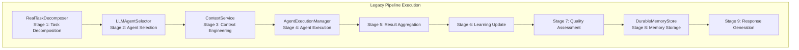
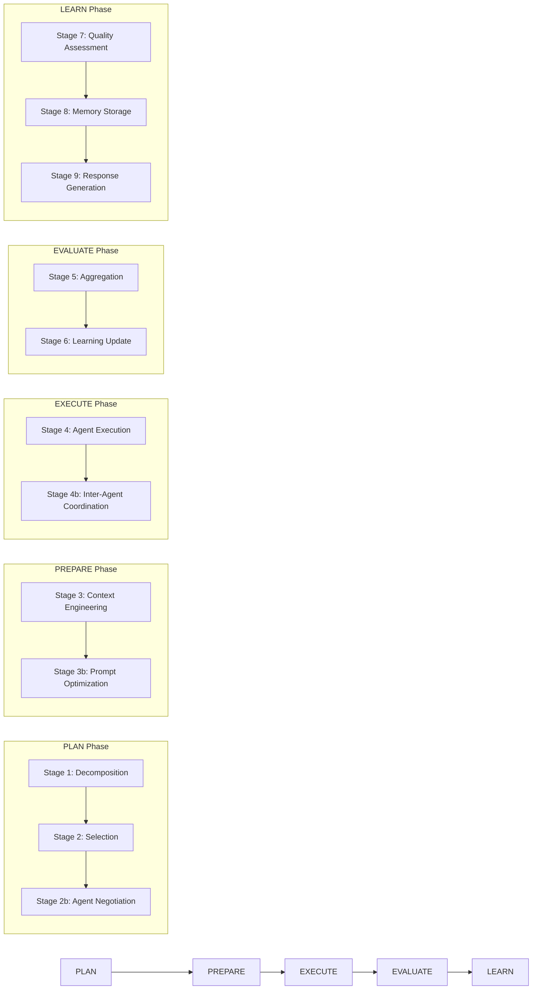
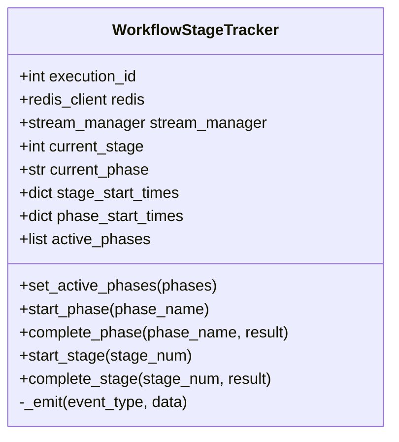

# Workflow Pipeline Architecture

Relevant source files

The following files were used as context for generating this wiki page:

- [frontend/components/__tests__/prd197-substrate-tile.test.tsx](frontend/components/__tests__/prd197-substrate-tile.test.tsx)
- [frontend/components/command-center/is-it-working-strip.tsx](frontend/components/command-center/is-it-working-strip.tsx)
- [frontend/hooks/use-analytics-api.ts](frontend/hooks/use-analytics-api.ts)
- [frontend/lib/api-client.ts](frontend/lib/api-client.ts)
- [orchestrator/api/workflows.py](orchestrator/api/workflows.py)
- [orchestrator/config.py](orchestrator/config.py)
- [orchestrator/core/models/substrate_metrics.py](orchestrator/core/models/substrate_metrics.py)
- [orchestrator/core/observability/substrate_metrics.py](orchestrator/core/observability/substrate_metrics.py)
- [orchestrator/main.py](orchestrator/main.py)
- [orchestrator/reports/route-manifest.json](orchestrator/reports/route-manifest.json)
- [orchestrator/router_manifest.py](orchestrator/router_manifest.py)
- [orchestrator/tests/authz_sweep_probe.py](orchestrator/tests/authz_sweep_probe.py)
- [orchestrator/tests/test_p2w2_authz_boundary_sweep.py](orchestrator/tests/test_p2w2_authz_boundary_sweep.py)
- [orchestrator/tests/test_prd154_s5_missions.py](orchestrator/tests/test_prd154_s5_missions.py)
- [orchestrator/tests/test_prd222_w2s1_plan_tiers.py](orchestrator/tests/test_prd222_w2s1_plan_tiers.py)

## Purpose and Scope

This document details the workflow execution pipeline architecture in Automatos AI, covering the **legacy 9-stage workflow orchestration system**, the **PRD-59 dynamic phase model** (`PLAN`, `PREPARE`, `EXECUTE`, `EVALUATE`, `LEARN`), and the **`WorkflowStageTracker`** class. It explains how the system manages phase transitions, calculates durations, and emits real-time Server-Sent Events (SSE) and Redis Pub/Sub messages for multi-agent workflows.

Sources: [orchestrator/api/workflows.py:38-80]()

---

## Overview: Execution Models

Automatos AI supports multiple workflow execution paths, all unified under the telemetry and event reporting layer provided by `WorkflowStageTracker`:

| Model | Description | Use Case | Implementation Class / Reference |
|-------|-------------|----------|----------------------------------|
| **Legacy 9-Stage Pipeline** | Sequential pipeline covering decomposition, selection, context, execution, and learning. | Advanced multi-agent orchestration tasks. | `WorkflowStageTracker.STAGES` [orchestrator/api/workflows.py:41-52]() |
| **PRD-59 Dynamic Phases** | Simplified grouping of stages into 5 high-level phases with sub-stages. | Standardized autonomous operations. | `WorkflowStageTracker.PHASES` [orchestrator/api/workflows.py:63-69]() |
| **Recipe Execution Engine** | Step-by-step runner executing recipes with workspace semaphores and scratchpad storage. | Scheduled cron tasks and playbooks. | `RecipeExecution` [orchestrator/api/workflows.py:27]() |

Sources: [orchestrator/api/workflows.py:38-80]()

---

## Legacy 9-Stage Pipeline

### Architecture and Flow

The legacy workflow engine processes tasks through 9 distinct stages, managing the transition from task intake to response delivery.

### Stage Breakdown

*   **Stage 1 (Task Decomposition)**: Breaks incoming natural language requests into structured subtasks using decomposition services [orchestrator/api/workflows.py:43]().
*   **Stage 2 (Agent Selection)**: Selects optimal agents based on capabilities and workspace assignment [orchestrator/api/workflows.py:44]().
*   **Stage 3 (Context Engineering)**: Assembles prompt sections via `ContextService` [orchestrator/api/workflows.py:45]().
*   **Stage 4 (Agent Execution)**: Executes tool loops and agent reasoning steps [orchestrator/api/workflows.py:46]().
*   **Stages 5–9**: Handle aggregation, learning updates, quality assessment, memory persistence, and final response formatting [orchestrator/api/workflows.py:47-52]().

Sources: [orchestrator/api/workflows.py:41-52]()

---

## PRD-59 Dynamic Phase Architecture

### Five-Phase Grouping Model

PRD-59 groups the linear stages into five conceptual phases to improve modularity and provide cleaner status reporting to the frontend UI:

### Phase Mapping Table

| Phase Name | Constituent Stages | Label | Description |
|------------|--------------------|-------|-------------|
| `PLAN` | `[1, 2, "2b"]` | Planning | Decomposition, agent selection, and negotiation [orchestrator/api/workflows.py:64]() |
| `PREPARE` | `[3, "3b"]` | Preparation | Context assembly and prompt optimization [orchestrator/api/workflows.py:65]() |
| `EXECUTE` | `[4, "4b"]` | Execution | Tool execution and inter-agent coordination [orchestrator/api/workflows.py:66]() |
| `EVALUATE` | `[5, 6]` | Evaluation | Result aggregation and learning feedback [orchestrator/api/workflows.py:67]() |
| `LEARN` | `[7, 8, 9]` | Learning | Quality checks, memory persistence, and output generation [orchestrator/api/workflows.py:68]() |

Sources: [orchestrator/api/workflows.py:54-69]()

---

## WorkflowStageTracker Implementation

### Class Structure and State Management

The `WorkflowStageTracker` class tracks workflow state transitions and manages dual-delivery event broadcasting through Redis Pub/Sub and Server-Sent Events (SSE) [orchestrator/api/workflows.py:38-80]().

### Key Execution Methods

1. **`set_active_phases(phases)`**: Configures the active phases selected for a specific execution run [orchestrator/api/workflows.py:81-83]().
2. **`start_phase(phase_name)` / `complete_phase(...)`**: Records phase timestamps, computes execution duration in milliseconds, and emits `phase_start` / `phase_complete` events [orchestrator/api/workflows.py:89-125]().
3. **`start_stage(stage_num)` / `complete_stage(...)`**: Supports integer and string stage identifiers (e.g., `"2b"`, `"3b"`), calculates duration, and emits stage events [orchestrator/api/workflows.py:127-161]().
4. **`_emit(event_type, data)`**: Broadcasts events to active SSE streams and Redis channels [orchestrator/api/workflows.py:162-180]().

Sources: [orchestrator/api/workflows.py:71-180]()

---

## Observability and Retrieval Integration

During execution phases, the workflow pipeline interfaces with storage subsystems and telemetry collectors to record retrieval performance and memory states.

*   **Substrate Metrics**: Tracks latency and status (`hit`, `empty`, `error`) across retrieval seams (`documents`, `memory`, and `field`) [orchestrator/core/models/substrate_metrics.py:22-48]().
*   **Memory Persistence**: Integrates with `DurableMemoryStore` for long-term storage and retrieval across agent interactions [orchestrator/modules/memory/durable_store.py:76-94]().

Sources: [orchestrator/core/models/substrate_metrics.py:22-48](), [orchestrator/modules/memory/durable_store.py:76-94]()

---

## Code Entity Reference

### Core Classes and Modules

| Entity Name | File Path | Role |
|-------------|-----------|------|
| `WorkflowStageTracker` | [orchestrator/api/workflows.py:38-179]() | Manages phase/stage state tracking and event emission. |
| `RecipeExecution` | [orchestrator/core/models/core.py:27]() | Database model for recipe execution tracking. |
| `SubstrateMetricEvent` | [orchestrator/core/models/substrate_metrics.py:22-48]() | Observability model for search and retrieval telemetry. |
| `DurableMemoryStore` | [orchestrator/modules/memory/durable_store.py:76-94]() | Qdrant-backed durable memory storage interface. |

### SSE Event Signatures

*   `phase_start`: Emitted via `WorkflowStageTracker.start_phase` with phase metadata and active stage list [orchestrator/api/workflows.py:107]().
*   `stage_start`: Emitted via `WorkflowStageTracker.start_stage` indicating stage initialization [orchestrator/api/workflows.py:141]().
*   `stage_complete`: Emitted via `WorkflowStageTracker.complete_stage` providing execution duration and result dictionaries [orchestrator/api/workflows.py:160]().

Sources: [orchestrator/api/workflows.py:38-179](), [orchestrator/core/models/substrate_metrics.py:22-48]()

---