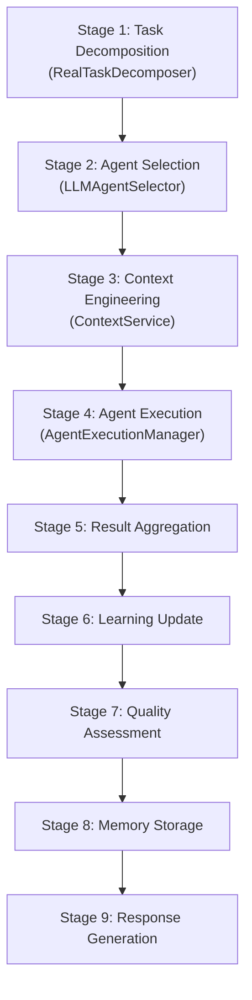
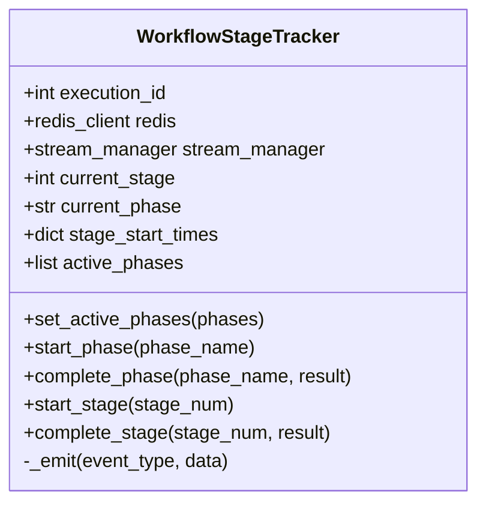

# Workflow Pipeline Architecture

Relevant source files

The following files were used as context for generating this wiki page:

- [frontend/components/knowledge/BusinessGraphPanel.tsx](frontend/components/knowledge/BusinessGraphPanel.tsx)
- [frontend/components/workflows/execution-kitchen.tsx](frontend/components/workflows/execution-kitchen.tsx)
- [frontend/lib/api-client.ts](frontend/lib/api-client.ts)
- [orchestrator/api/knowledge_graph.py](orchestrator/api/knowledge_graph.py)
- [orchestrator/api/workflows.py](orchestrator/api/workflows.py)
- [orchestrator/modules/context/sections/graph_context.py](orchestrator/modules/context/sections/graph_context.py)
- [orchestrator/modules/knowledge/graph_extraction.py](orchestrator/modules/knowledge/graph_extraction.py)
- [orchestrator/modules/knowledge/graph_service.py](orchestrator/modules/knowledge/graph_service.py)
- [orchestrator/modules/tools/discovery/actions_graph.py](orchestrator/modules/tools/discovery/actions_graph.py)
- [orchestrator/modules/tools/discovery/handlers_graph.py](orchestrator/modules/tools/discovery/handlers_graph.py)

## Purpose and Scope

This document describes the workflow execution pipeline architecture in Automatos AI, covering the **legacy 9-stage workflow orchestration system**, the **PRD-59 dynamic phase model**, and the **WorkflowStageTracker**. It explains how the system bridges these approaches to provide real-time progress tracking via SSE events and Redis Pub/Sub, ensuring visibility into complex multi-agent coordination.

---

## Overview: Execution Models

Automatos AI supports two distinct workflow execution architectures, unified by a common tracking layer:

| Model | Description | Use Case | Complexity |
|-------|-------------|----------|------------|
| **Legacy 9-Stage Pipeline** | Complex orchestration with task decomposition, agent selection, and learning loops. | Advanced multi-agent coordination. | High |
| **PRD-59 Dynamic Phases** | A modernized grouping of stages into 5 high-level phases (PLAN, PREPARE, EXECUTE, EVALUATE, LEARN). | Standardized autonomous workflows. | Medium |
| **Recipe Direct Executor** | Sequential execution bypassing the pipeline for simpler "Playbook" tasks. | Starter plan recipes, scheduled cron tasks. | Low |

The `WorkflowStageTracker` class provides a unified progress tracking interface that supports both models, allowing the system to emit consistent events regardless of the underlying execution logic [orchestrator/api/workflows.py:37-41]().

**Sources:** [orchestrator/api/workflows.py:37-41](), [orchestrator/api/workflows.py:62-68]()

---

## Legacy 9-Stage Pipeline

### Architecture Overview

The legacy workflow pipeline decomposes complex tasks into 9 sequential stages. Each stage is responsible for a specific orchestration concern.

**Legacy Stage to Code Entity Mapping**

### Stage Implementation Details

*   **Stage 1: Task Decomposition**: Handled by `RealTaskDecomposer`, which uses LLMs to break a complex `task_description` into atomic `subtasks`.
*   **Stage 2: Agent Selection**: Managed by `LLMAgentSelector`, which uses reasoning-based logic to find the best agent match based on skills and proficiency.
*   **Stage 3: Context Engineering**: Handled by the `ContextService` to assemble the prompt based on priorities and token budgets.
*   **Stage 4: Agent Execution**: Managed by the execution runtime, handling tool loops and inter-agent communication.

**Sources:** [orchestrator/api/workflows.py:41-51](), [orchestrator/api/workflows.py:74-84]()

---

## PRD-59 Dynamic Phase Architecture

### Five-Phase Model

PRD-59 introduces a simplified **phase-based execution model** that groups related stages into high-level phases. The `WorkflowStageTracker.PHASES` dictionary maps phases to their constituent stages, including dynamic sub-stages like "2b" (Agent Negotiation) and "4b" (Inter-Agent Coordination) [orchestrator/api/workflows.py:54-68]().

**Phase to Stage Relationship**

```mermaid
graph LR
    subgraph PLAN["PLAN Phase"]
        S1["Stage 1: Decomposition"]
        S2["Stage 2: Selection"]
        S2b["Stage 2b: Negotiation"]
    end
    
    subgraph PREPARE["PREPARE Phase"]
        S3["Stage 3: Context"]
        S3b["Stage 3b: Prompt Opt"]
    end
    
    subgraph EXECUTE["EXECUTE Phase"]
        S4["Stage 4: Execution"]
        S4b["Stage 4b: Coordination"]
    end
    
    subgraph EVALUATE["EVALUATE Phase"]
        S5["Stage 5: Aggregation"]
        S6["Stage 6: Learning"]
    end
    
    subgraph LEARN["LEARN Phase"]
        S7["Stage 7: Quality"]
        S8["Stage 8: Memory"]
        S9["Stage 9: Response"]
    end
    
    PLAN --> PREPARE
    PREPARE --> EXECUTE
    EXECUTE --> EVALUATE
    EVALUATE --> LEARN
```

### Phase Configuration

| Phase | Stages | Label | Purpose |
|-------|--------|-------|---------|
| `PLAN` | 1, 2, "2b" | Planning | Task decomposition and agent selection/negotiation [orchestrator/api/workflows.py:63](). |
| `PREPARE` | 3, "3b" | Preparation | Context assembly and prompt optimization [orchestrator/api/workflows.py:64](). |
| `EXECUTE` | 4, "4b" | Execution | Agent task execution and inter-agent coordination [orchestrator/api/workflows.py:65](). |
| `EVALUATE` | 5, 6 | Evaluation | Result aggregation and preliminary learning updates [orchestrator/api/workflows.py:66](). |
| `LEARN` | 7, 8, 9 | Learning | Quality assessment, memory storage, and final response [orchestrator/api/workflows.py:67](). |

**Sources:** [orchestrator/api/workflows.py:54-68]()

---

## WorkflowStageTracker Implementation

### Class Structure

`WorkflowStageTracker` is the central component for tracking workflow progress. It maintains state for the current phase and stage, calculating durations and broadcasting updates via Redis and SSE [orchestrator/api/workflows.py:70-79]().

### Key Logic

1. **Phase Management**: `start_phase` marks the beginning of a high-level phase (e.g., `PLAN`) and calculates the `phase_index` relative to `active_phases` [orchestrator/api/workflows.py:88-106]().
2. **Stage Management**: `start_stage` and `complete_stage` handle both integer IDs and dynamic strings (e.g., "4b"). They calculate `duration_ms` for performance monitoring [orchestrator/api/workflows.py:126-159]().
3. **Event Emission**: The `_emit` method ensures dual-delivery:
   - **SSE**: Real-time updates to the browser via a `stream_manager` [orchestrator/api/workflows.py:163-171]().
   - **Redis**: Persistence and inter-service coordination via `publish_workflow_event` [orchestrator/api/workflows.py:173-178]().

**Sources:** [orchestrator/api/workflows.py:70-178]()

---

## Frontend Integration: Execution Kitchen

The frontend consumes pipeline events to provide a "Kitchen" view of the execution. The `ExecutionKitchen` component visualizes logs and progress [frontend/components/workflows/execution-kitchen.tsx:47-55]().

### UI Logs and Progress

*   **Streaming Logs**: The `StreamingLog` component displays events such as `stage_start`, `agent_spawn`, and `task_progress` in real-time [frontend/components/workflows/execution-kitchen.tsx:99-130]().
*   **Theater Visualization**: High-level progress is visualized through `TheaterStageProgress` and `TheaterStepExecution`, mapping backend stages to UI animations [frontend/components/workflows/execution-kitchen.tsx:36-37]().
*   **Stage Metadata**: The UI maintains a list of `STAGE_NAMES` and `STAGE_SHORT_NAMES` for the legacy 9-stage display [frontend/components/workflows/execution-kitchen.tsx:74-89]().

**Sources:** [frontend/components/workflows/execution-kitchen.tsx:36-130]()

---

## Code Entity Reference

### Core Services

| Entity | File | Role |
|--------|------|------|
| `WorkflowStageTracker` | [orchestrator/api/workflows.py:37-41]() | Orchestrates phase/stage transitions and event emission. |
| `apiClient` | [frontend/lib/api-client.ts:95-101]() | Handles frontend-to-backend communication for workflow status. |
| `GraphifyService` | [orchestrator/modules/knowledge/graph_service.py:128-135]() | Manages knowledge-graph builds that feed into the Evaluation/Learning phases. |

### WebSocket & SSE Events

| Event Type | Source | Purpose |
|------------|--------|---------|
| `phase_start` | `WorkflowStageTracker.start_phase` | Signals the beginning of a PRD-59 phase [orchestrator/api/workflows.py:106](). |
| `stage_start` | `WorkflowStageTracker.start_stage` | Signals the beginning of a specific orchestration stage [orchestrator/api/workflows.py:140](). |
| `stage_complete` | `WorkflowStageTracker.complete_stage` | Emits stage results and duration [orchestrator/api/workflows.py:159](). |

**Sources:** [orchestrator/api/workflows.py:37-178](), [frontend/lib/api-client.ts:95-156](), [orchestrator/modules/knowledge/graph_service.py:128-150]()

---