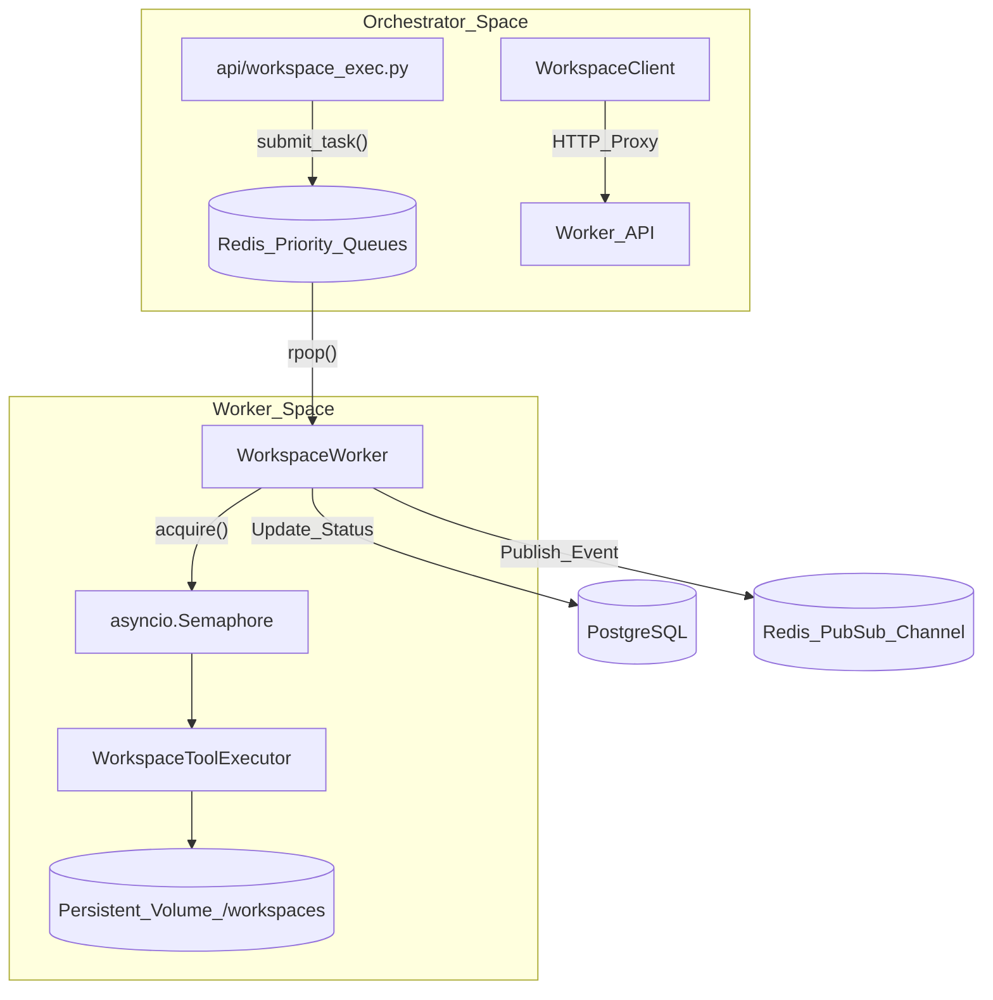
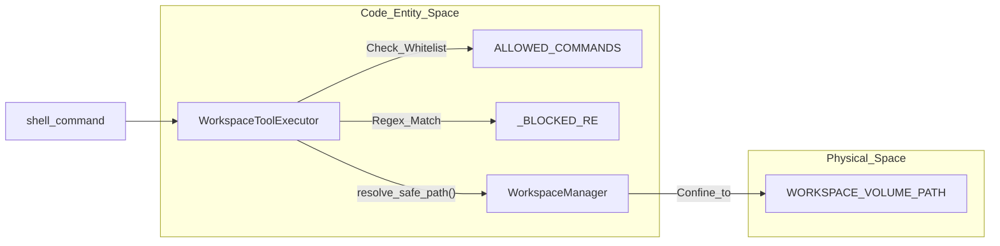

# Workspace Execution

Relevant source files

The following files were used as context for generating this wiki page:

- [frontend/components/widgets/CodingCanvasWidget/CodeEditor.tsx](frontend/components/widgets/CodingCanvasWidget/CodeEditor.tsx)
- [frontend/components/widgets/CodingCanvasWidget/EditorTabs.tsx](frontend/components/widgets/CodingCanvasWidget/EditorTabs.tsx)
- [frontend/components/widgets/CodingCanvasWidget/FileExplorer.tsx](frontend/components/widgets/CodingCanvasWidget/FileExplorer.tsx)
- [frontend/components/widgets/CodingCanvasWidget/RepoSelector.tsx](frontend/components/widgets/CodingCanvasWidget/RepoSelector.tsx)
- [frontend/components/widgets/CodingCanvasWidget/index.tsx](frontend/components/widgets/CodingCanvasWidget/index.tsx)
- [frontend/components/widgets/CodingCanvasWidget/useWorkspaceFiles.ts](frontend/components/widgets/CodingCanvasWidget/useWorkspaceFiles.ts)
- [frontend/components/widgets/FileWidget/FilePreview.tsx](frontend/components/widgets/FileWidget/FilePreview.tsx)
- [frontend/components/widgets/FileWidget/index.tsx](frontend/components/widgets/FileWidget/index.tsx)
- [frontend/components/widgets/TerminalWidget/InteractiveTerminal.tsx](frontend/components/widgets/TerminalWidget/InteractiveTerminal.tsx)
- [frontend/components/widgets/TerminalWidget/index.tsx](frontend/components/widgets/TerminalWidget/index.tsx)
- [frontend/components/widgets/index.ts](frontend/components/widgets/index.ts)
- [frontend/components/widgets/router.ts](frontend/components/widgets/router.ts)
- [frontend/components/widgets/types.ts](frontend/components/widgets/types.ts)
- [frontend/components/workspace/WorkspaceExplorer.tsx](frontend/components/workspace/WorkspaceExplorer.tsx)
- [frontend/components/workspace/gallery-view/deliverable-preview.tsx](frontend/components/workspace/gallery-view/deliverable-preview.tsx)
- [frontend/package-lock.json](frontend/package-lock.json)
- [frontend/package.json](frontend/package.json)
- [frontend/yarn.lock](frontend/yarn.lock)
- [orchestrator/api/workspace_exec.py](orchestrator/api/workspace_exec.py)
- [orchestrator/api/workspace_files.py](orchestrator/api/workspace_files.py)
- [orchestrator/api/workspace_github.py](orchestrator/api/workspace_github.py)
- [orchestrator/core/workspace_client.py](orchestrator/core/workspace_client.py)
- [orchestrator/modules/tools/discovery/workspace_actions.py](orchestrator/modules/tools/discovery/workspace_actions.py)
- [orchestrator/modules/tools/execution/exec_workspace.py](orchestrator/modules/tools/execution/exec_workspace.py)
- [services/workspace-worker/Dockerfile](services/workspace-worker/Dockerfile)
- [services/workspace-worker/entrypoint.sh](services/workspace-worker/entrypoint.sh)
- [services/workspace-worker/executor.py](services/workspace-worker/executor.py)
- [services/workspace-worker/main.py](services/workspace-worker/main.py)
- [services/workspace-worker/requirements.txt](services/workspace-worker/requirements.txt)

The Workspace Execution subsystem provides a secure, sandboxed environment for agents to perform code-related tasks, such as cloning repositories, running shell commands, and managing files. This system decouples heavy or dangerous execution from the main orchestrator using a dedicated worker architecture and persistent volumes.

## Workspace Worker Architecture

The `workspace-worker` is an independent service implemented as an ARQ-style Redis consumer [services/workspace-worker/main.py:59-68](). It is designed for high reliability and concurrency control, ensuring that agent tasks do not overwhelm system resources.

*   **Priority Queuing**: Tasks are distributed across four levels: `critical`, `high`, `normal`, and `low` [services/workspace-worker/main.py:44-49]().
*   **Concurrency Control**: The worker uses an `asyncio.Semaphore` to limit the number of simultaneous executions based on the `WORKER_CONCURRENCY` environment variable [services/workspace-worker/main.py:72-78]().
*   **Lifecycle**: Includes a heartbeat reporter for monitoring and a graceful shutdown handler that waits for active tasks to complete [services/workspace-worker/main.py:117-141]().
*   **DevOps Toolchain**: The worker environment is pre-loaded with `git`, `nodejs`, `python`, `pytest`, `ruff`, and `playwright` to support immediate agent productivity [services/workspace-worker/Dockerfile:5-49]().

For details, see [Workspace Worker Architecture](#21.1).

### Workspace Task Flow
The following diagram illustrates how a task moves from the Orchestrator to the Worker.

"Workspace Task Flow"

Sources: [services/workspace-worker/main.py:44-54](), [orchestrator/core/workspace_client.py:23-45](), [services/workspace-worker/executor.py:108-114](), [orchestrator/api/workspace_files.py:154-181]()

## File Operations & Command Execution

The system provides an interactive interface for agents and users to interact with the workspace filesystem. The `WorkspaceClient` in the orchestrator acts as a proxy, forwarding requests to the worker's internal HTTP server [orchestrator/api/workspace_files.py:6-12]().

*   **Directory Listing**: `GET /files` provides a structured view of the workspace contents [orchestrator/api/workspace_files.py:52-69]().
*   **File Content**: `GET /files/content` allows the frontend to display source code in the `CodingCanvasWidget` [orchestrator/api/workspace_files.py:75-92](), [frontend/components/widgets/CodingCanvasWidget/index.tsx:29-43]().
*   **Command Execution**: `POST /exec` allows running shell commands with configurable timeouts and working directories [orchestrator/api/workspace_files.py:160-181]().
*   **Storage Routing**: The system routes requests between the physical worker filesystem and Postgres-backed graph storage (used for wizard-created environments) via `_select_client` [orchestrator/api/workspace_files.py:41-46]().

For details, see [File Operations & Command Execution](#21.2).

## GitHub Integration

Agents can clone and interact with GitHub repositories within their sandboxed workspaces. This integration leverages Composio for secure credential management and OAuth flows [orchestrator/api/workspace_github.py:4-8]().

*   **Repo Discovery**: The `list_github_repos` endpoint resolves Composio identities for the workspace and lists accessible repositories [orchestrator/api/workspace_github.py:113-138]().
*   **Cloning**: Repositories are cloned into the persistent workspace volume. The system enforces strict URL validation (HTTPS only) and branch name sanitization via `_BRANCH_RE` to prevent injection [orchestrator/api/workspace_github.py:40-95]().
*   **UI Components**: The `RepoSelector` component allows users to manually trigger clones into an agent's workspace [frontend/components/widgets/CodingCanvasWidget/RepoSelector.tsx]().

For details, see [GitHub Integration](#21.3).

## Security & Sandboxing

Security is enforced at the `WorkspaceToolExecutor` level to prevent container escapes or malicious actions [services/workspace-worker/executor.py:4-15]().

*   **Command Whitelist**: Only a specific set of binaries (e.g., `git`, `python`, `npm`, `ls`, `cargo`, `uv`, `playwright`) are allowed to run [services/workspace-worker/executor.py:35-73]().
*   **Pattern Blocking**: Even whitelisted commands are blocked if they contain dangerous patterns like `rm -rf /`, `sudo`, or backtick execution [services/workspace-worker/executor.py:76-95]().
*   **Path Containment**: The `WorkspaceManager` ensures all file operations are strictly relative to the assigned workspace root [services/workspace-worker/executor.py:154-160]().
*   **Resource Limits**: Output is capped at 100KB for `stdout` and 50KB for `stderr` [services/workspace-worker/executor.py:101-102]().

For details, see [Security & Sandboxing](#21.4).

### Execution Security Layer
This diagram shows the relationship between the execution request and the security constraints.

"Execution Security Boundary"

Sources: [services/workspace-worker/executor.py:108-160](), [services/workspace-worker/main.py:16](), [services/workspace-worker/executor.py:98]()

## Task Management & Board Integration

Workspace tasks are integrated into the platform's lifecycle, allowing for asynchronous tracking of long-running operations.

*   **Status Tracking**: The worker updates the `TASK_STATUS_KEY` and `TASK_RESULT_KEY` in Redis [services/workspace-worker/main.py:50-51]().
*   **Event Streaming**: Real-time task events are published to Redis Pub/Sub channels (`workspace:task:{task_id}:events`) for live progress updates in the `InteractiveTerminal` widget [services/workspace-worker/main.py:52]().

For details, see [Task Management & Board Integration](#21.5).

## Workspace Outputs Hub

The Outputs Hub (PRD-129 Deliverables system) provides a centralized repository for agent deliverables created during workspace execution.

*   **Auto-Registration**: When an agent uses `workspace_write_file`, the system automatically invokes `_auto_register_deliverable` to track the file in the `DeliverableService` [orchestrator/modules/tools/execution/exec_workspace.py:43-56]().
*   **Metadata Extraction**: The system infers artifact types (e.g., `DOCUMENT`, `CODE`, `IMAGE`) and attributes them to the specific agent and source (e.g., `mission`, `task`, `heartbeat`) [orchestrator/modules/tools/execution/exec_workspace.py:65-113]().
*   **Public Access**: The `workspace_get_public_url` tool allows agents to move files from the private workspace to a public image store for external sharing [orchestrator/modules/tools/execution/exec_workspace.py:121-160]().

For details, see [Workspace Outputs Hub](#21.6).

Sources:
- [services/workspace-worker/main.py:1-141]()
- [orchestrator/api/workspace_files.py:1-181]()
- [orchestrator/api/workspace_github.py:1-185]()
- [services/workspace-worker/executor.py:1-152]()
- [orchestrator/core/workspace_client.py:23-45]()
- [orchestrator/modules/tools/execution/exec_workspace.py:43-160]()
- [services/workspace-worker/Dockerfile:1-69]()
- [orchestrator/modules/tools/discovery/workspace_actions.py:15-170]()

---