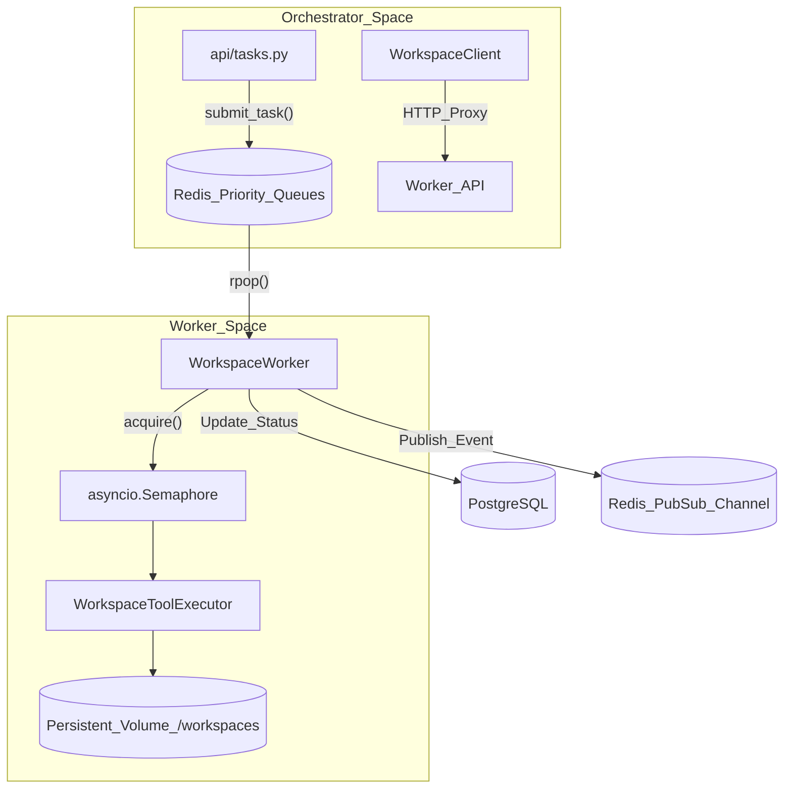
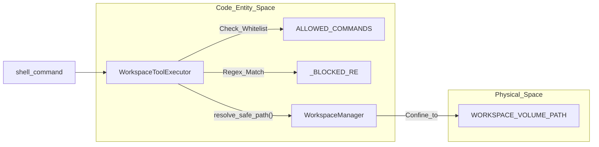

# Workspace Execution

Relevant source files

The following files were used as context for generating this wiki page:

- [frontend/components/widgets/TerminalWidget/InteractiveTerminal.tsx](frontend/components/widgets/TerminalWidget/InteractiveTerminal.tsx)
- [frontend/components/widgets/TerminalWidget/index.tsx](frontend/components/widgets/TerminalWidget/index.tsx)
- [orchestrator/api/workspace_files.py](orchestrator/api/workspace_files.py)
- [orchestrator/core/workspace_client.py](orchestrator/core/workspace_client.py)
- [orchestrator/modules/tools/discovery/canvas_git.py](orchestrator/modules/tools/discovery/canvas_git.py)
- [orchestrator/tests/test_prd170_canvas_git.py](orchestrator/tests/test_prd170_canvas_git.py)
- [orchestrator/tests/test_prd170_canvas_session_manager.py](orchestrator/tests/test_prd170_canvas_session_manager.py)
- [orchestrator/tests/test_prd203_cs8_worker_auth.py](orchestrator/tests/test_prd203_cs8_worker_auth.py)
- [services/workspace-worker/Dockerfile](services/workspace-worker/Dockerfile)
- [services/workspace-worker/canvas_confinement.py](services/workspace-worker/canvas_confinement.py)
- [services/workspace-worker/canvas_session_service.py](services/workspace-worker/canvas_session_service.py)
- [services/workspace-worker/entrypoint.sh](services/workspace-worker/entrypoint.sh)
- [services/workspace-worker/executor.py](services/workspace-worker/executor.py)
- [services/workspace-worker/main.py](services/workspace-worker/main.py)
- [services/workspace-worker/requirements.txt](services/workspace-worker/requirements.txt)
- [services/workspace-worker/worker_config.py](services/workspace-worker/worker_config.py)
- [services/workspace-worker/workspace_manager.py](services/workspace-worker/workspace_manager.py)

The Workspace Execution subsystem provides a secure, sandboxed environment for agents to perform code-related tasks, such as cloning repositories, running shell commands, and managing files. This system decouples heavy or dangerous execution from the main orchestrator using a dedicated worker architecture and persistent volumes.

## Workspace Worker Architecture

The `workspace-worker` is an independent service implemented as an ARQ-style Redis consumer [services/workspace-worker/main.py:62-71](). It is designed for high reliability and concurrency control, ensuring that agent tasks do not overwhelm system resources.

*   **Priority Queuing**: Tasks are distributed across four levels: `critical`, `high`, `normal`, and `low` [services/workspace-worker/main.py:44-49]().
*   **Concurrency Control**: The worker uses an `asyncio.Semaphore` to limit the number of simultaneous executions based on the `WORKER_CONCURRENCY` environment variable [services/workspace-worker/main.py:75-81]().
*   **Lifecycle**: Includes a heartbeat reporter for monitoring and a graceful shutdown handler that waits for active tasks to complete [services/workspace-worker/main.py:118-144]().
*   **Worker ID**: Each worker instance generates a unique identifier using its PID and timestamp for tracking [services/workspace-worker/main.py:82]().
*   **Canvas Integration**: The worker manages headless Claude Agent SDK sessions, persisting state and transcripts to the workspace volume [services/workspace-worker/canvas_session_service.py:4-17]().
*   **Toolchain**: The worker Docker image includes essential development tools like `git`, `curl`, `nodejs`, `npm`, `pnpm`, and `uv` for Python package management [services/workspace-worker/Dockerfile:6-27](). It also conditionally installs headless Chromium for the `workspace_html_to_png` tool [services/workspace-worker/Dockerfile:50-65]().

For details, see [Workspace Worker Architecture](#21.1).

### Workspace Task Flow
The following diagram illustrates how a task moves from the Orchestrator to the Worker.

"Workspace Task Flow"

Sources: [services/workspace-worker/main.py:44-53](), [orchestrator/core/workspace_client.py:2-20](), [services/workspace-worker/executor.py:108-114]()

## File Operations & Command Execution

The system provides an interactive interface for agents and users to interact with the workspace filesystem. The `WorkspaceClient` in the orchestrator acts as a proxy, forwarding requests to the worker's internal HTTP server [orchestrator/api/workspace_files.py:6-21]().

*   **Directory Listing**: `GET /files` provides a structured view of the workspace contents [orchestrator/api/workspace_files.py:69-86]().
*   **File Content**: `GET /files/content` allows the frontend to display source code [orchestrator/api/workspace_files.py:92-109]().
*   **Raw File Download**: `GET /files/raw` allows downloading binary file content for previews [orchestrator/api/workspace_files.py:115-137]().
*   **File Writing**: `PUT /files/content` enables creating or updating files in the workspace [orchestrator/api/workspace_files.py:148-159]().
*   **Command Execution**: `POST /exec` allows running shell commands with configurable timeouts and working directories [orchestrator/api/workspace_files.py:169-180]().
*   **Interactive Terminal**: The frontend `InteractiveTerminal` component provides a VS Code-style shell with ANSI color support and command history [frontend/components/widgets/TerminalWidget/InteractiveTerminal.tsx:4-14](). It handles `cd` commands locally by updating the displayed CWD based on worker responses [frontend/components/widgets/TerminalWidget/InteractiveTerminal.tsx:108-113]().
*   **Storage Routing**: The system routes requests between the physical worker filesystem and Postgres-backed graph storage via `_select_client` [orchestrator/api/workspace_files.py:58-63]().

For details, see [File Operations & Command Execution](#21.2).

## GitHub Integration

Agents can clone and interact with GitHub repositories within their sandboxed workspaces.

*   **Canvas Git Integration**: Supports branch-per-session workflows (`canvas/<session-id>`) with automated, editable commit message generation [orchestrator/modules/tools/discovery/canvas_git.py:1-10](). The `canvas_branch_name` function generates safe git reference names [orchestrator/modules/tools/discovery/canvas_git.py:37-44]().
*   **Token Security**: The system strictly redacts GitHub tokens from logs and error messages using `redact_token` and `_GH_TOKEN_RE` regex patterns [orchestrator/modules/tools/discovery/canvas_git.py:32-62]().
*   **Authenticated Remotes**: Securely builds authenticated remote URLs for push operations while ensuring token material is never leaked [orchestrator/modules/tools/discovery/canvas_git.py:65-74]().
*   **Command Injection Prevention**: Git remote names are validated against `_REMOTE_RE` and shell-quoted to prevent command injection during `git push` operations [orchestrator/modules/tools/discovery/canvas_git.py:155-168]().

For details, see [GitHub Integration](#21.3).

## Security & Sandboxing

Security is enforced at the `WorkspaceToolExecutor` level to prevent container escapes or malicious actions [services/workspace-worker/executor.py:4-15]().

*   **Command Whitelist**: Only a specific set of binaries (e.g., `git`, `python`, `npm`, `ls`, `cargo`, `uv`) are allowed to run [services/workspace-worker/executor.py:35-73]().
*   **Pattern Blocking**: Even whitelisted commands are blocked if they contain dangerous patterns like `rm -rf /`, `sudo`, or backtick execution [services/workspace-worker/executor.py:76-95]().
*   **Path Containment**: The `WorkspaceManager` ensures all file operations are strictly relative to the assigned workspace root via `resolve_safe_path` [services/workspace-worker/workspace_manager.py:48-49](). The `canvas_confinement.py` module specifically enforces this for Claude SDK tool calls [services/workspace-worker/canvas_confinement.py]().
*   **Resource Limits**: Output is capped at 100KB for `stdout` and 50KB for `stderr` [services/workspace-worker/executor.py:101-102]().
*   **Storage Quotas**: The system enforces a default storage quota (e.g., 5GB) per workspace, configurable via `WORKSPACE_DEFAULT_QUOTA_GB` [services/workspace-worker/workspace_manager.py:37-55]().

For details, see [Security & Sandboxing](#21.4).

### Execution Security Layer
This diagram shows the relationship between the execution request and the security constraints.

"Execution Security Boundary"

Sources: [services/workspace-worker/executor.py:108-152](), [services/workspace-worker/main.py:16](), [services/workspace-worker/executor.py:98]()

## Task Management & Board Integration

Workspace tasks are integrated into the platform's lifecycle, allowing for asynchronous tracking of long-running operations.

*   **Worker Polling**: Workers poll queues in priority order: `critical` → `high` → `normal` → `low` [services/workspace-worker/main.py:184-193]().
*   **Status Updates**: Task progress and results are stored in Redis with defined TTLs using keys like `TASK_STATUS_KEY` and `TASK_RESULT_KEY` [services/workspace-worker/main.py:53-54, 58-59]().
*   **Task Cleanup**: Ephemeral task directories and credentials are automatically cleaned up after completion or after a stale period using `cleanup_task` and `cleanup_all_stale_tasks` [services/workspace-worker/workspace_manager.py:141-152, 156-178]().

For details, see [Task Management & Board Integration](#21.5).

## Workspace Outputs Hub

The Outputs Hub provides a centralized repository for agent deliverables.

*   **Headless Rendering**: The worker includes a `html_to_png` tool using Playwright for generating visual artifacts [services/workspace-worker/requirements.txt:21-22](). The Dockerfile conditionally installs Chromium for this purpose [services/workspace-worker/Dockerfile:50-65]().
*   **Directory Structure**: The `WorkspaceManager` provisions standard subdirectories for `repos`, `reports`, `content`, `artifacts`, `analytics`, and `graph` [services/workspace-worker/workspace_manager.py:62-70](). These directories are used to organize agent-generated outputs.

For details, see [Workspace Outputs Hub & Deliverables](#21.6).

Sources:
- [services/workspace-worker/main.py:1-145]()
- [services/workspace-worker/executor.py:1-152]()
- [orchestrator/api/workspace_files.py:1-168]()
- [orchestrator/core/workspace_client.py:1-171]()
- [services/workspace-worker/workspace_manager.py:1-175]()
- [orchestrator/modules/tools/discovery/canvas_git.py:1-185]()
- [frontend/components/widgets/TerminalWidget/InteractiveTerminal.tsx:1-170]()
- [services/workspace-worker/canvas_session_service.py:1-189]()
- [services/workspace-worker/Dockerfile:1-74]()
- [services/workspace-worker/requirements.txt:21-22]()
- [services/workspace-worker/canvas_confinement.py]()

---