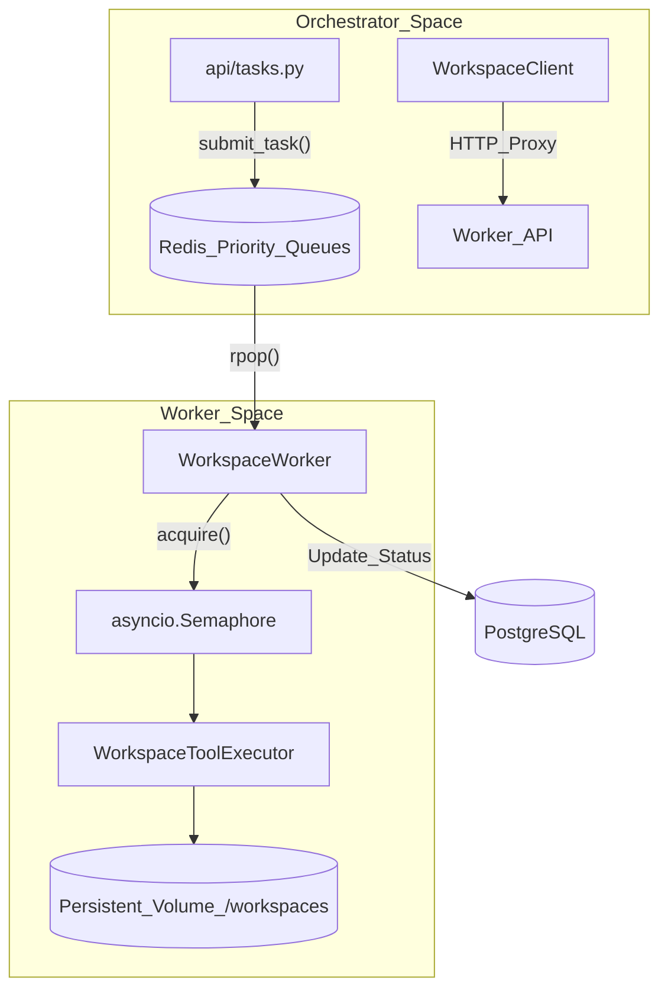
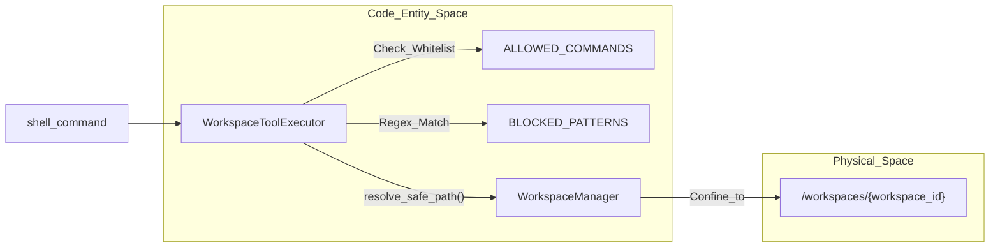

# Workspace Execution

Relevant source files

The following files were used as context for generating this wiki page:

- [frontend/components/widgets/CodingCanvasWidget/RepoSelector.tsx](frontend/components/widgets/CodingCanvasWidget/RepoSelector.tsx)
- [orchestrator/api/main.py](orchestrator/api/main.py)
- [orchestrator/api/tasks.py](orchestrator/api/tasks.py)
- [orchestrator/api/widgets/cors.py](orchestrator/api/widgets/cors.py)
- [orchestrator/api/widgets/rate_limit.py](orchestrator/api/widgets/rate_limit.py)
- [orchestrator/api/workspace_files.py](orchestrator/api/workspace_files.py)
- [orchestrator/api/workspace_github.py](orchestrator/api/workspace_github.py)
- [orchestrator/core/workspace_client.py](orchestrator/core/workspace_client.py)
- [orchestrator/modules/tools/discovery/workspace_actions.py](orchestrator/modules/tools/discovery/workspace_actions.py)
- [services/workspace-worker/executor.py](services/workspace-worker/executor.py)
- [services/workspace-worker/main.py](services/workspace-worker/main.py)
- [services/workspace-worker/workspace_manager.py](services/workspace-worker/workspace_manager.py)

The Workspace Execution subsystem provides a secure, sandboxed environment for agents to perform code-related tasks, such as cloning repositories, running shell commands, and managing files. This system decouples heavy or dangerous execution from the main orchestrator using a dedicated worker architecture and persistent volumes.

## Workspace Worker Architecture

The `workspace-worker` is an independent service that consumes tasks from a Redis-backed priority queue [services/workspace-worker/main.py:58-67](). It is designed for high reliability and concurrency control, ensuring that agent tasks do not overwhelm system resources.

*   **Priority Queuing**: Tasks are distributed across four levels: `critical`, `high`, `normal`, and `low` [services/workspace-worker/main.py:43-48]().
*   **Concurrency Control**: The worker uses an `asyncio.Semaphore` to limit the number of simultaneous executions based on the `WORKER_CONCURRENCY` environment variable [services/workspace-worker/main.py:71-77]().
*   **Lifecycle**: Includes a heartbeat reporter for monitoring [services/workspace-worker/main.py:117]() and a graceful shutdown handler that waits for active tasks to complete [services/workspace-worker/main.py:125-141]().
*   **Worker Identification**: Each worker generates a unique ID using its PID and timestamp to coordinate in multi-node deployments [services/workspace-worker/main.py:78]().

For details, see [Workspace Worker Architecture](#21.1).

### Workspace Task Flow
The following diagram illustrates how a task moves from the Orchestrator to the Worker.

"Workspace Task Flow"

Sources: [services/workspace-worker/main.py:43-53](), [orchestrator/core/workspace_client.py:1-20](), [services/workspace-worker/executor.py:108-114](), [orchestrator/api/tasks.py:62-75]()

## File Operations & Command Execution

The system provides an interactive interface for agents and users to interact with the workspace filesystem. The `WorkspaceClient` in the orchestrator acts as a proxy, forwarding requests to the worker's internal HTTP server [orchestrator/api/workspace_files.py:6-12]().

*   **Directory Listing**: `GET /files` provides a structured view of the workspace contents [orchestrator/api/workspace_files.py:34-52]().
*   **File Content**: `GET /files/content` allows the frontend "Code Viewer" widget to display source code [orchestrator/api/workspace_files.py:57-74]().
*   **Command Execution**: `POST /exec` allows running shell commands with configurable timeouts and working directories [orchestrator/api/workspace_files.py:86-107]().
*   **Client Implementation**: `WorkspaceClient` handles the low-level `httpx` communication, including internal token authentication (`X-Internal-Token`) and URL building [orchestrator/core/workspace_client.py:28-45]().

For details, see [File Operations & Command Execution](#21.2).

## GitHub Integration

Agents can clone and interact with GitHub repositories within their sandboxed workspaces. This integration leverages Composio for secure credential management and OAuth flows [orchestrator/api/workspace_github.py:4-8]().

*   **Repo Discovery**: The `list_github_repos` endpoint uses the `EntityManager` to resolve Composio identities [orchestrator/api/workspace_github.py:47-58]() and list accessible repositories via the `GITHUB_LIST_REPOSITORIES_FOR_THE_AUTHENTICATED_USER` action [orchestrator/api/workspace_github.py:117-122]().
*   **Cloning**: Repositories are cloned into the persistent workspace volume via the task runner [orchestrator/api/workspace_github.py:167-185]().
*   **Validation**: The system enforces strict URL validation (HTTPS only, allowed hosts: `github.com`, `gitlab.com`, `bitbucket.org`) and branch name sanitization to prevent injection [orchestrator/api/workspace_github.py:69-92]().
*   **Frontend UI**: The `RepoSelector` component provides a dialog for users to browse and trigger clones [frontend/components/widgets/CodingCanvasWidget/RepoSelector.tsx:39-44]().

For details, see [GitHub Integration](#21.3).

## Security & Sandboxing

Security is enforced at the `WorkspaceToolExecutor` level to prevent container escapes or malicious actions [services/workspace-worker/executor.py:4-15]().

*   **Command Whitelist**: Only a specific set of binaries (e.g., `git`, `python`, `npm`, `ls`, `cargo`, `go`, `uv`) are allowed to run [services/workspace-worker/executor.py:35-73]().
*   **Pattern Blocking**: Even whitelisted commands are blocked if they contain dangerous patterns like `rm -rf /`, `sudo`, `chmod 777`, or backtick execution [services/workspace-worker/executor.py:76-95]().
*   **Path Containment**: The `WorkspaceManager` uses `resolve_safe_path` to ensure all operations are strictly relative to the assigned workspace root [services/workspace-worker/workspace_manager.py:44]().
*   **Resource Limits**: Output is capped at 100KB for `stdout` and 50KB for `stderr` [services/workspace-worker/executor.py:101-102]().
*   **Widget Protection**: API access via widgets is governed by `WidgetCORSMiddleware` [orchestrator/api/widgets/cors.py:36-38]() and `WidgetRateLimitMiddleware` [orchestrator/api/widgets/rate_limit.py:85-88]().

For details, see [Security & Sandboxing](#21.4).

### Execution Security Layer
This diagram shows the relationship between the execution request and the security constraints.

"Execution Security Boundary"

Sources: [services/workspace-worker/executor.py:108-152](), [services/workspace-worker/workspace_manager.py:27-28](), [services/workspace-worker/executor.py:35-95]()

## Task Management & Board Integration

Workspace tasks are integrated into the platform's lifecycle, allowing for asynchronous tracking of long-running operations.

*   **Task Submission**: Direct steps (commands, file ops) are submitted via `POST /api/tasks/submit` [orchestrator/api/tasks.py:62-75]().
*   **Persistence**: Tasks are recorded in the `task_executions` table before being pushed to Redis to ensure atomicity [orchestrator/api/tasks.py:106-124]().
*   **Status Tracking**: The worker updates the `TASK_STATUS_KEY` and `TASK_RESULT_KEY` in Redis [services/workspace-worker/main.py:49-50]().
*   **Event Streaming**: Real-time task events are published to Redis Pub/Sub channels (`workspace:task:{task_id}:events`) [services/workspace-worker/main.py:51]().

For details, see [Task Management & Board Integration](#21.5).

Sources:
- [services/workspace-worker/main.py:1-141]()
- [orchestrator/api/workspace_files.py:1-108]()
- [orchestrator/api/workspace_github.py:1-185]()
- [services/workspace-worker/executor.py:1-152]()
- [orchestrator/core/workspace_client.py:1-50]()
- [orchestrator/api/tasks.py:1-174]()
- [services/workspace-worker/workspace_manager.py:1-160]()
- [orchestrator/api/widgets/cors.py:1-93]()
- [orchestrator/api/widgets/rate_limit.py:1-166]()

---