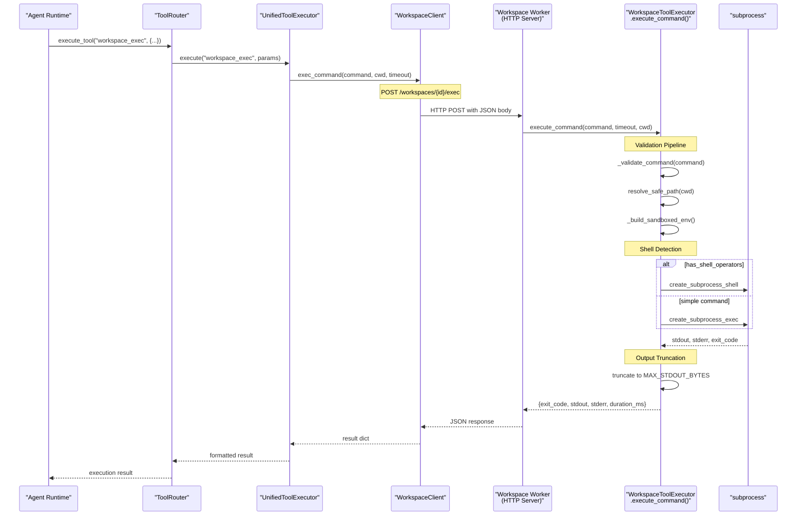
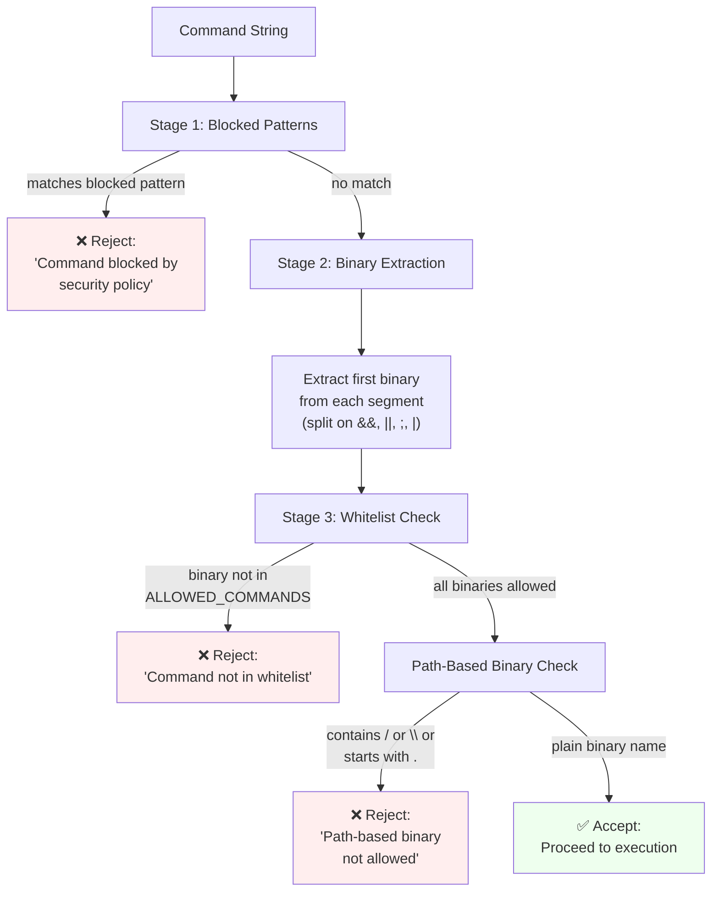
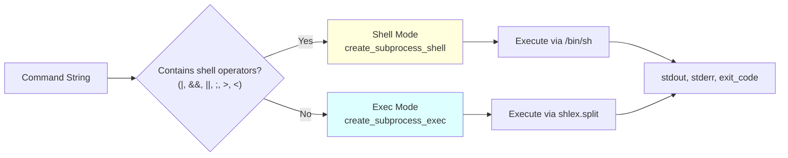
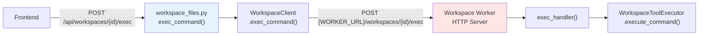
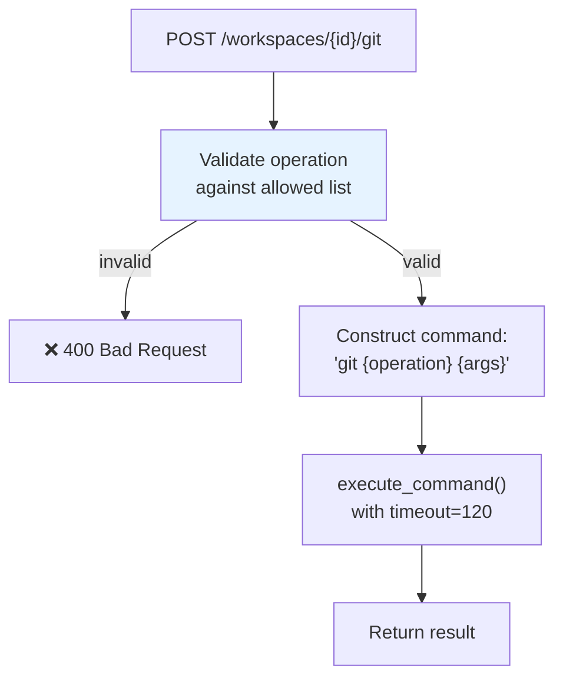

# Command Execution

<details>
<summary>Relevant source files</summary>

The following files were used as context for generating this wiki page:

- [frontend/components/widgets/CodingCanvasWidget/RepoSelector.tsx](frontend/components/widgets/CodingCanvasWidget/RepoSelector.tsx)
- [orchestrator/api/tasks.py](orchestrator/api/tasks.py)
- [orchestrator/api/widgets/cors.py](orchestrator/api/widgets/cors.py)
- [orchestrator/api/widgets/rate_limit.py](orchestrator/api/widgets/rate_limit.py)
- [orchestrator/api/workspace_files.py](orchestrator/api/workspace_files.py)
- [orchestrator/api/workspace_github.py](orchestrator/api/workspace_github.py)
- [orchestrator/core/workspace_client.py](orchestrator/core/workspace_client.py)
- [orchestrator/modules/tools/discovery/action_registry.py](orchestrator/modules/tools/discovery/action_registry.py)
- [orchestrator/modules/tools/discovery/workspace_actions.py](orchestrator/modules/tools/discovery/workspace_actions.py)
- [services/workspace-worker/executor.py](services/workspace-worker/executor.py)
- [services/workspace-worker/main.py](services/workspace-worker/main.py)
- [services/workspace-worker/workspace_manager.py](services/workspace-worker/workspace_manager.py)

</details>


## Purpose and Scope

This document covers sandboxed shell command execution within workspace environments. The command execution system allows AI agents to run development commands (tests, linters, builds, git operations) in isolated workspace directories with strict security controls.

For broader workspace architecture and task lifecycle, see [Workspace Worker Architecture](#9.1). For file operations (read/write/grep), see [File Operations](#9.3). For detailed security policies, see [Security & Sandboxing](#9.5).

---

## Architecture Overview

Command execution follows a multi-tier architecture where requests flow from agents through the orchestrator to the workspace worker, which performs the actual execution in a sandboxed environment.

### End-to-End Request Flow



**Sources**: [services/workspace-worker/executor.py:122-225](), [orchestrator/core/workspace_client.py:133-151](), [services/workspace-worker/main.py:643-668](), [orchestrator/modules/tools/execution/unified_executor.py]()

---

## Command Validation Pipeline

All commands pass through a three-stage validation pipeline before execution. This is the primary security boundary preventing malicious or destructive operations.

### Validation Stages



**Sources**: [services/workspace-worker/executor.py:448-500]()

### Command Whitelist

The `ALLOWED_COMMANDS` set defines the only binaries that can execute. This whitelist covers development toolchains but excludes system administration commands.

| Category | Commands |
|----------|----------|
| **Shell** | `sh`, `bash`, `cd`, `pwd`, `export`, `source`, `test`, `true`, `false` |
| **Version Control** | `git` |
| **Python** | `python`, `python3`, `pip`, `pip3`, `uv`, `pytest`, `ruff`, `black`, `mypy`, `isort`, `flake8`, `coverage`, `tox` |
| **Node.js** | `node`, `npm`, `npx`, `pnpm`, `yarn`, `vitest`, `jest`, `tsc`, `eslint`, `prettier` |
| **File Tools** | `ls`, `cat`, `grep`, `find`, `tree`, `wc`, `sort`, `uniq`, `cut`, `tr`, `head`, `tail`, `diff`, `patch`, `jq`, `sed`, `awk` |
| **Network** | `curl`, `wget` |
| **Build Tools** | `make`, `cmake` |
| **Archive** | `tar`, `gzip`, `gunzip`, `zip`, `unzip`, `bzip2` |
| **File Ops** | `touch`, `mkdir`, `cp`, `mv`, `rm`, `ln`, `chmod` |
| **System Info** | `echo`, `printf`, `env`, `which`, `whoami`, `id`, `date`, `basename`, `dirname`, `realpath`, `stat`, `file`, `du`, `df` |
| **Process** | `ps`, `kill`, `sleep`, `timeout` |
| **Polyglot** | `cargo`, `go`, `ruby`, `java`, `javac`, `mvn`, `gradle`, `rustc`, `gcc`, `g++` |
| **Docker** | `docker-compose` (read-only inspection) |

**Sources**: [services/workspace-worker/executor.py:35-73]()

### Blocked Patterns

Even if a binary is whitelisted, commands matching any blocked pattern are rejected. These patterns use regex to catch dangerous operations.

| Pattern | Description | Example Blocked |
|---------|-------------|----------------|
| `rm\s+-rf\s+/\s*$` | Delete root filesystem | `rm -rf /` |
| `rm\s+-rf\s+/[^w]` | Delete non-workspace paths | `rm -rf /etc` |
| `\bsudo\b` | Privilege escalation | `sudo apt install` |
| `\bsu\s` | User switching | `su root` |
| `\bchmod\s+777\b` | Dangerous permissions | `chmod 777 /tmp` |
| `\bkubectl\b` | Kubernetes access | `kubectl delete pod` |
| `>\s*/dev/` | Device file access | `cat data > /dev/sda` |
| `\bmkfs\b` | Filesystem formatting | `mkfs.ext4 /dev/sdb` |
| `\bdd\s+if=` | Raw disk operations | `dd if=/dev/zero of=/dev/sda` |
| `\biptables\b` | Firewall manipulation | `iptables -F` |
| `\bsystemctl\b` | Service management | `systemctl stop nginx` |
| `\bpasswd\b` | Password changes | `passwd root` |
| `\buseradd\b` | User creation | `useradd attacker` |
| `\bmount\b` / `\bumount\b` | Filesystem mounting | `mount /dev/sdb /mnt` |
| `` ` `` | Backtick execution | ``cat `malicious.sh` `` |
| `\n` | Embedded newlines | Multi-line injection |

**Sources**: [services/workspace-worker/executor.py:76-98]()

---

## Execution Modes

The executor automatically selects between shell mode and exec mode based on command syntax. This balances security (exec mode is safer) with functionality (shell mode supports pipes and redirects).

### Mode Selection Logic



**Sources**: [services/workspace-worker/executor.py:164-184]()

### Shell Mode (Compound Commands)

When the command contains shell operators (`|`, `&&`, `||`, `;`, `>`, `<`), the executor uses `asyncio.create_subprocess_shell`:

```python
# Example commands that trigger shell mode:
"pytest tests/ | tee test-output.txt"
"npm run build && npm test"
"git status; git diff"
"python script.py > output.log 2>&1"
```

**Security**: Even in shell mode, the command has already passed the validation pipeline, so each binary segment was checked against the whitelist.

### Exec Mode (Simple Commands)

When the command is a simple binary invocation, the executor uses `asyncio.create_subprocess_exec` with `shlex.split`:

```python
# Example commands that use exec mode:
"pytest tests/test_main.py"
"npm test"
"python -m mypy src/"
```

**Advantages**: Exec mode is immune to shell injection attacks since arguments are passed as an array rather than a string parsed by the shell.

**Sources**: [services/workspace-worker/executor.py:167-184]()

---

## Sandboxed Environment

Every command executes in a stripped-down environment with minimal privileges. The environment is rebuilt for each command to prevent contamination.

### Environment Variables

The `_build_sandboxed_env()` method constructs a clean environment that strips all host variables:

| Variable | Value | Purpose |
|----------|-------|---------|
| `PATH` | `/usr/local/sbin:/usr/local/bin:/usr/sbin:/usr/bin:/sbin:/bin` | Standard binary locations only |
| `WORKSPACE_ID` | `{workspace_id}` | Identity tracking |
| `HOME` | `/workspaces/{workspace_id}` | User home directory |
| `GIT_CONFIG_GLOBAL` | `/workspaces/{workspace_id}/.gitconfig` | Per-workspace git config |
| `GIT_SSH_COMMAND` | `ssh -F {root}/.ssh/config -i {root}/.ssh/id_ed25519 -o StrictHostKeyChecking=no` | Secure git auth |
| `LANG` / `LC_ALL` | `en_US.UTF-8` | Locale settings |
| `PYTHONDONTWRITEBYTECODE` | `1` | Prevent `.pyc` files |
| `PYTHONUNBUFFERED` | `1` | Immediate stdout/stderr |
| `NODE_ENV` | `test` | Node.js environment |
| `npm_config_cache` | `/workspaces/{workspace_id}/.npm_cache` | NPM cache location |

**Sources**: [services/workspace-worker/executor.py:506-536]()

### Working Directory

Commands execute in a working directory that is:

1. **Validated**: Passed through `WorkspaceManager.resolve_safe_path()` to prevent traversal
2. **Workspace-scoped**: Must resolve to a path inside `/workspaces/{workspace_id}/`
3. **Defaults to root**: If no `cwd` parameter provided, uses `/workspaces/{workspace_id}/`

```python
# Working directory resolution
if cwd:
    work_dir = self.ws.resolve_safe_path(cwd)  # Validates path safety
else:
    work_dir = self.ws.root  # Default to workspace root
```

**Sources**: [services/workspace-worker/executor.py:146-152]()

---

## Output Handling

Command output is captured, truncated, and sanitized to prevent resource exhaustion and ensure consistent behavior.

### Output Limits

| Stream | Limit | Behavior on Exceed |
|--------|-------|-------------------|
| `stdout` | 100 KB (`MAX_STDOUT_BYTES`) | Truncated, `truncated: true` flag set |
| `stderr` | 50 KB (`MAX_STDERR_BYTES`) | Truncated, `truncated: true` flag set |

**Sources**: [services/workspace-worker/executor.py:100-102]()

### Timeout Enforcement

Commands that exceed their timeout are killed:

1. Default timeout: 120 seconds (`DEFAULT_TIMEOUT`)
2. Maximum timeout: 300 seconds (enforced at API layer)
3. On timeout: `proc.kill()` called, result returns `{"timed_out": true, "exit_code": -1}`

```python
try:
    stdout_bytes, stderr_bytes = await asyncio.wait_for(
        proc.communicate(), timeout=timeout
    )
except asyncio.TimeoutError:
    proc.kill()
    await proc.wait()
    return {
        "exit_code": -1,
        "stdout": "",
        "stderr": f"Command timed out after {timeout}s",
        "duration_ms": elapsed,
        "timed_out": True,
    }
```

**Sources**: [services/workspace-worker/executor.py:186-200]()

### Encoding and Truncation

Output bytes are decoded with error replacement and truncated to size limits:

```python
stdout = stdout_bytes[:MAX_STDOUT_BYTES].decode("utf-8", errors="replace")
stderr = stderr_bytes[:MAX_STDERR_BYTES].decode("utf-8", errors="replace")
truncated = len(stdout_bytes) > MAX_STDOUT_BYTES or len(stderr_bytes) > MAX_STDERR_BYTES
```

This ensures:
- Non-UTF-8 output doesn't crash the worker
- Binary output is represented as replacement characters
- Large outputs don't exhaust memory
- Clients know when output was truncated

**Sources**: [services/workspace-worker/executor.py:204-207]()

---

## API Integration

Command execution is exposed through multiple API layers to support different use cases.

### Orchestrator API (Frontend → Worker)

The `/api/workspaces/{workspace_id}/exec` endpoint proxies requests from the frontend to the worker:



**Request Schema** (orchestrator layer):

```typescript
{
  "command": string,    // Required, 1-4096 chars
  "cwd": string?,       // Optional working directory
  "timeout": number?    // Optional, 1-300 seconds
}
```

**Response Schema**:

```typescript
{
  "exit_code": number,        // 0 = success, non-zero = failure, -1 = error
  "stdout": string,           // Truncated to MAX_STDOUT_BYTES
  "stderr": string,           // Truncated to MAX_STDERR_BYTES
  "duration_ms": number,      // Execution time
  "truncated"?: boolean,      // True if output was truncated
  "timed_out"?: boolean,      // True if killed by timeout
  "error"?: string            // Error message if failed to execute
}
```

**Sources**: [orchestrator/api/workspace_files.py:77-107](), [orchestrator/core/workspace_client.py:133-151]()

### Agent Tool Integration

Agents access command execution via the `workspace_exec` tool registered in the action registry:

```json
{
  "name": "workspace_exec",
  "description": "Run a sandboxed shell command in the workspace...",
  "category": "workspace_exec",
  "parameters": {
    "type": "object",
    "properties": {
      "command": {
        "type": "string",
        "description": "Shell command to execute (e.g. 'pytest tests/', 'npm test')"
      },
      "cwd": {
        "type": "string",
        "description": "Working directory relative to workspace root (e.g. 'repos/my-app')"
      },
      "timeout": {
        "type": "integer",
        "description": "Max seconds to wait (default 120, max 300)"
      }
    },
    "required": ["command"]
  }
}
```

**Sources**: [orchestrator/modules/tools/discovery/workspace_actions.py:159-200]()

### Worker HTTP Endpoints

The workspace worker exposes a direct HTTP API for both internal (orchestrator) and agent tool execution:

| Endpoint | Method | Purpose |
|----------|--------|---------|
| `/workspaces/{id}/exec` | POST | Execute command with JSON body |
| `/workspaces/{id}/git` | POST | Execute git operation (calls exec internally) |

Both endpoints require the `X-Internal-Token` header for authentication when `WORKER_INTERNAL_TOKEN` is configured.

**Sources**: [services/workspace-worker/main.py:643-668](), [services/workspace-worker/main.py:761-796]()

---

## Execution Result Structure

Commands return a consistent result structure regardless of success or failure:

### Success Result

```json
{
  "exit_code": 0,
  "stdout": "test_login.py::test_valid_credentials PASSED\ntest_login.py::test_invalid_credentials PASSED\n\n2 passed in 0.45s",
  "stderr": "",
  "duration_ms": 523,
  "truncated": false
}
```

### Failure Result (Non-Zero Exit)

```json
{
  "exit_code": 1,
  "stdout": "",
  "stderr": "ERROR: Could not find a version that satisfies the requirement nonexistent-package",
  "duration_ms": 1203,
  "truncated": false
}
```

### Timeout Result

```json
{
  "exit_code": -1,
  "stdout": "",
  "stderr": "Command timed out after 120s",
  "duration_ms": 120104,
  "timed_out": true
}
```

### Validation Error

```json
{
  "error": "Command 'sudo' not in whitelist. Allowed: bash, cat, cd, ...",
  "exit_code": -1,
  "stdout": "",
  "stderr": ""
}
```

**Sources**: [services/workspace-worker/executor.py:141-224]()

---

## Git Operations Integration

Git commands are exposed through a specialized endpoint that validates operations and constructs safe git command strings:

### Allowed Git Operations

```
status, diff, add, commit, push, pull, log, branch, checkout, stash, show, blame, fetch
```

### Git Endpoint Flow



**Example Request**:

```json
{
  "operation": "commit",
  "cwd": "repos/my-app",
  "args": "-m \"fix login bug\" -a"
}
```

**Constructed Command**:

```bash
git commit -m "fix login bug" -a
```

**Sources**: [services/workspace-worker/main.py:761-796]()

---

## Security Guarantees

The command execution system provides defense-in-depth through multiple security layers:

### 1. Binary Whitelist

Only pre-approved development tools can execute. System administration commands (`sudo`, `systemctl`, `useradd`, etc.) are excluded.

### 2. Pattern Blacklist

Dangerous operations are blocked even if the binary is whitelisted (`rm -rf /`, device access, mounting).

### 3. Path Validation

All working directories must resolve within the workspace boundary. Symlink escapes and `../` traversal are prevented by `resolve_safe_path()`.

### 4. Environment Isolation

Commands execute with a stripped environment that excludes host variables, SSH keys, and cloud credentials.

### 5. Resource Limits

- **Timeout**: Max 300 seconds per command
- **Output**: Max 100KB stdout, 50KB stderr
- **Concurrency**: Worker semaphore limits concurrent executions

### 6. Credential Injection

OAuth tokens and SSH keys are injected per-task and cleaned up after execution. They're never stored in environment variables accessible to user code.

### What's Prevented

| Attack Vector | Prevention Mechanism |
|---------------|---------------------|
| Privilege escalation | `sudo`, `su` blocked by pattern regex |
| Filesystem escape | Path validation via `resolve_safe_path()` |
| Root filesystem deletion | `rm -rf /` blocked by pattern regex |
| Network attack tools | `nmap`, `netcat` not in whitelist |
| Container escape | `docker run`, `kubectl` blocked |
| Credential theft | Sandboxed environment strips host credentials |
| Resource exhaustion | Output limits, timeout enforcement, storage quotas |
| Backdoor installation | No persistent system access, ephemeral task dirs |

**Sources**: [services/workspace-worker/executor.py:76-98](), [services/workspace-worker/workspace_manager.py:228-253](), [orchestrator/api/workspace_files.py:77-107]()

---

## Example Usage Patterns

### Running Tests

```python
# Agent tool call
{
  "name": "workspace_exec",
  "parameters": {
    "command": "pytest tests/ -v",
    "cwd": "repos/my-app",
    "timeout": 180
  }
}

# Result
{
  "exit_code": 0,
  "stdout": "test_login.py::test_valid PASSED\n... collected 45 items, 43 passed, 2 failed",
  "stderr": "",
  "duration_ms": 4523
}
```

### Running Linter

```python
{
  "name": "workspace_exec",
  "parameters": {
    "command": "ruff check . --fix",
    "cwd": "repos/my-app/src"
  }
}
```

### Build Command

```python
{
  "name": "workspace_exec",
  "parameters": {
    "command": "npm run build && npm test",
    "cwd": "repos/frontend",
    "timeout": 300
  }
}
```

### Pipeline with Output Redirection

```python
{
  "name": "workspace_exec",
  "parameters": {
    "command": "pytest tests/ --junitxml=test-results.xml | tee test-output.txt",
    "cwd": "repos/my-app"
  }
}
```

**Sources**: [orchestrator/modules/tools/discovery/workspace_actions.py:159-200]()

---