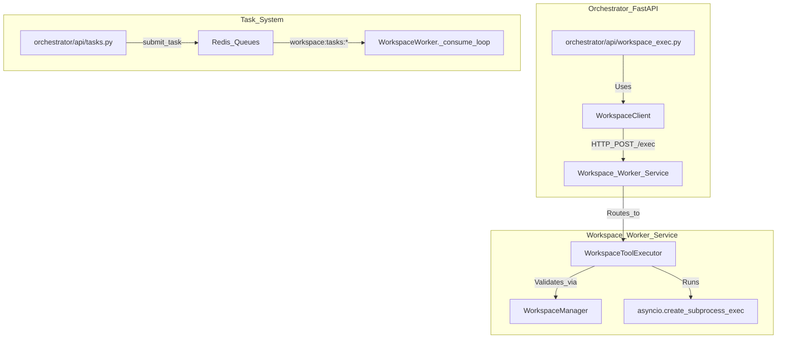
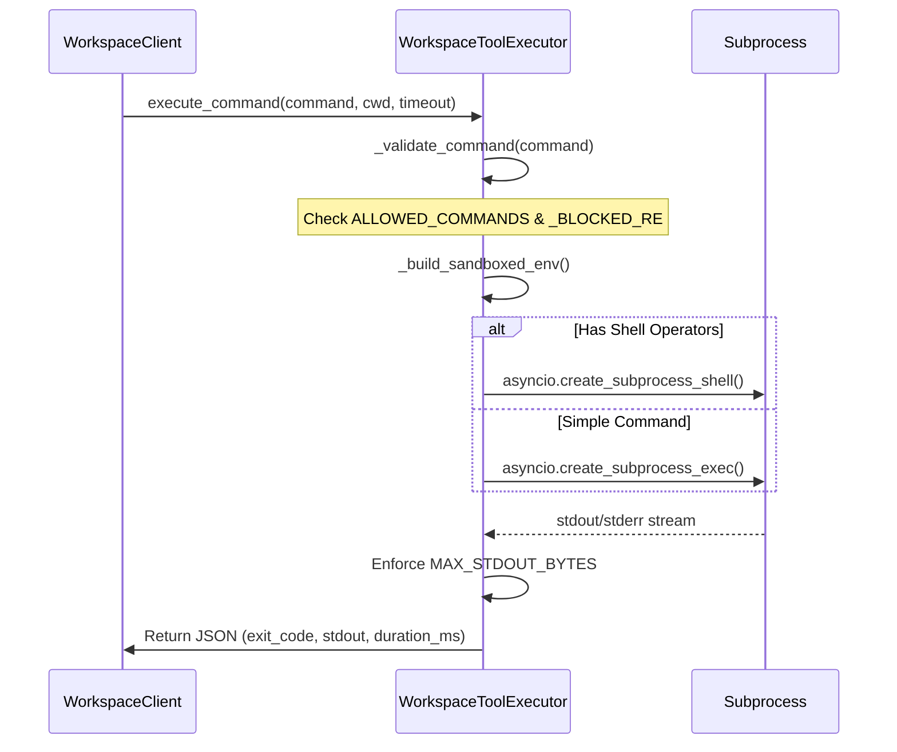

# File Operations & Command Execution

Relevant source files

The following files were used as context for generating this wiki page:

- [frontend/components/widgets/CodingCanvasWidget/RepoSelector.tsx](frontend/components/widgets/CodingCanvasWidget/RepoSelector.tsx)
- [frontend/components/widgets/TerminalWidget/InteractiveTerminal.tsx](frontend/components/widgets/TerminalWidget/InteractiveTerminal.tsx)
- [frontend/components/widgets/TerminalWidget/index.tsx](frontend/components/widgets/TerminalWidget/index.tsx)
- [orchestrator/api/workspace_exec.py](orchestrator/api/workspace_exec.py)
- [orchestrator/api/workspace_github.py](orchestrator/api/workspace_github.py)
- [orchestrator/core/workspace_client.py](orchestrator/core/workspace_client.py)
- [orchestrator/modules/tools/discovery/workspace_actions.py](orchestrator/modules/tools/discovery/workspace_actions.py)
- [orchestrator/modules/tools/execution/exec_workspace.py](orchestrator/modules/tools/execution/exec_workspace.py)
- [services/workspace-worker/Dockerfile](services/workspace-worker/Dockerfile)
- [services/workspace-worker/entrypoint.sh](services/workspace-worker/entrypoint.sh)
- [services/workspace-worker/executor.py](services/workspace-worker/executor.py)
- [services/workspace-worker/main.py](services/workspace-worker/main.py)
- [services/workspace-worker/requirements.txt](services/workspace-worker/requirements.txt)

The Workspace Execution subsystem provides a secure, sandboxed environment for AI agents and users to interact with a physical filesystem and execute shell commands. This is primarily facilitated by the `WorkspaceWorker` service, which acts as the execution engine, and the `WorkspaceClient`, which serves as the proxy layer between the central orchestrator and the worker.

## Workspace Execution Architecture

The system uses a proxied architecture where the main FastAPI backend (Orchestrator) does not execute code directly. Instead, it forwards requests to a specialized `workspace-worker` service that has the persistent workspace volumes mounted.

### Data Flow: Orchestrator to Worker

1.  **Request Initiation**: A user via the `InteractiveTerminal` [frontend/components/widgets/TerminalWidget/InteractiveTerminal.tsx:43-43]() or an agent via a tool call triggers a file or command operation.
2.  **Proxy Layer**: The `WorkspaceClient` [orchestrator/core/workspace_client.py:56-65]() constructs a request to the internal worker URL [orchestrator/core/workspace_client.py:42-44]().
3.  **HTTP Bridge**: The request is received by the worker's HTTP server (proxied through `api/workspace_exec.py` [orchestrator/api/workspace_exec.py:31-36]() or `api/workspace_files.py`).
4.  **Execution**: The `WorkspaceToolExecutor` [services/workspace-worker/executor.py:108-116]() validates the command and executes it within the specific workspace directory.

### Code Entity Map: Execution Proxy

This diagram maps the high-level NL concepts to the specific classes and files responsible for proxying execution.

Sources: [orchestrator/api/workspace_exec.py:41-46](), [orchestrator/core/workspace_client.py:56-65](), [services/workspace-worker/executor.py:108-116](), [services/workspace-worker/main.py:148-158]()

## File Operations

File operations are exposed via the `WorkspaceClient` and handled by the worker's filesystem manager. These operations are registered as agent tools in the `ActionRegistry` [orchestrator/modules/tools/discovery/workspace_actions.py:15-18]().

### Key Operations
*   **`list_dir(path)`**: Returns a listing of files and directories. It handles 404s by returning an empty list [orchestrator/core/workspace_client.py:96-108]().
*   **`read_file(path)`**: Retrieves the text content of a file for display in the code viewer [orchestrator/core/workspace_client.py:68-80]().
*   **`write_file(path, content)`**: Creates or overwrites files. This is used by agents to fix bugs or update code [orchestrator/core/workspace_client.py:82-94](). Freshly written files are automatically registered as deliverables via `_auto_register_deliverable` [orchestrator/modules/tools/execution/exec_workspace.py:43-56]().
*   **`download_file(path)`**: Downloads raw binary content from the workspace [orchestrator/core/workspace_client.py:110-126]().
*   **`grep(pattern, path)`**: Searches for regex patterns across files using the worker's search capabilities [orchestrator/core/workspace_client.py:130-150]().

### Path Safety Validation
The `WorkspaceManager` ensures that all operations are contained. Any path provided is resolved via `resolve_safe_path` to prevent path traversal attacks. The `WorkspaceToolExecutor` calls this before any execution [services/workspace-worker/executor.py:154-157]().

Sources: [orchestrator/core/workspace_client.py:66-150](), [services/workspace-worker/executor.py:154-157](), [orchestrator/modules/tools/execution/exec_workspace.py:43-56]()

## Command Execution

The `WorkspaceToolExecutor` is the security boundary for shell commands. It enforces strict constraints on what an AI agent or user can run.

### Security Constraints
| Feature | Implementation |
| :--- | :--- |
| **Command Whitelist** | Only ~70 approved binaries (e.g., `git`, `python`, `ls`, `npm`, `uv`, `cargo`, `rustc`) are allowed [services/workspace-worker/executor.py:35-73](). |
| **Blocked Patterns** | Regex checks block dangerous patterns like `rm -rf /`, `sudo`, `chmod 777`, or backtick execution [services/workspace-worker/executor.py:76-95](). |
| **Output Limits** | `stdout` is capped at 100KB (`MAX_STDOUT_BYTES`) and `stderr` at 50KB (`MAX_STDERR_BYTES`) [services/workspace-worker/executor.py:101-102](). |
| **Timeouts** | Default 120s timeout [services/workspace-worker/executor.py:105-105](), capped at 300s via API [orchestrator/api/workspace_exec.py:28-28]() and 600s via client [orchestrator/core/workspace_client.py:162-162](). |
| **Environment** | Commands run with a sandboxed environment where `PATH` is restricted [services/workspace-worker/executor.py:163-163](). |

### Execution Flow in Worker

Sources: [services/workspace-worker/executor.py:122-198](), [orchestrator/core/workspace_client.py:153-171](), [services/workspace-worker/executor.py:167-184]()

## GitHub Integration & Cloning

Workspaces support cloning repositories via Composio-backed actions [orchestrator/api/workspace_github.py:133-138]().

### Cloning Workflow
1.  **Repo Selection**: Users select a repo via the `RepoSelector` frontend component which calls the `/repos` endpoint [orchestrator/api/workspace_github.py:113-118]().
2.  **Clone Request**: The `/clone` endpoint validates the HTTPS URL and branch name [orchestrator/api/workspace_github.py:85-108]().
3.  **Worker Execution**: The repository is cloned into the workspace volume under the `repos/` directory. Agents can auto-detect these directories using `resolve_repo_dir` [orchestrator/modules/tools/execution/exec_workspace.py:163-180]().

Sources: [orchestrator/api/workspace_github.py:81-185](), [orchestrator/modules/tools/execution/exec_workspace.py:163-180]()

## Security & Quotas

The `WorkspaceWorker` and its environment enforce resource limits and access control.

*   **Storage Quotas**: Each workspace has a default quota of 5GB [services/workspace-worker/Dockerfile:57-57]().
*   **Isolated Environment**: The worker runs as a non-root `worker` user (UID 1000) [services/workspace-worker/Dockerfile:33-35](). The `entrypoint.sh` script ensures the mounted volumes are owned by this user [services/workspace-worker/entrypoint.sh:6-9]().
*   **Worker Concurrency**: The worker limits simultaneous task execution via an internal semaphore, defaulting to 3 concurrent tasks [services/workspace-worker/main.py:72-78]().
*   **Authentication**: Internal communication between the Orchestrator and Worker is secured via an `X-Internal-Token` [orchestrator/core/workspace_client.py:33-34]().

Sources: [services/workspace-worker/Dockerfile:33-60](), [services/workspace-worker/main.py:70-79](), [orchestrator/core/workspace_client.py:33-34](), [services/workspace-worker/entrypoint.sh:1-12]()

## API Reference Summary

### Workspace Exec API (`/api/workspaces/{workspace_id}/exec`)
*   **`POST /`**: Proxies interactive terminal commands. Accepts `command`, `cwd`, and `timeout` [orchestrator/api/workspace_exec.py:31-52]().

### Workspace GitHub API (`/api/workspaces/{workspace_id}/github`)
*   **`GET /repos`**: Lists accessible GitHub repositories via Composio [orchestrator/api/workspace_github.py:113-120]().
*   **`POST /clone`**: Initiates a repository clone into the workspace [orchestrator/api/workspace_github.py:185-191]().

### Worker Internal API
*   **`GET /files`**: List directory contents [orchestrator/core/workspace_client.py:96-101]().
*   **`GET /files/content`**: Retrieve file text [orchestrator/core/workspace_client.py:68-71]().
*   **`POST /files/write`**: Write content to a file [orchestrator/core/workspace_client.py:82-85]().
*   **`POST /exec`**: Run a sandboxed command [orchestrator/core/workspace_client.py:153-161]().

Sources: [orchestrator/api/workspace_exec.py:19-53](), [orchestrator/api/workspace_github.py:31-191](), [orchestrator/core/workspace_client.py:66-171]()

---