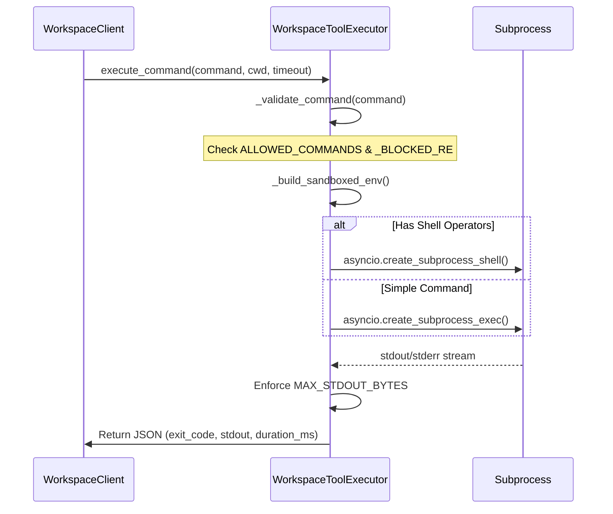
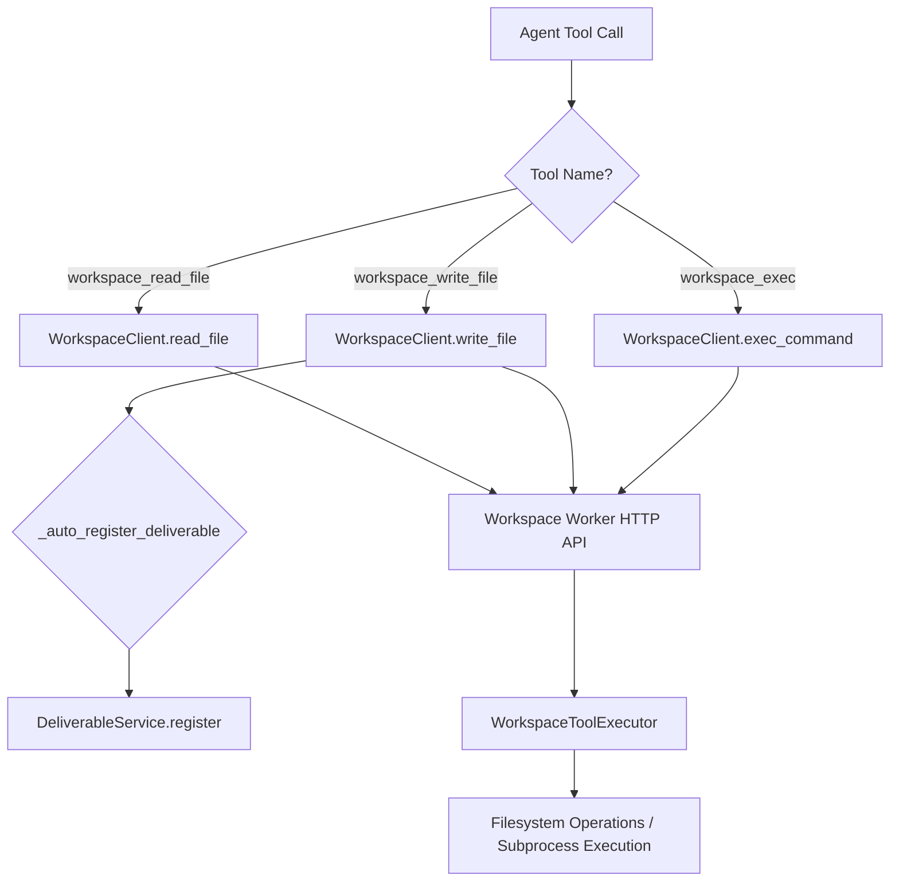

# File Operations & Command Execution

Relevant source files

The following files were used as context for generating this wiki page:

- [frontend/components/deliverables/deliverable-artwork.tsx](frontend/components/deliverables/deliverable-artwork.tsx)
- [frontend/components/icons/deliverable-icon.tsx](frontend/components/icons/deliverable-icon.tsx)
- [frontend/components/widgets/TerminalWidget/InteractiveTerminal.tsx](frontend/components/widgets/TerminalWidget/InteractiveTerminal.tsx)
- [frontend/components/widgets/TerminalWidget/index.tsx](frontend/components/widgets/TerminalWidget/index.tsx)
- [frontend/components/workspace/gallery-view/deliverable-card.tsx](frontend/components/workspace/gallery-view/deliverable-card.tsx)
- [frontend/components/workspace/gallery-view/deliverable-row.tsx](frontend/components/workspace/gallery-view/deliverable-row.tsx)
- [frontend/components/workspace/gallery-view/filter-bar.tsx](frontend/components/workspace/gallery-view/filter-bar.tsx)
- [orchestrator/api/workspace_files.py](orchestrator/api/workspace_files.py)
- [orchestrator/core/workspace_client.py](orchestrator/core/workspace_client.py)
- [orchestrator/modules/tools/discovery/canvas_git.py](orchestrator/modules/tools/discovery/canvas_git.py)
- [orchestrator/modules/tools/discovery/workspace_actions.py](orchestrator/modules/tools/discovery/workspace_actions.py)
- [orchestrator/modules/tools/execution/exec_workspace.py](orchestrator/modules/tools/execution/exec_workspace.py)
- [orchestrator/tests/test_prd170_canvas_git.py](orchestrator/tests/test_prd170_canvas_git.py)
- [orchestrator/tests/test_prd170_canvas_session_manager.py](orchestrator/tests/test_prd170_canvas_session_manager.py)
- [orchestrator/tests/test_prd203_cs8_worker_auth.py](orchestrator/tests/test_prd203_cs8_worker_auth.py)
- [services/workspace-worker/Dockerfile](services/workspace-worker/Dockerfile)
- [services/workspace-worker/canvas_confinement.py](services/workspace-worker/canvas_confinement.py)
- [services/workspace-worker/canvas_session_service.py](services/workspace-worker/canvas_session_service.py)
- [services/workspace-worker/entrypoint.sh](services/workspace-worker/entrypoint.sh)
- [services/workspace-worker/executor.py](services/workspace-worker/executor.py)
- [services/workspace-worker/main.py](services/workspace-worker/main.py)
- [services/workspace-worker/requirements.txt](services/workspace-worker/requirements.txt)
- [services/workspace-worker/worker_config.py](services/workspace-worker/worker_config.py)
- [services/workspace-worker/workspace_manager.py](services/workspace-worker/workspace_manager.py)

The Workspace Execution subsystem provides a secure, sandboxed environment for AI agents and users to interact with a physical filesystem and execute shell commands. This is primarily facilitated by the `WorkspaceWorker` service, which acts as the execution engine, and the `WorkspaceClient`, which serves as the proxy layer between the central orchestrator and the worker.

## Workspace Execution Architecture

The system uses a proxied architecture where the main FastAPI backend (Orchestrator) does not execute code directly. Instead, it forwards requests to a specialized `workspace-worker` service that has the persistent workspace volumes mounted.

### Data Flow: Orchestrator to Worker

1.  **Request Initiation**: A user via the `InteractiveTerminal` [frontend/components/widgets/TerminalWidget/InteractiveTerminal.tsx:43-43]() or an agent via a tool call triggers a file or command operation.
2.  **Proxy Layer**: The `WorkspaceClient` [orchestrator/core/workspace_client.py:56-64]() constructs a request to the internal worker URL defined in `config.WORKER_INTERNAL_URL` [orchestrator/core/workspace_client.py:42-44]().
3.  **HTTP Bridge**: The request is received by the worker's HTTP server (proxied through `api/workspace_files.py` [orchestrator/api/workspace_files.py:9-11]()).
4.  **Execution**: The `WorkspaceToolExecutor` [services/workspace-worker/executor.py:108-113]() validates the command and executes it within the specific workspace directory.

### Code Entity Map: Execution Proxy

This diagram maps the high-level NL concepts to the specific classes and files responsible for proxying execution.

Sources: [orchestrator/api/workspace_files.py:58-63](), [orchestrator/core/workspace_client.py:56-64](), [services/workspace-worker/executor.py:108-116](), [services/workspace-worker/main.py:151-182]()

## File Operations

File operations are exposed via the `WorkspaceClient` and handled by the worker's filesystem manager. 

### Backend Routing
The system supports two storage backends. The `_select_client` helper [orchestrator/api/workspace_files.py:58-63]() routes requests:
*   **`DbWorkspaceClient`**: Handles paths prefixed with `graph/`, persisting artifacts to Postgres for wizard-created workspaces [orchestrator/api/workspace_files.py:55-62]().
*   **`WorkspaceClient`**: Handles standard filesystem operations by proxying to the worker over HTTP [orchestrator/api/workspace_files.py:63-63]().

### Key Operations
*   **`list_dir(path)`**: Returns a listing of files and directories. It handles 404s by returning an empty list [orchestrator/core/workspace_client.py:96-108]().
*   **`read_file(path)`**: Retrieves the text content of a file for display in the code viewer [orchestrator/core/workspace_client.py:68-80]().
*   **`write_file(path, content)`**: Creates or overwrites files. This is used by agents to fix bugs or update code [orchestrator/core/workspace_client.py:82-94]().
*   **`download_file(path)`**: Downloads raw binary content from the workspace for previews (PDF, images) [orchestrator/core/workspace_client.py:110-126]().
*   **`grep(pattern, path)`**: Searches for regex patterns across files using the worker's search capabilities [orchestrator/core/workspace_client.py:130-150]().

### Path Safety Validation
The `WorkspaceManager` ensures that all operations are contained. Any path provided is resolved via `resolve_safe_path` to prevent path traversal attacks [services/workspace-worker/workspace_manager.py:48-49](). The `WorkspaceToolExecutor` calls this before any execution [services/workspace-worker/executor.py:115-116]().

Sources: [orchestrator/core/workspace_client.py:66-150](), [services/workspace-worker/executor.py:115-116](), [services/workspace-worker/workspace_manager.py:48-54](), [orchestrator/api/workspace_files.py:58-63]()

## Command Execution

The `WorkspaceToolExecutor` is the security boundary for shell commands. It enforces strict constraints on what an AI agent can run.

### Security Constraints
| Feature | Implementation |
| :--- | :--- |
| **Command Whitelist** | Only approved binaries (e.g., `git`, `python`, `ls`, `npm`, `uv`, `cargo`, `rustc`) are allowed [services/workspace-worker/executor.py:35-73](). |
| **Blocked Patterns** | Regex checks block dangerous patterns like `rm -rf /`, `sudo`, `chmod 777`, or backtick execution [services/workspace-worker/executor.py:76-95](). |
| **Output Limits** | `stdout` is capped at 100KB (`MAX_STDOUT_BYTES`) and `stderr` at 50KB (`MAX_STDERR_BYTES`) [services/workspace-worker/executor.py:101-102](). |
| **Timeouts** | Default 120s timeout, configurable via API [services/workspace-worker/executor.py:105-105](), [orchestrator/core/workspace_client.py:157-157](). |
| **Environment** | Commands run with a sandboxed environment where `PATH` is restricted [services/workspace-worker/executor.py:162-163]().

### Execution Flow in Worker

Sources: [services/workspace-worker/executor.py:122-192](), [orchestrator/core/workspace_client.py:153-171](), [services/workspace-worker/executor.py:175-192]()

## Workspace Actions and `exec_workspace` Tools

AI agents interact with the workspace through a set of defined tools, which are registered as `ActionDefinition` objects. These tools abstract the underlying file operations and command execution, providing a structured interface for agents.

### Workspace Action Definitions
The `register_workspace_actions` function [orchestrator/modules/tools/discovery/workspace_actions.py:15-15]() registers several actions:
*   **`workspace_read_file`**: Reads file content [orchestrator/modules/tools/discovery/workspace_actions.py:18-51]().
*   **`workspace_write_file`**: Writes or creates files [orchestrator/modules/tools/discovery/workspace_actions.py:53-90]().
*   **`workspace_list_dir`**: Lists directory contents [orchestrator/modules/tools/discovery/workspace_actions.py:92-121]().
*   **`workspace_grep`**: Searches for patterns in files [orchestrator/modules/tools/discovery/workspace_actions.py:123-161]().
*   **`workspace_exec`**: Executes a sandboxed shell command [orchestrator/modules/tools/discovery/workspace_actions.py:163-175]().

These actions are categorized under `workspace_files` or `workspace_exec` and have defined `permission_level` (read/write) and `promoted` status.

### `exec_workspace` Tool Execution
The `execute_workspace_action` function [orchestrator/modules/tools/execution/exec_workspace.py:183-185]() is responsible for executing these workspace tools. It uses the `WorkspaceClient` to proxy the requests to the `workspace-worker`.

A key feature is the automatic registration of deliverables. When `workspace_write_file` is called, `_auto_register_deliverable` [orchestrator/modules/tools/execution/exec_workspace.py:43-119]() attempts to register the newly written file as a deliverable if its `artifact_type` is agent-registerable. This ensures that agent-generated outputs are visible in the Outputs Hub.

Sources: [orchestrator/modules/tools/discovery/workspace_actions.py:12-175](), [orchestrator/modules/tools/execution/exec_workspace.py:43-119](), [orchestrator/modules/tools/execution/exec_workspace.py:183-185]()

## GitHub Integration & Canvas Git

Workspaces support advanced git operations, specifically for the "Code Canvas" feature which uses a branch-per-session model [orchestrator/modules/tools/discovery/canvas_git.py:1-7]().

### Canvas Git Logic
*   **Branch Naming**: Sessions use the `canvas/<session-id>` naming convention, with automatic slugification for safety [orchestrator/modules/tools/discovery/canvas_git.py:37-45]().
*   **Commit Generation**: The system generates editable conventional-commit messages based on changed paths (e.g., `docs:` for README changes) [orchestrator/modules/tools/discovery/canvas_git.py:117-144]().
*   **Token Redaction**: To prevent credential leaks, the system uses regex to strip GitHub tokens from logs and command outputs [orchestrator/modules/tools/discovery/canvas_git.py:48-62]().
*   **Remote Validation**: Git remotes are validated against a strict regex to prevent command injection through malicious remote URLs [orchestrator/modules/tools/discovery/canvas_git.py:155-168]().

Sources: [orchestrator/modules/tools/discovery/canvas_git.py:1-185](), [orchestrator/tests/test_prd170_canvas_git.py:35-125]()

## Security & Quotas

The `WorkspaceManager` and worker configuration enforce resource limits and access control.

*   **Storage Quotas**: Each workspace has a default quota (typically 5GB) [services/workspace-worker/workspace_manager.py:37-37](). The worker calculates usage via `get_usage_bytes()` [services/workspace-worker/workspace_manager.py:97-109]().
*   **Container Security**: The worker runs as a non-root `worker` user (UID 1000) [services/workspace-worker/Dockerfile:37-39](). The `entrypoint.sh` script fixes volume ownership at runtime to ensure the worker can write to persistent mounts [services/workspace-worker/entrypoint.sh:4-9]().
*   **Authentication**: Internal communication between the orchestrator and worker is secured via an internal token [orchestrator/core/workspace_client.py:33-34]().

Sources: [services/workspace-worker/workspace_manager.py:37-109](), [services/workspace-worker/Dockerfile:36-39](), [services/workspace-worker/entrypoint.sh:1-12](), [orchestrator/core/workspace_client.py:28-39]()

## API Reference Summary

### Workspace File API (`/api/workspaces/{workspace_id}`)
*   **`GET /files`**: List directory contents. Proxies to worker or DB backend [orchestrator/api/workspace_files.py:69-86]().
*   **`GET /files/content`**: Get file text for the code viewer [orchestrator/api/workspace_files.py:92-109]().
*   **`PUT /files/content`**: Write or create a file [orchestrator/api/workspace_files.py:148-165]().
*   **`POST /exec`**: Execute a shell command [orchestrator/api/workspace_files.py:11-11]().

### Canvas Session API
*   **`POST /canvas/sessions`**: Start or resume a headless Claude Agent SDK session [orchestrator/api/workspace_files.py:12-12]().
*   **`GET /canvas/events`**: SSE proxy for canvas session events (approvals, edits) [orchestrator/api/workspace_files.py:39-42]().

Sources: [orchestrator/api/workspace_files.py:1-165](), [orchestrator/core/workspace_client.py:68-171](), [services/workspace-worker/canvas_session_service.py:138-154]()

---