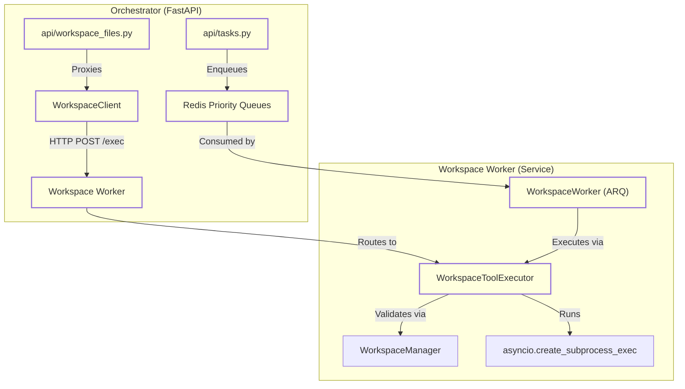
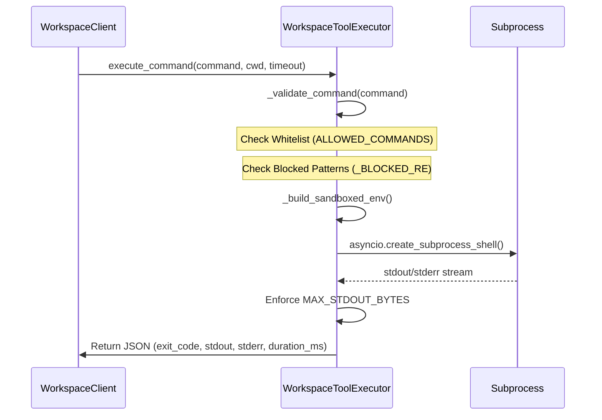

# File Operations & Command Execution

Relevant source files

The following files were used as context for generating this wiki page:

- [frontend/components/widgets/CodingCanvasWidget/RepoSelector.tsx](frontend/components/widgets/CodingCanvasWidget/RepoSelector.tsx)
- [orchestrator/api/main.py](orchestrator/api/main.py)
- [orchestrator/api/tasks.py](orchestrator/api/tasks.py)
- [orchestrator/api/widgets/cors.py](orchestrator/api/widgets/cors.py)
- [orchestrator/api/widgets/rate_limit.py](orchestrator/api/widgets/rate_limit.py)
- [orchestrator/api/workspace_files.py](orchestrator/api/workspace_files.py)
- [orchestrator/api/workspace_github.py](orchestrator/api/workspace_github.py)
- [orchestrator/core/workspace_client.py](orchestrator/core/workspace_client.py)
- [orchestrator/modules/tools/discovery/workspace_actions.py](orchestrator/modules/tools/discovery/workspace_actions.py)
- [services/workspace-worker/executor.py](services/workspace-worker/executor.py)
- [services/workspace-worker/main.py](services/workspace-worker/main.py)
- [services/workspace-worker/workspace_manager.py](services/workspace-worker/workspace_manager.py)

The Workspace Execution subsystem provides a secure, sandboxed environment for AI agents and users to interact with a physical filesystem and execute shell commands. This is primarily facilitated by the `WorkspaceWorker` service, which acts as the execution engine, and the `WorkspaceClient`, which serves as the proxy layer between the central orchestrator and the worker.

## Workspace Execution Architecture

The system uses a proxied architecture where the main FastAPI backend (Orchestrator) does not execute code directly. Instead, it forwards requests to a specialized `workspace-worker` service that has the persistent workspace volumes mounted.

### Data Flow: Orchestrator to Worker

1.  **Request Initiation**: A user via the `CodingCanvasWidget` or an agent via a tool call (e.g., `workspace_exec`) triggers a file or command operation.
2.  **Proxy Layer**: The `WorkspaceClient` [orchestrator/core/workspace_client.py:56-65]() constructs a request to the internal worker URL [orchestrator/core/workspace_client.py:42-44]().
3.  **HTTP Bridge**: The request is received by the worker's HTTP server (proxied through `api/workspace_files.py` [orchestrator/api/workspace_files.py:1-12]()).
4.  **Execution**: The `WorkspaceToolExecutor` [services/workspace-worker/executor.py:108-116]() validates the command and executes it within the specific workspace directory.

### Code Entity Map: Execution Proxy

This diagram maps the high-level Natural Language concepts to the specific classes and files responsible for proxying execution.

Sources: [orchestrator/api/workspace_files.py:21-21](), [orchestrator/core/workspace_client.py:56-65](), [services/workspace-worker/executor.py:108-116](), [orchestrator/api/tasks.py:127-151](), [services/workspace-worker/main.py:58-67]()

## File Operations

File operations are exposed via the `WorkspaceClient` and handled by the worker's filesystem manager.

### Directory Listing & Content
*   **`list_dir(path)`**: Returns a recursive or flat listing of files. It handles 404s gracefully by returning an empty list [orchestrator/core/workspace_client.py:96-108]().
*   **`read_file(path)`**: Retrieves the text content of a file for display in the `CodingCanvasWidget` [orchestrator/core/workspace_client.py:68-80]().
*   **`write_file(path, content)`**: Creates or overwrites files. This is used by agents to save code artifacts [orchestrator/core/workspace_client.py:82-94]().
*   **`download_file(path)`**: Downloads raw binary content from the workspace [orchestrator/core/workspace_client.py:110-126]().
*   **`grep(pattern, path)`**: Searches for regex patterns across files using the worker's search capabilities [orchestrator/core/workspace_client.py:130-149]().

### Path Safety Validation
The `WorkspaceManager` (utilized by the executor) ensures that all file operations are "contained." Any path provided is resolved via `resolve_safe_path` to prevent path traversal attacks [services/workspace-worker/workspace_manager.py:44-45](), [services/workspace-worker/executor.py:146-152]().

Sources: [orchestrator/core/workspace_client.py:66-126](), [services/workspace-worker/executor.py:146-152](), [services/workspace-worker/workspace_manager.py:36-45]()

## Command Execution

The `WorkspaceToolExecutor` is the security boundary for shell commands. It enforces strict constraints on what an AI agent can run.

### Security Constraints
| Feature | Implementation |
| :--- | :--- |
| **Command Whitelist** | Only 70+ approved binaries (e.g., `git`, `python`, `ls`, `npm`, `uv`, `cargo`, `rustc`, `go`) are allowed [services/workspace-worker/executor.py:35-73](). |
| **Blocked Patterns** | Regex checks block dangerous patterns like `rm -rf /`, `sudo`, `chmod 777`, `kubectl`, or backtick execution [services/workspace-worker/executor.py:76-95](). |
| **Output Limits** | `stdout` is capped at 100KB (`MAX_STDOUT_BYTES`) and `stderr` at 50KB (`MAX_STDERR_BYTES`) [services/workspace-worker/executor.py:101-102](). |
| **Timeouts** | Default 120s timeout, configurable up to 300s via API [services/workspace-worker/executor.py:105-105](), [orchestrator/api/workspace_files.py:83-83](). |
| **Environment** | Commands run with a sandboxed environment where `PATH` is restricted [services/workspace-worker/executor.py:155-155](). |

### Execution Flow in Worker

Sources: [services/workspace-worker/executor.py:122-198](), [orchestrator/core/workspace_client.py:153-171](), [services/workspace-worker/executor.py:35-98]()

## GitHub Integration & Cloning

Workspaces support cloning repositories via the `GITHUB_LIST_REPOSITORIES_FOR_THE_AUTHENTICATED_USER` action through Composio [orchestrator/api/workspace_github.py:117-122]().

### Cloning Workflow
1.  **Repo Selection**: Users select a repo via the `RepoSelector` frontend component [frontend/components/widgets/CodingCanvasWidget/RepoSelector.tsx:39-44]().
2.  **Task Submission**: The `clone_github_repo` endpoint submits a task to the `queued` task runner [orchestrator/api/workspace_github.py:168-185]().
3.  **Worker Execution**: The `WorkspaceWorker` dequeues the task from Redis [services/workspace-worker/main.py:180-193]() and uses `git clone` within the workspace's `repos/` directory [services/workspace-worker/workspace_manager.py:62-63]().

Sources: [orchestrator/api/workspace_github.py:97-185](), [frontend/components/widgets/CodingCanvasWidget/RepoSelector.tsx:39-88](), [services/workspace-worker/workspace_manager.py:58-77](), [services/workspace-worker/main.py:180-193]()

## Security & Quotas

The `WorkspaceManager` enforces resource limits to prevent workspace abuse.

*   **Storage Quotas**: Each workspace has a default quota (e.g., 5GB) [services/workspace-worker/workspace_manager.py:33-33](). The worker checks `check_quota()` before operations [services/workspace-worker/workspace_manager.py:97-106]().
*   **Rate Limiting**: The `WidgetRateLimitMiddleware` applies per-API-key rate limiting to widget endpoints, defaulting to 30 req/min for public keys and 1000 req/min for server keys [orchestrator/api/widgets/rate_limit.py:37-39]().
*   **CORS Protection**: `WidgetCORSMiddleware` restricts access to widget APIs based on an origin allowlist [orchestrator/api/widgets/cors.py:19-21]().

Sources: [services/workspace-worker/workspace_manager.py:32-106](), [orchestrator/api/widgets/rate_limit.py:33-40](), [orchestrator/api/widgets/cors.py:19-33]()

## API Reference Summary

### Workspace File API (`/api/workspaces/{workspace_id}`)
*   **`GET /files`**: List directory contents. Proxies to worker via `WorkspaceClient.list_dir` [orchestrator/api/workspace_files.py:34-52]().
*   **`GET /files/content`**: Get raw file text via `WorkspaceClient.read_file` [orchestrator/api/workspace_files.py:57-74]().
*   **`POST /exec`**: Execute a command. Accepts `command`, `cwd`, and `timeout` [orchestrator/api/workspace_files.py:86-107]().

### Workspace Task API (`/api/tasks`)
*   **`POST /submit`**: Directly enqueues a series of `TaskStep` objects (commands, file ops, git ops) to the Redis priority queues (`workspace:tasks:critical`, etc.) [orchestrator/api/tasks.py:62-100]().
*   **`GET /{id}/events`**: SSE stream for real-time output from running tasks [orchestrator/api/tasks.py:11-11]().

### Workspace GitHub API (`/api/workspaces/{workspace_id}/github`)
*   **`GET /repos`**: List accessible GitHub repositories using Composio entity management [orchestrator/api/workspace_github.py:97-161]().
*   **`POST /clone`**: Initiates a background task to clone a repository into the workspace [orchestrator/api/workspace_github.py:167-185]().

Sources: [orchestrator/api/workspace_files.py:1-12](), [orchestrator/api/tasks.py:33-173](), [orchestrator/api/workspace_github.py:31-185]()

---