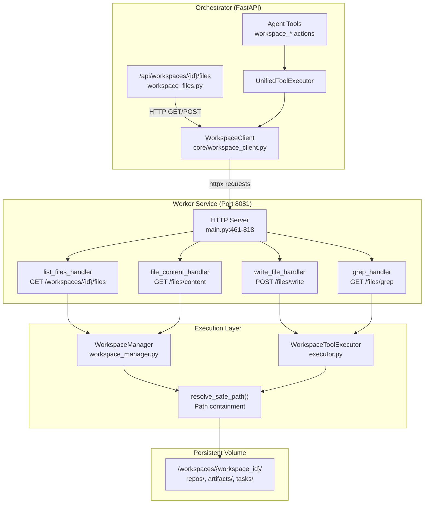
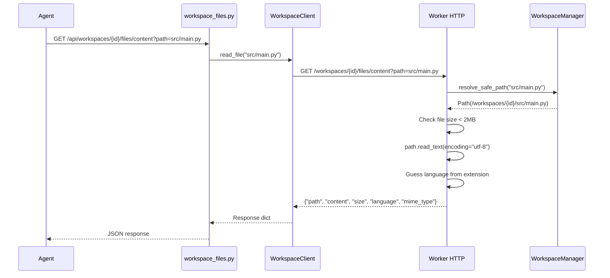
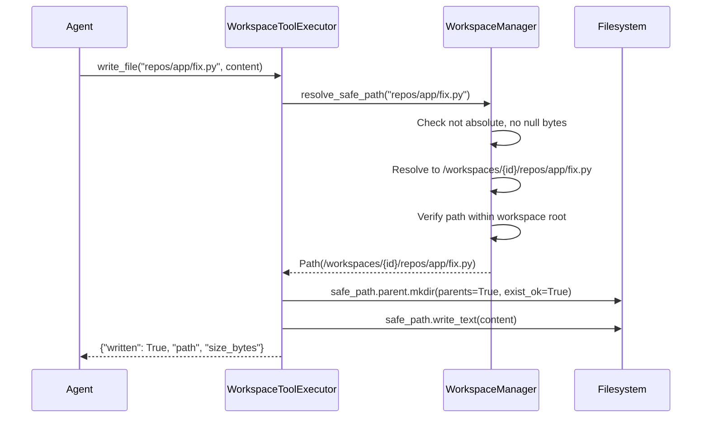
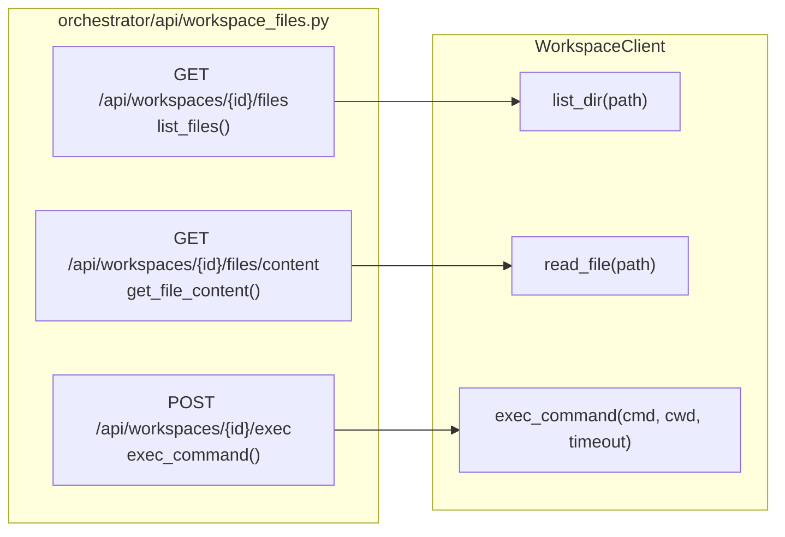
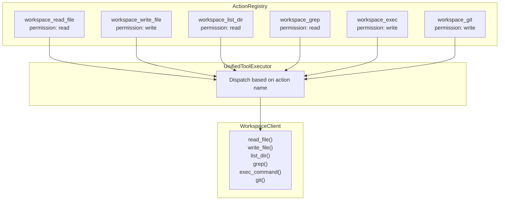
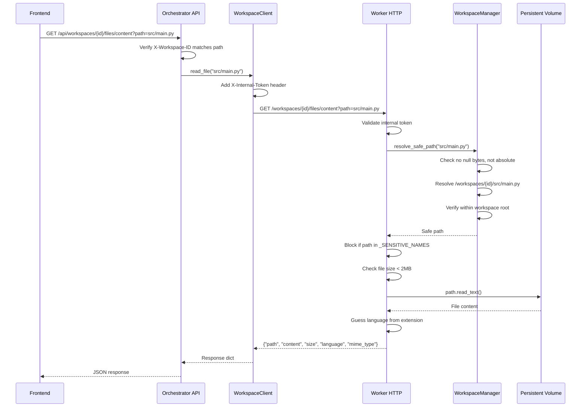

# File Operations

<details>
<summary>Relevant source files</summary>

The following files were used as context for generating this wiki page:

- [frontend/components/widgets/CodingCanvasWidget/RepoSelector.tsx](frontend/components/widgets/CodingCanvasWidget/RepoSelector.tsx)
- [orchestrator/api/tasks.py](orchestrator/api/tasks.py)
- [orchestrator/api/widgets/cors.py](orchestrator/api/widgets/cors.py)
- [orchestrator/api/widgets/rate_limit.py](orchestrator/api/widgets/rate_limit.py)
- [orchestrator/api/workspace_files.py](orchestrator/api/workspace_files.py)
- [orchestrator/api/workspace_github.py](orchestrator/api/workspace_github.py)
- [orchestrator/core/workspace_client.py](orchestrator/core/workspace_client.py)
- [orchestrator/modules/tools/discovery/action_registry.py](orchestrator/modules/tools/discovery/action_registry.py)
- [orchestrator/modules/tools/discovery/workspace_actions.py](orchestrator/modules/tools/discovery/workspace_actions.py)
- [services/workspace-worker/executor.py](services/workspace-worker/executor.py)
- [services/workspace-worker/main.py](services/workspace-worker/main.py)
- [services/workspace-worker/workspace_manager.py](services/workspace-worker/workspace_manager.py)

</details>


File operations enable agents and users to interact with files stored in workspace directories on the persistent volume. This includes reading source code, writing new files, listing directory contents, and searching file patterns. All file access is workspace-scoped and subject to path safety validation to prevent directory traversal attacks.

For command execution within workspaces, see [Command Execution](#9.4). For GitHub repository cloning, see [GitHub Integration](#9.2). For overall workspace architecture, see [Workspace Worker Architecture](#9.1).

---

## Purpose & Scope

File operations provide:
- **Read access** to files for code review and analysis
- **Write access** for creating/updating files (bug fixes, new features)
- **Directory listing** for exploring repository structure
- **Pattern search (grep)** for finding function definitions, TODOs, error messages
- **Path safety enforcement** to prevent escape from workspace boundaries
- **Size limits** to prevent memory exhaustion on large files

All operations are proxied through the workspace worker's HTTP API, which has direct mount access to the persistent volume at `/workspaces/{workspace_id}/`.

**Sources:** [orchestrator/api/workspace_files.py:1-108](), [services/workspace-worker/main.py:461-819](), [orchestrator/modules/tools/discovery/workspace_actions.py:1-249]()

---

## Architecture Overview



**Two-tier architecture:**
1. **Orchestrator** exposes REST APIs and hosts agent tools; forwards file requests via `WorkspaceClient`
2. **Worker** receives HTTP requests, validates paths via `WorkspaceManager.resolve_safe_path()`, executes file I/O on mounted volume

This separation keeps the orchestrator stateless (no volume mount) while the worker has persistent storage access.

**Sources:** [orchestrator/api/workspace_files.py:1-108](), [orchestrator/core/workspace_client.py:1-185](), [services/workspace-worker/main.py:461-818](), [services/workspace-worker/workspace_manager.py:228-254]()

---

## File Operation Types

### Read File

Returns file content, size, language, and MIME type. Subject to 2MB size limit (configurable via `max_file_size` in worker).

**Flow:**


**Orchestrator endpoint:** [orchestrator/api/workspace_files.py:57-74]()  
**Worker handler:** [services/workspace-worker/main.py:585-639]()  
**Size limit:** [services/workspace-worker/main.py:467]() (`max_file_size = 2 * 1024 * 1024`)

**Sources:** [orchestrator/api/workspace_files.py:57-74](), [services/workspace-worker/main.py:585-639](), [orchestrator/core/workspace_client.py:68-78]()

---

### Write File

Creates or overwrites a file. Parent directories are created automatically. Returns written path and byte size.

**Flow:**


**Executor method:** [services/workspace-worker/executor.py:254-270]()  
**Worker handler:** [services/workspace-worker/main.py:670-697]()  
**Path safety:** [services/workspace-worker/workspace_manager.py:228-253]()

**Sources:** [services/workspace-worker/executor.py:254-270](), [services/workspace-worker/main.py:670-697](), [orchestrator/core/workspace_client.py:80-92]()

---

### List Directory

Returns array of entries with `name`, `path`, `type` (file/directory), `size`, and `modified_at`. Sensitive entries (`.ssh`, `.gitconfig`, `.aws`, `.task_env_*`) are filtered out.

**Endpoint:** `GET /api/workspaces/{workspace_id}/files?path=repos/my-app/src`

**Sensitive filtering:**
```python
_SENSITIVE_NAMES = {".ssh", ".gitconfig", ".aws", ".gcp", ".workspace_meta.json"}

def _is_sensitive(name: str) -> bool:
    if name in _SENSITIVE_NAMES:
        return True
    if name.startswith(".task_env_"):  # Task credentials
        return True
    return False
```

**Sources:** [services/workspace-worker/main.py:473-481](), [services/workspace-worker/main.py:525-583]()

**Max entries:** 500 per request (configurable via `max_dir_entries`). If directory has more entries, `truncated: true` is returned.

**Sources:** [services/workspace-worker/main.py:468](), [services/workspace-worker/main.py:557-566]()

---

### Grep (Pattern Search)

Searches for regex patterns across files using the system `grep` command. Returns matches with `file`, `line`, and `content`.

**Parameters:**
- `pattern`: Regex pattern (e.g., `def handle_error`, `TODO`)
- `path`: Directory to search (default: `.` = workspace root)
- `include`: Glob filter (e.g., `*.py`, `*.ts`)
- `max_results`: Limit matches (default 50, max 200)

**Implementation:**
```bash
grep -rn --include "*.py" -- "pattern" .
```

Output is parsed into structured matches:
```json
{
  "matches": [
    {"file": "src/auth.py", "line": 42, "content": "def handle_error(msg):"},
    {"file": "tests/test_auth.py", "line": 15, "content": "# TODO: Add validation"}
  ],
  "total": 2,
  "truncated": false,
  "pattern": "TODO"
}
```

**Worker handler:** [services/workspace-worker/main.py:699-759]()  
**Grep execution:** [services/workspace-worker/main.py:720-736]()

**Sources:** [services/workspace-worker/main.py:699-759](), [orchestrator/core/workspace_client.py:110-129]()

---

## Path Safety & Security

### resolve_safe_path

All file operations go through `WorkspaceManager.resolve_safe_path()`, which enforces workspace containment:

**Checks performed:**
1. **Null byte rejection:** `\x00` in path → `SecurityError`
2. **Absolute path rejection:** Path starting with `/` → `SecurityError`
3. **Traversal prevention:** Path must resolve within workspace root
4. **Symlink resolution:** Follows symlinks, then checks containment

**Implementation:**
```python
def resolve_safe_path(self, relative_path: str) -> Path:
    if "\x00" in relative_path:
        raise SecurityError(f"Null byte in path: workspace {self.workspace_id[:8]}")
    
    if relative_path.startswith("/"):
        raise SecurityError(f"Absolute path not allowed: {relative_path}")
    
    resolved = (self.root / relative_path).resolve()
    base_resolved = self.root.resolve()
    
    try:
        resolved.relative_to(base_resolved)  # Must be child of workspace root
    except ValueError:
        raise SecurityError(
            f"Path traversal blocked: '{relative_path}' resolves outside "
            f"workspace {self.workspace_id[:8]}"
        )
    
    return resolved
```

**Sources:** [services/workspace-worker/workspace_manager.py:228-253]()

### Sensitive Path Filtering

The worker's HTTP handlers block access to credential files and workspace metadata:

| Pattern | Reason |
|---------|--------|
| `.ssh/` | SSH private keys for git authentication |
| `.gitconfig` | Git identity configuration |
| `.aws/`, `.gcp/` | Cloud provider credentials |
| `.workspace_meta.json` | Internal workspace state |
| `.task_env_{task_id}` | Task-specific environment variables |

These are filtered in directory listings ([main.py:562-563]()) and explicitly blocked when reading file content ([main.py:609-611]()).

**Sources:** [services/workspace-worker/main.py:473-481](), [services/workspace-worker/main.py:546-548](), [services/workspace-worker/main.py:609-611]()

---

## Orchestrator API Layer

### Endpoints

The orchestrator exposes three file operation endpoints that proxy to the worker:



**Authentication:** All endpoints require `get_request_context_hybrid` dependency, which validates `X-Workspace-ID` header matches request path.

**Error handling:** Worker connection failures return `503 Service Unavailable`, worker errors return status code from worker response.

**Sources:** [orchestrator/api/workspace_files.py:34-107]()

### Request/Response Models

**List Files:**
- Query param: `path` (default: `.`)
- Response: `{"path": "src", "entries": [...], "truncated": false}`

**Read File:**
- Query param: `path` (required)
- Response: `{"path", "name", "content", "size", "language", "mime_type"}`

**Exec Command:**
- Body: `{"command": "pytest", "cwd": "repos/app", "timeout": 120}`
- Response: `{"exit_code", "stdout", "stderr", "duration_ms", "truncated"}`

**Sources:** [orchestrator/api/workspace_files.py:80-84]()

---

## Worker HTTP Server

The worker runs an `aiohttp` web server on port 8081 (configurable via `WORKER_HEALTH_PORT`) with file operation endpoints.

### Authentication

Requests must include `X-Internal-Token` header if `WORKER_INTERNAL_TOKEN` is configured. Health endpoint is always public.

```python
@web.middleware
async def internal_auth_middleware(request, handler):
    if request.path == "/health":
        return await handler(request)
    if internal_token:
        req_token = request.headers.get("X-Internal-Token", "")
        if req_token != internal_token:
            return web.json_response({"error": "Unauthorized"}, status=401)
    return await handler(request)
```

**Sources:** [services/workspace-worker/main.py:502-512]()

### Language Detection

Files are tagged with Monaco-compatible language identifiers based on extension:

```python
_lang_map = {
    ".py": "python", ".js": "javascript", ".ts": "typescript",
    ".json": "json", ".yaml": "yaml", ".md": "markdown",
    ".html": "html", ".css": "css", ".sql": "sql",
    ".sh": "shell", ".rs": "rust", ".go": "go",
    # ... 25+ languages total
}

def _guess_language(filename: str) -> str:
    return _lang_map.get(Path(filename).suffix.lower(), "plaintext")
```

**Sources:** [services/workspace-worker/main.py:483-499]()

### Size and Entry Limits

| Limit | Value | Purpose |
|-------|-------|---------|
| Max file size | 2 MB | Prevent OOM when reading files |
| Max dir entries | 500 | Prevent UI hang on large directories |

When limits are exceeded:
- Files over 2MB: Return `413 Payload Too Large`
- Dirs over 500 entries: Return first 500 + `"truncated": true`

**Sources:** [services/workspace-worker/main.py:467-468](), [services/workspace-worker/main.py:619-623](), [services/workspace-worker/main.py:564-566]()

---

## WorkspaceClient

The orchestrator uses `WorkspaceClient` to make HTTP requests to the worker. A singleton `httpx.AsyncClient` is reused across the process for connection pooling.

### Client Initialization

```python
# Singleton with internal token auth
_client: Optional[httpx.AsyncClient] = None

def _get_client() -> httpx.AsyncClient:
    global _client
    if _client is None or _client.is_closed:
        headers = {}
        if config.WORKER_INTERNAL_TOKEN:
            headers["X-Internal-Token"] = config.WORKER_INTERNAL_TOKEN
        _client = httpx.AsyncClient(
            timeout=httpx.Timeout(connect=10.0, read=130.0, write=30.0, pool=10.0),
            headers=headers,
        )
    return _client
```

**Sources:** [orchestrator/core/workspace_client.py:28-39]()

### Methods

| Method | Worker Endpoint | Purpose |
|--------|----------------|---------|
| `read_file(path)` | GET `/workspaces/{id}/files/content` | Read file content |
| `write_file(path, content)` | POST `/workspaces/{id}/files/write` | Create/update file |
| `list_dir(path)` | GET `/workspaces/{id}/files` | List directory |
| `grep(pattern, path, include, max_results)` | GET `/workspaces/{id}/files/grep` | Search files |
| `exec_command(command, cwd, timeout)` | POST `/workspaces/{id}/exec` | Run shell command |
| `git(operation, cwd, args)` | POST `/workspaces/{id}/git` | Execute git operation |

**Error handling:** Connection timeouts and errors return `{"success": False, "error": "..."}` instead of raising exceptions.

**Sources:** [orchestrator/core/workspace_client.py:56-176]()

---

## Agent Tool Integration

File operations are exposed as agent tools via `workspace_actions.py`. These register with the `ActionRegistry` and appear in the LLM's function calling schema.

### Tool Definitions



**Action parameters include rich descriptions:**
- `workspace_read_file`: "Relative path to the file inside the workspace. All paths are relative to the workspace root. Repo files live under repos/ (e.g. 'repos/my-app/src/main.py')."
- `workspace_grep`: "Regex pattern to search for (e.g. 'def handle_login', 'TODO', 'import os')."

**Sources:** [orchestrator/modules/tools/discovery/workspace_actions.py:15-248]()

### Permission Levels

| Tool | Permission | Justification |
|------|-----------|---------------|
| `workspace_read_file` | `read` | No state mutation |
| `workspace_list_dir` | `read` | No state mutation |
| `workspace_grep` | `read` | No state mutation |
| `workspace_write_file` | `write` | Modifies workspace files |
| `workspace_exec` | `write` | Can modify files via commands |
| `workspace_git` | `write` | Can commit/push changes |

**Sources:** [orchestrator/modules/tools/discovery/workspace_actions.py:43-248]()

### Example Natural Language → Tool Call

**User:** "Show me the package.json file"

**LLM Tool Call:**
```json
{
  "name": "workspace_read_file",
  "arguments": {
    "path": "package.json"
  }
}
```

**User:** "Find all TODO comments in Python files"

**LLM Tool Call:**
```json
{
  "name": "workspace_grep",
  "arguments": {
    "pattern": "TODO",
    "include": "*.py",
    "max_results": 50
  }
}
```

**Sources:** [orchestrator/modules/tools/discovery/workspace_actions.py:45-49](), [orchestrator/modules/tools/discovery/workspace_actions.py:152-156]()

---

## File Size and Output Limits

### Worker Limits

Defined in [services/workspace-worker/main.py:467-468]():

```python
max_file_size = 2 * 1024 * 1024  # 2 MB
max_dir_entries = 500
```

### Executor Limits

Defined in [services/workspace-worker/executor.py:100-102]():

```python
MAX_STDOUT_BYTES = 100_000    # 100KB for command stdout
MAX_STDERR_BYTES = 50_000     # 50KB for command stderr
DEFAULT_TIMEOUT = 120         # 2 minutes for command execution
```

### Workspace Quotas

Each workspace has a storage quota (default 5GB, configurable via `WORKSPACE_DEFAULT_QUOTA_GB`). Before executing tasks, the worker checks:

```python
def check_quota(self) -> bool:
    usage = self.get_usage_bytes()
    under = usage < self.quota_bytes
    if not under:
        logger.warning(
            "Workspace %s over quota: %s / %s",
            self.workspace_id[:8], self.usage_human, self.quota_human,
        )
    return under
```

If over quota, tasks are rejected with error message directing user to free space or upgrade plan.

**Sources:** [services/workspace-worker/workspace_manager.py:98-106](), [services/workspace-worker/main.py:251-264]()

---

## File Operation Flow Summary



**Key security boundaries:**
1. **Orchestrator:** Validates workspace ownership via JWT + X-Workspace-ID
2. **Worker:** Validates internal token, resolves safe paths, blocks sensitive files
3. **Volume:** Enforces Unix permissions (workspace dirs owned by worker user)

**Sources:** [orchestrator/api/workspace_files.py:57-74](), [orchestrator/core/workspace_client.py:68-78](), [services/workspace-worker/main.py:585-639](), [services/workspace-worker/workspace_manager.py:228-253]()

---