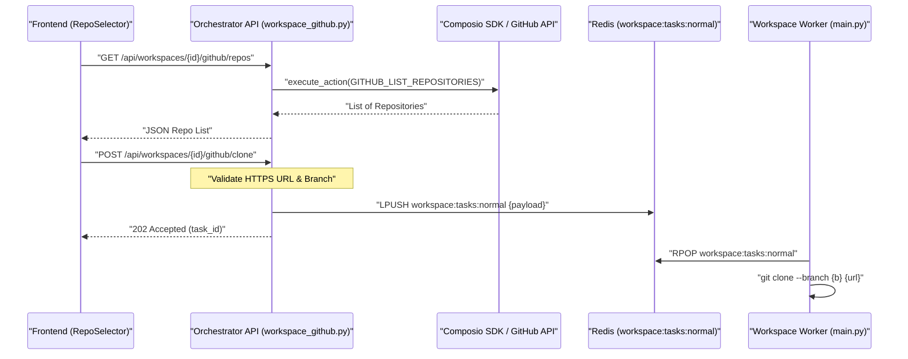
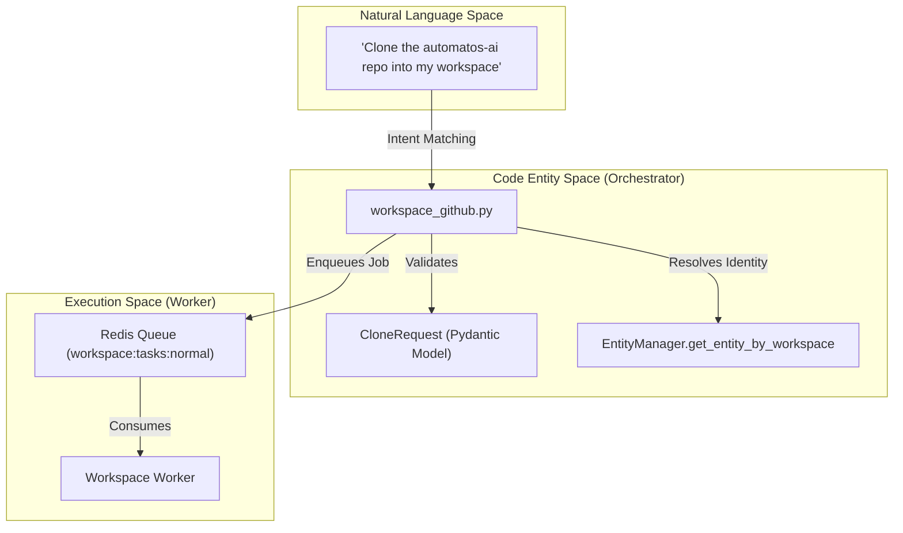

# GitHub Integration

Relevant source files

The following files were used as context for generating this wiki page:

- [orchestrator/api/context.py](orchestrator/api/context.py)
- [orchestrator/api/documents.py](orchestrator/api/documents.py)
- [orchestrator/api/github_webhooks.py](orchestrator/api/github_webhooks.py)
- [orchestrator/api/system.py](orchestrator/api/system.py)
- [orchestrator/api/workspace_github.py](orchestrator/api/workspace_github.py)
- [orchestrator/modules/rag/ingestion/contextual_annotator.py](orchestrator/modules/rag/ingestion/contextual_annotator.py)
- [orchestrator/modules/rag/ingestion/manager.py](orchestrator/modules/rag/ingestion/manager.py)
- [orchestrator/modules/rag/service.py](orchestrator/modules/rag/service.py)
- [orchestrator/modules/search/services/entity_extractor.py](orchestrator/modules/search/services/entity_extractor.py)
- [orchestrator/tests/security/test_s5_closures.py](orchestrator/tests/security/test_s5_closures.py)
- [orchestrator/tests/test_entity_extractor_no_vendor_key.py](orchestrator/tests/test_entity_extractor_no_vendor_key.py)
- [orchestrator/tests/test_p2w1_contextual_annotations.py](orchestrator/tests/test_p2w1_contextual_annotations.py)
- [orchestrator/tests/test_p2w2_tasks_lane_deleted.py](orchestrator/tests/test_p2w2_tasks_lane_deleted.py)

The GitHub Integration subsystem enables AI agents and users to interact with remote repositories directly within sandboxed workspace environments. This integration supports repository discovery, automated cloning into persistent workspace volumes, and a suite of tools for code manipulation and version control backed by the Composio SDK.

## Overview

GitHub integration is implemented as a bridge between the **Orchestrator API**, the **Workspace Worker**, and external VCS providers. It leverages the `Composio` platform to handle OAuth authentication and entity management, allowing agents to act on behalf of users with fine-grained permissions.

### Key Components
*   **`workspace_github.py`**: The primary API router for repository listing and clone task submission [orchestrator/api/workspace_github.py:32-35]().
*   **`Workspace Worker`**: An ARQ-style consumer that executes the physical `git clone` and file operations on a persistent volume [orchestrator/tests/test_p2w2_tasks_lane_deleted.py:77-81]().
*   **`RepoSelector`**: A frontend component allowing users to browse and select repositories for their workspace.
*   **`EntityManager`**: A core service that resolves Composio `entity_id` mappings for workspaces to facilitate authenticated GitHub actions [orchestrator/api/workspace_github.py:55-63]().

Sources: [orchestrator/api/workspace_github.py:32-35](), [orchestrator/api/workspace_github.py:55-63](), [orchestrator/tests/test_p2w2_tasks_lane_deleted.py:77-81]()

## Implementation & Data Flow

The integration follows a decoupled architecture where the API server manages metadata and permissions, while the worker service handles heavy I/O and shell execution.

### Repository Discovery and Cloning
When a user or agent requests a repository list, the system uses the `EntityManager` to resolve the workspace's Composio identity [orchestrator/api/workspace_github.py:59-63](). It then fetches repository metadata via the `GITHUB_LIST_REPOSITORIES_FOR_THE_AUTHENTICATED_USER` action [orchestrator/api/workspace_github.py:134-139]().

**GitHub Repository Operations Flow**

Sources: [orchestrator/api/workspace_github.py:114-140](), [orchestrator/api/workspace_github.py:186-210](), [orchestrator/tests/test_p2w2_tasks_lane_deleted.py:73-74]()

## API Reference: workspace_github.py

The GitHub integration provides two main endpoints scoped by `workspace_id`. Access is restricted to users with `workspace:manage` permissions for cloning operations [orchestrator/api/workspace_github.py:186]().

| Endpoint | Method | Description |
| :--- | :--- | :--- |
| `/api/workspaces/{id}/github/repos` | `GET` | Lists GitHub repositories accessible via the authenticated Composio entity [orchestrator/api/workspace_github.py:114-115](). |
| `/api/workspaces/{id}/github/clone` | `POST` | Enqueues a background task to clone a repository into the workspace volume [orchestrator/api/workspace_github.py:186-187](). |

### Security Validation
To prevent SSRF and injection attacks, the `CloneRequest` model enforces strict validation:
*   **Scheme**: Must be `https` [orchestrator/api/workspace_github.py:90-91]().
*   **Allowed Hosts**: Limited to `github.com`, `gitlab.com`, and `bitbucket.org` [orchestrator/api/workspace_github.py:38](), [orchestrator/api/workspace_github.py:92-93]().
*   **Credentials**: No embedded usernames or passwords allowed in the URL [orchestrator/api/workspace_github.py:94-95]().
*   **Branch**: Validated against a safe regex `^[A-Za-z0-9._/\-]+$` [orchestrator/api/workspace_github.py:41](), [orchestrator/api/workspace_github.py:106-107]().

Sources: [orchestrator/api/workspace_github.py:38](), [orchestrator/api/workspace_github.py:41](), [orchestrator/api/workspace_github.py:90-95](), [orchestrator/api/workspace_github.py:106-107](), [orchestrator/api/workspace_github.py:114-115](), [orchestrator/api/workspace_github.py:186-187]()

## Agent-Facing Workspace Tools

Agents interact with GitHub repositories using Composio-backed actions. The system ensures that if GitHub is not connected, the agent is informed via a specific error message [orchestrator/api/workspace_github.py:48-52]().

**Code Entity Mapping: Natural Language to Tool Execution**

Sources: [orchestrator/api/workspace_github.py:48-52](), [orchestrator/api/workspace_github.py:59-63](), [orchestrator/api/workspace_github.py:82-109](), [orchestrator/tests/test_p2w2_tasks_lane_deleted.py:73-74]()

## Security and Sandboxing

GitHub integration adheres to strict security boundaries. While the direct `/api/tasks` ingress has been removed to prevent ungoverned shell access [orchestrator/tests/test_p2w2_tasks_lane_deleted.py:1-7](), the GitHub clone lane remains a supported, governed background job producer [orchestrator/tests/test_p2w2_tasks_lane_deleted.py:14-15]().

### Identity Resolution
All GitHub operations require a valid Composio connection. The system detects `ConnectedAccountNotFound` errors and provides actionable feedback to the user to connect their account in the "Tools & Accounts" section [orchestrator/api/workspace_github.py:48-52](), [orchestrator/api/workspace_github.py:66-75]().

### Queue Isolation
Clone tasks are dispatched to the `workspace:tasks:normal` Redis queue [orchestrator/tests/test_p2w2_tasks_lane_deleted.py:74](). This ensures that long-running I/O operations like cloning large repositories do not block the primary Orchestrator API threads and are handled by the dedicated `workspace-worker` service [orchestrator/tests/test_p2w2_tasks_lane_deleted.py:77-81]().

Sources: [orchestrator/api/workspace_github.py:48-52](), [orchestrator/api/workspace_github.py:66-75](), [orchestrator/tests/test_p2w2_tasks_lane_deleted.py:1-16](), [orchestrator/tests/test_p2w2_tasks_lane_deleted.py:74](), [orchestrator/tests/test_p2w2_tasks_lane_deleted.py:77-81]()

---