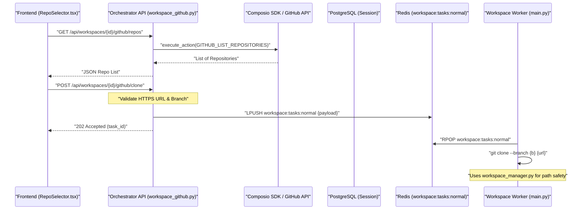
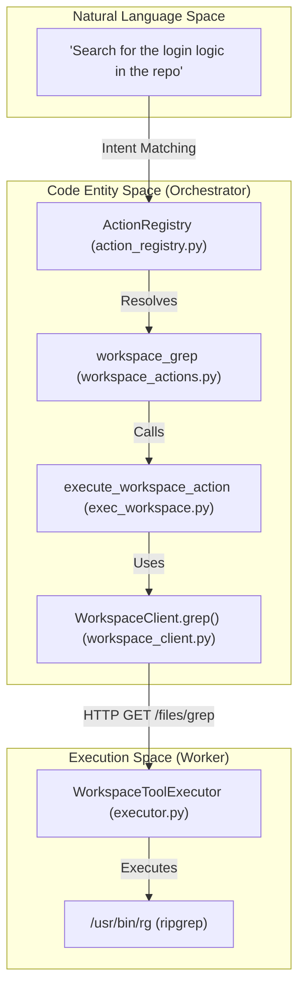

# GitHub Integration

Relevant source files

The following files were used as context for generating this wiki page:

- [frontend/components/widgets/CodingCanvasWidget/RepoSelector.tsx](frontend/components/widgets/CodingCanvasWidget/RepoSelector.tsx)
- [frontend/components/widgets/TerminalWidget/InteractiveTerminal.tsx](frontend/components/widgets/TerminalWidget/InteractiveTerminal.tsx)
- [frontend/components/widgets/TerminalWidget/index.tsx](frontend/components/widgets/TerminalWidget/index.tsx)
- [orchestrator/api/workspace_exec.py](orchestrator/api/workspace_exec.py)
- [orchestrator/api/workspace_github.py](orchestrator/api/workspace_github.py)
- [orchestrator/core/workspace_client.py](orchestrator/core/workspace_client.py)
- [orchestrator/modules/tools/discovery/workspace_actions.py](orchestrator/modules/tools/discovery/workspace_actions.py)
- [orchestrator/modules/tools/execution/exec_workspace.py](orchestrator/modules/tools/execution/exec_workspace.py)
- [services/workspace-worker/Dockerfile](services/workspace-worker/Dockerfile)
- [services/workspace-worker/entrypoint.sh](services/workspace-worker/entrypoint.sh)
- [services/workspace-worker/executor.py](services/workspace-worker/executor.py)
- [services/workspace-worker/main.py](services/workspace-worker/main.py)
- [services/workspace-worker/requirements.txt](services/workspace-worker/requirements.txt)

The GitHub Integration subsystem enables AI agents and users to interact with remote repositories directly within sandboxed workspace environments. This integration supports repository discovery, automated cloning into persistent workspace volumes, and a suite of tools for code manipulation and version control backed by the Composio SDK.

## Overview

GitHub integration is implemented as a bridge between the **Orchestrator API**, the **Workspace Worker**, and external VCS providers. It leverages the `Composio` platform to handle OAuth authentication and entity management, allowing agents to act on behalf of users with fine-grained permissions.

### Key Components
*   **`workspace_github.py`**: The primary API router for repository listing and clone task submission [orchestrator/api/workspace_github.py:31-34]().
*   **`Workspace Worker`**: An ARQ-style consumer that executes the physical `git clone` and file operations on a persistent volume [services/workspace-worker/main.py:59-68]().
*   **`RepoSelector`**: A frontend component allowing users to browse and select repositories for their workspace [frontend/components/widgets/CodingCanvasWidget/RepoSelector.tsx:39-44]().
*   **`WorkspaceClient`**: An asynchronous proxy used by the Orchestrator to communicate with the worker's HTTP API for file and command operations [orchestrator/core/workspace_client.py:56-61]().

## Implementation & Data Flow

The integration follows a decoupled architecture where the API server manages metadata and permissions, while the worker service handles heavy I/O and shell execution.

### Repository Discovery and Cloning
When a user or agent requests a repository list, the system uses the `EntityManager` to resolve the workspace's Composio identity [orchestrator/api/workspace_github.py:54-62](). It then fetches repository metadata via the `GITHUB_LIST_REPOSITORIES_FOR_THE_AUTHENTICATED_USER` action [orchestrator/api/workspace_github.py:133-138]().

**GitHub Repository Operations Flow**

Sources: [orchestrator/api/workspace_github.py:113-179](), [orchestrator/api/workspace_github.py:185-200](), [services/workspace-worker/main.py:180-194](), [services/workspace-worker/executor.py:108-116]()

## API Reference: workspace_github.py

The GitHub integration provides two main endpoints scoped by `workspace_id`.

| Endpoint | Method | Description |
| :--- | :--- | :--- |
| `/api/workspaces/{id}/github/repos` | `GET` | Lists GitHub repositories accessible via the authenticated Composio entity [orchestrator/api/workspace_github.py:113-114](). |
| `/api/workspaces/{id}/github/clone` | `POST` | Enqueues a background task to clone a repository into the workspace volume [orchestrator/api/workspace_github.py:185-186](). |

### URL Validation
To prevent SSRF and injection attacks, the `CloneRequest` model enforces strict validation:
*   **Scheme**: Must be `https` [orchestrator/api/workspace_github.py:89-90]().
*   **Allowed Hosts**: Limited to `github.com`, `gitlab.com`, and `bitbucket.org` [orchestrator/api/workspace_github.py:37-38](), [orchestrator/api/workspace_github.py:91-92]().
*   **Credentials**: No embedded usernames or passwords allowed in the URL [orchestrator/api/workspace_github.py:93-94]().
*   **Branch**: Validated against a safe regex `^[A-Za-z0-9._/\-]+$` [orchestrator/api/workspace_github.py:40-41](), [orchestrator/api/workspace_github.py:105-106]().

## Agent-Facing Workspace Tools

Agents interact with GitHub repositories using a set of "Platform Actions" defined in the `ActionRegistry`. These actions are proxied to the `Workspace Worker` via the `WorkspaceClient`.

**Code Entity Mapping: Natural Language to Tool Execution**

Sources: [orchestrator/modules/tools/discovery/workspace_actions.py:124-161](), [orchestrator/modules/tools/execution/exec_workspace.py:183-192](), [orchestrator/core/workspace_client.py:130-149](), [services/workspace-worker/executor.py:108-116]()

### Key Workspace Actions
*   **`workspace_read_file`**: Retrieves text content, size, and language of a specific file [orchestrator/modules/tools/discovery/workspace_actions.py:18-51]().
*   **`workspace_write_file`**: Creates or overwrites files, including automatic parent directory creation [orchestrator/modules/tools/discovery/workspace_actions.py:53-90]().
*   **`workspace_list_dir`**: Explores project structure [orchestrator/modules/tools/discovery/workspace_actions.py:92-121]().
*   **`workspace_grep`**: Performs regex searches across the repository [orchestrator/modules/tools/discovery/workspace_actions.py:124-161]().
*   **`workspace_exec`**: Runs whitelisted commands (e.g., `pytest`, `npm test`) in the repository context [orchestrator/modules/tools/discovery/workspace_actions.py:164-181]().

## Security and Sandboxing

GitHub integration adheres to strict security boundaries to prevent unauthorized access or system compromise during code execution.

### Command Whitelisting
The `WorkspaceToolExecutor` maintains an `ALLOWED_COMMANDS` set. Only binaries in this list (e.g., `git`, `python`, `npm`, `ls`) are permitted [services/workspace-worker/executor.py:35-73]().

### Blocked Patterns
Even if a binary is whitelisted, specific argument patterns are blocked via regex (e.g., `rm -rf /`, `sudo`, `chmod 777`) [services/workspace-worker/executor.py:76-95]().

### Path Containment
The `WorkspaceManager` ensures all file operations are confined to the `/workspaces/{workspace_id}` directory using `resolve_safe_path`, which prevents directory traversal attacks [services/workspace-worker/executor.py:155-157]().

### Interactive Terminal
The `InteractiveTerminal` component allows users to execute shell commands directly in the workspace via the `exec_command` API [frontend/components/widgets/TerminalWidget/InteractiveTerminal.tsx:65-88](). It tracks the current working directory (`cwd`) and updates it based on `cd` command outputs returned by the worker [frontend/components/widgets/TerminalWidget/InteractiveTerminal.tsx:110-113]().

## Workspace Filesystem Layout

The `WorkspaceWorker` is configured via environment variables to use a persistent volume [services/workspace-worker/main.py:16-19](). The `entrypoint.sh` script ensures the `worker` user has correct ownership of the volume at runtime [services/workspace-worker/entrypoint.sh:6-9]().

| Path | Purpose | Configuration |
| :--- | :--- | :--- |
| `/workspaces` | Base mount point for all workspaces | `WORKSPACE_VOLUME_PATH` [services/workspace-worker/Dockerfile:56]() |
| `/workspaces/{id}/repos` | Target directory for GitHub clones | Hardcoded in `workspace_actions.py` [orchestrator/modules/tools/discovery/workspace_actions.py:34]() |

Sources: [services/workspace-worker/Dockerfile:56-59](), [services/workspace-worker/main.py:16-20](), [services/workspace-worker/entrypoint.sh:1-13]()

---