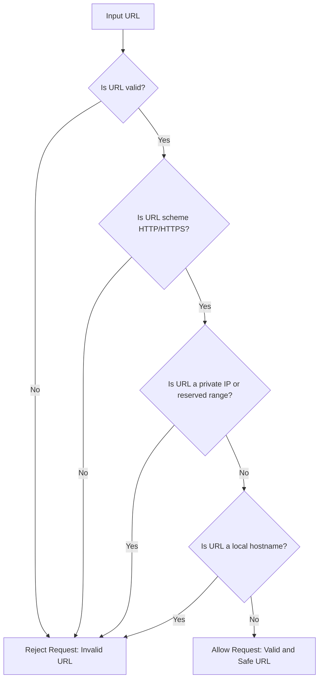

# Security & Sandboxing

<details>
<summary>Relevant source files</summary>

The following files were used as context for generating this wiki page:

- [docs/workspace-execution/security-sandboxing.md](docs/workspace-execution/security-sandboxing.md)
- [orchestrator/alembic/versions/prd140_permission_bypass_log.py](orchestrator/alembic/versions/prd140_permission_bypass_log.py)
- [orchestrator/alembic/versions/prd140_team_lead_enabled.py](orchestrator/alembic/versions/prd140_team_lead_enabled.py)
- [orchestrator/api/widgets/cors.py](orchestrator/api/widgets/cors.py)
- [orchestrator/core/security/__init__.py](orchestrator/core/security/__init__.py)
- [orchestrator/core/security/bypass_audit.py](orchestrator/core/security/bypass_audit.py)
- [orchestrator/core/security/hierarchy_permissions.py](orchestrator/core/security/hierarchy_permissions.py)
- [orchestrator/core/security/url_validator.py](orchestrator/core/security/url_validator.py)
- [orchestrator/core/services/auto_cadence.py](orchestrator/core/services/auto_cadence.py)
- [orchestrator/modules/tools/execution/exec_platform.py](orchestrator/modules/tools/execution/exec_platform.py)
- [orchestrator/scripts/check_hierarchy_gate.py](orchestrator/scripts/check_hierarchy_gate.py)
- [orchestrator/tests/security/test_hierarchy_permissions.py](orchestrator/tests/security/test_hierarchy_permissions.py)
- [orchestrator/tests/security/test_prd172_tenant_isolation.py](orchestrator/tests/security/test_prd172_tenant_isolation.py)
- [orchestrator/tests/test_p2w2_cors_boot_guard.py](orchestrator/tests/test_p2w2_cors_boot_guard.py)
- [orchestrator/tests/test_prd008a_cors_coverage.py](orchestrator/tests/test_prd008a_cors_coverage.py)
- [orchestrator/tests/test_prd186_s3_hardening.py](orchestrator/tests/test_prd186_s3_hardening.py)

</details>


Automatos AI implements a multi-layered security architecture designed to isolate agent execution, protect the host filesystem, and govern external access via widgets. The system relies on physical workspace boundaries, strict command whitelisting, and per-workspace rate limiting to ensure that autonomous agents operate within safe constraints.

## Workspace Isolation & Path Traversal Prevention

The core of the sandboxing strategy is the `WorkspaceWorker`, which manages isolated directories for each workspace on a persistent volume [services/workspace-worker/main.py:6-9](). Security is enforced at the `WorkspaceManager` and `WorkspaceToolExecutor` levels to prevent agents from accessing data outside their designated environment.

### Path Containment
All file operations and command executions are passed through a validation layer. The `WorkspaceToolExecutor` uses `WorkspaceManager.resolve_safe_path` to ensure that any path provided by an agent (or user) is resolved relative to the workspace root and does not use `..` or symlinks to escape the boundary [services/workspace-worker/executor.py:115-116]().

### Command Whitelisting
Agents do not have unrestricted shell access. The system maintains a strict `ALLOWED_COMMANDS` set, including essential tools for development:
*   **Interpreters:** `sh`, `bash`, `python3`, `node` [services/workspace-worker/executor.py:35-49]().
*   **Package Managers:** `pip`, `uv`, `npm`, `pnpm` [services/workspace-worker/executor.py:44-49]().
*   **Dev Tools:** `git`, `pytest`, `ruff`, `tsc`, `jq`, `curl` [services/workspace-worker/executor.py:41-58]().
*   **System Utils:** `ls`, `grep`, `cat`, `find`, `tar`, `chmod` [services/workspace-worker/executor.py:53-60]().

Furthermore, even whitelisted commands are subject to regex-based `BLOCKED_PATTERNS` to prevent dangerous operations such as:
*   `rm -rf /` (Root deletion) [services/workspace-worker/executor.py:77-78]().
*   `sudo` or `su` (Privilege escalation) [services/workspace-worker/executor.py:79-80]().
*   `kubectl` (Unauthorized cluster access) [services/workspace-worker/executor.py:82]().
*   Device access via `> /dev/` [services/workspace-worker/executor.py:83]().
*   Backtick execution and embedded newlines [services/workspace-worker/executor.py:93-94]().

### Data Flow: Secure Command Execution
The following diagram illustrates how a command from an agent is validated before execution on the worker.

**Figure 1: Command Validation and Execution Flow**
```mermaid
graph TD
    subgraph "Orchestrator [orchestrator/core/workspace_client.py]"
        "Agent/User" -- "POST /api/workspaces/{ws_id}/exec" --> "WorkspaceExecAPI"["api.workspace_exec:exec_command"]
        "WorkspaceExecAPI" -- "Proxy Request" --> "WorkspaceClient"["core.workspace_client:WorkspaceClient.exec_command"]
    end

    subgraph "Workspace Worker [services/workspace-worker/main.py]"
        "WorkspaceClient" -- "HTTP POST /exec" --> "WorkspaceWorker"["main.py:WorkspaceWorker"]
        "WorkspaceWorker" -- "Validate Command" --> "WTE_Validate"["executor.py:WorkspaceToolExecutor._validate_command"]
        "WTE_Validate" -- "Check Whitelist" --> "Allowed?"{"Allowed?"}
        "Allowed?" -- "No" --> "SecurityError"["Return SecurityError"]
        "Allowed?" -- "Yes" --> "BuildEnv"["executor.py:WorkspaceToolExecutor._build_sandboxed_env"]
        "BuildEnv" -- "Subprocess" --> "AsyncSubprocess"["asyncio.create_subprocess_exec"]
        "AsyncSubprocess" -- "Output Limit" --> "Truncate"["executor.py:MAX_STDOUT_BYTES"]
    end
```
Sources: [orchestrator/core/workspace_client.py:153-171](), [services/workspace-worker/executor.py:122-143](), [services/workspace-worker/executor.py:101-102](), [services/workspace-worker/main.py:59-68]()

## Storage Quotas & Resource Limits

To prevent resource exhaustion, the `WorkspaceWorker` enforces limits on storage and process output:
*   **Storage Quotas:** The default storage per workspace is configured via `WORKSPACE_DEFAULT_QUOTA_GB` (defaulting to 5GB) [services/workspace-worker/main.py:17](). 
*   **Output Capping:** Command output is truncated if it exceeds `MAX_STDOUT_BYTES` (100KB) or `MAX_STDERR_BYTES` (50KB) to prevent memory bloat in the orchestrator [services/workspace-worker/executor.py:101-102]().
*   **Timeouts:** Every command has a default timeout of 120 seconds, and the `WorkspaceClient` caps requests at 600 seconds [services/workspace-worker/executor.py:105](), [orchestrator/core/workspace_client.py:162]().
*   **Concurrency:** The worker uses an `asyncio.Semaphore` to limit concurrent task execution based on `WORKER_CONCURRENCY` [services/workspace-worker/main.py:78]().

Sources: [services/workspace-worker/main.py:17-18](), [services/workspace-worker/executor.py:101-105](), [orchestrator/core/workspace_client.py:162]()

## Tenant Isolation & S3 Hardening

The system enforces strict tenant isolation across all data domains. Workspace A cannot read, write, or delete any data belonging to Workspace B [orchestrator/tests/security/test_prd172_tenant_isolation.py:3-6]().

### S3 Vector Isolation
For vector storage in shared S3 buckets, isolation is ensured by mandatory workspace labeling:
*   **Stamping:** Every document chunk added to the vector store is stamped with the `workspace_id` in its metadata [orchestrator/tests/test_prd186_s3_hardening.py:108-116]().
*   **Filtering:** Search operations automatically drop any hits that are unlabeled or belong to a different workspace [orchestrator/tests/test_prd186_s3_hardening.py:83-93]().
*   **Scoped Deletion:** Disconnect-time deletion is strictly file-scoped rather than index-wide to prevent accidental clearing of other tenants' vectors [orchestrator/tests/test_prd186_s3_hardening.py:119-132]().

Sources: [orchestrator/tests/security/test_prd172_tenant_isolation.py:3-6](), [orchestrator/tests/test_prd186_s3_hardening.py:83-132]()

## Widget Security & CORS Policy

The widget system allows embedding Automatos capabilities into external sites. This requires specialized security measures to prevent abuse and ensure cross-origin safety.

### Widget CORS Policy
Widget endpoints (`/api/widgets/*`) and Sites endpoints (`/api/sites/*`) use a dedicated `WidgetCORSMiddleware`. This middleware is ASGI-native to avoid buffering `StreamingResponse` (SSE) data, ensuring real-time performance for chat streams [orchestrator/api/widgets/cors.py:5-8]().

*   **Dynamic Domain Validation:** For `/api/widgets`, the middleware checks if the `Origin` header matches any domain explicitly named on an active public `SdkApiKey`. This lookup is cached with a TTL of 60 seconds to maintain performance [orchestrator/api/widgets/cors.py:86-119]().
*   **Platform Fast-Path:** First-party origins (e.g., the Automatos dashboard) are pre-validated against `PLATFORM_ORIGINS` and bypass the database lookup [orchestrator/api/widgets/cors.py:112-113]().
*   **Fail-Closed Logic:** If a database lookup for an origin fails, the middleware fails closed (denies access) to prevent security regressions during outages [orchestrator/api/widgets/cors.py:122-127]().

### Widget Rate Limiting
The widget subsystem includes rate limiting using a thread-safe in-memory sliding-window counter [orchestrator/api/widgets/rate_limit.py:46-51]().
*   **Public Keys:** Default 30 requests per minute [orchestrator/api/widgets/rate_limit.py:37]().
*   **Server Keys:** Default 1000 requests per minute for keys starting with `ak_srv_` [orchestrator/api/widgets/rate_limit.py:38](), [orchestrator/api/widgets/rate_limit.py:127]().

### CORS Boot Guard
A critical security boot guard ensures that the `WidgetCORSMiddleware` is correctly configured. This guard runs during the application's `lifespan` event, ensuring that any misconfiguration (e.g., an empty `WIDGET_ORIGIN_ALLOWLIST` which is now deprecated) would abort the boot process rather than allowing the application to start in a vulnerable state [orchestrator/tests/test_p2w2_cors_boot_guard.py:74-75](). This prevents a scenario where a misconfigured CORS policy could inadvertently widen access.

### Code Canvas Confinement
The Code Canvas feature (PRD-170) manages headless Claude Agent SDK sessions within the workspace worker [services/workspace-worker/canvas_session_service.py:4-5]().
*   **Hard Confinement:** Every tool call requested by the SDK is routed through `evaluate_tool_confinement`. Any path outside the workspace mount is denied immediately without human intervention [services/workspace-worker/canvas_session_service.py:171-189]().
*   **Human-in-the-Loop:** Mutating tools (like file writes or shell commands) require explicit approval via a `permission.request` event sent to the UI [services/workspace-worker/canvas_session_service.py:173-177]().

**Figure 2: Widget Authentication and CORS Architecture**
```mermaid
graph LR
    subgraph "External Webpage"
        "JS_SDK"["JS Widget SDK"]
    end

    subgraph "Automatos Backend [api/widgets/]"
        "CORS_MW"["cors.py:WidgetCORSMiddleware"]
        "KeyService"["core.services.api_key_service:ApiKeyService"]
        "WidgetChat"["chat.py:widget_chat"]
    end

    "JS_SDK" -- "OPTIONS Preflight" --> "CORS_MW"
    "CORS_MW" -- "Origin Lookup" --> "KeyService"
    "KeyService" -- "allowed_domains Check" --> "CORS_MW"
    "CORS_MW" -- "Allow-Origin Header" --> "JS_SDK"
    "JS_SDK" -- "POST /api/widgets/chat" --> "WidgetChat"
```
Sources: [orchestrator/api/widgets/cors.py:104-131](), [orchestrator/api/widgets/cors.py:158-168](), [services/workspace-worker/canvas_session_service.py:165-189]()

## URL Validation

The system employs robust URL validation to prevent various security vulnerabilities, particularly Server-Side Request Forgery (SSRF) and open redirects. The `validate_webhook_url` function [core/security/url_validator.py:21]() is a key component, ensuring that URLs used for webhooks or other external requests adhere to strict safety criteria.

**Figure 3: URL Validation Flow**

Sources: [orchestrator/core/security/url_validator.py:21]()

## Hierarchy Permissions & Bypass Audit

The platform implements a granular hierarchy permission system, primarily managed by the `can_actor_modify` function [core/security/hierarchy_permissions:111](). This system ensures that agents and users can only perform actions on targets (agents, tasks, playbooks, skills) within their authorized scope.

### Actor Gate
The `can_actor_modify` function includes a strict "actor gate" that fails closed on suspicious activity:
*   **Anonymous Actors:** Requests without an `actor_agent_id` are denied without escalation [core/security/hierarchy_permissions:131-134]().
*   **Unknown Actors:** If the `actor_agent_id` does not correspond to an existing agent, the request is denied [core/security/hierarchy_permissions:136-139]().
*   **Cross-Workspace Actors:** An actor attempting to modify a target in a different workspace is denied outright [core/security/hierarchy_permissions:141-145]().
*   **Inactive Actors:** Agents with an inactive status are prevented from performing actions [core/security/hierarchy_permissions:147-150]().

These security failures are refused directly and do not trigger an escalation to Auto, as they represent fundamental breaches of trust [core/security/hierarchy_permissions:92-94]().

### Narrowed System Bypass
Certain system agents (e.g., "Auto", "Auto CTO", "HARNESS", "platform-admin", "platform-system") are allowed to bypass the hierarchy for critical operations. However, this bypass is strictly narrowed: an agent must have `is_system_agent=True` AND its `name` must be present in the `SYSTEM_BYPASS_ALLOWLIST` [core/security/hierarchy_permissions:152-157](), [core/security/hierarchy_permissions:68-74](). This prevents a stray `is_system_agent` flag from granting unintended privileges [orchestrator/tests/security/test_hierarchy_permissions.py:142-151]().

### Permission Bypass Log
All instances where a system agent or platform admin bypasses the standard hierarchy permissions are recorded in the `permission_bypass_log` table [alembic/versions/prd140_permission_bypass_log.py:23-36](). This provides a queryable audit trail for governance and compliance, allowing workspace owners to review bypass events [core/security/bypass_audit.py:33-66](). The logging mechanism is fail-soft; if the audit insert fails, the operation still proceeds, but a warning is logged to indicate degraded audit coverage [core/security/bypass_audit.py:67-78]().

### Agent Impersonation Prevention
When executing platform actions, the system explicitly strips any `_agent_id` or `_agent_name` parameters that an LLM or tool call might try to smuggle in. The true `agent_id` is server-minted from the trusted runtime context. This prevents an agent from impersonating a system agent and bypassing hierarchy permission checks [modules/tools/execution/exec_platform.py:58-65]().

Sources: [core/security/hierarchy_permissions.py:111](), [core/security/hierarchy_permissions.py:131-150](), [core/security/hierarchy_permissions.py:152-157](), [core/security/hierarchy_permissions.py:68-74](), [orchestrator/tests/security/test_hierarchy_permissions.py:142-151](), [alembic/versions/prd140_permission_bypass_log.py:23-36](), [core/security/bypass_audit.py:33-66](), [core/security/bypass_audit.py:67-78](), [modules/tools/execution/exec_platform.py:58-65]()

---