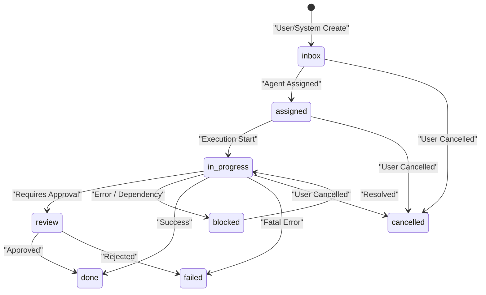
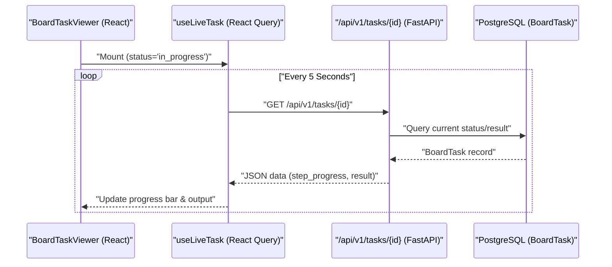

# Task Management & Board Integration

<details>
<summary>Relevant source files</summary>

The following files were used as context for generating this wiki page:

- [frontend/components/activity/board/board-card.tsx](frontend/components/activity/board/board-card.tsx)
- [frontend/components/activity/board/board-column.tsx](frontend/components/activity/board/board-column.tsx)
- [frontend/components/activity/board/board-task-viewer.tsx](frontend/components/activity/board/board-task-viewer.tsx)
- [frontend/components/activity/board/board-view.tsx](frontend/components/activity/board/board-view.tsx)
- [frontend/components/activity/board/index.ts](frontend/components/activity/board/index.ts)
- [frontend/components/command-center/__tests__/calendar-actions.test.ts](frontend/components/command-center/__tests__/calendar-actions.test.ts)
- [frontend/components/command-center/__tests__/calendar-tab-feed.test.tsx](frontend/components/command-center/__tests__/calendar-tab-feed.test.tsx)
- [frontend/components/command-center/__tests__/calendar-tab-scope.test.tsx](frontend/components/command-center/__tests__/calendar-tab-scope.test.tsx)
- [frontend/components/command-center/board-tab.tsx](frontend/components/command-center/board-tab.tsx)
- [frontend/components/command-center/calendar-actions.ts](frontend/components/command-center/calendar-actions.ts)
- [frontend/hooks/use-board-tasks.ts](frontend/hooks/use-board-tasks.ts)
- [frontend/hooks/use-heartbeats-api.ts](frontend/hooks/use-heartbeats-api.ts)
- [frontend/types/board.ts](frontend/types/board.ts)
- [orchestrator/api/board_tasks.py](orchestrator/api/board_tasks.py)
- [orchestrator/services/board_task_bridge.py](orchestrator/services/board_task_bridge.py)
- [orchestrator/services/orchestration_board_bridge.py](orchestrator/services/orchestration_board_bridge.py)
- [orchestrator/services/playbook_breaker.py](orchestrator/services/playbook_breaker.py)
- [orchestrator/tests/api/test_deliverables_api.py](orchestrator/tests/api/test_deliverables_api.py)
- [orchestrator/tests/modules/tools/execution/test_exec_workspace_deliverable.py](orchestrator/tests/modules/tools/execution/test_exec_workspace_deliverable.py)
- [orchestrator/tests/test_eval_graph_mode.py](orchestrator/tests/test_eval_graph_mode.py)
- [orchestrator/tests/test_p2w0_playbook_failure_visibility.py](orchestrator/tests/test_p2w0_playbook_failure_visibility.py)
- [orchestrator/tests/test_p2w0_s8_vector_probe.py](orchestrator/tests/test_p2w0_s8_vector_probe.py)
- [orchestrator/tests/test_playbook_scheduler.py](orchestrator/tests/test_playbook_scheduler.py)

</details>


The Task Management system provides a centralized Kanban-style interface for tracking agent activities, manual tasks, and mission executions. It bridges high-level user goals with the low-level execution layer, allowing for real-time status tracking and lifecycle management from "Inbox" to "Done".

## BoardTask Data Model

The `BoardTask` model is the central entity for the Kanban board. It supports manual tasks created by users, automated tasks from Recipes, and multi-agent coordination from the Mission (Orchestration) system. [orchestrator/api/board_tasks.py:5-7]()

*   **Statuses**: `inbox`, `assigned`, `in_progress`, `review`, `blocked`, `done`, `failed`, `cancelled`. [orchestrator/api/board_tasks.py:43-43](), [frontend/types/board.ts:6-6]()
*   **Priorities**: `urgent`, `high`, `medium`, `low`. [orchestrator/api/board_tasks.py:44-44]()
*   **Review Modes**: `human`, `llm`, `auto`. [orchestrator/api/board_tasks.py:45-45]()
*   **SLA Tracking**: Tasks include an `sla_deadline` calculated based on priority (e.g., 4 hours for urgent, 72 hours for low). [orchestrator/api/board_tasks.py:56-61](), [orchestrator/services/orchestration_board_bridge.py:34-39]()
*   **Planning Data**: A `JSONB` field storing step-by-step progress, execution IDs, and approval actions. [orchestrator/services/board_task_bridge.py:54-58](), [frontend/types/board.ts:46-46]()
*   **Source Types**: Tasks distinguish between manual entries and system-generated ones using `source_type` (e.g., `recipe`, `orchestration`, `orchestration_task`). [orchestrator/api/board_tasks.py:48-53]()
*   **Runtime Reference**: For tasks executed via the CLI, `runtime_ref` stores details like files touched, usage, and session ID for takeover. [frontend/types/board.ts:49-49](), [frontend/components/activity/board/board-task-viewer.tsx:63-134]()

### Task Entity Mapping
The following diagram maps the logical task concepts to the physical database and API entities.

**Diagram: Task Entity Mapping**
```mermaid
graph TD
    subgraph "NaturalLanguageSpace"
        ["User Goal / Prompt"]
        ["Board Card UI"]
    end

    subgraph "CodeEntitySpace"
        BT["class BoardTask (core.models.core)"]
        BTRouter["/api/v1/tasks (orchestrator/api/board_tasks.py)"]
        BTBridge["board_task_bridge.py (orchestrator/services)"]
        OBBridge["orchestration_board_bridge.py (orchestrator/services)"]
        
        BT --- BTRouter
        BT --- BTBridge
        BT --- OBBridge
        ["User Goal / Prompt"] --> BTRouter
        ["Board Card UI"] --- BT
    end

    subgraph "ExecutionSpace"
        RE["RecipeExecution"]
        OR["OrchestrationRun (Mission)"]
        OT["OrchestrationTask"]
        
        BTBridge --- RE
        OBBridge --- OR
        OBBridge --- OT
    end
```
Sources: [orchestrator/api/board_tasks.py:26-34](), [orchestrator/services/board_task_bridge.py:17-25](), [orchestrator/services/orchestration_board_bridge.py:24-31]()

## Board Integration Bridges

Two primary bridge services synchronize external execution states with the Kanban board.

### 1. Recipe Bridge
The `board_task_bridge.py` service handles standard recipe (playbook) executions. [orchestrator/services/board_task_bridge.py:1-9]()

| Function | Purpose |
| :--- | :--- |
| `create_recipe_board_task` | Initializes a `BoardTask` when a recipe starts, linking it via `source_id`. [orchestrator/services/board_task_bridge.py:22-67]() |
| `update_recipe_board_task_progress` | Updates `step_progress` in `planning_data`. [orchestrator/services/board_task_bridge.py:70-93]() |
| `complete_recipe_board_task` | Moves task to `done` (success) or `failed` (failure) and attaches `result` or `error_message`. [orchestrator/services/board_task_bridge.py:95-128]() |

### 2. Orchestration (Mission) Bridge
The `orchestration_board_bridge.py` service integrates complex multi-agent missions. [orchestrator/services/orchestration_board_bridge.py:1-16]()

*   **Mission Mapping**: A mission (`OrchestrationRun`) creates a parent `BoardTask` with `source_type='orchestration'`. [orchestrator/services/orchestration_board_bridge.py:76-128]()
*   **Task Mapping**: Individual mission steps (`OrchestrationTask`) create child `BoardTask` rows linked via `parent_task_id`. [orchestrator/services/orchestration_board_bridge.py:136-216]()
*   **Status Sync**: Uses `BOARD_STATUS_MAP` to translate internal mission states (e.g., `todo`, `in_review`) to Kanban terms (e.g., `inbox`, `review`). [orchestrator/services/orchestration_board_bridge.py:49-68]()

Sources: [orchestrator/services/board_task_bridge.py:1-129](), [orchestrator/services/orchestration_board_bridge.py:1-216]()

## Task Lifecycle & Notifications

Tasks follow a state machine from creation to completion. Upon completion, the system utilizes the `NotificationDispatcher` to fire `task_complete` events. [orchestrator/api/board_tasks.py:179-204]()

**Diagram: Task Status Transitions**

Sources: [orchestrator/api/board_tasks.py:43-43](), [orchestrator/services/orchestration_board_bridge.py:49-58](), [frontend/types/board.ts:6-6]()

## Board View UI Components

The frontend provides a real-time Kanban board using `@hello-pangea/dnd` for drag-and-drop interactions. [frontend/components/activity/board/board-view.tsx:4-4]()

### Component Architecture
*   **BoardView**: Orchestrates filters (agent, priority, type) and manages the `DragDropContext`. It uses `useUpdateTaskStatus` for optimistic UI updates during drag-and-drop. [frontend/components/activity/board/board-view.tsx:21-49](), [frontend/hooks/use-board-tasks.ts:101-141]()
*   **BoardCard**: Displays task type (Mission, Playbook, or Task), assignee icons, and SLA indicators. It handles visual indicators for overdue tasks. [frontend/components/activity/board/board-card.tsx:18-52](), [frontend/components/activity/board/board-card.tsx:87-140]()
*   **BoardTaskViewer**: A modal providing deep introspection. It uses the `useLiveTask` hook to poll the backend every 5 seconds for live output and progress updates when a task is `in_progress`. [frontend/components/activity/board/board-task-viewer.tsx:26-49]() It also displays session details for CLI-based tasks, including files touched, usage, and a command to resume the session. [frontend/components/activity/board/board-task-viewer.tsx:63-134]()
*   **BoardFiltersBar**: Provides multi-dimensional filtering by priority, task type (Mission/Playbook/Task), and assigned agent. [frontend/components/activity/board/board-filters.tsx:51-135]()
*   **CreateTaskDialog**: A dialog for creating new tasks, accessible from the `BoardView`. [frontend/components/activity/board/board-view.tsx:98-104]()

### Live Data Flow
The frontend maintains synchronization with the backend through a combination of polling and optimistic updates.

**Diagram: UI Synchronization Flow**

Sources: [frontend/components/activity/board/board-task-viewer.tsx:26-49](), [frontend/hooks/use-board-tasks.ts:39-59](), [orchestrator/api/board_tasks.py:58-164]()

## Task Completion & Approval Flow

Tasks with `review_mode` enabled or specific `approval_action` triggers require manual intervention.
*   **Approval**: `useApproveTask` triggers a `POST` to `/api/v1/tasks/{taskId}/approve`. [frontend/hooks/use-board-tasks.ts:162-176]()
*   **Rejection**: `useRejectTask` triggers a `POST` to `/api/v1/tasks/{taskId}/reject` with optional feedback. [frontend/hooks/use-board-tasks.ts:178-192]()
*   **Immediate Execution**: `useRunTask` allows users to manually re-dispatch a task through the board loop immediately. [frontend/hooks/use-board-tasks.ts:197-209]()

Sources: [frontend/hooks/use-board-tasks.ts:162-209](), [orchestrator/services/board_task_bridge.py:95-129]()

---