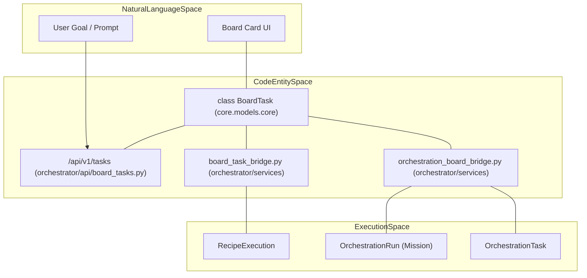
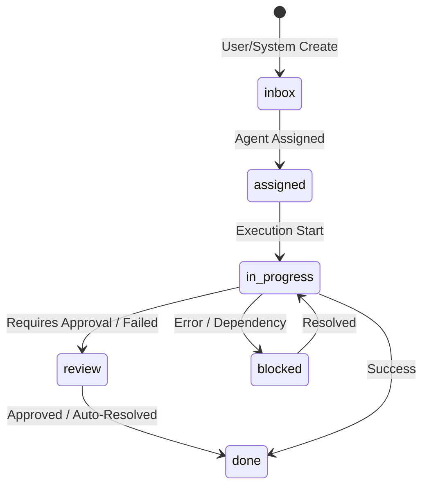
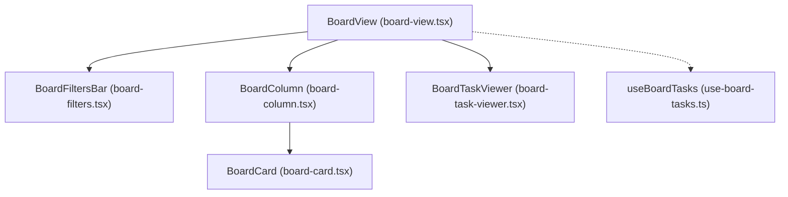

# Task Management & Board Integration

Relevant source files

The following files were used as context for generating this wiki page:

- [frontend/components/activity/board/board-agent-sidebar.tsx](frontend/components/activity/board/board-agent-sidebar.tsx)
- [frontend/components/activity/board/board-card.tsx](frontend/components/activity/board/board-card.tsx)
- [frontend/components/activity/board/board-column.tsx](frontend/components/activity/board/board-column.tsx)
- [frontend/components/activity/board/board-filters.tsx](frontend/components/activity/board/board-filters.tsx)
- [frontend/components/activity/board/board-task-viewer.tsx](frontend/components/activity/board/board-task-viewer.tsx)
- [frontend/components/activity/board/board-view.tsx](frontend/components/activity/board/board-view.tsx)
- [frontend/components/activity/board/index.ts](frontend/components/activity/board/index.ts)
- [frontend/hooks/use-board-tasks.ts](frontend/hooks/use-board-tasks.ts)
- [frontend/types/board.ts](frontend/types/board.ts)
- [orchestrator/api/board_tasks.py](orchestrator/api/board_tasks.py)
- [orchestrator/services/board_task_bridge.py](orchestrator/services/board_task_bridge.py)
- [orchestrator/services/orchestration_board_bridge.py](orchestrator/services/orchestration_board_bridge.py)

The Task Management system provides a centralized Kanban-style interface for tracking agent activities, manual tasks, and mission executions. It bridges high-level user goals with the low-level execution layer, allowing for real-time status tracking and lifecycle management from "Inbox" to "Done".

## BoardTask Data Model

The `BoardTask` model is the central entity for the Kanban board. It supports manual tasks created by users, automated tasks from Recipes, and multi-agent coordination from the Mission (Orchestration) system. [core/models/core.py:22-22]()

*   **Statuses**: `inbox`, `assigned`, `in_progress`, `review`, `blocked`, `done`. [orchestrator/api/board_tasks.py:28-28]()
*   **Priorities**: `urgent`, `high`, `medium`, `low`. [orchestrator/api/board_tasks.py:29-29]()
*   **Review Modes**: `human`, `llm`, `auto`. [orchestrator/api/board_tasks.py:30-30]()
*   **SLA Tracking**: Tasks include an `sla_deadline` calculated based on priority (e.g., 4 hours for urgent, 72 hours for low). [orchestrator/api/board_tasks.py:33-38](), [orchestrator/api/board_tasks.py:119-120]()
*   **Planning Data**: A `JSONB` field storing step-by-step progress, execution IDs, and approval actions. [orchestrator/api/board_tasks.py:98-100](), [frontend/types/board.ts:42-42]()

### Task Entity Mapping
The following diagram maps the logical task concepts to the physical database and API entities.

**Diagram: Task Entity Mapping**

Sources: [orchestrator/api/board_tasks.py:21-26](), [orchestrator/services/board_task_bridge.py:17-18](), [orchestrator/services/orchestration_board_bridge.py:24-31]()

## Board Integration Bridges

Two primary bridge services synchronize external execution states with the Kanban board.

### 1. Recipe Bridge
The `board_task_bridge.py` service handles standard recipe (playbook) executions. [orchestrator/services/board_task_bridge.py:1-9]()

| Function | Purpose |
| :--- | :--- |
| `create_recipe_board_task` | Initializes a `BoardTask` when a recipe starts, linking it via `source_id` (execution_id). [orchestrator/services/board_task_bridge.py:22-67]() |
| `update_recipe_board_task_progress` | Updates `step_progress` in `planning_data` for the linked task. [orchestrator/services/board_task_bridge.py:70-93]() |
| `complete_recipe_board_task` | Moves task to `done` and attaches `result` or `error_message`. [orchestrator/services/board_task_bridge.py:95-128]() |

### 2. Orchestration (Mission) Bridge
The `orchestration_board_bridge.py` service integrates complex multi-agent missions. [orchestrator/services/orchestration_board_bridge.py:1-16]()

*   **Mission Mapping**: A mission (`OrchestrationRun`) creates a parent `BoardTask` with `source_type='orchestration'`. [orchestrator/services/orchestration_board_bridge.py:76-128]()
*   **Task Mapping**: Individual mission steps (`OrchestrationTask`) create child `BoardTask` rows linked via `parent_task_id`. [orchestrator/services/orchestration_board_bridge.py:136-216]()
*   **Status Sync**: Uses `_resolve_board_status` to translate internal mission states to Kanban terms. [orchestrator/services/orchestration_board_bridge.py:60-68]()

Sources: [orchestrator/services/board_task_bridge.py:1-128](), [orchestrator/services/orchestration_board_bridge.py:1-216]()

## Task Lifecycle & Submission

Tasks follow a state machine from creation to completion. Manual tasks are created via the `POST /api/v1/tasks` endpoint. [orchestrator/api/board_tasks.py:67-72]()

**Diagram: Task Status Transitions**

Sources: [orchestrator/api/board_tasks.py:28-28](), [orchestrator/services/orchestration_board_bridge.py:49-58](), [frontend/types/board.ts:6-6]()

## Board View UI Components

The frontend provides a real-time Kanban board using `@hello-pangea/dnd` for drag-and-drop interactions. [frontend/components/activity/board/board-view.tsx:4-4]()

### Component Architecture
*   **BoardView**: Orchestrates filters (agent, priority, type) and manages the `DragDropContext`. [frontend/components/activity/board/board-view.tsx:21-122]()
*   **BoardCard**: Displays task type (Mission, Playbook, or Task), assignee icons, SLA indicators, and step progress bars. [frontend/components/activity/board/board-card.tsx:54-173]()
*   **BoardTaskViewer**: A modal providing deep introspection. It uses the `useLiveTask` hook to poll the backend every 5 seconds for live output and progress updates when a task is `in_progress`. [frontend/components/activity/board/board-task-viewer.tsx:26-49]()
*   **BoardFiltersBar**: Provides client-side and server-side filtering by agent, priority, and task type. [frontend/components/activity/board/board-filters.tsx:28-137]()

### Data Flow & Hooks
*   **useBoardTasks**: Fetches tasks from `/api/v1/tasks` and groups them into columns based on `BOARD_COLUMNS` configuration. [frontend/hooks/use-board-tasks.ts:39-94]()
*   **useUpdateTaskStatus**: Implements optimistic status updates for drag-and-drop actions. [frontend/hooks/use-board-tasks.ts:99-139]()
*   **useApproveTask / useRejectTask**: Handles the human-in-the-loop review cycle for tasks requiring manual verification. [frontend/hooks/use-board-tasks.ts:144-177]()

**Diagram: UI Component Hierarchy**

Sources: [frontend/components/activity/board/board-view.tsx:1-122](), [frontend/components/activity/board/board-card.tsx:1-173](), [frontend/components/activity/board/board-task-viewer.tsx:1-110](), [frontend/hooks/use-board-tasks.ts:1-220](), [frontend/types/board.ts:62-85]()

---