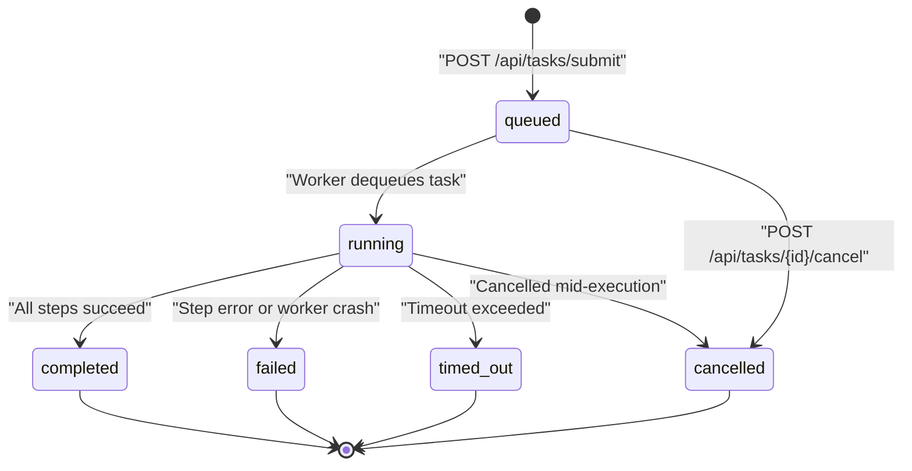
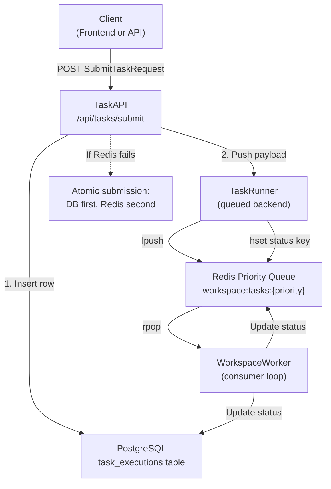
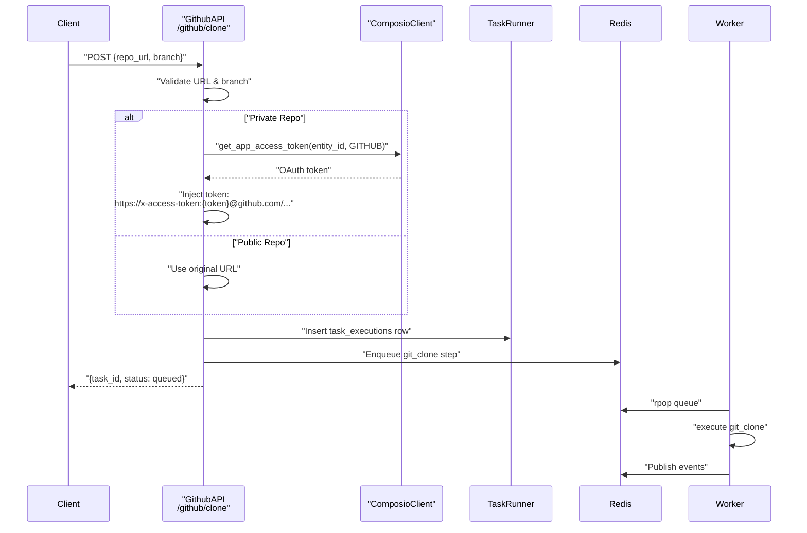
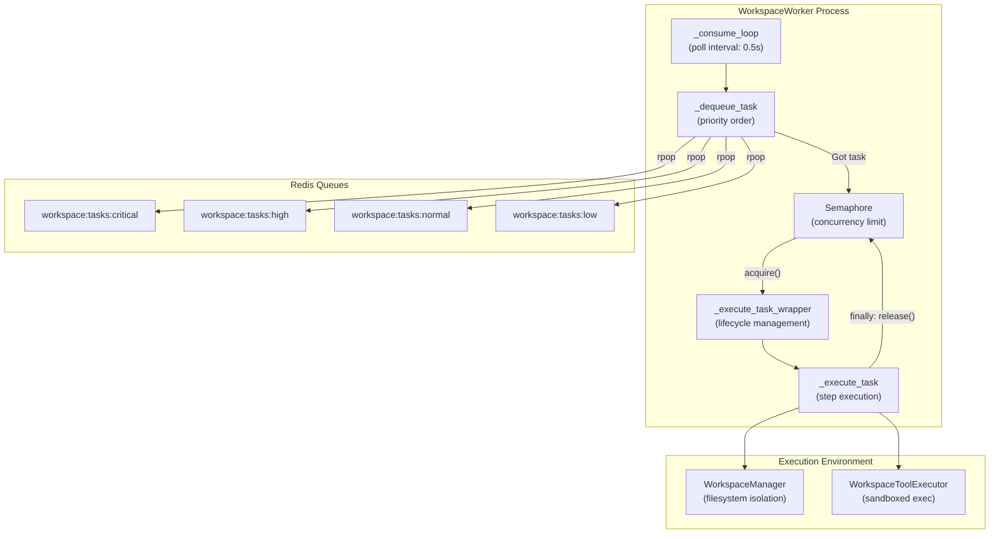
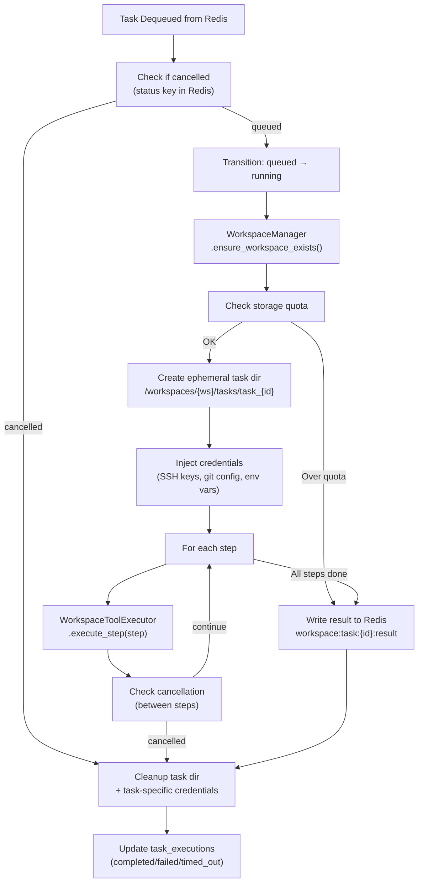
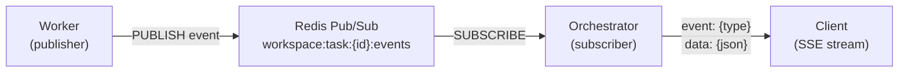
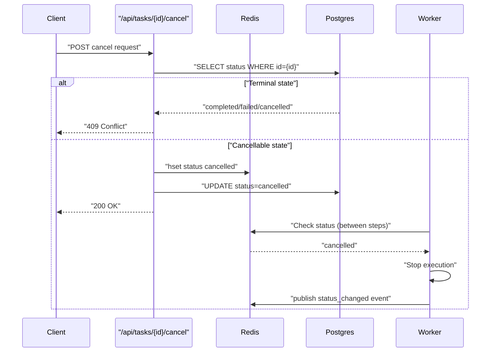
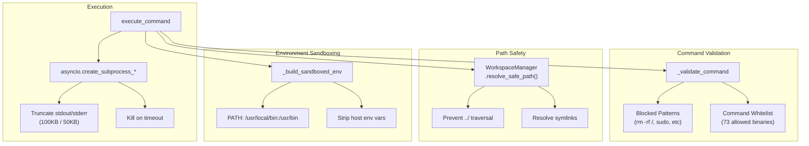
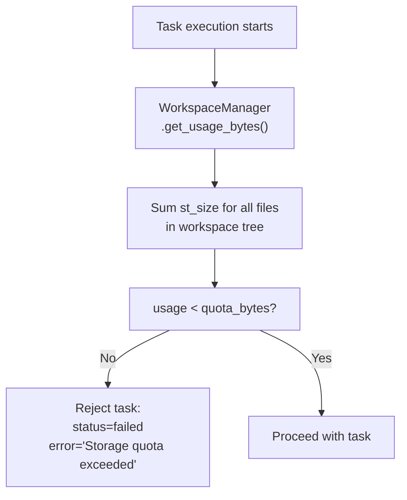
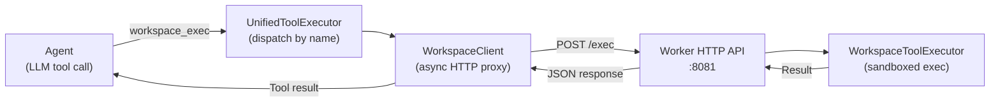

# Task Management

<details>
<summary>Relevant source files</summary>

The following files were used as context for generating this wiki page:

- [frontend/components/widgets/CodingCanvasWidget/RepoSelector.tsx](frontend/components/widgets/CodingCanvasWidget/RepoSelector.tsx)
- [orchestrator/api/tasks.py](orchestrator/api/tasks.py)
- [orchestrator/api/widgets/cors.py](orchestrator/api/widgets/cors.py)
- [orchestrator/api/widgets/rate_limit.py](orchestrator/api/widgets/rate_limit.py)
- [orchestrator/api/workspace_files.py](orchestrator/api/workspace_files.py)
- [orchestrator/api/workspace_github.py](orchestrator/api/workspace_github.py)
- [orchestrator/core/workspace_client.py](orchestrator/core/workspace_client.py)
- [orchestrator/modules/tools/discovery/action_registry.py](orchestrator/modules/tools/discovery/action_registry.py)
- [orchestrator/modules/tools/discovery/workspace_actions.py](orchestrator/modules/tools/discovery/workspace_actions.py)
- [services/workspace-worker/executor.py](services/workspace-worker/executor.py)
- [services/workspace-worker/main.py](services/workspace-worker/main.py)
- [services/workspace-worker/workspace_manager.py](services/workspace-worker/workspace_manager.py)

</details>


The task management system enables asynchronous execution of workspace operations—shell commands, file operations, git operations—in isolated, sandboxed environments. Tasks are queued in Redis priority queues, consumed by workspace workers, and executed within persistent workspace directories on a mounted volume. This system supports both explicit step-based task submission (via `/api/tasks/submit`) and higher-level operations like GitHub repository cloning (via `/api/workspaces/{workspace_id}/github/clone`).

For information about the workspace filesystem architecture and security model, see [Security & Sandboxing](#9.5). For details on workspace file operations and the code viewer, see [File Operations](#9.3).

---

## Task Lifecycle

Tasks progress through five states: `queued` → `running` → `completed` (or `failed`, `cancelled`, `timed_out`). State transitions are tracked in both Redis (for fast worker access) and PostgreSQL (for durable persistence and API queries).

### Task Lifecycle Diagram



**Sources:** [orchestrator/api/tasks.py:1-404](), [services/workspace-worker/main.py:227-358]()

---

## Task Submission

### Direct Task Submission

The `/api/tasks/submit` endpoint accepts explicit task steps for immediate execution. Unlike workflow execution (which uses LLM agents to generate steps), this endpoint enqueues concrete operations directly to the worker.



**Request Model:**

| Field | Type | Description |
|-------|------|-------------|
| `steps` | `List[TaskStep]` | Ordered list of actions to execute |
| `priority` | `str` | Queue priority: `low`, `normal`, `high`, `critical` |
| `timeout_seconds` | `int` | Max execution time (10-3600s) |

**TaskStep Actions:**

| Action | Parameters | Description |
|--------|-----------|-------------|
| `execute_command` | `command`, `cwd`, `timeout` | Run shell command |
| `git_clone` | `repo`, `branch`, `shallow` | Clone repository |
| `git_pull` | `repo_name`, `branch` | Update cached repo |
| `read_file` | `path` | Read file contents |
| `write_file` | `path`, `content` | Write or create file |
| `list_directory` | `path` | List directory entries |
| `create_directory` | `path` | Create directory tree |

**Sources:** [orchestrator/api/tasks.py:39-173](), [services/workspace-worker/executor.py:322-360]()

---

### GitHub Repository Cloning

The `/api/workspaces/{workspace_id}/github/clone` endpoint provides a specialized task submission flow for cloning repositories. It retrieves the user's GitHub OAuth token via Composio and injects it into the clone URL for authenticated access to private repos.



**Sources:** [orchestrator/api/workspace_github.py:167-293](), [services/workspace-worker/executor.py:368-419]()

---

## Worker Architecture

### WorkspaceWorker Consumer Loop

The `WorkspaceWorker` class implements a priority queue consumer that polls Redis queues in order (`critical` → `high` → `normal` → `low`) and executes tasks concurrently up to a configurable limit (default: 3).



**Configuration:**

| Environment Variable | Default | Description |
|---------------------|---------|-------------|
| `WORKER_CONCURRENCY` | `3` | Max concurrent tasks |
| `REDIS_URL` | `redis://localhost:6379/0` | Redis connection string |
| `WORKSPACE_VOLUME_PATH` | `//workspaces` | Persistent volume mount |
| `WORKER_HEALTH_PORT` | `8081` | Health check HTTP port |
| `WORKER_INTERNAL_TOKEN` | (empty) | Auth token for internal API |

**Sources:** [services/workspace-worker/main.py:60-180](), [services/workspace-worker/main.py:44-57]()

---

### Task Execution Flow

When a worker dequeues a task, it progresses through a multi-stage execution pipeline with quota checks, credential injection, step execution, and cleanup.



**Sources:** [services/workspace-worker/main.py:227-358]()

---

## Task Status Tracking

Task state is maintained in two storage tiers:

### Redis (Fast Access for Workers)

| Key Pattern | Type | TTL | Purpose |
|-------------|------|-----|---------|
| `workspace:task:{task_id}:status` | Hash | 7200s | Current status, worker_id, timestamps |
| `workspace:task:{task_id}:result` | String (JSON) | 3600s | Full execution result payload |
| `workspace:ws:{workspace_id}:active_tasks` | Set | N/A | Active task IDs for workspace |
| `workspace:worker:{worker_id}:heartbeat` | String | 60s | Worker health timestamp |
| `workspace:worker:{worker_id}:tasks` | Set | 60s | Tasks assigned to this worker |

**Sources:** [services/workspace-worker/main.py:44-57](), [services/workspace-worker/main.py:363-421]()

### PostgreSQL (Durable Persistence)

The `task_executions` table stores complete task metadata and is updated in lockstep with Redis by the worker.

```sql
CREATE TABLE task_executions (
    id UUID PRIMARY KEY,
    workspace_id UUID NOT NULL,
    task_type VARCHAR(50) NOT NULL,
    agent_id UUID,
    prompt TEXT,
    configuration JSONB,
    status VARCHAR(20) NOT NULL,  -- queued, running, completed, failed, cancelled, timed_out
    priority VARCHAR(20),
    runner_backend VARCHAR(50),  -- 'queued' for workspace worker
    resources_requested JSONB,
    resources_used JSONB,
    submitted_at TIMESTAMP,
    started_at TIMESTAMP,
    completed_at TIMESTAMP,
    result JSONB,
    error_message TEXT,
    tokens_used INTEGER,
    execution_time_ms INTEGER,
    parent_execution_id UUID,
    correlation_id VARCHAR(100),
    worker_id VARCHAR(100),
    workspace_path TEXT,
    updated_at TIMESTAMP DEFAULT NOW()
);
```

**Sources:** [services/workspace-worker/main.py:377-415]()

---

## Real-Time Event Streaming

The `/api/tasks/{task_id}/events` endpoint provides Server-Sent Events (SSE) for live task progress. The worker publishes events to Redis pub/sub, which the orchestrator streams to the client.

### Event Types



| Event Type | Data Fields | When Fired |
|-----------|--------------|------------|
| `status_changed` | `status`, `execution_time_ms` | Status transition |
| `progress_update` | `step`, `total_steps`, `description` | Before each step |
| `error` | `error`, `step` | Step failure or exception |

**Example SSE Stream:**

```
event: status_changed
data: {"status": "running"}

event: progress_update
data: {"step": 1, "total_steps": 3, "description": "Clone github.com/user/repo"}

event: status_changed
data: {"status": "completed", "execution_time_ms": 14532}
```

**Sources:** [orchestrator/api/tasks.py:352-403](), [services/workspace-worker/main.py:422-434]()

---

## Task Cancellation

Tasks can be cancelled via `POST /api/tasks/{task_id}/cancel`. The cancellation mechanism varies by task state:

- **Queued tasks**: Marked as cancelled in Redis status key; worker skips execution when dequeued
- **Running tasks**: Worker checks cancellation flag between steps; stops execution gracefully
- **Completed/failed tasks**: Cannot be cancelled (terminal state)



**Sources:** [orchestrator/api/tasks.py:304-346](), [services/workspace-worker/main.py:236-286]()

---

## Workspace HTTP API

The workspace worker exposes an HTTP server on port 8081 (configurable via `WORKER_HEALTH_PORT`) for health checks and direct file/command operations. This API is used by the orchestrator to proxy file browsing and command execution requests to the worker.

### Endpoints

| Method | Path | Purpose | Auth |
|--------|------|---------|------|
| `GET` | `/health` | Worker health check | None |
| `GET` | `/workspaces/{ws_id}/files` | List directory | Internal token |
| `GET` | `/workspaces/{ws_id}/files/content` | Read file | Internal token |
| `POST` | `/workspaces/{ws_id}/files/write` | Write file | Internal token |
| `POST` | `/workspaces/{ws_id}/exec` | Execute command | Internal token |
| `GET` | `/workspaces/{ws_id}/files/grep` | Search files | Internal token |
| `POST` | `/workspaces/{ws_id}/git` | Git operation | Internal token |

### Internal Authentication

Requests from the orchestrator to the worker HTTP API are authenticated via the `X-Internal-Token` header. This prevents external access to workspace operations.

**Configuration:**

```env
# In orchestrator .env
WORKER_INTERNAL_URL=http://workspace-worker:8081
WORKER_INTERNAL_TOKEN=secure_random_token_here

# In worker .env
WORKER_INTERNAL_TOKEN=secure_random_token_here
```

**Sources:** [services/workspace-worker/main.py:461-819](), [orchestrator/core/workspace_client.py:1-185]()

---

## Task Execution Environment

### WorkspaceToolExecutor

The `WorkspaceToolExecutor` class provides sandboxed execution of task steps with command whitelisting, path containment, and output limits.



### Allowed Commands

The executor enforces a strict whitelist of 73 allowed commands. Path-based binaries (e.g., `/usr/bin/python`) and relative paths (e.g., `./malicious`) are rejected.

**Categories:**

| Category | Commands |
|----------|----------|
| **Shell** | `sh`, `bash`, `cd`, `pwd`, `export`, `source`, `test` |
| **VCS** | `git` |
| **Python** | `python`, `python3`, `pip`, `pip3`, `uv`, `pytest`, `ruff`, `black`, `mypy` |
| **Node.js** | `node`, `npm`, `npx`, `pnpm`, `yarn`, `vitest`, `jest`, `tsc`, `eslint` |
| **Search** | `ls`, `cat`, `grep`, `egrep`, `fgrep`, `rg`, `find`, `tree` |
| **Build** | `make`, `cmake`, `cargo`, `go`, `mvn`, `gradle`, `rustc`, `gcc` |

**Blocked Patterns:**

- `rm -rf /` and `rm -rf /{anything}`
- `sudo`, `su`, `passwd`, `useradd`, `userdel`
- `chmod 777`, `mount`, `umount`, `mkfs`
- Backticks, embedded newlines, device access (`> /dev/`)
- Kubernetes, iptables, systemctl

**Sources:** [services/workspace-worker/executor.py:35-99](), [services/workspace-worker/executor.py:448-501]()

---

## Workspace Directory Structure

Each workspace gets a persistent directory tree on the worker volume with repos, ephemeral task dirs, and artifacts.

```
/workspaces/{workspace_id}/
├── repos/                    ← Cloned repos (persistent, git pull on revisit)
│   ├── my-app/              ← Git repo cached from clone
│   └── another-repo/
├── tasks/                    ← Ephemeral task execution dirs
│   ├── task_{uuid}/         ← Cleaned up after task completion
│   └── task_{uuid}/
├── artifacts/                ← Test reports, build outputs (persistent)
├── .ssh/                     ← Deploy keys (injected per task)
│   ├── id_ed25519
│   └── config
├── .gitconfig                ← Per-workspace git identity
├── .task_env_{uuid}          ← Task-specific env vars (ephemeral)
└── .workspace_meta.json      ← Workspace metadata
```

**Workspace Metadata:**

```json
{
  "workspace_id": "uuid",
  "created_at": "2024-01-15T10:30:00Z",
  "plan_tier": "pilot",
  "storage_quota_bytes": 5368709120,
  "total_tasks_run": 42,
  "repos_cached": ["my-app", "another-repo"],
  "last_task_at": "2024-01-15T12:45:00Z"
}
```

**Sources:** [services/workspace-worker/workspace_manager.py:1-308]()

---

## Storage Quota Enforcement

The `WorkspaceManager` enforces per-workspace storage quotas (default: 5GB) by calculating disk usage before task execution. Tasks are rejected if the quota is exceeded.



**Configuration:**

```env
WORKSPACE_DEFAULT_QUOTA_GB=5  # Default quota in GB
```

**Quota Check:**

```python
# In worker._execute_task()
if not ws_manager.check_quota():
    error_msg = (
        f"Workspace storage exceeds quota "
        f"({ws_manager.usage_human} / {ws_manager.quota_human})"
    )
    await self._write_result(task_id, workspace_id, {
        "status": "failed",
        "error": error_msg,
    })
    return
```

**Sources:** [services/workspace-worker/workspace_manager.py:83-115](), [services/workspace-worker/main.py:250-264]()

---

## Integration with Platform Tools

The task management system integrates with the platform tools registry to provide workspace actions (`workspace_read_file`, `workspace_exec`, etc.) that agents can invoke during chat or recipe execution.

### Workspace Action Definitions

| Action Name | Category | Permission | Description |
|------------|----------|------------|-------------|
| `workspace_read_file` | `workspace_files` | `read` | Read file contents |
| `workspace_write_file` | `workspace_files` | `write` | Write or create file |
| `workspace_list_dir` | `workspace_files` | `read` | List directory entries |
| `workspace_grep` | `workspace_files` | `read` | Search files with regex |
| `workspace_exec` | `workspace_exec` | `write` | Run sandboxed command |
| `workspace_git` | `workspace_git` | `write` | Execute git operation |

These actions proxy requests through the `WorkspaceClient` to the worker HTTP API, which executes them via `WorkspaceToolExecutor`.

**Execution Flow:**



**Sources:** [orchestrator/modules/tools/discovery/workspace_actions.py:1-249](), [orchestrator/core/workspace_client.py:56-185]()

---

## Error Handling

Task execution errors are captured at multiple levels and persisted for debugging:

### Error Capture Hierarchy

1. **Step-level errors**: Returned in `result["steps"][i]["result"]["error"]` but don't stop execution (agent decides)
2. **Task-level exceptions**: Caught by `_execute_task_wrapper`, written to result, status set to `failed`
3. **Timeout errors**: Subprocess killed, status set to `timed_out`, elapsed time recorded
4. **Cancellation**: Checked between steps, status set to `cancelled` if detected

### Error Result Structure

```json
{
  "status": "failed",
  "error": "Command 'npm test' failed with exit code 1",
  "result": {
    "steps": [
      {
        "step": 1,
        "action": "execute_command",
        "result": {
          "exit_code": 1,
          "stdout": "...",
          "stderr": "Test suite failed: 3 failing",
          "duration_ms": 4532
        }
      }
    ]
  },
  "execution_time_ms": 5123,
  "completed_at": "2024-01-15T12:45:33Z"
}
```

**Sources:** [services/workspace-worker/main.py:331-354]()

---

## Heartbeat and Health Monitoring

Workers report health via two mechanisms:

### Heartbeat Loop

Every 30 seconds, the worker updates a heartbeat key in Redis with the current timestamp and reports active task IDs.

```python
async def _heartbeat_loop(self):
    heartbeat_key = f"workspace:worker:{self._worker_id}:heartbeat"
    tasks_key = f"workspace:worker:{self._worker_id}:tasks"
    
    while self._running:
        await self._redis.set(heartbeat_key, str(int(time.time())), ex=60)
        active_ids = list(self._active_tasks.keys())
        if active_ids:
            await self._redis.sadd(tasks_key, *active_ids)
        await asyncio.sleep(30)
```

### Health Check Endpoint

The `/health` endpoint returns worker status including concurrency, active task count, and volume path.

```json
{
  "status": "healthy",
  "worker_id": "worker-12345-1705323000",
  "active_tasks": 2,
  "concurrency": 3,
  "volume_path": "/workspaces"
}
```

**Sources:** [services/workspace-worker/main.py:440-459](), [services/workspace-worker/main.py:516-523]()

---