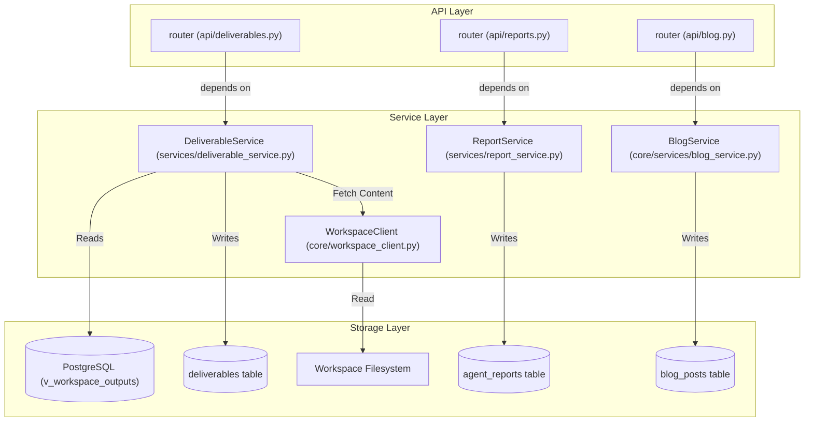
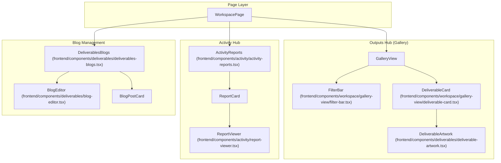

# Workspace Outputs Hub & Deliverables

Relevant source files

The following files were used as context for generating this wiki page:

- [.claude/scheduled_tasks.lock](.claude/scheduled_tasks.lock)
- [docs/PRDS/76-AGENT-REPORTING-WORKSPACE.md](docs/PRDS/76-AGENT-REPORTING-WORKSPACE.md)
- [frontend/components/activity/activity-reports.tsx](frontend/components/activity/activity-reports.tsx)
- [frontend/components/activity/report-grade-form.tsx](frontend/components/activity/report-grade-form.tsx)
- [frontend/components/activity/report-viewer.tsx](frontend/components/activity/report-viewer.tsx)
- [frontend/components/deliverables/blog-editor.tsx](frontend/components/deliverables/blog-editor.tsx)
- [frontend/components/deliverables/deliverable-artwork.tsx](frontend/components/deliverables/deliverable-artwork.tsx)
- [frontend/components/deliverables/deliverables-blogs.tsx](frontend/components/deliverables/deliverables-blogs.tsx)
- [frontend/components/icons/deliverable-icon.tsx](frontend/components/icons/deliverable-icon.tsx)
- [frontend/components/workspace/gallery-view/deliverable-card.tsx](frontend/components/workspace/gallery-view/deliverable-card.tsx)
- [frontend/components/workspace/gallery-view/deliverable-row.tsx](frontend/components/workspace/gallery-view/deliverable-row.tsx)
- [frontend/components/workspace/gallery-view/filter-bar.tsx](frontend/components/workspace/gallery-view/filter-bar.tsx)
- [frontend/hooks/use-blogs-api.ts](frontend/hooks/use-blogs-api.ts)
- [orchestrator/alembic/versions/prd129_deliverables.py](orchestrator/alembic/versions/prd129_deliverables.py)
- [orchestrator/alembic/versions/prd133b_outputs_view.py](orchestrator/alembic/versions/prd133b_outputs_view.py)
- [orchestrator/api/blog.py](orchestrator/api/blog.py)
- [orchestrator/api/reports.py](orchestrator/api/reports.py)
- [orchestrator/api/widgets/blog.py](orchestrator/api/widgets/blog.py)
- [orchestrator/core/llm/defaults.py](orchestrator/core/llm/defaults.py)
- [orchestrator/core/services/blog_service.py](orchestrator/core/services/blog_service.py)
- [orchestrator/modules/tools/discovery/actions_blog.py](orchestrator/modules/tools/discovery/actions_blog.py)
- [orchestrator/modules/tools/discovery/handlers_blog.py](orchestrator/modules/tools/discovery/handlers_blog.py)
- [orchestrator/modules/tools/discovery/workspace_actions.py](orchestrator/modules/tools/discovery/workspace_actions.py)
- [orchestrator/modules/tools/execution/exec_workspace.py](orchestrator/modules/tools/execution/exec_workspace.py)
- [orchestrator/scripts/seed_blog_playbook.py](orchestrator/scripts/seed_blog_playbook.py)
- [orchestrator/services/deliverable_service.py](orchestrator/services/deliverable_service.py)
- [orchestrator/services/report_service.py](orchestrator/services/report_service.py)
- [orchestrator/tests/services/test_deliverable_service.py](orchestrator/tests/services/test_deliverable_service.py)
- [orchestrator/tests/test_agent_token_budget.py](orchestrator/tests/test_agent_token_budget.py)
- [orchestrator/tests/test_blog_author_byline.py](orchestrator/tests/test_blog_author_byline.py)
- [orchestrator/tests/test_us010_power_mode_caps.py](orchestrator/tests/test_us010_power_mode_caps.py)

The **Workspace Outputs Hub** (PRD-129) is a centralized system for tracking, discovery, and visualization of all high-value assets produced by AI agents. While the workspace filesystem stores raw data, the Outputs Hub provides a metadata layer that enables a consumer-facing Gallery view with advanced filtering, previewing, and lifecycle management.

## System Architecture

The system follows a standard three-tier architecture: a PostgreSQL metadata store, a FastAPI service layer, and a Next.js frontend with specialized visualization components.

### Data Flow: Registration to Visualization

1.  **Registration**: Agents or system services (like Heartbeat or Reports) produce files in the workspace. The `execute_workspace_action` in the tool executor triggers `_auto_register_deliverable` upon successful file writes [orchestrator/modules/tools/execution/exec_workspace.py:43-56]().
2.  **Indexing**: The `DeliverableService` registers metadata (provenance, artifact type, file path) in the `deliverables` table using idempotent SQL [orchestrator/services/deliverable_service.py:156-174]().
3.  **Discovery**: The frontend `GalleryView` queries the `/api/deliverables` endpoint with filters (type, agent, date) [frontend/components/workspace/gallery-view/filter-bar.tsx:81-87]().
4.  **Retrieval**: When a user selects an item, the `DeliverablePreview` fetches metadata and, if requested, streams the actual file content from the workspace filesystem via `WorkspaceClient` [orchestrator/services/deliverable_service.py:56-71]().

### Code Entity Space Bridge (Backend)

The following diagram maps the logical components of the Outputs Hub to their specific implementations in the orchestrator.

Sources: [orchestrator/services/deliverable_service.py:5-9](), [orchestrator/services/report_service.py:152-154](), [orchestrator/api/reports.py:25-29](), [orchestrator/api/blog.py:25-29]()

## Data Model & Persistence

The system uses a unified view `v_workspace_outputs` which `UNION`s records from `blog_posts`, `agent_reports`, and `deliverables` [orchestrator/services/deliverable_service.py:5-9]().

### Schema Highlights
*   **Idempotency**: `DeliverableService.register` uses `ON CONFLICT (workspace_id, file_path)` to update metadata in place if an agent overwrites a file [orchestrator/services/deliverable_service.py:175-179]().
*   **Soft Delete**: The service routes deletes to the correct source table based on `artifact_type` [orchestrator/services/deliverable_service.py:13-14]().
*   **Classification**: Artifacts are categorized by extension into types such as `image`, `report`, `code`, `spreadsheet`, and `video` [orchestrator/services/deliverable_service.py:78-109]().

### Artifact Classification Logic
| Extension | Artifact Type |
| :--- | :--- |
| `.png`, `.jpg`, `.webp` | `image` |
| `.md`, `.markdown` | `report` |
| `.py`, `.js`, `.ts`, `.sql` | `code` |
| `.pdf`, `.docx`, `.txt` | `document` |
| `.xlsx`, `.csv` | `spreadsheet` |

Sources: [orchestrator/services/deliverable_service.py:78-109](), [orchestrator/services/deliverable_service.py:121-126]()

## Backend Service: DeliverableService

The `DeliverableService` encapsulates the business logic for the hub.

### Key Functions
*   **`register()`**: Idempotently upserts metadata. It refuses `blog_post` or `report` types directly, as those must be managed via their respective specialized services [orchestrator/services/deliverable_service.py:156-174]().
*   **`get_deliverable(include_content=True)`**: Retrieves metadata and optionally fetches content. For blog posts, content is returned from the DB; for others, it uses `WorkspaceClient` to fetch from the worker [orchestrator/services/deliverable_service.py:25-27]().
*   **`_infer_artifact_type()`**: Helper to determine category from file paths [orchestrator/services/deliverable_service.py:121-126]().
*   **`_workspace_file_url()`**: Generates internal API paths for the frontend, branching between `/files/raw` for binaries and `/files/content` for text [orchestrator/services/deliverable_service.py:56-71]().

Sources: [orchestrator/services/deliverable_service.py:31-71](), [orchestrator/modules/tools/execution/exec_workspace.py:43-56]()

## Frontend Architecture

The frontend provides a multi-view interface for interacting with workspace outputs.

### View States
Users can toggle between three primary modes:
1.  **Gallery**: The visual grid of `DeliverableCard` components.
2.  **Explorer**: Technical file browser and editor.
3.  **Activity**: Chronological feed, specifically leveraging `ActivityReports` for agent submissions [frontend/components/activity/activity-reports.tsx:113-125]().

### Code Entity Space Bridge (Frontend)

This diagram illustrates the component hierarchy and data fetching hooks.

Sources: [frontend/components/workspace/gallery-view/deliverable-card.tsx:69-80](), [frontend/components/activity/activity-reports.tsx:122-128](), [frontend/components/deliverables/deliverable-artwork.tsx:37-40](), [frontend/components/deliverables/deliverables-blogs.tsx:110-122](), [frontend/components/deliverables/blog-editor.tsx:54-55]()

### Gallery Components

#### DeliverableCard & Artwork
`DeliverableCard` renders a visual tile for each output. If the artifact is an image, it uses `useAuthenticatedBlobUrl` to show a preview [frontend/components/workspace/gallery-view/deliverable-card.tsx:82-83](). For other types, it renders custom SVG illustrations via `DeliverableArtwork` [frontend/components/deliverables/deliverable-artwork.tsx:21-40]().

#### FilterBar
The `FilterBar` provides multi-dimensional filtering:
*   **Search**: Local state with a 300ms debounce [frontend/components/workspace/gallery-view/filter-bar.tsx:101-102]().
*   **Type Filter**: Dropdown mapping to `artifact_type` [frontend/components/workspace/gallery-view/filter-bar.tsx:160-163]().
*   **Source Filter**: Dropdown for `chat`, `task`, `mission`, `heartbeat`, etc [frontend/components/workspace/gallery-view/filter-bar.tsx:63-71]().

### Agent Reporting Integration
Reports are a specialized form of deliverable managed by `ReportService` and `PlatformActionExecutor` [orchestrator/modules/tools/discovery/handlers_reports.py:14-21]().
*   **Submission**: Agents call `platform_submit_report` to save markdown content to `reports/{agent_dir}/` and index it in `agent_reports` [orchestrator/services/report_service.py:173-181]().
*   **Metrics**: The system automatically aggregates LLM usage and costs for the report context [orchestrator/services/report_service.py:39-48]().
*   **Grading**: Users can rate reports (1-5) via `grade_report` to provide feedback to agents [orchestrator/api/reports.py:124-132]().

Sources: [orchestrator/modules/tools/discovery/actions_reports.py:9-16](), [orchestrator/services/report_service.py:156-172](), [frontend/components/activity/activity-reports.tsx:72-75]()

### Blog Deliverables and Editor

The system supports blog posts as a specific type of deliverable, managed by the `BlogService` and exposed through dedicated API endpoints and a frontend editor.

#### Backend Blog Management
The `BlogService` [core/services/blog_service.py]() handles CRUD operations for blog posts.
*   **`create_post()`**: Creates a new blog post, saving its content and metadata to the `blog_posts` table. Agents can use the `platform_publish_blog_post` tool to create posts [orchestrator/modules/tools/discovery/handlers_blog.py:74-105](). This tool includes validation to reject placeholder content [orchestrator/modules/tools/discovery/handlers_blog.py:25-41]().
*   **`list_posts()`**: Retrieves a list of blog posts, with filtering options by status, category, and tags [orchestrator/modules/tools/discovery/handlers_blog.py:127-132]().
*   **`get_post()` / `get_post_by_slug()`**: Fetches a single blog post by ID or URL slug [orchestrator/modules/tools/discovery/handlers_blog.py:165-169]().
*   **`update_post()`**: Modifies an existing blog post [orchestrator/api/blog.py:143-153]().
*   **`publish_post()` / `unpublish_post()`**: Changes the status of a blog post to `published` or `draft` [orchestrator/api/blog.py:172-183]().
*   **`delete_post()`**: Soft-deletes a blog post by archiving it [orchestrator/api/blog.py:165-169]().

The `api/blog.py` router provides authenticated endpoints for these operations, requiring workspace permissions [orchestrator/api/blog.py:75-80](). The author name for public posts defaults to the workspace name [orchestrator/api/blog.py:31-40]().

#### Frontend Blog Editor
The `DeliverablesBlogs` component [frontend/components/deliverables/deliverables-blogs.tsx]() provides the main interface for viewing and managing blog posts.
*   **`BlogEmptyState`**: Displays a prompt to create a new post when none exist [frontend/components/deliverables/deliverables-blogs.tsx:91-104]().
*   **`BlogPostCard`**: Renders a summary card for each blog post, showing title, excerpt, status, tags, and actions like edit, publish, unpublish, and delete [frontend/components/deliverables/deliverables-blogs.tsx:110-122]().
*   **`BlogEditor`**: A sheet-based editor [frontend/components/deliverables/blog-editor.tsx:54-55]() for creating and updating blog posts. It supports:
    *   Manual content entry for title, content, excerpt, cover image URL, category, tags, and SEO metadata [frontend/components/deliverables/blog-editor.tsx:59-68]().
    *   Toggling publish status with a confirmation dialog for the first publish [frontend/components/deliverables/blog-editor.tsx:141-144]().
    *   Starting a "mission" to generate a blog post from a topic, leveraging `useCreateBlogMission` [frontend/components/deliverables/blog-editor.tsx:75-76](). This mission is seeded by `seed_blog_playbook.py` [orchestrator/scripts/seed_blog_playbook.py:74-145]() and uses agents like "QUILL" to scout topics and launch multi-agent research and writing [orchestrator/scripts/seed_blog_playbook.py:27-59]().
    *   Cover image upload functionality [frontend/components/deliverables/blog-editor.tsx:188-199]().
    *   A live markdown preview of the content [frontend/components/deliverables/blog-editor.tsx:107-109]().

Sources: [orchestrator/modules/tools/discovery/handlers_blog.py:74-105](), [orchestrator/modules/tools/discovery/handlers_blog.py:25-41](), [orchestrator/modules/tools/discovery/handlers_blog.py:127-132](), [orchestrator/modules/tools/discovery/handlers_blog.py:165-169](), [orchestrator/api/blog.py:143-153](), [orchestrator/api/blog.py:172-183](), [orchestrator/api/blog.py:165-169](), [orchestrator/api/blog.py:75-80](), [orchestrator/api/blog.py:31-40](), [frontend/components/deliverables/deliverables-blogs.tsx:91-104](), [frontend/components/deliverables/deliverables-blogs.tsx:110-122](), [frontend/components/deliverables/blog-editor.tsx:54-55](), [frontend/components/deliverables/blog-editor.tsx:59-68](), [frontend/components/deliverables/blog-editor.tsx:141-144](), [frontend/components/deliverables/blog-editor.tsx:75-76](), [orchestrator/scripts/seed_blog_playbook.py:74-145](), [orchestrator/scripts/seed_blog_playbook.py:27-59](), [frontend/components/deliverables/blog-editor.tsx:188-199](), [frontend/components/deliverables/blog-editor.tsx:107-109]()

---