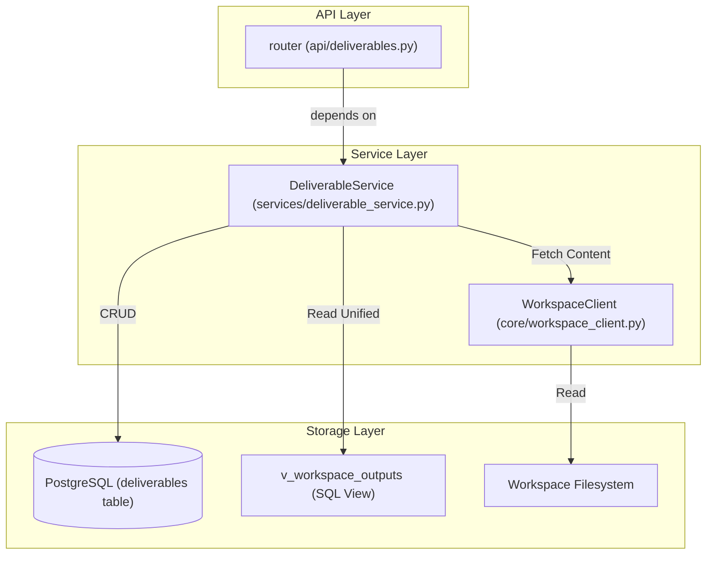
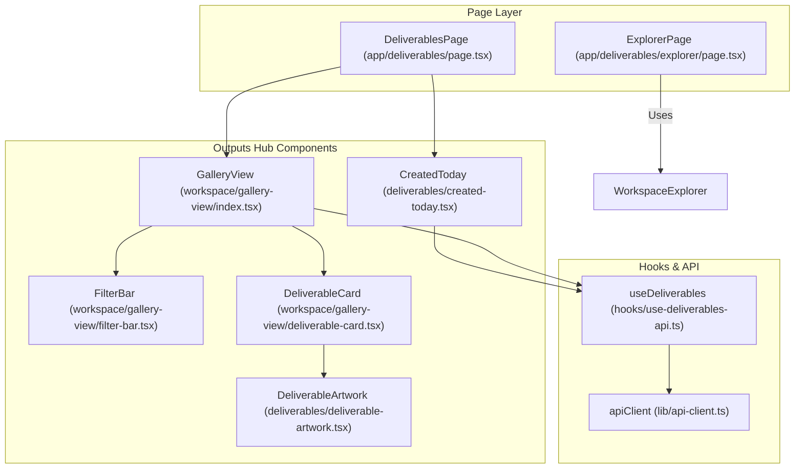

# Workspace Outputs Hub

Relevant source files

The following files were used as context for generating this wiki page:

- [frontend/app/activity/execution/page.tsx](frontend/app/activity/execution/page.tsx)
- [frontend/app/command-center/page.tsx](frontend/app/command-center/page.tsx)
- [frontend/app/deliverables/explorer/page.tsx](frontend/app/deliverables/explorer/page.tsx)
- [frontend/app/deliverables/page.tsx](frontend/app/deliverables/page.tsx)
- [frontend/app/settings/profile/page.tsx](frontend/app/settings/profile/page.tsx)
- [frontend/components/analytics/performance-analytics.tsx](frontend/components/analytics/performance-analytics.tsx)
- [frontend/components/context/context-engineering.tsx](frontend/components/context/context-engineering.tsx)
- [frontend/components/dashboard/dashboard-complex.tsx](frontend/components/dashboard/dashboard-complex.tsx)
- [frontend/components/dashboard/quick-actions.tsx](frontend/components/dashboard/quick-actions.tsx)
- [frontend/components/deliverables/blog-editor.tsx](frontend/components/deliverables/blog-editor.tsx)
- [frontend/components/deliverables/created-today.tsx](frontend/components/deliverables/created-today.tsx)
- [frontend/components/deliverables/deliverable-artwork.tsx](frontend/components/deliverables/deliverable-artwork.tsx)
- [frontend/components/deliverables/deliverables-blogs.tsx](frontend/components/deliverables/deliverables-blogs.tsx)
- [frontend/components/icons/deliverable-icon.tsx](frontend/components/icons/deliverable-icon.tsx)
- [frontend/components/landing/landing-page.tsx](frontend/components/landing/landing-page.tsx)
- [frontend/components/playbooks/PlaybooksPanel.tsx](frontend/components/playbooks/PlaybooksPanel.tsx)
- [frontend/components/workspace/gallery-view/deliverable-card.tsx](frontend/components/workspace/gallery-view/deliverable-card.tsx)
- [frontend/components/workspace/gallery-view/deliverable-row.tsx](frontend/components/workspace/gallery-view/deliverable-row.tsx)
- [frontend/components/workspace/gallery-view/filter-bar.tsx](frontend/components/workspace/gallery-view/filter-bar.tsx)
- [frontend/components/workspace/gallery-view/index.tsx](frontend/components/workspace/gallery-view/index.tsx)
- [frontend/hooks/use-deliverables-api.ts](frontend/hooks/use-deliverables-api.ts)
- [orchestrator/alembic/versions/prd129_deliverables.py](orchestrator/alembic/versions/prd129_deliverables.py)
- [orchestrator/alembic/versions/prd133b_outputs_view.py](orchestrator/alembic/versions/prd133b_outputs_view.py)
- [orchestrator/api/deliverables.py](orchestrator/api/deliverables.py)
- [orchestrator/services/deliverable_service.py](orchestrator/services/deliverable_service.py)
- [orchestrator/tests/api/__init__.py](orchestrator/tests/api/__init__.py)
- [orchestrator/tests/api/test_deliverables_api.py](orchestrator/tests/api/test_deliverables_api.py)
- [orchestrator/tests/services/__init__.py](orchestrator/tests/services/__init__.py)
- [orchestrator/tests/services/test_deliverable_service.py](orchestrator/tests/services/test_deliverable_service.py)

The **Workspace Outputs Hub** (PRD-129) is a centralized system for tracking, discovery, and visualization of all high-value assets produced by AI agents. While the workspace filesystem stores raw data, the Outputs Hub provides a metadata layer that enables a consumer-facing Gallery view with advanced filtering, previewing, and lifecycle management.

## System Architecture

The system follows a three-tier architecture: a PostgreSQL metadata store (with a unified view), a FastAPI service layer, and a Next.js frontend featuring specialized visualization components and a dedicated "Explorer" mode.

### Data Flow: Registration to Visualization

1.  **Registration**: Agents or system services produce files in the workspace.
2.  **Indexing**: The `DeliverableService` registers metadata (provenance, artifact type, file path) in the `deliverables` table [orchestrator/services/deliverable_service.py:156-174]().
3.  **Unified View**: The system reads from the `v_workspace_outputs` view, which unions `blog_posts`, `agent_reports`, and ad-hoc `deliverables` [orchestrator/services/deliverable_service.py:5-9]().
4.  **Discovery**: The frontend `GalleryView` queries the `/api/deliverables` endpoint with filters (type, agent, date) [frontend/components/workspace/gallery-view/index.tsx:83]().
5.  **Retrieval**: When a user selects an item, the `DeliverablePreview` fetches metadata and, if requested, streams the actual file content from the workspace filesystem via `WorkspaceClient` [orchestrator/services/deliverable_service.py:46-71]().

### Code Entity Space Bridge (Backend)

The following diagram maps the logical components of the Outputs Hub to their specific implementations in the orchestrator.

Sources: [orchestrator/api/deliverables.py:37-131](), [orchestrator/services/deliverable_service.py:1-31](), [orchestrator/alembic/versions/prd129_deliverables.py:22-56]()

## Data Model & Persistence

The `deliverables` table stores metadata for reports, images, documents, code, slides, spreadsheets, and media.

### Schema Highlights
*   **Idempotency**: A unique index `uq_deliverables_workspace_path` on `(workspace_id, file_path)` where `deleted_at IS NULL` ensures that agent overwrites update existing records instead of creating duplicates [orchestrator/alembic/versions/prd129_deliverables.py:71-73]().
*   **Soft Delete**: Items are never immediately purged; the `deleted_at` column manages visibility [orchestrator/alembic/versions/prd129_deliverables.py:53]().
*   **Classification**: Artifacts are categorized into types via file extension mapping (e.g., `.py` → `code`, `.png` → `image`) [orchestrator/services/deliverable_service.py:78-109]().

### Metadata Structure
| Field | Type | Description |
| :--- | :--- | :--- |
| `workspace_id` | UUID | Scopes the deliverable to a specific tenant. |
| `source_type` | VARCHAR | Origin: `chat`, `task`, `mission`, `heartbeat`, `playbook`, etc. |
| `artifact_type`| VARCHAR | Classification for UI icons and filtering. |
| `file_path` | VARCHAR | Relative path within the workspace filesystem. |
| `preview_url` | VARCHAR | Canonical URL for streaming content. |

Sources: [orchestrator/alembic/versions/prd129_deliverables.py:22-56](), [orchestrator/services/deliverable_service.py:156-174]()

## Backend Service: DeliverableService

The `DeliverableService` encapsulates the business logic for the hub, prioritizing a single source of truth for different artifact types.

### Key Functions
*   **`register()`**: Performs an idempotent upsert of deliverable metadata. It rejects `blog_post` or `report` types, forcing callers to use their respective specialized services [orchestrator/services/deliverable_service.py:11-14](), [orchestrator/services/deliverable_service.py:156-174]().
*   **`get_deliverable(include_content=True)`**: Retrieves metadata and optionally fetches file content. It enforces a `MAX_INLINE_CONTENT_BYTES` limit (1MB) to prevent OOM errors [orchestrator/services/deliverable_service.py:50-53]().
*   **`soft_delete()`**: Routes the update to the correct source table (e.g., `blog_posts` or `deliverables`) based on the row's `artifact_type` [orchestrator/services/deliverable_service.py:13-14]().
*   **`_workspace_file_url()`**: Helper that determines whether to use `/files/raw` (for binary/images) or `/files/content` (for text/code) [orchestrator/services/deliverable_service.py:56-71]().

Sources: [orchestrator/services/deliverable_service.py:1-174]()

## Frontend Architecture

The frontend provides a multi-tab interface for interacting with workspace outputs, located at `/deliverables`.

### View States
Users can toggle between primary modes using the `FilterTabs` component:
1.  **Outputs (Gallery)**: The high-level grid view of all artifacts [frontend/app/deliverables/page.tsx:79-86]().
2.  **Blogs**: Management interface for generated blog posts [frontend/app/deliverables/page.tsx:88-92]().
3.  **Templates**: Document template management [frontend/app/deliverables/page.tsx:94-98]().
4.  **Explorer**: A dedicated full-page file browser and editor mode [frontend/app/deliverables/page.tsx:73](), [frontend/app/deliverables/explorer/page.tsx:23-42]().

### Code Entity Space Bridge (Frontend)

This diagram illustrates the component hierarchy and data fetching hooks used in the Outputs Hub.

Sources: [frontend/app/deliverables/page.tsx:31-104](), [frontend/components/deliverables/created-today.tsx:173-182](), [frontend/components/workspace/gallery-view/deliverable-card.tsx:69-147]()

### Gallery Components

#### CreatedToday
A hero section that displays a horizontal scrolling row of deliverables registered within the current day. It uses the `useDeliverables` hook with a hardcoded `date_range='today'` filter [frontend/components/deliverables/created-today.tsx:69-75](), [frontend/components/deliverables/created-today.tsx:174]().

#### GalleryView & FilterBar
`GalleryView` manages the state of the output grid. The `FilterBar` provides:
*   **Debounced Search**: 300ms delay before triggering a metadata search [frontend/components/workspace/gallery-view/filter-bar.tsx:42-49]().
*   **Classification Filters**: Dropdowns for `artifact_type` (Reports, Images, Code, etc.) and `source_type` (Chat, Missions, Heartbeats) [frontend/components/workspace/gallery-view/filter-bar.tsx:52-71]().
*   **View Toggle**: Switch between Grid and List layouts [frontend/components/workspace/gallery-view/filter-bar.tsx:28]().

#### DeliverableCard & Artwork
`DeliverableCard` renders a visual preview. If the artifact is an image, it attempts to load the `preview_url` using `useAuthenticatedBlobUrl` [frontend/components/workspace/gallery-view/deliverable-card.tsx:82-83](). For non-image types, it renders a `DeliverableArtwork` component, which provides unique SVG illustrations for each `artifact_type` (e.g., `CodeArt`, `SpreadsheetArt`) [frontend/components/deliverables/deliverable-artwork.tsx:102-154]().

### Workspace Explorer Mode
The `/deliverables/explorer` page provides a full-viewport environment for technical file manipulation.
*   **Deep Linking**: Supports `?path=...` parameters to open specific files immediately [frontend/app/deliverables/explorer/page.tsx:29]().
*   **Navigation**: Includes a "Back to Deliverables" button to return to the Gallery view [frontend/app/deliverables/explorer/page.tsx:62]().
*   **Keybindings**: Pressing `Escape` automatically navigates back to the Outputs tab [frontend/app/deliverables/explorer/page.tsx:32-41]().

Sources: [frontend/app/deliverables/explorer/page.tsx:23-83](), [frontend/components/workspace/gallery-view/filter-bar.tsx:1-146](), [frontend/components/deliverables/deliverable-artwork.tsx:1-55]()

---