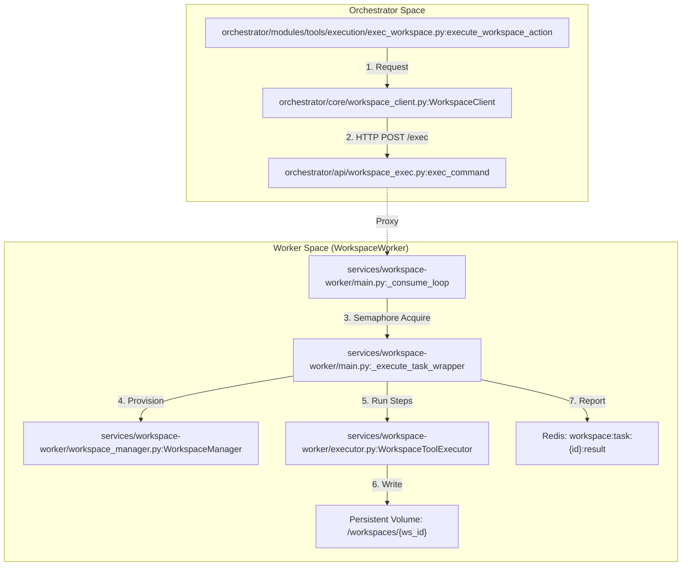
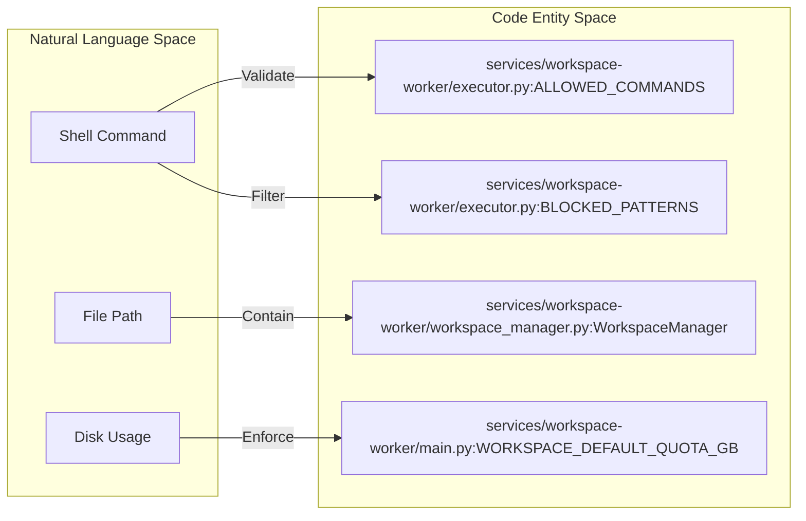

# Workspace Worker Architecture

Relevant source files

The following files were used as context for generating this wiki page:

- [frontend/components/widgets/CodingCanvasWidget/RepoSelector.tsx](frontend/components/widgets/CodingCanvasWidget/RepoSelector.tsx)
- [frontend/components/widgets/TerminalWidget/InteractiveTerminal.tsx](frontend/components/widgets/TerminalWidget/InteractiveTerminal.tsx)
- [frontend/components/widgets/TerminalWidget/index.tsx](frontend/components/widgets/TerminalWidget/index.tsx)
- [orchestrator/api/workspace_exec.py](orchestrator/api/workspace_exec.py)
- [orchestrator/api/workspace_github.py](orchestrator/api/workspace_github.py)
- [orchestrator/core/workspace_client.py](orchestrator/core/workspace_client.py)
- [orchestrator/modules/tools/discovery/workspace_actions.py](orchestrator/modules/tools/discovery/workspace_actions.py)
- [orchestrator/modules/tools/execution/exec_workspace.py](orchestrator/modules/tools/execution/exec_workspace.py)
- [services/workspace-worker/Dockerfile](services/workspace-worker/Dockerfile)
- [services/workspace-worker/entrypoint.sh](services/workspace-worker/entrypoint.sh)
- [services/workspace-worker/executor.py](services/workspace-worker/executor.py)
- [services/workspace-worker/main.py](services/workspace-worker/main.py)
- [services/workspace-worker/requirements.txt](services/workspace-worker/requirements.txt)

The **Workspace Worker** is a dedicated service responsible for executing background tasks within isolated, persistent filesystem environments. It operates as an asynchronous consumer of Redis-based priority queues, providing a secure boundary for agent-driven code execution, file operations, and GitHub integrations.

## Architecture Overview

The subsystem follows a producer-consumer pattern. The **Orchestrator API** (Producer) submits tasks to Redis, which are then consumed by the **Workspace Worker** (Consumer).

### Key Components

| Component | Role | Implementation |
|:---|:---|:---|
| `WorkspaceWorker` | The main ARQ-style consumer loop that polls Redis and manages task concurrency. | [services/workspace-worker/main.py:59-68]() |
| `WorkspaceManager` | Handles physical directory provisioning, storage quotas, and path safety. | [services/workspace-worker/workspace_manager.py:36-45]() |
| `WorkspaceToolExecutor` | Executes shell commands and file operations within a sandbox. | [services/workspace-worker/executor.py:108-113]() |
| `WorkspaceClient` | An async proxy used by the Orchestrator to communicate with the worker's HTTP API. | [orchestrator/core/workspace_client.py:56-61]() |

### System Data Flow: Task Execution
The following diagram illustrates the flow from a task submission in the API to execution on the worker's filesystem.

Sources: [orchestrator/modules/tools/execution/exec_workspace.py:183-192](), [orchestrator/core/workspace_client.py:153-160](), [services/workspace-worker/main.py:148-178](), [services/workspace-worker/executor.py:122-138]()

---

## Queue Management & Priority

The worker utilizes four distinct Redis lists to manage task priority. The `_dequeue_task` function polls these in strict order: `critical` > `high` > `normal` > `low` [services/workspace-worker/main.py:180-184]().

### Queue Definitions
*   `workspace:tasks:critical` [services/workspace-worker/main.py:45-45]()
*   `workspace:tasks:high` [services/workspace-worker/main.py:46-46]()
*   `workspace:tasks:normal` [services/workspace-worker/main.py:47-47]()
*   `workspace:tasks:low` [services/workspace-worker/main.py:48-48]()

The worker implements concurrency control via an `asyncio.Semaphore`, initialized by the `WORKER_CONCURRENCY` environment variable (default: 3) [services/workspace-worker/main.py:72-78]().

Sources: [services/workspace-worker/main.py:44-49](), [services/workspace-worker/main.py:186-194]()

---

## Workspace Isolation & Security

Security is enforced through a combination of path validation, command whitelisting, and resource quotas.

### 1. Command Whitelisting
The `WorkspaceToolExecutor` maintains a strict `ALLOWED_COMMANDS` set, including essential binaries like `git`, `python`, `pip`, `npm`, and standard Unix utilities [services/workspace-worker/executor.py:35-73](). It also uses regex patterns in `BLOCKED_PATTERNS` to prevent dangerous operations like `rm -rf /` or `sudo` [services/workspace-worker/executor.py:76-95]().

### 2. Path Safety
The `WorkspaceManager` provides path validation logic to prevent path traversal attacks by ensuring all resolved paths remain under the workspace root directory [services/workspace-worker/executor.py:8-10]().

### 3. Resource Quotas
Storage is limited per workspace (default 5GB). The worker enforces these quotas during file operations via `check_quota` to prevent disk exhaustion on the host [services/workspace-worker/main.py:17-17]().

### Security Entity Mapping

Sources: [services/workspace-worker/executor.py:35-95](), [services/workspace-worker/main.py:13-20]()

---

## Lifecycle & Heartbeat

The worker maintains its own health and reports status back to the system.

*   **Heartbeat**: The `_heartbeat_loop` runs periodically, updating a Redis key with the worker's ID and current timestamp to signal it is alive [services/workspace-worker/main.py:118]().
*   **Health Server**: A lightweight HTTP server runs on `WORKER_HEALTH_PORT` (default 8081) providing a `/health` endpoint for infrastructure monitoring [services/workspace-worker/main.py:73]().
*   **Graceful Shutdown**: Upon receiving `SIGTERM` or `SIGINT`, the worker sets `_running = False`, stops dequeuing new tasks, and waits for active tasks to complete before closing Redis and Database connections [services/workspace-worker/main.py:121-141]().

Sources: [services/workspace-worker/main.py:109-119](), [services/workspace-worker/main.py:143-147]()

---

## GitHub Integration

The `workspace_github.py` router provides endpoints for cloning repositories directly into the workspace volume.

*   **Cloning**: The `POST /clone` endpoint submits a task to the worker to perform a `git clone`. It supports HTTPS URLs and validates them against an allowlist (`github.com`, `gitlab.com`, `bitbucket.org`) [orchestrator/api/workspace_github.py:186-200]().
*   **Authentication**: It retrieves OAuth tokens via the `EntityManager` to allow cloning private repositories [orchestrator/api/workspace_github.py:54-62]().
*   **Safe Branching**: Branch names are validated against a strict regex to prevent injection [orchestrator/api/workspace_github.py:40-40](), [orchestrator/api/workspace_github.py:97-108]().

Sources: [orchestrator/api/workspace_github.py:36-41](), [orchestrator/api/workspace_github.py:186-200]()

---

## File Operations Proxy

The Orchestrator provides a proxy layer for both agents and the frontend to interact with the worker's filesystem via the `WorkspaceClient`.

| Endpoint | Function | Proxy Target |
|:---|:---|:---|
| `GET /files` | List directory contents | `WorkspaceClient.list_dir` [orchestrator/core/workspace_client.py:96-109]() |
| `GET /files/content` | Read file text | `WorkspaceClient.read_file` [orchestrator/core/workspace_client.py:68-81]() |
| `POST /exec` | Execute shell command | `WorkspaceClient.exec_command` [orchestrator/core/workspace_client.py:153-172]() |

### Deliverable Auto-Registration
When an agent writes a file via `workspace_write_file`, the `_auto_register_deliverable` helper automatically indexes it in the `DeliverableService` if it matches specific artifact types (e.g., PDFs, images, reports) [orchestrator/modules/tools/execution/exec_workspace.py:43-56]().

Sources: [orchestrator/core/workspace_client.py:56-172](), [orchestrator/modules/tools/execution/exec_workspace.py:43-119]()

---

## Interactive Terminal

The system includes an `InteractiveTerminal` component for the frontend, allowing users to run commands directly in the workspace.

*   **Command Proxy**: Commands entered in the UI are sent to `POST /api/workspaces/{id}/exec` [frontend/components/widgets/TerminalWidget/InteractiveTerminal.tsx:78-88]().
*   **Working Directory Tracking**: The terminal tracks the current working directory (`cwd`). If a user runs `cd`, the worker returns the new relative path, which the frontend adopts for subsequent commands [frontend/components/widgets/TerminalWidget/InteractiveTerminal.tsx:110-113]().
*   **ANSI Support**: Output is rendered using the `ansi-to-react` library to support terminal colors and formatting [frontend/components/widgets/TerminalWidget/InteractiveTerminal.tsx:215-217]().

Sources: [frontend/components/widgets/TerminalWidget/InteractiveTerminal.tsx:43-127](), [orchestrator/api/workspace_exec.py:31-52]()

---