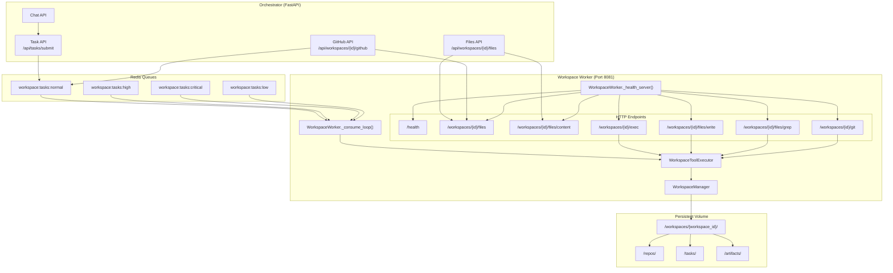
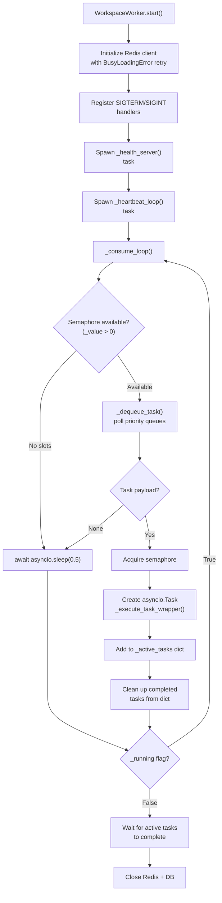
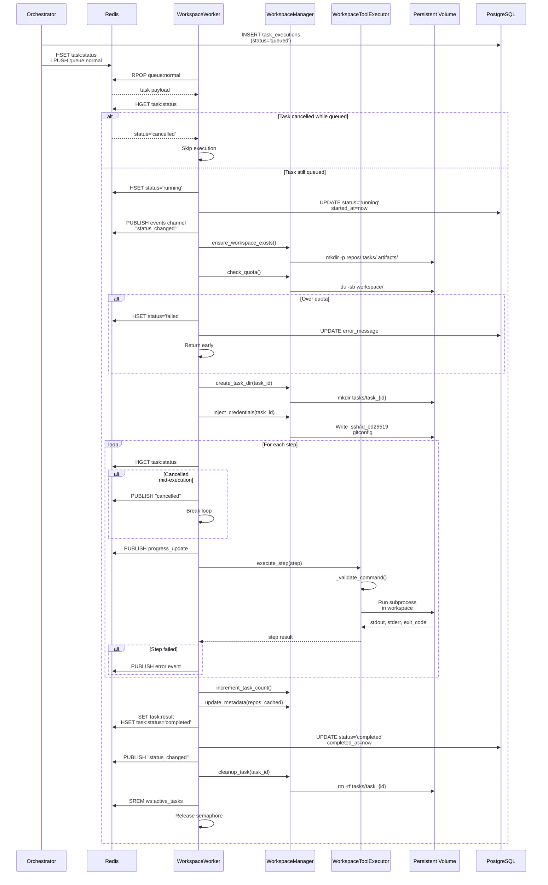
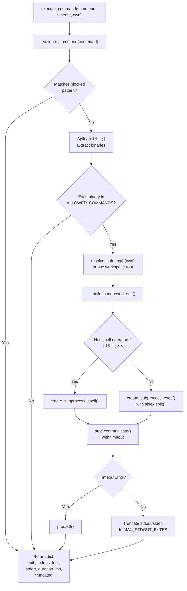
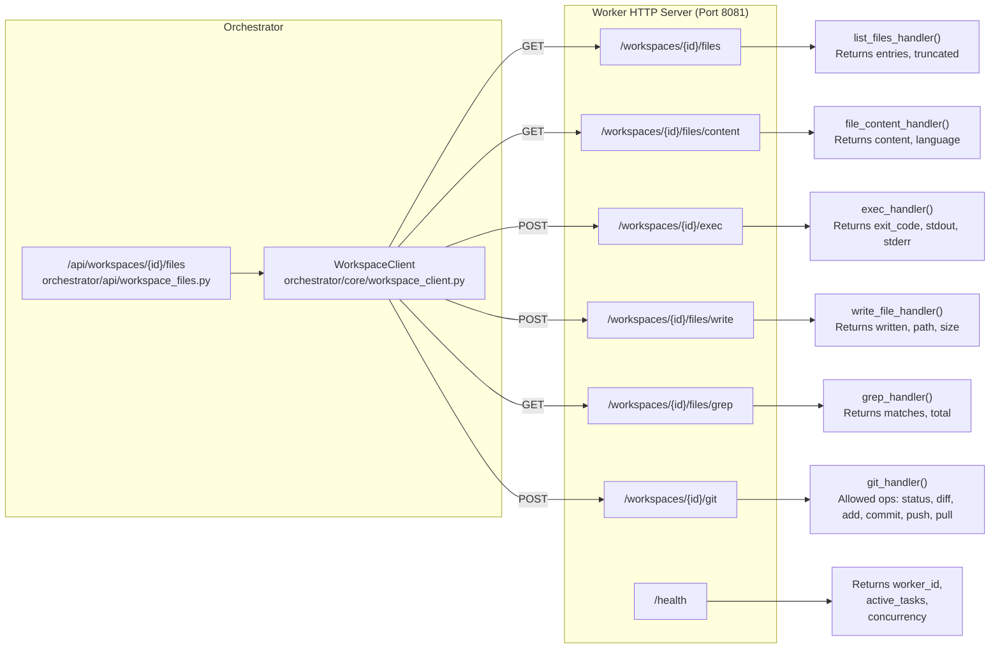
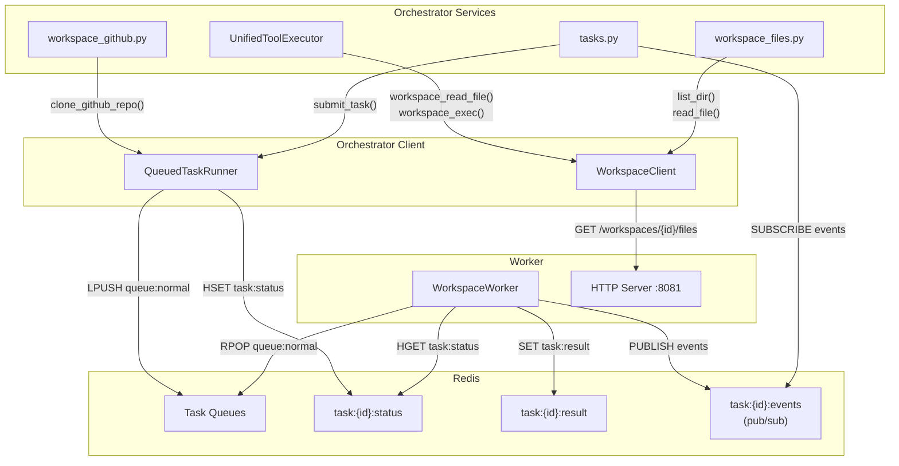
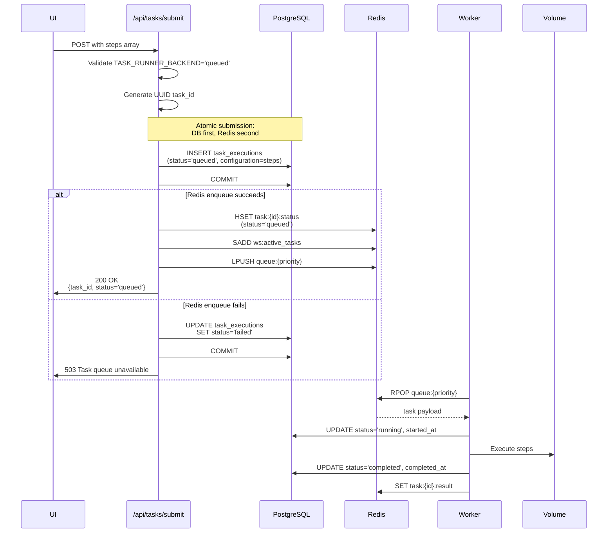

# Workspace Worker Architecture

<details>
<summary>Relevant source files</summary>

The following files were used as context for generating this wiki page:

- [frontend/components/widgets/CodingCanvasWidget/RepoSelector.tsx](frontend/components/widgets/CodingCanvasWidget/RepoSelector.tsx)
- [orchestrator/api/tasks.py](orchestrator/api/tasks.py)
- [orchestrator/api/widgets/cors.py](orchestrator/api/widgets/cors.py)
- [orchestrator/api/widgets/rate_limit.py](orchestrator/api/widgets/rate_limit.py)
- [orchestrator/api/workspace_files.py](orchestrator/api/workspace_files.py)
- [orchestrator/api/workspace_github.py](orchestrator/api/workspace_github.py)
- [orchestrator/core/workspace_client.py](orchestrator/core/workspace_client.py)
- [orchestrator/modules/tools/discovery/action_registry.py](orchestrator/modules/tools/discovery/action_registry.py)
- [orchestrator/modules/tools/discovery/workspace_actions.py](orchestrator/modules/tools/discovery/workspace_actions.py)
- [services/workspace-worker/executor.py](services/workspace-worker/executor.py)
- [services/workspace-worker/main.py](services/workspace-worker/main.py)
- [services/workspace-worker/workspace_manager.py](services/workspace-worker/workspace_manager.py)

</details>


The **Workspace Worker** is a standalone service that executes agent tasks in isolated filesystem environments. It operates independently from the orchestrator, consuming tasks from Redis queues and exposing an HTTP API for file operations. Each workspace gets its own persistent directory on a mounted volume, with sandboxed command execution, path safety validation, and storage quota enforcement.

For API endpoints that submit tasks to the worker, see [Task Management](#9.6). For GitHub repository integration via the worker, see [GitHub Integration](#9.2). For security policies and sandboxing details, see [Security & Sandboxing](#9.5).

---

## Architecture Overview

The workspace worker implements a **two-interface architecture**: a Redis queue consumer for long-running background tasks, and an HTTP server for synchronous file operations.

### Dual-Interface Design



**Sources:** [services/workspace-worker/main.py:1-832](), [orchestrator/api/workspace_files.py:1-108](), [orchestrator/api/workspace_github.py:1-294]()

---

## WorkspaceWorker Main Loop

The `WorkspaceWorker` class implements a priority-based task consumer with graceful shutdown, health reporting, and concurrent execution limits.

### Task Consumer Architecture



**Sources:** [services/workspace-worker/main.py:60-143](), [services/workspace-worker/main.py:149-204]()

### Key Configuration

| Environment Variable | Default | Purpose |
|---------------------|---------|---------|
| `REDIS_URL` | `redis://localhost:6379/0` | Redis connection string for task queues |
| `WORKER_CONCURRENCY` | `3` | Maximum concurrent task executions |
| `WORKER_HEALTH_PORT` | `8081` | HTTP server port for health checks and file API |
| `WORKSPACE_VOLUME_PATH` | `//workspaces` | Mount path for persistent workspace volume |
| `WORKSPACE_DEFAULT_QUOTA_GB` | `5` | Default storage quota per workspace |
| `WORKER_INTERNAL_TOKEN` | (empty) | Auth token for internal API calls (optional) |
| `WORKER_BIND_HOST` | `0.0.0.0` | HTTP server bind address |

**Sources:** [services/workspace-worker/main.py:16-19](), [services/workspace-worker/workspace_manager.py:32-33]()

---

## Task Execution Lifecycle

Tasks move through a state machine from `queued` → `running` → `completed`/`failed`/`timed_out`/`cancelled`. The worker updates both Redis (for real-time tracking) and PostgreSQL (for persistent history) at each transition.

### Task Execution Flow



**Sources:** [services/workspace-worker/main.py:205-358](), [services/workspace-worker/main.py:363-416]()

---

## WorkspaceManager: Filesystem Isolation

The `WorkspaceManager` class provides workspace provisioning, path safety, credential injection, and quota enforcement. Each workspace is a self-contained directory tree on the persistent volume.

### Workspace Directory Structure

```
/workspaces/{workspace_id}/
├── repos/                      ← Cloned repositories (persistent)
│   ├── my-app/
│   │   ├── .git/
│   │   ├── src/
│   │   └── package.json
│   └── my-lib/
├── tasks/                      ← Ephemeral task execution dirs
│   ├── task_{uuid1}/           ← Auto-cleaned after completion
│   └── task_{uuid2}/
├── artifacts/                  ← Build outputs, test reports (persistent)
│   ├── test-results.json
│   └── coverage/
├── .ssh/                       ← Injected credentials (per-task)
│   ├── id_ed25519              ← Deploy key (chmod 600)
│   └── config                  ← SSH config (StrictHostKeyChecking=no)
├── .gitconfig                  ← Per-workspace git identity
├── .task_env_{uuid}            ← Task-specific env vars (auto-cleaned)
└── .workspace_meta.json        ← Metadata (quota, repos, task count)
```

**Sources:** [services/workspace-worker/workspace_manager.py:10-18]()

### WorkspaceManager Methods

| Method | Purpose | Security |
|--------|---------|----------|
| `ensure_workspace_exists()` | Create directory tree on first use | Creates `repos/`, `tasks/`, `artifacts/` + `.workspace_meta.json` |
| `check_quota()` | Verify storage under `WORKSPACE_DEFAULT_QUOTA_GB` | Walks entire tree, returns False if over quota |
| `create_task_dir(task_id)` | Create ephemeral dir under `tasks/` | Returns `tasks/task_{task_id}/` path |
| `cleanup_task(task_id)` | Remove ephemeral task dir + credentials | `shutil.rmtree()` task dir + `.task_env_{task_id}` |
| `inject_credentials(task_id, creds)` | Write SSH key, git config, env vars | `.ssh/id_ed25519` with chmod 600 |
| `resolve_safe_path(relative)` | Validate path stays within workspace | Blocks `../`, symlinks, absolute paths, null bytes |
| `get_repo_path(name)` | Get path for a cached repo | Returns `repos/{sanitized_name}/` |
| `list_repos()` | List all cloned repos | Returns directory names from `repos/` |

**Sources:** [services/workspace-worker/workspace_manager.py:36-303]()

### Path Safety Validation

The `resolve_safe_path()` method is the security boundary for all file operations. It prevents directory traversal attacks by ensuring resolved paths stay within the workspace root.

```python
def resolve_safe_path(self, relative_path: str) -> Path:
    """Resolve a path and guarantee it stays within the workspace.
    
    Blocks: ../../ traversal, symlink escape, absolute paths, null bytes.
    """
    if "\x00" in relative_path:
        raise SecurityError(f"Null byte in path: workspace {self.workspace_id[:8]}")
    
    if relative_path.startswith("/"):
        raise SecurityError(f"Absolute path not allowed: {relative_path}")
    
    resolved = (self.root / relative_path).resolve()
    base_resolved = self.root.resolve()
    
    try:
        resolved.relative_to(base_resolved)
    except ValueError:
        raise SecurityError(
            f"Path traversal blocked: '{relative_path}' resolves outside "
            f"workspace {self.workspace_id[:8]}"
        )
    
    return resolved
```

**Sources:** [services/workspace-worker/workspace_manager.py:228-253]()

---

## WorkspaceToolExecutor: Sandboxed Execution

The `WorkspaceToolExecutor` class enforces command whitelisting, output limits, timeouts, and environment sandboxing for all shell commands executed in the workspace.

### Command Execution Flow



**Sources:** [services/workspace-worker/executor.py:122-224](), [services/workspace-worker/executor.py:448-500]()

### Command Whitelist

The `ALLOWED_COMMANDS` set contains only approved binaries. Any command not in this set is rejected before execution.

**Selected Whitelisted Commands:**

| Category | Commands |
|----------|----------|
| **Version Control** | `git` |
| **Python** | `python`, `python3`, `pip`, `pip3`, `uv`, `pytest`, `ruff`, `black`, `mypy`, `isort`, `flake8`, `coverage` |
| **Node.js** | `node`, `npm`, `npx`, `pnpm`, `yarn`, `vitest`, `jest`, `tsc`, `eslint`, `prettier` |
| **File Operations** | `ls`, `cat`, `grep`, `find`, `tree`, `wc`, `sort`, `head`, `tail`, `diff`, `jq`, `sed`, `awk` |
| **System Tools** | `curl`, `wget`, `make`, `cmake`, `tar`, `gzip`, `zip`, `touch`, `mkdir`, `cp`, `mv`, `rm` |
| **Other Runtimes** | `cargo`, `go`, `ruby`, `java`, `mvn`, `gradle`, `rustc`, `gcc` |

**Sources:** [services/workspace-worker/executor.py:35-73]()

### Blocked Patterns

Even if a binary is whitelisted, commands matching these regex patterns are always rejected:

```python
BLOCKED_PATTERNS: list[str] = [
    r"rm\s+-rf\s+/\s*$",        # rm -rf /
    r"rm\s+-rf\s+/[^w]",        # rm -rf /anything (but not /workspaces)
    r"\bsudo\b",                 # privilege escalation
    r"\bsu\s",                   # user switching
    r"\bchmod\s+777\b",          # dangerous permissions
    r"\bkubectl\b",              # k8s access
    r">\s*/dev/",                # device access
    r"\bmkfs\b",                 # filesystem formatting
    r"\bdd\s+if=",               # raw disk operations
    r"\biptables\b",             # firewall manipulation
    r"`",                        # backtick execution
    r"\n",                       # embedded newlines
]
```

**Sources:** [services/workspace-worker/executor.py:76-95]()

### Sandboxed Environment

The `_build_sandboxed_env()` method strips the host environment and provides only essential variables:

```python
def _build_sandboxed_env(self, extras: Optional[Dict[str, str]] = None) -> Dict[str, str]:
    env = {
        # Minimal PATH — only standard locations
        "PATH": "/usr/local/sbin:/usr/local/bin:/usr/sbin:/usr/bin:/sbin:/bin",
        # Workspace identity
        "WORKSPACE_ID": self.workspace_id,
        "HOME": str(self.ws.root),
        # Git config location
        "GIT_CONFIG_GLOBAL": str(self.ws.root / ".gitconfig"),
        # SSH config
        "GIT_SSH_COMMAND": f"ssh -F {self.ws.root / '.ssh' / 'config'} ...",
        # Locale
        "LANG": "en_US.UTF-8",
        "LC_ALL": "en_US.UTF-8",
        # Python
        "PYTHONDONTWRITEBYTECODE": "1",
        "PYTHONUNBUFFERED": "1",
        # Node
        "NODE_ENV": "test",
        "npm_config_cache": str(self.ws.root / ".npm_cache"),
    }
    if extras:
        env.update(extras)
    return env
```

**Sources:** [services/workspace-worker/executor.py:506-536]()

---

## HTTP API for File Operations

The worker exposes an HTTP server on port 8081 (configurable via `WORKER_HEALTH_PORT`) for synchronous file operations. The orchestrator proxies requests to this API via the `WorkspaceClient`.

### HTTP Endpoints



**Sources:** [services/workspace-worker/main.py:461-818]()

### Endpoint Details

| Endpoint | Method | Purpose | Returns |
|----------|--------|---------|---------|
| `/health` | GET | Health check | `{status, worker_id, active_tasks, concurrency, volume_path}` |
| `/workspaces/{id}/files` | GET | List directory (`?path=.`) | `{path, entries: [{name, type, size, modified_at}], truncated}` |
| `/workspaces/{id}/files/content` | GET | Read file content (`?path=file.py`) | `{path, name, content, size, language, mime_type}` |
| `/workspaces/{id}/exec` | POST | Execute command | `{exit_code, stdout, stderr, duration_ms, truncated}` |
| `/workspaces/{id}/files/write` | POST | Write file | `{written, path, size_bytes}` |
| `/workspaces/{id}/files/grep` | GET | Search pattern (`?pattern=TODO`) | `{matches: [{file, line, content}], total, truncated}` |
| `/workspaces/{id}/git` | POST | Git operation | `{exit_code, stdout, stderr, duration_ms}` |

**Sources:** [services/workspace-worker/main.py:516-818]()

### Internal Authentication

If `WORKER_INTERNAL_TOKEN` is set, the HTTP server requires an `X-Internal-Token` header on all non-health requests. The orchestrator includes this token via `WorkspaceClient._get_client()`.

```python
@web.middleware
async def internal_auth_middleware(request, handler):
    # Health endpoint is always public
    if request.path == "/health":
        return await handler(request)
    # If token is configured, enforce it
    if internal_token:
        req_token = request.headers.get("X-Internal-Token", "")
        if req_token != internal_token:
            return web.json_response({"error": "Unauthorized"}, status=401)
    return await handler(request)
```

**Sources:** [services/workspace-worker/main.py:501-512](), [orchestrator/core/workspace_client.py:28-39]()

---

## Integration with Orchestrator

The orchestrator interacts with the workspace worker through two channels: task submission (Redis) and file operations (HTTP).

### Orchestrator-Worker Communication



**Sources:** [orchestrator/core/workspace_client.py:56-176](), [orchestrator/api/tasks.py:62-174]()

### WorkspaceClient Methods

The `WorkspaceClient` class provides an async HTTP client interface to the worker's file operations:

```python
class WorkspaceClient:
    def __init__(self, workspace_id: str) -> None:
        self.workspace_id = workspace_id
    
    async def read_file(self, path: str) -> Dict[str, Any]:
        """Read a file from the workspace."""
        # GET /workspaces/{workspace_id}/files/content?path={path}
    
    async def write_file(self, path: str, content: str) -> Dict[str, Any]:
        """Write or create a file in the workspace."""
        # POST /workspaces/{workspace_id}/files/write
    
    async def list_dir(self, path: str = ".") -> Dict[str, Any]:
        """List directory contents."""
        # GET /workspaces/{workspace_id}/files?path={path}
    
    async def grep(self, pattern: str, path: str = ".", 
                   include: str = "", max_results: int = 50) -> Dict[str, Any]:
        """Search for a regex pattern across workspace files."""
        # GET /workspaces/{workspace_id}/files/grep?pattern={pattern}
    
    async def exec_command(self, command: str, cwd: Optional[str] = None, 
                          timeout: int = 120) -> Dict[str, Any]:
        """Run a sandboxed shell command in the workspace."""
        # POST /workspaces/{workspace_id}/exec
    
    async def git(self, operation: str, cwd: Optional[str] = None, 
                  args: str = "") -> Dict[str, Any]:
        """Execute a git operation (status, diff, add, commit, push, etc.)."""
        # POST /workspaces/{workspace_id}/git
```

**Sources:** [orchestrator/core/workspace_client.py:56-185]()

---

## Task Submission Flow

Tasks can be submitted via two routes: direct API submission (`/api/tasks/submit`) or agent-initiated operations (GitHub clone, recipe step execution).

### Task Submission Sequence



**Sources:** [orchestrator/api/tasks.py:62-174](), [orchestrator/api/workspace_github.py:167-293]()

---

## Redis Key Patterns

The worker uses Redis for task coordination, status tracking, and real-time events. All keys have TTL to prevent unbounded growth.

### Task-Related Keys

| Key Pattern | Type | TTL | Purpose |
|-------------|------|-----|---------|
| `workspace:task:{task_id}:status` | Hash | 7200s | Task status, worker_id, timestamps |
| `workspace:task:{task_id}:result` | String (JSON) | 3600s | Final execution result |
| `workspace:task:{task_id}:events` | Pub/Sub | N/A | Real-time event stream (SSE) |
| `workspace:ws:{workspace_id}:active_tasks` | Set | ∞ | Currently running tasks for workspace |
| `workspace:worker:{worker_id}:heartbeat` | String | 60s | Worker health timestamp |
| `workspace:worker:{worker_id}:tasks` | Set | 60s | Task IDs this worker is executing |

### Queue Keys

| Key | Type | Priority | Purpose |
|-----|------|----------|---------|
| `workspace:tasks:critical` | List | 1 (highest) | Critical-priority tasks |
| `workspace:tasks:high` | List | 2 | High-priority tasks |
| `workspace:tasks:normal` | List | 3 | Normal-priority tasks (default) |
| `workspace:tasks:low` | List | 4 (lowest) | Low-priority tasks |

**Sources:** [services/workspace-worker/main.py:44-58]()

---

## Health Check and Heartbeat

The worker reports health via two mechanisms: an HTTP `/health` endpoint and periodic heartbeat updates to Redis.

### Health Server

```python
async def health_handler(request):
    return web.json_response({
        "status": "healthy",
        "worker_id": self._worker_id,
        "active_tasks": len(self._active_tasks),
        "concurrency": self.concurrency,
        "volume_path": volume_path,
    })
```

**Sources:** [services/workspace-worker/main.py:516-523]()

### Heartbeat Loop

The worker updates Redis every 30 seconds with its health status and active task IDs:

```python
async def _heartbeat_loop(self) -> None:
    """Report worker health to Redis every 30s."""
    heartbeat_key = f"workspace:worker:{self._worker_id}:heartbeat"
    tasks_key = f"workspace:worker:{self._worker_id}:tasks"
    
    while self._running:
        try:
            await self._redis.set(heartbeat_key, str(int(time.time())), ex=60)
            # Report active task IDs
            active_ids = list(self._active_tasks.keys())
            if active_ids:
                await self._redis.delete(tasks_key)
                await self._redis.sadd(tasks_key, *active_ids)
                await self._redis.expire(tasks_key, 60)
            else:
                await self._redis.delete(tasks_key)
        except Exception as e:
            logger.warning("Heartbeat failed: %s", e)
        
        await asyncio.sleep(30)
```

**Sources:** [services/workspace-worker/main.py:440-459]()

---

## Graceful Shutdown

The worker handles `SIGTERM` and `SIGINT` by setting the `_running` flag to `False`, which stops the consume loop. It then waits for all active tasks to complete before closing connections.

```python
def _handle_shutdown(self) -> None:
    """Signal handler for graceful shutdown."""
    logger.info("Shutdown signal received")
    self._running = False

async def start(self) -> None:
    # ... startup code ...
    try:
        await self._consume_loop()
    except asyncio.CancelledError:
        pass
    finally:
        logger.info("Shutting down worker %s...", self._worker_id)
        # Wait for active tasks to finish
        if self._active_tasks:
            logger.info("Waiting for %d active tasks...", len(self._active_tasks))
            await asyncio.gather(*self._active_tasks.values(), return_exceptions=True)
        
        health_task.cancel()
        heartbeat_task.cancel()
        
        if self._redis:
            await self._redis.aclose()
        
        if self._db_engine:
            self._db_engine.dispose()
        
        logger.info("Worker %s shutdown complete", self._worker_id)
```

**Sources:** [services/workspace-worker/main.py:144-142]()

---

## Sensitive Path Filtering

The HTTP server blocks access to sensitive files and directories that should never be exposed via file browsing or reading endpoints.

```python
_SENSITIVE_NAMES = {".ssh", ".gitconfig", ".aws", ".gcp", ".workspace_meta.json"}

def _is_sensitive(name: str) -> bool:
    """Check if a file/dir name is sensitive and should be hidden."""
    if name in _SENSITIVE_NAMES:
        return True
    if name.startswith(".task_env_"):
        return True
    return False
```

When listing directories or reading files, the server traverses the path components and rejects access if any part is sensitive:

```python
# Block access to sensitive paths
for part in target.relative_to(ws_dir.resolve()).parts:
    if _is_sensitive(part):
        return web.json_response({"error": "Access denied"}, status=403)
```

**Sources:** [services/workspace-worker/main.py:473-481](), [services/workspace-worker/main.py:545-548](), [services/workspace-worker/main.py:609-611]()

---

## Docker Compose Integration

The workspace worker is orchestrated via `docker-compose.yml` with the `workers` profile. It mounts the `workspace_data` volume and exposes port 8081 for internal HTTP API access.

```yaml
workspace-worker:
  build:
    context: .
    dockerfile: services/workspace-worker/Dockerfile
  container_name: automatos-workspace-worker
  restart: unless-stopped
  profiles: ["workers", "all"]
  depends_on:
    backend:
      condition: service_healthy
  environment:
    - REDIS_URL=redis://redis:6379/0
    - DATABASE_URL=${DATABASE_URL}
    - WORKER_CONCURRENCY=3
    - WORKER_HEALTH_PORT=8081
    - WORKSPACE_VOLUME_PATH=/workspaces
    - WORKSPACE_DEFAULT_QUOTA_GB=5
    - WORKER_INTERNAL_TOKEN=${WORKER_INTERNAL_TOKEN:-}
    - LOG_LEVEL=${LOG_LEVEL:-INFO}
  volumes:
    - workspace_data:/workspaces
  ports:
    - "8081:8081"
  networks:
    - automatos-network
```

**Sources:** [docker-compose.yml:1-282]() (workspace-worker service definition)

---

## Summary Table: Component Responsibilities

| Component | File | Responsibility |
|-----------|------|----------------|
| `WorkspaceWorker` | [services/workspace-worker/main.py:60-819]() | Main consumer loop, task orchestration, HTTP server |
| `WorkspaceManager` | [services/workspace-worker/workspace_manager.py:36-308]() | Filesystem provisioning, path safety, quota enforcement |
| `WorkspaceToolExecutor` | [services/workspace-worker/executor.py:108-537]() | Command execution, validation, sandboxing |
| `WorkspaceClient` | [orchestrator/core/workspace_client.py:56-185]() | Async HTTP client for orchestrator → worker calls |
| Task API | [orchestrator/api/tasks.py:62-403]() | Task submission, listing, cancellation, SSE streaming |
| Files API | [orchestrator/api/workspace_files.py:34-107]() | Proxy endpoints for file browsing from frontend |
| GitHub API | [orchestrator/api/workspace_github.py:97-293]() | Repository listing and cloning via Composio |

**Sources:** All files listed in table

---