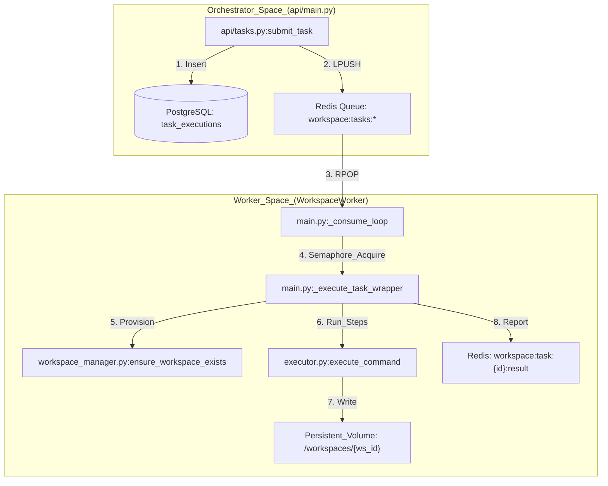
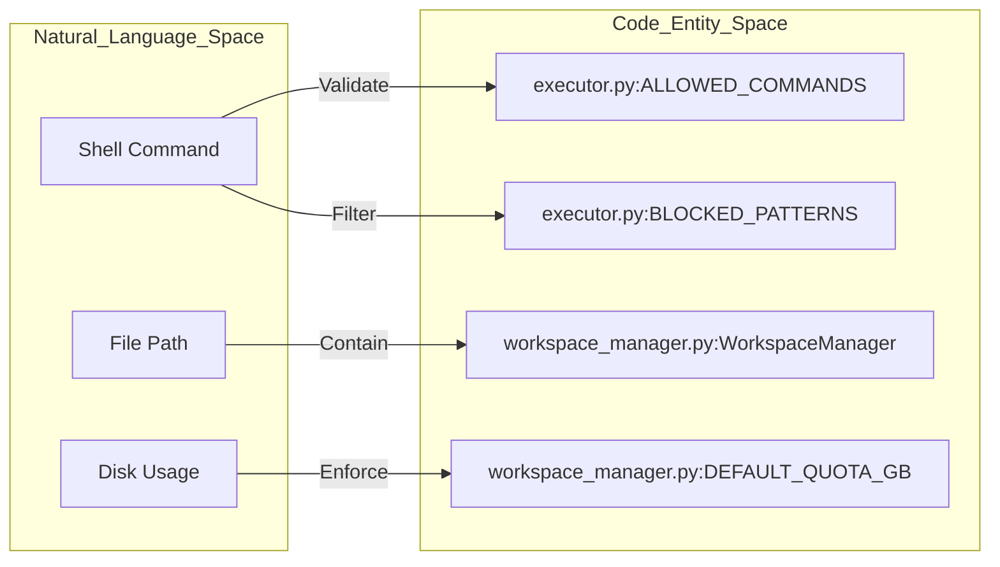
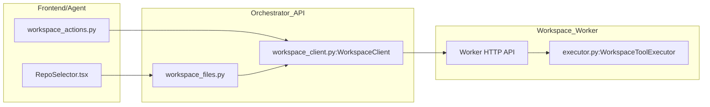

# Workspace Worker Architecture

Relevant source files

The following files were used as context for generating this wiki page:

- [frontend/components/widgets/CodingCanvasWidget/RepoSelector.tsx](frontend/components/widgets/CodingCanvasWidget/RepoSelector.tsx)
- [orchestrator/api/main.py](orchestrator/api/main.py)
- [orchestrator/api/tasks.py](orchestrator/api/tasks.py)
- [orchestrator/api/widgets/cors.py](orchestrator/api/widgets/cors.py)
- [orchestrator/api/widgets/rate_limit.py](orchestrator/api/widgets/rate_limit.py)
- [orchestrator/api/workspace_files.py](orchestrator/api/workspace_files.py)
- [orchestrator/api/workspace_github.py](orchestrator/api/workspace_github.py)
- [orchestrator/core/workspace_client.py](orchestrator/core/workspace_client.py)
- [orchestrator/modules/tools/discovery/workspace_actions.py](orchestrator/modules/tools/discovery/workspace_actions.py)
- [services/workspace-worker/executor.py](services/workspace-worker/executor.py)
- [services/workspace-worker/main.py](services/workspace-worker/main.py)
- [services/workspace-worker/workspace_manager.py](services/workspace-worker/workspace_manager.py)

The **Workspace Worker** is a dedicated service responsible for executing background tasks within isolated, persistent filesystem environments. It operates as an asynchronous consumer of Redis-based priority queues, providing a secure boundary for agent-driven code execution, file operations, and GitHub integrations.

## Architecture Overview

The subsystem follows a producer-consumer pattern. The **Orchestrator API** (Producer) submits tasks to Redis, which are then consumed by the **Workspace Worker** (Consumer).

### Key Components

| Component | Role | Implementation |
|:---|:---|:---|
| `WorkspaceWorker` | The main ARQ-style consumer loop that polls Redis and manages task concurrency via semaphores. | [services/workspace-worker/main.py:58-67]() |
| `WorkspaceManager` | Handles physical directory provisioning, storage quotas, and path safety validation. | [services/workspace-worker/workspace_manager.py:36-45]() |
| `WorkspaceToolExecutor` | Executes shell commands and file operations within a sandbox, enforcing whitelists. | [services/workspace-worker/executor.py:108-113]() |
| `WorkspaceClient` | An async proxy used by the Orchestrator to communicate with the worker's HTTP API. | [orchestrator/core/workspace_client.py:56-61]() |

### System Data Flow: Task Execution
The following diagram illustrates the flow from a task submission in the API to execution on the worker's filesystem.

Sources: [orchestrator/api/tasks.py:62-124](), [orchestrator/api/tasks.py:133-151](), [services/workspace-worker/main.py:147-178](), [services/workspace-worker/main.py:43-48]()

---

## Queue Management & Priority

The worker utilizes four distinct Redis lists to manage task priority. The `_dequeue_task` function polls these in strict order: `critical` > `high` > `normal` > `low`.

### Queue Definitions
*   `workspace:tasks:critical` [services/workspace-worker/main.py:44]()
*   `workspace:tasks:high` [services/workspace-worker/main.py:45]()
*   `workspace:tasks:normal` [services/workspace-worker/main.py:46]()
*   `workspace:tasks:low` [services/workspace-worker/main.py:47]()

The worker implements concurrency control via an `asyncio.Semaphore`, initialized by the `WORKER_CONCURRENCY` environment variable (default: 3) [services/workspace-worker/main.py:71-77]().

Sources: [services/workspace-worker/main.py:43-48](), [services/workspace-worker/main.py:180-194]()

---

## Workspace Isolation & Security

Security is enforced through a combination of path validation, command whitelisting, and resource quotas.

### 1. Command Whitelisting
The `WorkspaceToolExecutor` maintains a strict `ALLOWED_COMMANDS` set, including essential binaries like `git`, `python`, `pip`, `npm`, `uv`, and standard Unix utilities [services/workspace-worker/executor.py:35-73](). It also uses regex patterns in `BLOCKED_PATTERNS` to prevent dangerous operations like `rm -rf /` or `sudo` [services/workspace-worker/executor.py:76-95]().

### 2. Path Safety
The `WorkspaceManager` provides `resolve_safe_path`, which prevents path traversal attacks by ensuring all resolved paths remain under the workspace root directory [services/workspace-worker/workspace_manager.py:44]().

### 3. Resource Quotas
Storage is limited per workspace (default 5GB). The worker enforces these quotas via `check_quota` during file operations to prevent disk exhaustion on the host [services/workspace-worker/workspace_manager.py:33-51]().

### Security Entity Mapping

Sources: [services/workspace-worker/executor.py:35-95](), [services/workspace-worker/workspace_manager.py:33-51](), [services/workspace-worker/workspace_manager.py:97-106]()

---

## Lifecycle & Heartbeat

The worker maintains its own health and reports status back to the system.

*   **Heartbeat**: The `_heartbeat_loop` runs periodically, updating a Redis key with the worker's ID and current timestamp to signal it is alive [services/workspace-worker/main.py:117]().
*   **Health Server**: A lightweight HTTP server runs on `WORKER_HEALTH_PORT` (default 8081) providing a `/health` endpoint for infrastructure monitoring [services/workspace-worker/main.py:72]().
*   **Graceful Shutdown**: Upon receiving `SIGTERM` or `SIGINT`, the worker sets `_running = False`, stops dequeuing new tasks, and waits for active tasks to complete before closing Redis and Database connections [services/workspace-worker/main.py:108-140]().

Sources: [services/workspace-worker/main.py:108-118](), [services/workspace-worker/main.py:142-146]()

---

## GitHub Integration

The `workspace_github.py` router provides endpoints for cloning repositories directly into the workspace volume.

*   **Cloning**: The `POST /clone` endpoint submits a task to the worker to perform a `git clone`. It supports HTTPS URLs and validates them against an allowlist (`github.com`, `gitlab.com`, `bitbucket.org`) [orchestrator/api/workspace_github.py:167-190]().
*   **Authentication**: It retrieves OAuth tokens via the `EntityManager` to allow cloning private repositories [orchestrator/api/workspace_github.py:47-58]().
*   **Frontend**: The `RepoSelector` component allows users to browse and trigger clones from the UI [frontend/components/widgets/CodingCanvasWidget/RepoSelector.tsx:39-44]().

Sources: [orchestrator/api/workspace_github.py:36-41](), [orchestrator/api/workspace_github.py:167-190](), [frontend/components/widgets/CodingCanvasWidget/RepoSelector.tsx:69-88]()

---

## File Operations Proxy

The Orchestrator provides a proxy layer for the frontend and agents to interact with the worker's filesystem via the `WorkspaceClient`.

| Endpoint | Function | Proxy Target |
|:---|:---|:---|
| `GET /files` | List directory contents | `WorkspaceClient.list_dir` |
| `GET /files/content` | Read file text | `WorkspaceClient.read_file` |
| `POST /exec` | Execute shell command | `WorkspaceClient.exec_command` |

### Proxy Architecture

Sources: [orchestrator/api/workspace_files.py:34-107](), [orchestrator/core/workspace_client.py:68-153](), [orchestrator/modules/tools/discovery/workspace_actions.py:15-160]()

---

## Security & Rate Limiting

The system enforces strict access controls and rate limits on widget-related workspace operations.

*   **CORS**: `WidgetCORSMiddleware` handles dynamic origin validation for widget endpoints [orchestrator/api/widgets/cors.py:36-40]().
*   **Rate Limiting**: `WidgetRateLimitMiddleware` implements a sliding-window counter per API key to prevent abuse of workspace execution resources [orchestrator/api/widgets/rate_limit.py:85-102]().

Sources: [orchestrator/api/widgets/cors.py:36-92](), [orchestrator/api/widgets/rate_limit.py:37-78]()

---