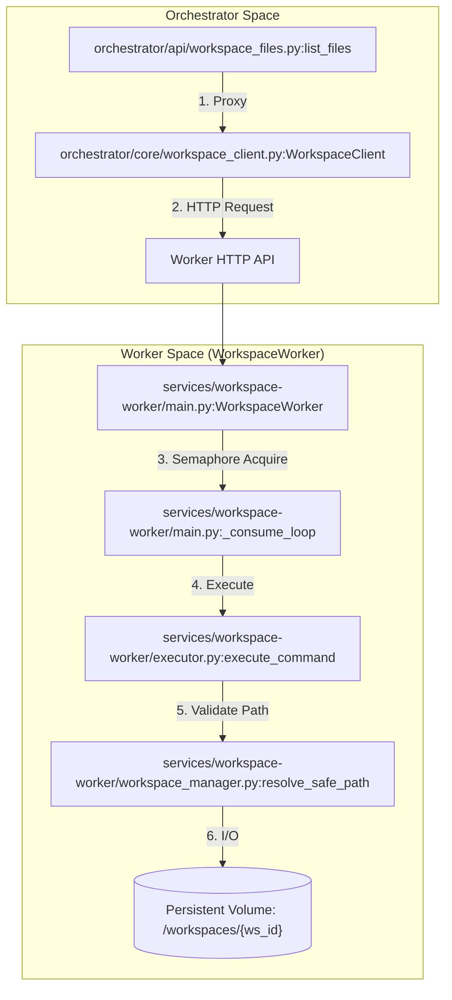
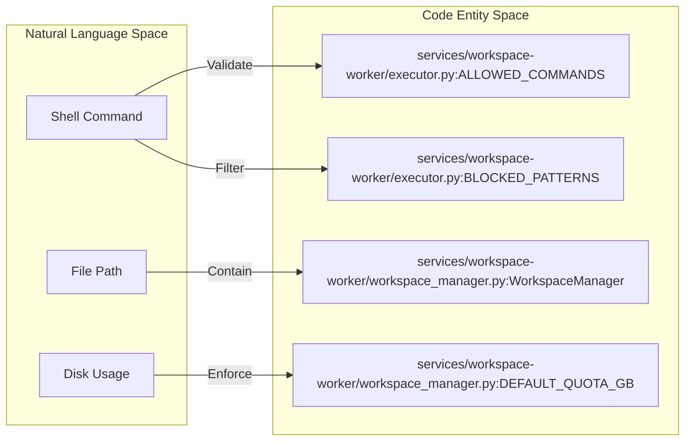

# Workspace Worker Architecture

Relevant source files

The following files were used as context for generating this wiki page:

- [frontend/components/widgets/TerminalWidget/InteractiveTerminal.tsx](frontend/components/widgets/TerminalWidget/InteractiveTerminal.tsx)
- [frontend/components/widgets/TerminalWidget/index.tsx](frontend/components/widgets/TerminalWidget/index.tsx)
- [orchestrator/api/workspace_files.py](orchestrator/api/workspace_files.py)
- [orchestrator/core/workspace_client.py](orchestrator/core/workspace_client.py)
- [orchestrator/modules/tools/discovery/canvas_git.py](orchestrator/modules/tools/discovery/canvas_git.py)
- [orchestrator/tests/test_prd170_canvas_git.py](orchestrator/tests/test_prd170_canvas_git.py)
- [orchestrator/tests/test_prd170_canvas_session_manager.py](orchestrator/tests/test_prd170_canvas_session_manager.py)
- [orchestrator/tests/test_prd203_cs8_worker_auth.py](orchestrator/tests/test_prd203_cs8_worker_auth.py)
- [services/workspace-worker/Dockerfile](services/workspace-worker/Dockerfile)
- [services/workspace-worker/canvas_confinement.py](services/workspace-worker/canvas_confinement.py)
- [services/workspace-worker/canvas_session_service.py](services/workspace-worker/canvas_session_service.py)
- [services/workspace-worker/entrypoint.sh](services/workspace-worker/entrypoint.sh)
- [services/workspace-worker/executor.py](services/workspace-worker/executor.py)
- [services/workspace-worker/main.py](services/workspace-worker/main.py)
- [services/workspace-worker/requirements.txt](services/workspace-worker/requirements.txt)
- [services/workspace-worker/worker_config.py](services/workspace-worker/worker_config.py)
- [services/workspace-worker/workspace_manager.py](services/workspace-worker/workspace_manager.py)

The **Workspace Worker** is a dedicated service responsible for executing background tasks within isolated, persistent filesystem environments. It operates as an asynchronous consumer of Redis-based priority queues, providing a secure boundary for agent-driven code execution, file operations, and headless agent sessions (Code Canvas).

## Architecture Overview

The subsystem follows a producer-consumer pattern. The **Orchestrator API** (Producer) submits tasks or proxies HTTP requests to the **Workspace Worker** (Consumer). The worker is packaged as a Docker container containing a full DevOps toolchain (Git, Node.js, Python, Playwright) to support agent activities [services/workspace-worker/Dockerfile:5-27]().

### Key Components

| Component | Role | Implementation |
|:---|:---|:---|
| `WorkspaceWorker` | The main ARQ-style consumer loop that polls Redis and manages task concurrency via a semaphore. | [services/workspace-worker/main.py:62-82]() |
| `WorkspaceManager` | Manages physical directory provisioning, storage quotas (default 5GB), and path safety. | [services/workspace-worker/workspace_manager.py:40-56]() |
| `WorkspaceToolExecutor` | Executes shell commands and file operations within a sandbox using a command whitelist. | [services/workspace-worker/executor.py:108-117]() |
| `CanvasSessionManager` | Manages headless Claude Agent SDK sessions for interactive "Code Canvas" features. | [services/workspace-worker/canvas_session_service.py:138-154]() |
| `WorkspaceClient` | An async proxy used by the Orchestrator to communicate with the worker's HTTP API. | [orchestrator/core/workspace_client.py:56-64]() |

### System Data Flow: Task Execution
The following diagram illustrates the flow from a task submission in the API to execution on the worker's filesystem.

Sources: [orchestrator/api/workspace_files.py:69-86](), [orchestrator/core/workspace_client.py:153-171](), [services/workspace-worker/main.py:151-182](), [services/workspace-worker/executor.py:122-166]()

---

## Queue Management & Priority

The worker utilizes four distinct Redis lists to manage task priority. The `_dequeue_task` function polls these in strict order: `critical` > `high` > `normal` > `low` [services/workspace-worker/main.py:183-194]().

### Queue Definitions
*   `workspace:tasks:critical` [services/workspace-worker/main.py:45-45]()
*   `workspace:tasks:high` [services/workspace-worker/main.py:46-46]()
*   `workspace:tasks:normal` [services/workspace-worker/main.py:47-47]()
*   `workspace:tasks:low` [services/workspace-worker/main.py:48-48]()

The worker implements concurrency control via an `asyncio.Semaphore`, initialized by the `WORKER_CONCURRENCY` environment variable (default: 3) [services/workspace-worker/main.py:75-81]().

Sources: [services/workspace-worker/main.py:44-56](), [services/workspace-worker/main.py:183-194]()

---

## Workspace Isolation & Security

Security is enforced through a combination of path validation, command whitelisting, and resource quotas.

### 1. Command Whitelisting
The `WorkspaceToolExecutor` maintains a strict `ALLOWED_COMMANDS` set, including essential binaries like `git`, `python`, `pip`, `npm`, and standard Unix utilities [services/workspace-worker/executor.py:35-73](). It also uses regex patterns in `BLOCKED_PATTERNS` to prevent dangerous operations like `rm -rf /` or `sudo` [services/workspace-worker/executor.py:76-95]().

### 2. Path Safety
The `WorkspaceManager` provides `resolve_safe_path` to prevent path traversal attacks by ensuring all resolved paths remain under the workspace root directory [services/workspace-worker/workspace_manager.py:48-49]().

### 3. Resource Quotas
Storage is limited per workspace (default 5GB). The worker enforces these quotas during file operations via `check_quota` to prevent disk exhaustion on the host [services/workspace-worker/workspace_manager.py:111-121]().

### Security Entity Mapping

Sources: [services/workspace-worker/executor.py:35-98](), [services/workspace-worker/workspace_manager.py:37-56]()

---

## Code Canvas & SDK Sessions

The worker supports PRD-170 "Code Canvas" via the `CanvasSessionManager`. This manages headless Claude Agent SDK sessions confined to the workspace volume [services/workspace-worker/canvas_session_service.py:4-23]().

*   **Tenancy**: Every tool call requested by the SDK is routed through `evaluate_tool_confinement` to ensure the agent cannot access paths outside the workspace mount [services/workspace-worker/canvas_session_service.py:18-23]().
*   **Human-in-the-Loop**: Mutating tools (like file writes or bash commands) pause execution and emit a `permission.request` event to the platform, awaiting human approval [services/workspace-worker/canvas_session_service.py:167-180]().
*   **Persistence**: Session state and transcripts are stored in `.canvas/session.json` on the workspace volume, allowing sessions to survive worker restarts [services/workspace-worker/canvas_session_service.py:7-17]().

Sources: [services/workspace-worker/canvas_session_service.py:1-59](), [services/workspace-worker/canvas_session_service.py:138-190]()

---

## Lifecycle & Heartbeat

The worker maintains its own health and reports status back to the system.

*   **Heartbeat**: The `_heartbeat_loop` runs periodically, updating a Redis key with the worker's ID and current timestamp to signal it is alive [services/workspace-worker/main.py:121]().
*   **Health Server**: A lightweight HTTP server runs on `WORKER_HEALTH_PORT` (default 8081) providing a `/health` endpoint for infrastructure monitoring [services/workspace-worker/main.py:76]().
*   **Graceful Shutdown**: Upon receiving `SIGTERM` or `SIGINT`, the worker sets `_running = False`, stops dequeuing new tasks, and waits for active tasks to complete before closing Redis and Database connections [services/workspace-worker/main.py:124-144]().

Sources: [services/workspace-worker/main.py:112-146](), [services/workspace-worker/main.py:73-83]()

---

## Git Integration & Token Redaction

The worker integrates with GitHub for repository management. A critical security feature is the redaction of authentication tokens in logs and error messages.

*   **Token Redaction**: The `redact_token` function strips GitHub tokens (e.g., `ghp_...`) and userinfo from URLs before they are logged or returned to the UI [orchestrator/modules/tools/discovery/canvas_git.py:48-62]().
*   **Branching Strategy**: Each canvas session operates on its own branch named `canvas/<session-id>` to isolate changes [orchestrator/modules/tools/discovery/canvas_git.py:37-45]().
*   **Authenticated Remotes**: The system dynamically builds authenticated remote URLs for push operations using installation tokens, ensuring no credentials persist in the `.git/config` [orchestrator/modules/tools/discovery/canvas_git.py:65-74]().

Sources: [orchestrator/modules/tools/discovery/canvas_git.py:23-74](), [orchestrator/modules/tools/discovery/canvas_git.py:179-195]()

---