# Memory Migration & Mem0 Integration Review

## Executive Summary
This document summarizes the migration from legacy SQL-based memory to **Mem0** (vector memory).
**Current Status:**
- ✅ **Infrastructure:** Mem0 server is reachable and active.
- ✅ **Persistence:** Memories are saving correctly (verified via direct script inspection).
- ✅ **Retrieval:** "Fact-based" memories (e.g., "Name is Gerard") specifically addressed.
- ✅ **Behavior:** SQL fallback for memory checks has been explicitly blocked.

---

## 🏗️ Architecture & Flow
How a user message travels through the new memory system:

```mermaid
sequenceDiagram
    participant User
    participant ChatService as Chat Service
    participant Injection as Injection.py
    participant Mem0 as Mem0 Client
    participant LLM

    User->>ChatService: "Hi, I'm Gerard"
    
    rect rgb(20, 20, 40)
        note right of ChatService: 1. Retrieval Phase
        ChatService->>Injection: retrieve_relevant_memories(query)
        Injection->>Mem0: search(query, user_id="ws_..._agent_19")
        Mem0-->>Injection: Returns ["Name is Gerard"]
        
        note right of Injection: 2. Formatting Fix
        Injection->>Injection: Formats simple facts as "[Fact] Name is Gerard"
        Injection-->>ChatService: Returns formatted system prompt
    end

    ChatService->>LLM: Send Prompt + Memory Context
    LLM-->>ChatService: "Hello Gerard..."

    rect rgb(20, 40, 20)
        note right of ChatService: 3. Storage Phase
        ChatService->>Injection: store_conversation_memory()
        Injection->>Mem0: add("Hi...", "Hello...", user_id="ws_..._agent_19")
    end
```



---

## 🛠️ Components & Changes

### 1. The Connector (`mem0_client.py`)
**Role:** Low-level HTTP client talking to the Mem0 server.
**Key Implementation:**
- **Timeout Fix:** Increased to **15s** (was 5s) to prevent `Read timed out` errors on cold starts.
- **API Fix:** strict handling of `user_id` to ensure multi-tenant isolation.
- **Path:** `orchestrator/modules/memory/integrations/mem0_client.py`

### 2. The Adapter (`mem0_system.py`)
**Role:** Fits `Mem0Client` into the existing Automatos memory interface.
**Key Implementation:**
- **Scoping:** Generates unique user IDs: `ws_{workspace_id}_agent_{agent_id}`.
- **Path:** `orchestrator/modules/memory/storage/mem0_system.py`

### 3. The Logic Core (`injection.py`)
**Role:** Decides *when* and *how* to show memories to the LLM.
**Critical Fixes:**
- **Fact Support:** Originally, it filtered out memories missing a `user_query` field. We added support for raw "summary" strings (like "Name is Gerard"), so they appear as `[Fact] ...`.
- **Empty State Fix:** Originally returned `None` if memory was empty. Now returns a placeholder string. Why? To ensure the **System Prompt** (below) is always injected.
- **System Prompt:** Added strict instructions: *"If no memories are listed, do NOT use `query_database`..."*. This stops the "SQL query" hallucination.
- **Path:** `orchestrator/modules/memory/operations/injection.py`

### 4. The Visibility Config (`tool_registry.py`)
**Role:** Controls which tools agents can access.
**Key Fix:**
- **Log Noise:** Changed "⛔ ToolRegistry: Denying..." to "ℹ️ ToolRegistry: Filtering out..." at `DEBUG` level. This was just log spam, not actual errors, but it was confusing.
- **Path:** `orchestrator/modules/tools/registry/tool_registry.py`

---

## 🔍 The "Bad Behavior" Explained

**Symptom:** The bot ignored your name and tried running `SELECT * FROM users...`.

**Root Cause Chain:**
1.  **Empty Start:** You were testing fresh, so retrieval returned 0 results.
2.  **Logic Gap:** `injection.py` returned `None` for empty memory.
3.  **Missing Context:** Because it returned `None`, `service.py` **skipped inserting the memory instructions entirely**.
4.  **LLM Confusion:** The LLM received "Hi, do you remember me?" but *no instructions* on how to check memory.
5.  **Tool Over-eagerness:** It saw a `query_database` tool and a `users` table, so it tried to be "helpful" by writing SQL to find you.

**The Solution:**
We forced `injection.py` to **always** return a memory block, even if empty. This ensures the "Anti-SQL-Hallucination" instructions are ALWAYS present in the system prompt.

---

## ✅ Verification
We verified persistence is working using `debug_mem0_persistence.py`.
**Output Reference:**
```bash
Checking memories for User ID: ws_ae8320bc..._agent_19
✅ Found 2 memories:
- Memory: Name is Gerard
- Memory: Name is Gerard (duplicate from re-test)
```
This confirms data **is** landing in the database. The "disconnect" you felt in the chat was the retrieval logic filtering out these simple facts, which is now fixed.

---

## 📂 Key Modified Files
The following files contain the core logic changes for this migration:

1.  **[mem0_client.py](file:///Users/gkavanagh/Development/Automatos-AI-Platform/automatos-ai/orchestrator/modules/memory/integrations/mem0_client.py)**
    *   *Change:* Increased timeout to 15s, added strict user_id scoping.
2.  **[mem0_system.py](file:///Users/gkavanagh/Development/Automatos-AI-Platform/automatos-ai/orchestrator/modules/memory/storage/mem0_system.py)**
    *   *Change:* Implemented adapter interface, handles user ID generation `ws_..._agent_...`.
3.  **[injection.py](file:///Users/gkavanagh/Development/Automatos-AI-Platform/automatos-ai/orchestrator/modules/memory/operations/injection.py)**
    *   *Change:* Added "Fact" support, forced system prompt injection, blocked SQL fallback.
4.  **[tool_registry.py](file:///Users/gkavanagh/Development/Automatos-AI-Platform/automatos-ai/orchestrator/modules/tools/registry/tool_registry.py)**
    *   *Change:* Downgraded log level for "Filtering out" messages to reduce noise.
