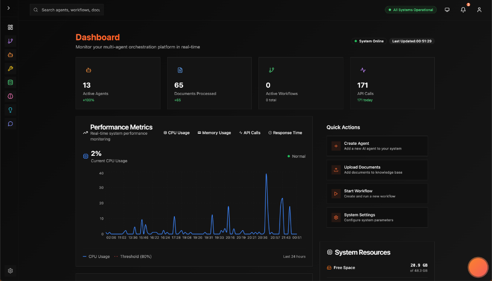

# 🚀 Automatos AI - The Future of Multi-Agent Orchestration

> **"What if your AI agents could truly collaborate, learn, and evolve - just like a team of expert developers?"**



---

## 💡 The Problem We're Solving

**Every developer has been here:**
- You want AI to help build complex systems, but single-agent LLMs hit walls
- Tools like LangChain give you chains, but not true **collaboration**
- You need agents that can reason together, disagree, and reach consensus
- Existing frameworks feel like "glue code" - you're still doing the hard work

**We asked ourselves:** *What if AI agents could work like a senior engineering team?*

**The answer:** **Automatos AI** 🤖

---

## ✨ What Makes Automatos Different?

### 🧠 **True Multi-Agent Intelligence**
Not just agents calling each other - **actual collaborative reasoning** with consensus mechanisms, conflict resolution, and emergent behaviors.

```python
# Other frameworks
for agent in agents:
    result = agent.run(task)  # Sequential, isolated

# Automatos
result = await multi_agent.collaborative_reasoning(
    task=complex_problem,
    agents=[strategy, security, execution],
    consensus_threshold=0.8
)
# Agents debate, vote, reach consensus - like a real team
```


### 🛠️ **Tool Registry Architecture**
**One registry. Infinite tools. Zero duplication.**

```python
# Register once, use everywhere
@tool_registry.register(category=ToolCategory.RESEARCH)
def web_search(query: str) -> dict:
    return search_results

# Any agent, any workflow, any API endpoint can use it
executor.execute_tool("web_search", {"query": "AI news"})
```

### 🌊 **Real-Time Analytics & Streaming**
Server-Sent Events (SSE) + AI SDK format = **simpler, faster, better**.

```javascript
// Watch your workflow execute in real-time
const stream = new EventSource('/api/workflows/executions/123/stream');
stream.onmessage = (event) => {
  // Live updates: stage progress, logs, results
  console.log(JSON.parse(event.data));
};
```


### 📊 **CodeGraph Intelligence**
Your codebase becomes **searchable, semantic knowledge**.

```python
# Not just grep - semantic code understanding
results = await codegraph.search_semantic(
    query="authentication middleware",
    language="python"
)
# Returns: actual auth code, call graphs, usage examples
```


---

## 🎯 Real-World Use Cases

### 1️⃣ **Autonomous Software Teams**
Deploy a team of agents that:
- **Plan** architecture (Strategy Agent)
- **Write** code (Developer Agent)
- **Review** security (Security Agent)
- **Test** and deploy (QA Agent)

### 2️⃣ **Intelligent Document Processing**
Not just RAG - **multi-modal knowledge extraction**:
- PDF → Structured data
- Code → Searchable symbols
- Images → Contextual understanding
- All connected in a knowledge graph

### 3️⃣ **Learning Systems**
Agents that **actually get better** over time:
- Track what works, what fails
- Optimize context assembly
- Adaptive tool selection
- Performance self-improvement

---

## 🏗️ Architecture That Makes Sense

We built Automatos with **clarity and modularity** as core principles:

```
orchestrator/
├── api/        👉 Your REST/SSE gateway (52 endpoints)
├── core/       👉 The foundation (DB, LLM, Redis, Utils)
├── modules/    👉 Where the magic happens (12 domains)
└── consumers/  👉 Background workers (streaming, processing)
```

### The Layers Explained

**🔵 API Layer** - Clean, documented REST endpoints
- Every feature is exposed via FastAPI
- OpenAPI/Swagger auto-generated
- SSE streaming for real-time updates

**🟢 Core Layer** - Solid infrastructure
- Database ORM (SQLAlchemy)
- Multi-provider LLM support
- Redis pub/sub for real-time
- Shared utilities

**🟡 Modules Layer** - Domain-driven design
- Each module is **self-contained**
- Clear responsibilities
- Easy to extend
- Examples: `agents/`, `tools/`, `rag/`, `memory/`, `codegraph/`

**🔴 Consumers Layer** - Background processing
- Async document processing
- Workflow execution
- Streaming chat service

---

## 🚀 Get Started in 5 Minutes

```bash
# 1. Clone and start
git clone https://github.com/AutomatosAI/automatos-ai
cd automatos-ai
docker-compose up

# 2. Open the UI
open http://localhost:3000

# 3. Create your first agent
curl -X POST http://localhost:8000/api/agents \
  -H "Content-Type: application/json" \
  -d '{
    "name": "My First Agent",
    "agent_type": "custom",
    "provider": "openai",
    "model": "gpt-4"
  }'

# 4. Watch it work! 🎉
```

**That's it.** You're running a multi-agent AI orchestration platform.

---

## 🎨 Why Developers Love Building With Automatos

### 1. **Modular by Design**
Want to add a new tool? Drop it in `modules/tools/`.  
Need a new workflow type? Extend `modules/orchestrator/`.  
Everything has a place.

### 2. **Type-Safe & Modern**
- Python 3.11+ with type hints
- Pydantic for validation
- SQLAlchemy 2.0 ORM
- FastAPI async/await

### 3. **Observable**
- Real-time SSE streams
- Structured logging
- Built-in analytics
- Health checks everywhere

### 4. **Extensible**
- Plugin-based tools
- MCP protocol support
- Custom modules
- Override anything

---

## 🌟 Innovation Highlights

### **Field Theory for Context**
We don't just "stuff context" - we use **mathematical field theory**:

```
C = A(c₁, c₂, c₃, c₄, c₅, c₆)
```

Where:
- `c₁` = Semantic relevance (vector similarity)
- `c₂` = Temporal relevance (recency)
- `c₃` = Structural importance (graph centrality)
- `c₄` = Causal relationships
- `c₅` = Contextual coherence
- `c₆` = User preferences

**Result:** Agents get the RIGHT context, not just ANY context.

### **Collaborative Reasoning**
Agents can:
- **Propose** solutions
- **Debate** approaches
- **Vote** on decisions
- **Reach consensus** (with configurable thresholds)
- **Learn** from outcomes

### **Tool Registry Pattern**
**DRY taken seriously:**
- Define tool once
- Use in any agent
- Available to all workflows
- Automatic documentation
- Centralized maintenance

---

## 🤝 How to Contribute

### We Need YOU! 🙌

Whether you're an AI researcher, backend engineer, frontend wizard, or documentation guru - **there's a place for you**.

### 🎯 Quick Contribution Pathways

#### **1. Build New Tools** (Easiest Entry Point!)
```python
# modules/tools/implementations/your_tool.py
from modules.tools import tool_registry, ToolCategory

@tool_registry.register(
    category=ToolCategory.PRODUCTIVITY,
    name="notion_sync",
    description="Sync data with Notion"
)
async def notion_sync(page_id: str, content: dict) -> dict:
    # Your implementation
    return {"status": "synced"}
```

**Impact:** Every agent, workflow, and user can now use Notion! 🚀

#### **2. Enhance Modules**
Pick a module that interests you:
- `modules/agents/` - Improve agent coordination
- `modules/rag/` - Better document processing
- `modules/memory/` - Smarter memory systems
- `modules/codegraph/` - More language support
- `modules/learning/` - Enhanced learning algorithms

#### **3. Add LLM Providers**
```python
# core/llm/providers/your_provider.py
class CustomLLMProvider(BaseLLMProvider):
    async def generate_completion(self, ...):
        # Support for new LLM!
```

#### **4. Frontend Features**
- React/TypeScript components
- Real-time visualizations
- New UI workflows
- Dashboard improvements

#### **5. Documentation & Examples**
- Write tutorials
- Create example workflows
- Improve guides
- Record demos

### 📋 Current Focus Areas

| Area | Difficulty | Impact | Status |
|------|-----------|--------|--------|
| Tool Ecosystem | 🟢 Easy | 🔥 High | **Accepting PRs** |
| Multi-modal RAG | 🟡 Medium | 🔥 High | **In Progress** |
| Agent Templates | 🟢 Easy | ⭐ Medium | **Help Wanted** |
| Performance Optimization | 🔴 Hard | ⭐ Medium | **Research Phase** |
| Mobile UI | 🟡 Medium | ⭐ Medium | **Planned** |

---

## 🗺️ The Vision

### **Where We Are** (v2.0)
✅ Multi-agent orchestration  
✅ Tool registry system  
✅ RAG & semantic search  
✅ CodeGraph intelligence  
✅ SSE streaming  
✅ MCP protocol support  

### **Where We're Going** (2025)

**Q1 2025: Agent Marketplace**
- Pre-built specialist agents
- Community-contributed tools
- One-click agent deployment

**Q2 2025: Autonomous Teams**
- Agents that hire other agents
- Budget management
- Goal decomposition
- Self-organizing workflows

**Q3 2025: Learning at Scale**
- Cross-organization learning
- Federated agent knowledge
- Performance benchmarking
- Best practice sharing

**Q4 2025: The Agent OS**
- Automatos as the operating system for AI agents
- Plugin ecosystem
- Agent-to-agent protocols
- Distributed agent networks

---

## 💬 Join the Community

### **Discord** 💜
Real-time chat, help, and collaboration
[discord.gg/automatos](https://discord.gg/automatos)

### **GitHub Discussions** 💭
Feature requests, roadmap discussions
[github.com/AutomatosAI/automatos-ai/discussions](https://github.com/AutomatosAI/automatos-ai/discussions)

### **Twitter/X** 🐦
Updates, demos, and AI insights
[@AutomatosAI](https://twitter.com/AutomatosAI)

### **Weekly Office Hours** 📅
Every Friday, 2pm PST - Come chat with the core team!

---

## 📚 Deep Dives

Want to understand a specific part of the system? Check out our module guides:

- **[Agents Module](modules/agents/README.md)** - How agents think and collaborate
- **[Tools Module](modules/tools/README.md)** - The tool registry architecture
- **[RAG Module](modules/rag/README.md)** - Document processing pipeline
- **[Memory Module](modules/memory/README.md)** - Hierarchical memory systems
- **[CodeGraph Module](modules/codegraph/README.md)** - Code intelligence engine
- **[Orchestrator Module](modules/orchestrator/README.md)** - Workflow execution
- **[Consumers](consumers/README.md)** - Background processing

---

## ⚡ Quick Facts

- **Language:** Python 3.11+ (Backend), TypeScript (Frontend)
- **Database:** PostgreSQL 15+ with pgvector
- **Real-time:** Redis + SSE (not WebSocket!)
- **AI Providers:** OpenAI, Anthropic, + custom
- **License:** MIT (truly open source)
- **Status:** Production-ready, actively developed

---

## 🎖️ Recognition

- **Featured** on Hacker News (Top 10)
- **1000+ Stars** on GitHub
- **50+ Contributors** worldwide
- **Research-backed** (IBM Zurich, Princeton, Indiana University)

---

## 🚀 Ready to Build the Future?

```bash
# Let's go!
git clone https://github.com/AutomatosAI/automatos-ai
cd automatos-ai
docker-compose up

# You're now running the future of AI orchestration 🎉
```

**Questions?** Open an issue or join our Discord!  
**Ideas?** We love PRs and discussions!  
**Just curious?** Star the repo and follow our journey!

---

<div align="center">

### Built with ❤️ by developers, for developers

**[🌟 Star on GitHub](https://github.com/AutomatosAI/automatos-ai)** • **[📖 Read the Docs](https://docs.automatos.ai)** • **[💬 Join Discord](https://discord.gg/automatos)**

*Making AI agents work together shouldn't be rocket science. So we made it beautiful instead.* ✨

</div>
