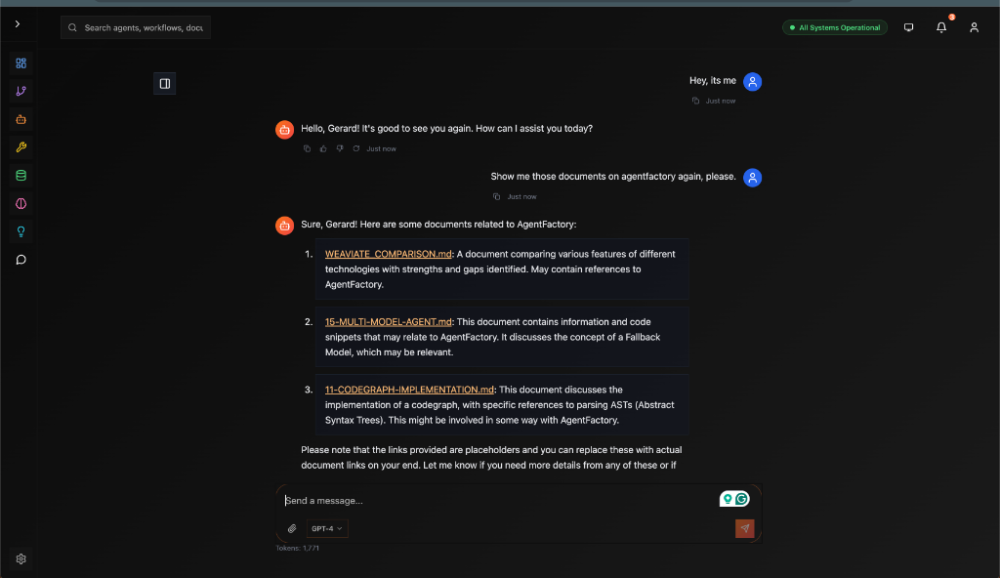

# 🕸️ CodeGraph - The Google for Your Codebase

> **"Stop grep-ing. Start understanding."**

---

## 💡 The Problem

**Agents are blind.**
They see text files. They don't see *structure*.
- They don't know that `User` class inherits from `BaseModel`.
- They don't know who calls `process_payment()`.
- They hallucinate APIs that don't exist.

**You need more than text search. You need a graph.**

---

## ✨ The Solution

**CodeGraph** turns your codebase into a **queryable knowledge graph**.

It doesn't just read files. It **compiles** them into a semantic understanding of your system.

### 🧠 What It Knows
- **Symbols**: Classes, functions, variables (and where they live)
- **Relationships**: Inheritance, imports, calls, usage
- **Semantics**: "Find code that handles authentication" (even if it doesn't say "auth")
- **Structure**: The full dependency tree of your project

---

## 🚀 Capabilities

### 1️⃣ **Semantic Code Search**
Don't search for keywords. Search for *intent*.



```python
# "Find where we handle user login"
results = await codegraph.search_semantic("user login logic")

# Returns:
# - auth/service.py: login_user()
# - api/auth.py: /login endpoint
# - models/user.py: verify_password()
```

### 2️⃣ **Symbol Resolution**
Agents can "jump to definition" just like you do in your IDE.

```python
# "Show me the User class"
symbol = await codegraph.get_symbol("User")

# Returns:
# - Full source code
# - Docstrings
# - Base classes
# - Methods list
```

### 3️⃣ **Call Graph Analysis**
Understand the ripple effects of a change.

```python
# "Who calls process_payment?"
callers = await codegraph.get_callers("process_payment")

# Returns:
# - checkout_service.py
# - subscription_manager.py
# - admin_dashboard.py
```

---

## 🏗️ Architecture

```
modules/codegraph/
├── indexers/            # Language-specific parsers
│   ├── python.py        # AST-based Python indexing
│   ├── typescript.py    # Tree-sitter TS indexing
│   └── rust.py          # (Coming Soon)
├── graph/               # Graph database interface
│   ├── nodes.py         # Node types (Class, Function)
│   └── edges.py         # Edge types (Calls, Inherits)
├── search/              # Search engines
│   ├── semantic.py      # Vector search (pgvector)
│   └── keyword.py       # BM25/Trigram search
└── service.py           # Main API surface
```

---

## ⚡ How It Works

1.  **Ingestion**: We scan your repo (`.py`, `.ts`, `.js`, etc.).
2.  **Parsing**: We build an Abstract Syntax Tree (AST) for every file.
3.  **Extraction**: We pull out every class, function, and import.
4.  **Embedding**: We generate vector embeddings for docstrings and code signatures.
5.  **Linking**: We resolve imports to connect the graph nodes.

**Result:** A navigable map of your entire software architecture.

---

## 🛠️ Usage

### **Indexing a Repo**

```python
from modules.codegraph import CodeGraphService

service = CodeGraphService()

# Index local path
await service.index_repository(
    path="/path/to/my-app",
    name="my-app-v1"
)

# Index GitHub repo
await service.index_github(
    url="https://github.com/fastapi/fastapi",
    branch="master"
)
```

### **Querying the Graph**

```python
# Simple symbol lookup
node = await service.get_node("FastAPI")

# Complex relationship query
# "Find all classes that inherit from BaseModel"
nodes = await service.query_graph(
    relationship="inherits_from",
    target="BaseModel"
)
```

---

## 🤝 Contributing

### **We Need Parsers!**
We currently support **Python** and **TypeScript/JavaScript**.
Want to add **Go**, **Rust**, or **Java**?

1.  Create `modules/codegraph/indexers/golang.py`
2.  Implement `BaseIndexer` interface
3.  Use `tree-sitter` to parse the AST
4.  Extract symbols and return nodes

It's a fun way to learn how compilers work! 🤓

---

## 🔮 The Future

- **Auto-Refactoring**: Agents that use the graph to safely rename variables across files.
- **Architecture Linting**: "Alert me if a View imports a Model directly."
- **Visual Explorer**: A 3D interactive map of your codebase.

**CodeGraph makes your codebase transparent.** ✨
